# Aether Clinician --- Architecture Design Document

| Field          | Value                                              |
| -------------- | -------------------------------------------------- |
| **Version**    | 1.0.0                                              |
| **Status**     | Draft                                              |
| **Authors**    | Engineering Team                                   |
| **Created**    | 2026-06-27                                         |
| **Updated**    | 2026-06-27                                         |
| **Audience**   | Engineering, Product, Clinical Safety, Regulatory   |
| **Repository** | `documedic` monorepo (Turborepo)                   |

---

## Table of Contents

1. [System Overview](#1-system-overview)
2. [High-Level Architecture](#2-high-level-architecture)
3. [Multi-Agent Reasoning Engine](#3-multi-agent-reasoning-engine)
4. [Data Flow Diagrams](#4-data-flow-diagrams)
5. [Component Architecture](#5-component-architecture)
6. [Data Model](#6-data-model)
7. [Integration Points](#7-integration-points)
8. [Safety Architecture and Autonomy Tiers](#8-safety-architecture-and-autonomy-tiers)
9. [Offline/Online Mode Architecture](#9-offlineonline-mode-architecture)
10. [Cross-Cutting Concerns](#10-cross-cutting-concerns)
11. [Deployment and Infrastructure](#11-deployment-and-infrastructure)
12. [Appendices](#12-appendices)

---

## 1. System Overview

Aether Clinician is a multi-agent clinical decision-support system (CDSS) designed for primary-care clinicians practicing in rural and semi-urban India. The system addresses a critical gap: these clinicians manage complex, multi-morbid patients with fragmented paper-based records, limited specialist access, and intermittent internet connectivity. Aether Clinician reads and structures historical prescriptions and lab reports, builds a longitudinal patient record, conducts specialist-style adaptive intake interviews, and produces grounded differential diagnoses with explicit evidence for and against each hypothesis, drug-safety checks, and guideline-cited management options.

The core innovation is an eight-agent reasoning engine orchestrated via LangGraph. Rather than a single monolithic LLM call, the system decomposes clinical reasoning into specialized agents --- triage/intake, a parallel specialist hypothesis panel, a can't-miss sentinel, a devil's-advocate adversary, an investigation strategist, a guideline-RAG agent, and an independent verifier --- all coordinated by a synthesis/orchestrator agent. This architecture mirrors the structure of a clinical team discussion (MDT), producing outputs that are inherently more auditable, more resistant to automation bias, and more transparent than single-pass generation.

The system is built on a safety-first architecture. Every clinical output must pass through an independent verifier agent before display to the clinician. Drug-allergy and contraindication conflicts produce hard blocks that cannot be overridden by the AI. All outputs carry autonomy-tier labels (Informational, Suggestive, or Flag-for-review) and are stored as immutable audit records with full agent traces. The system degrades gracefully offline: core record access and deterministic safety checks (drug interactions, allergy conflicts) work without connectivity, while LLM-dependent reasoning pauses with an explicit signal rather than silently producing degraded output.

---

## 2. High-Level Architecture

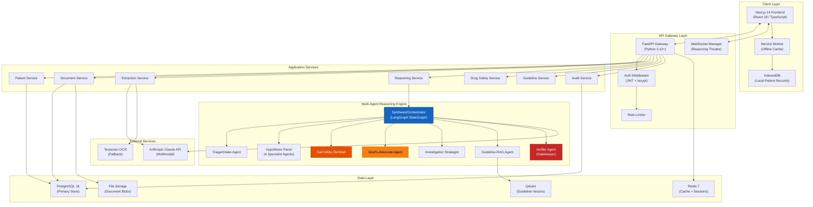
```mermaid
graph TB
    subgraph "Client Layer"
        WEB["Next.js 14 Frontend<br/>(React 18 / TypeScript)"]
        SW["Service Worker<br/>(Offline Cache)"]
        IDB["IndexedDB<br/>(Local Patient Records)"]
    end

    subgraph "API Gateway Layer"
        GW["FastAPI Gateway<br/>(Python 3.12+)"]
        AUTH["Auth Middleware<br/>(JWT + bcrypt)"]
        RL["Rate Limiter"]
        WS["WebSocket Manager<br/>(Reasoning Theatre)"]
    end

    subgraph "Application Services"
        PS["Patient Service"]
        DS["Document Service"]
        ES["Extraction Service"]
        RS["Reasoning Service"]
        DRS["Drug Safety Service"]
        GS["Guideline Service"]
        AS["Audit Service"]
    end

    subgraph "Multi-Agent Reasoning Engine"
        ORCH["Synthesis/Orchestrator<br/>(LangGraph StateGraph)"]
        TI["Triage/Intake Agent"]
        HP["Hypothesis Panel<br/>(4 Specialist Agents)"]
        CM["Can't-Miss Sentinel"]
        DA["Devil's-Advocate Agent"]
        IS["Investigation Strategist"]
        GR["Guideline-RAG Agent"]
        VR["Verifier Agent<br/>(Gatekeeper)"]
    end

    subgraph "Data Layer"
        PG["PostgreSQL 16<br/>(Primary Store)"]
        QD["Qdrant<br/>(Guideline Vectors)"]
        RD["Redis 7<br/>(Cache + Sessions)"]
        FS["File Storage<br/>(Document Blobs)"]
    end

    subgraph "External Services"
        LLM["Anthropic Claude API<br/>(Multimodal)"]
        OCR["Tesseract OCR<br/>(Fallback)"]
    end

    WEB <--> GW
    WEB <--> WS
    WEB --> SW --> IDB

    GW --> AUTH --> RL
    GW --> PS & DS & ES & RS & DRS & GS & AS

    RS --> ORCH
    ORCH --> TI & HP & CM & DA & IS & GR & VR

    PS & DS --> PG
    ES --> LLM & OCR
    GR --> QD
    GW --> RD
    DS --> FS
    ORCH --> LLM

    AS --> PG

    style VR fill:#c62828,stroke:#b71c1c,color:#fff
    style CM fill:#e65100,stroke:#bf360c,color:#fff
    style DA fill:#f57f17,stroke:#f9a825,color:#000
    style ORCH fill:#1565c0,stroke:#0d47a1,color:#fff
```

### Architecture Principles

| Principle | Implementation |
|---|---|
| **Safety over speed** | Verifier is mandatory, conservative output wins on disagreement |
| **Transparency over polish** | Full agent traces stored, disagreement preserved and surfaced |
| **Offline-first records** | Patient data cached locally, deterministic safety checks work offline |
| **Explicit degradation** | Never silently produce degraded output; signal connectivity state |
| **Audit everything** | Immutable ClinicalSuggestion records with complete reasoning traces |
| **India-context** | Data residency, DPDP Act compliance, CDSCO SaMD pathway, Indian drug vocabulary |

---

## 3. Multi-Agent Reasoning Engine

The reasoning engine is a LangGraph `StateGraph` where the shared state object (`CaseState`) flows through every node. Each agent is implemented as a graph node with defined inputs and outputs, connected by conditional edges that encode the clinical reasoning workflow.

### 3.1 CaseState --- Shared State Object

```python
@dataclass
class CaseState:
    # Patient context
    patient_id: str
    patient_graph_snapshot: PatientGraph
    presenting_complaint: str

    # Intake
    intake_questions: list[IntakeQuestion]
    intake_answers: list[IntakeAnswer]
    intake_complete: bool
    info_gain_score: float

    # Hypotheses
    hypothesis_set: list[Hypothesis]  # Each carries:
    #   - diagnosis_name, icd_code
    #   - evidence_for: list[Evidence]
    #   - evidence_against: list[Evidence]
    #   - probability_band: ProbabilityBand  # HIGH / MODERATE / LOW / VERY_LOW
    #   - cant_miss_flag: bool
    #   - source_agent: str

    # Guideline retrieval
    retrieved_chunks: list[GuidelineChunk]  # Each with corpus_version, section_id
    citation_scores: list[float]

    # Agent messages and trace
    agent_messages: list[AgentMessage]  # Ordered, append-only
    agent_trace: list[TraceEntry]       # Full reasoning chain

    # Verification
    verifier_verdicts: list[VerifierVerdict]
    autonomy_tier: AutonomyTier  # INFORMATIONAL / SUGGESTIVE / FLAG_FOR_REVIEW

    # Drug safety
    drug_safety_results: list[DrugSafetyResult]
    hard_blocks: list[HardBlock]

    # Investigation
    recommended_investigations: list[Investigation]

    # Metadata
    case_id: str
    created_at: datetime
    reasoning_start: datetime | None
    reasoning_end: datetime | None
    online: bool
```

### 3.2 Agent Specifications

#### Agent 1: Triage/Intake Agent

| Attribute | Detail |
|---|---|
| **Role** | Determine if sufficient information exists for reasoning. If not, generate highest-information-gain clarifying questions including red-flag screens and relevant negatives. |
| **Input** | `CaseState` with `presenting_complaint`, `patient_graph_snapshot`, existing `intake_answers` |
| **Output** | Updated `intake_questions`, `intake_answers`, `intake_complete`, `info_gain_score` |
| **Tools** | `query_patient_graph(filter)`, `flag_cant_miss(symptoms, context)` |
| **Loop** | Iterates until `info_gain_score < INFO_GAIN_THRESHOLD` or `len(intake_questions) >= QUESTION_CAP` |
| **LLM** | Claude (text) --- single-turn per question batch |
| **Prompt Strategy** | System prompt encodes triage nurse persona, emphasizes relevant negatives, red-flag recognition, and information-theoretic question selection |

#### Agent 2: Hypothesis Panel (Specialist Agents)

| Attribute | Detail |
|---|---|
| **Role** | Generate and rank candidate diagnoses with explicit evidence for and against. |
| **Composition** | 4 role-primed agents run **in parallel**: General Internal Medicine, Cardiology, Infectious Disease, Primary Care |
| **Input** | `CaseState` with completed intake, `patient_graph_snapshot` |
| **Output** | Per-agent ranked `hypothesis_set` with `evidence_for`, `evidence_against`, `probability_band` |
| **Tools** | `query_patient_graph(filter)`, `get_lab_trend(marker)` |
| **LLM** | Claude (text) --- one call per specialist, parallelized via `asyncio.gather()` |
| **Prompt Strategy** | Each agent receives a specialist system prompt with domain-specific differential reasoning patterns. Explicitly required to cite patient data for every evidence item. |

#### Agent 3: Can't-Miss Sentinel

| Attribute | Detail |
|---|---|
| **Role** | Scan for dangerous, time-critical, commonly-missed conditions. Force them onto the differential even at low probability. Flags **cannot be silently dropped** by downstream agents. |
| **Input** | `CaseState` with `presenting_complaint`, `intake_answers`, `patient_graph_snapshot`, current `hypothesis_set` |
| **Output** | Additional hypotheses with `cant_miss_flag = True` appended to `hypothesis_set` |
| **Tools** | `flag_cant_miss(symptoms, context)`, `query_patient_graph(filter)` |
| **LLM** | Claude (text) |
| **Constraint** | Output is append-only to hypothesis set. `cant_miss_flag` items require explicit clinician acknowledgment before case closure. |

#### Agent 4: Devil's-Advocate Agent

| Attribute | Detail |
|---|---|
| **Role** | Adversarially attack the leading hypothesis. Find disconfirming evidence, alternative explanations, base-rate problems. Output is **always** shown to clinician (primary anti-automation-bias mechanism). |
| **Input** | `CaseState` with ranked `hypothesis_set` (post-panel, post-sentinel) |
| **Output** | `devil_advocate_critique` attached to each top hypothesis: disconfirming evidence, alternative explanations, base-rate context |
| **Tools** | `query_patient_graph(filter)`, `get_lab_trend(marker)` |
| **LLM** | Claude (text) --- prompted with adversarial/skeptic persona |
| **Display** | Critique is surfaced in a dedicated UI section. Cannot be collapsed by default. Clinician must scroll past it. |

#### Agent 5: Investigation Strategist

| Attribute | Detail |
|---|---|
| **Role** | Compute the single most discriminating next test --- the one whose result most changes posterior probabilities. Frame with cost and local availability. |
| **Input** | `CaseState` with ranked `hypothesis_set` |
| **Output** | `recommended_investigations`: ordered list with expected information gain, cost estimate, availability tier (PHC/CHC/District Hospital/Referral) |
| **Tools** | `compute_discriminating_test(hypotheses)` |
| **LLM** | Claude (text) --- for cost/availability framing |

#### Agent 6: Guideline-RAG Agent

| Attribute | Detail |
|---|---|
| **Role** | Retrieve from curated guideline corpus. Draft management options strictly grounded in retrieved chunks with citations. Return "insufficient guideline support" if retrieval confidence is below threshold. |
| **Input** | `CaseState` with finalized `hypothesis_set`, `presenting_complaint` |
| **Output** | `retrieved_chunks` with `corpus_version` and `section_id`, management options with inline citations |
| **Tools** | `retrieve_guidelines(query, k)` |
| **LLM** | Claude (text) --- for synthesis of retrieved chunks into management options |
| **Thresholds** | Retrieval similarity score >= 0.75 required. Below threshold: output includes explicit "insufficient guideline support" warning. Target >=95% citation faithfulness. |
| **Corpus** | ICMR STWs (spine) + WHO/NICE guidelines. Versioned, chunked with stable section identifiers. |

#### Agent 7: Verifier Agent (Gatekeeper)

| Attribute | Detail |
|---|---|
| **Role** | Independently re-check every output against patient data and guidelines. Assign autonomy tier. When verifier and reasoning agents disagree, **conservative output wins**. |
| **Input** | Complete `CaseState` post all other agents |
| **Output** | `verifier_verdicts` (per-hypothesis and per-management-option), `autonomy_tier` for the case |
| **Tools** | `query_patient_graph(filter)`, `retrieve_guidelines(query, k)`, `check_drug_safety(drug, patient_id)` |
| **LLM** | Claude (text) --- independent prompt, no access to other agents' chain-of-thought |
| **Constraint** | **Cannot be bypassed**. All clinical output must have a verifier verdict before display. Disagreement triggers conservative resolution (downgrade confidence, add caveats, escalate autonomy tier). |

#### Agent 8: Synthesis/Orchestrator

| Attribute | Detail |
|---|---|
| **Role** | Coordinate all agents, reconcile outputs, preserve disagreement, write full trace to audit log, stream intermediate state to frontend via WebSocket. |
| **Input** | Initiates with patient context and presenting complaint |
| **Output** | Final `CaseState` with all fields populated, audit record written |
| **Implementation** | LangGraph `StateGraph` with conditional edges. Not itself an LLM call --- purely orchestration logic with state management. |

### 3.3 Agent Orchestration Flow

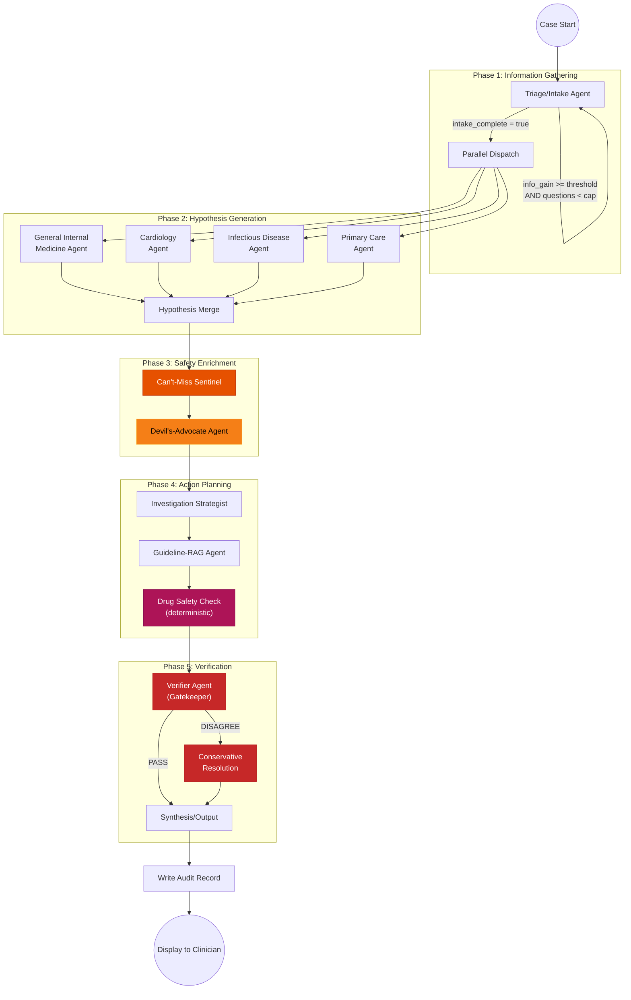
```mermaid
graph TD
    START((Case Start)) --> INTAKE

    subgraph "Phase 1: Information Gathering"
        INTAKE["Triage/Intake Agent"]
        INTAKE -->|"info_gain >= threshold<br/>AND questions < cap"| INTAKE
        INTAKE -->|"intake_complete = true"| PARALLEL
    end

    subgraph "Phase 2: Hypothesis Generation"
        PARALLEL["Parallel Dispatch"]
        PARALLEL --> GIM["General Internal<br/>Medicine Agent"]
        PARALLEL --> CARD["Cardiology<br/>Agent"]
        PARALLEL --> ID["Infectious Disease<br/>Agent"]
        PARALLEL --> PC["Primary Care<br/>Agent"]

        GIM --> MERGE["Hypothesis Merge"]
        CARD --> MERGE
        ID --> MERGE
        PC --> MERGE
    end

    subgraph "Phase 3: Safety Enrichment"
        MERGE --> SENTINEL["Can't-Miss Sentinel"]
        SENTINEL --> DEVIL["Devil's-Advocate Agent"]
    end

    subgraph "Phase 4: Action Planning"
        DEVIL --> INVEST["Investigation Strategist"]
        INVEST --> GUIDE["Guideline-RAG Agent"]
        GUIDE --> DRUG["Drug Safety Check<br/>(deterministic)"]
    end

    subgraph "Phase 5: Verification"
        DRUG --> VERIFY["Verifier Agent<br/>(Gatekeeper)"]
        VERIFY -->|"PASS"| SYNTH["Synthesis/Output"]
        VERIFY -->|"DISAGREE"| CONSERV["Conservative<br/>Resolution"]
        CONSERV --> SYNTH
    end

    SYNTH --> AUDIT["Write Audit Record"]
    AUDIT --> DISPLAY((Display to Clinician))

    style VERIFY fill:#c62828,stroke:#b71c1c,color:#fff
    style SENTINEL fill:#e65100,stroke:#bf360c,color:#fff
    style DEVIL fill:#f57f17,stroke:#f9a825,color:#000
    style CONSERV fill:#c62828,stroke:#b71c1c,color:#fff
    style DRUG fill:#ad1457,stroke:#880e4f,color:#fff
```

### 3.4 LangGraph StateGraph Definition

```python
from langgraph.graph import StateGraph, END

workflow = StateGraph(CaseState)

# Add nodes
workflow.add_node("triage_intake", triage_intake_agent)
workflow.add_node("hypothesis_panel", hypothesis_panel_node)  # Runs 4 agents in parallel
workflow.add_node("cant_miss_sentinel", cant_miss_sentinel_agent)
workflow.add_node("devils_advocate", devils_advocate_agent)
workflow.add_node("investigation_strategist", investigation_strategist_agent)
workflow.add_node("guideline_rag", guideline_rag_agent)
workflow.add_node("drug_safety_check", drug_safety_check_node)  # Deterministic, no LLM
workflow.add_node("verifier", verifier_agent)
workflow.add_node("conservative_resolution", conservative_resolution_node)
workflow.add_node("synthesis", synthesis_node)
workflow.add_node("audit_write", audit_write_node)

# Entry point
workflow.set_entry_point("triage_intake")

# Conditional: loop intake or proceed
workflow.add_conditional_edges(
    "triage_intake",
    should_continue_intake,  # Returns "triage_intake" or "hypothesis_panel"
    {
        "triage_intake": "triage_intake",
        "hypothesis_panel": "hypothesis_panel",
    },
)

# Sequential flow
workflow.add_edge("hypothesis_panel", "cant_miss_sentinel")
workflow.add_edge("cant_miss_sentinel", "devils_advocate")
workflow.add_edge("devils_advocate", "investigation_strategist")
workflow.add_edge("investigation_strategist", "guideline_rag")
workflow.add_edge("guideline_rag", "drug_safety_check")
workflow.add_edge("drug_safety_check", "verifier")

# Conditional: verifier pass or disagree
workflow.add_conditional_edges(
    "verifier",
    verifier_decision,  # Returns "synthesis" or "conservative_resolution"
    {
        "synthesis": "synthesis",
        "conservative_resolution": "conservative_resolution",
    },
)
workflow.add_edge("conservative_resolution", "synthesis")
workflow.add_edge("synthesis", "audit_write")
workflow.add_edge("audit_write", END)

app = workflow.compile()
```

### 3.5 Agent Tool Registry

All tools are app-owned (no external clinical APIs). They operate on the local data layer.

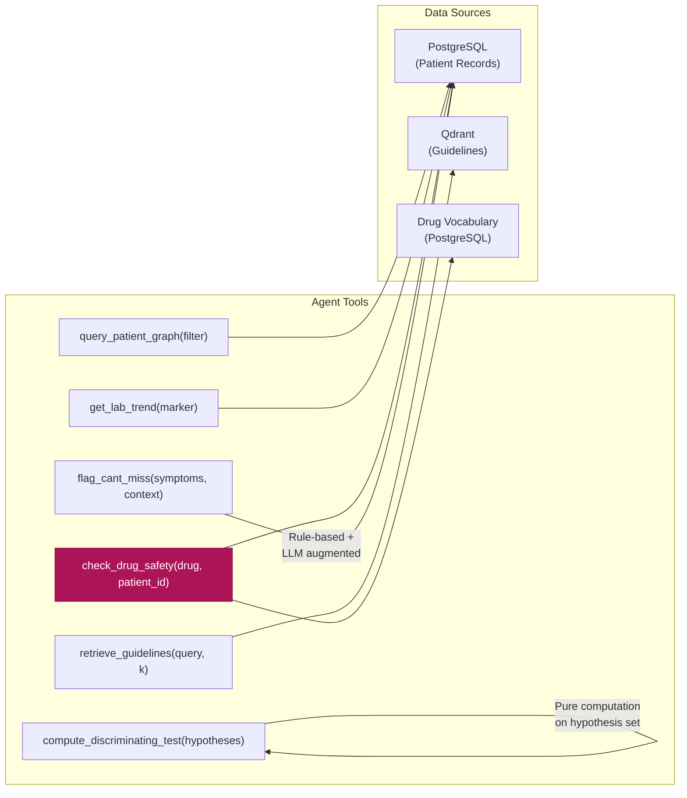
```mermaid
graph LR
    subgraph "Agent Tools"
        T1["query_patient_graph(filter)"]
        T2["get_lab_trend(marker)"]
        T3["check_drug_safety(drug, patient_id)"]
        T4["retrieve_guidelines(query, k)"]
        T5["compute_discriminating_test(hypotheses)"]
        T6["flag_cant_miss(symptoms, context)"]
    end

    subgraph "Data Sources"
        PG["PostgreSQL<br/>(Patient Records)"]
        QD["Qdrant<br/>(Guidelines)"]
        DV["Drug Vocabulary<br/>(PostgreSQL)"]
    end

    T1 --> PG
    T2 --> PG
    T3 --> PG & DV
    T4 --> QD
    T5 -->|"Pure computation<br/>on hypothesis set"| T5
    T6 -->|"Rule-based +<br/>LLM augmented"| PG

    style T3 fill:#ad1457,stroke:#880e4f,color:#fff
```

| Tool | Deterministic? | Works Offline? | Used By |
|---|---|---|---|
| `query_patient_graph(filter)` | Yes | Yes | Triage, Hypothesis Panel, Sentinel, Devil's-Advocate, Verifier |
| `get_lab_trend(marker)` | Yes | Yes | Hypothesis Panel, Devil's-Advocate |
| `check_drug_safety(drug, patient_id)` | Yes | Yes | Drug Safety Check, Verifier |
| `retrieve_guidelines(query, k)` | No (vector search) | No | Guideline-RAG, Verifier |
| `compute_discriminating_test(hypotheses)` | Yes (computation) | Yes | Investigation Strategist |
| `flag_cant_miss(symptoms, context)` | Hybrid (rules + LLM) | Partial (rules only) | Triage, Sentinel |

---

## 4. Data Flow Diagrams

### 4.1 Document Ingestion Flow

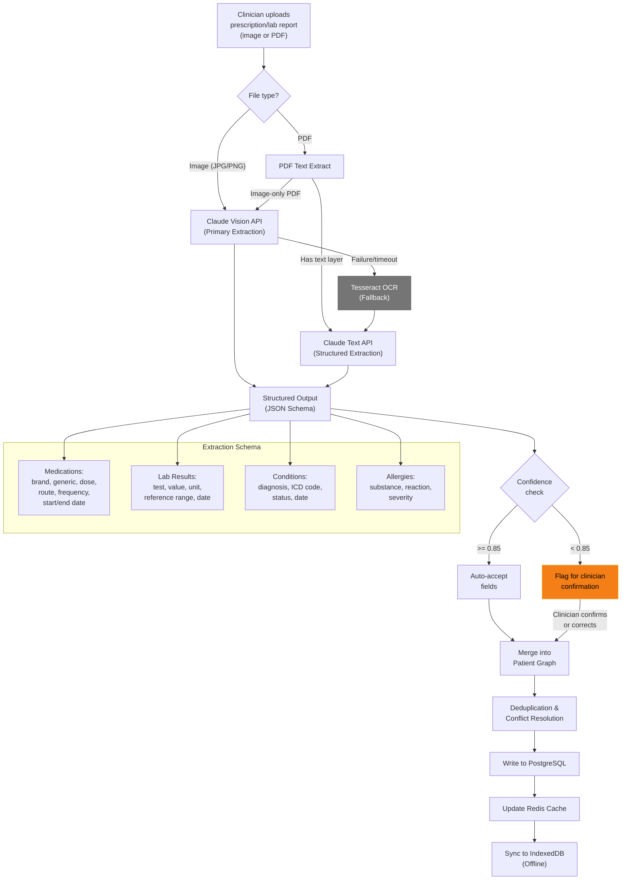
```mermaid
flowchart TD
    UPLOAD["Clinician uploads<br/>prescription/lab report<br/>(image or PDF)"]
    UPLOAD --> CLASSIFY{"File type?"}

    CLASSIFY -->|"Image (JPG/PNG)"| CLAUDE_VIS["Claude Vision API<br/>(Primary Extraction)"]
    CLASSIFY -->|"PDF"| PDF_PARSE["PDF Text Extract"]
    PDF_PARSE -->|"Has text layer"| CLAUDE_TEXT["Claude Text API<br/>(Structured Extraction)"]
    PDF_PARSE -->|"Image-only PDF"| CLAUDE_VIS

    CLAUDE_VIS -->|"Failure/timeout"| TESS["Tesseract OCR<br/>(Fallback)"]
    TESS --> CLAUDE_TEXT

    CLAUDE_VIS --> STRUCT["Structured Output<br/>(JSON Schema)"]
    CLAUDE_TEXT --> STRUCT

    STRUCT --> CONF{"Confidence<br/>check"}
    CONF -->|">= 0.85"| AUTO["Auto-accept<br/>fields"]
    CONF -->|"< 0.85"| REVIEW["Flag for clinician<br/>confirmation"]

    AUTO --> MERGE["Merge into<br/>Patient Graph"]
    REVIEW -->|"Clinician confirms<br/>or corrects"| MERGE

    MERGE --> DEDUP["Deduplication &<br/>Conflict Resolution"]
    DEDUP --> PG_WRITE["Write to PostgreSQL"]
    PG_WRITE --> CACHE["Update Redis Cache"]
    CACHE --> SYNC["Sync to IndexedDB<br/>(Offline)"]

    subgraph "Extraction Schema"
        direction LR
        MED["Medications:<br/>brand, generic, dose,<br/>route, frequency,<br/>start/end date"]
        LAB["Lab Results:<br/>test, value, unit,<br/>reference range, date"]
        DX["Conditions:<br/>diagnosis, ICD code,<br/>status, date"]
        ALG["Allergies:<br/>substance, reaction,<br/>severity"]
    end

    STRUCT --> MED & LAB & DX & ALG

    style REVIEW fill:#f57f17,stroke:#f9a825,color:#000
    style TESS fill:#757575,stroke:#616161,color:#fff
```

### 4.2 Clinical Reasoning Flow

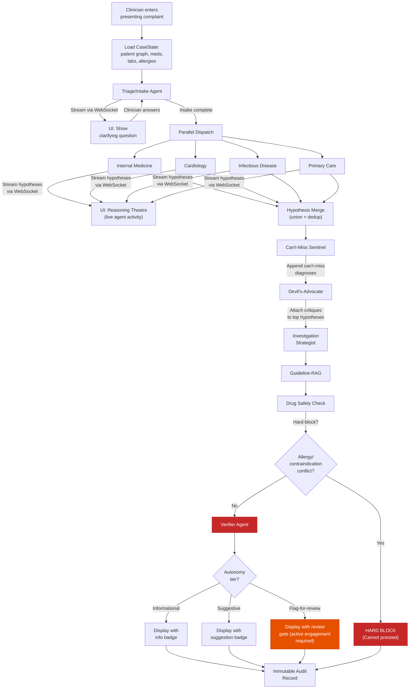
```mermaid
flowchart TD
    CC["Clinician enters<br/>presenting complaint"]
    CC --> LOAD["Load CaseState:<br/>patient graph, meds,<br/>labs, allergies"]

    LOAD --> TI["Triage/Intake Agent"]

    TI -->|"Stream via WebSocket"| UI_Q["UI: Show<br/>clarifying question"]
    UI_Q -->|"Clinician answers"| TI

    TI -->|"Intake complete"| DISPATCH["Parallel Dispatch"]

    DISPATCH --> GIM["Internal Medicine"] & CARD["Cardiology"] & INF["Infectious Disease"] & PRI["Primary Care"]

    GIM & CARD & INF & PRI -->|"Stream hypotheses<br/>via WebSocket"| UI_THEATRE["UI: Reasoning Theatre<br/>(live agent activity)"]

    GIM & CARD & INF & PRI --> MERGE["Hypothesis Merge<br/>(union + dedup)"]

    MERGE --> SENT["Can't-Miss Sentinel"]
    SENT -->|"Append can't-miss<br/>diagnoses"| DA["Devil's-Advocate"]

    DA -->|"Attach critiques<br/>to top hypotheses"| INVEST["Investigation<br/>Strategist"]
    INVEST --> GUIDE["Guideline-RAG"]

    GUIDE --> DRUG["Drug Safety Check"]
    DRUG -->|"Hard-block?"| BLOCK{"Allergy/<br/>contraindication<br/>conflict?"}
    BLOCK -->|"Yes"| HARD_BLOCK["HARD BLOCK<br/>(Cannot proceed)"]
    BLOCK -->|"No"| VERIFY["Verifier Agent"]

    VERIFY --> TIER{"Autonomy<br/>tier?"}
    TIER -->|"Informational"| DISPLAY_I["Display with<br/>info badge"]
    TIER -->|"Suggestive"| DISPLAY_S["Display with<br/>suggestion badge"]
    TIER -->|"Flag-for-review"| DISPLAY_F["Display with review<br/>gate (active engagement<br/>required)"]

    DISPLAY_I & DISPLAY_S & DISPLAY_F --> AUDIT["Immutable Audit<br/>Record"]

    HARD_BLOCK --> AUDIT

    style HARD_BLOCK fill:#c62828,stroke:#b71c1c,color:#fff
    style VERIFY fill:#c62828,stroke:#b71c1c,color:#fff
    style DISPLAY_F fill:#e65100,stroke:#bf360c,color:#fff
```

### 4.3 Drug Safety Flow

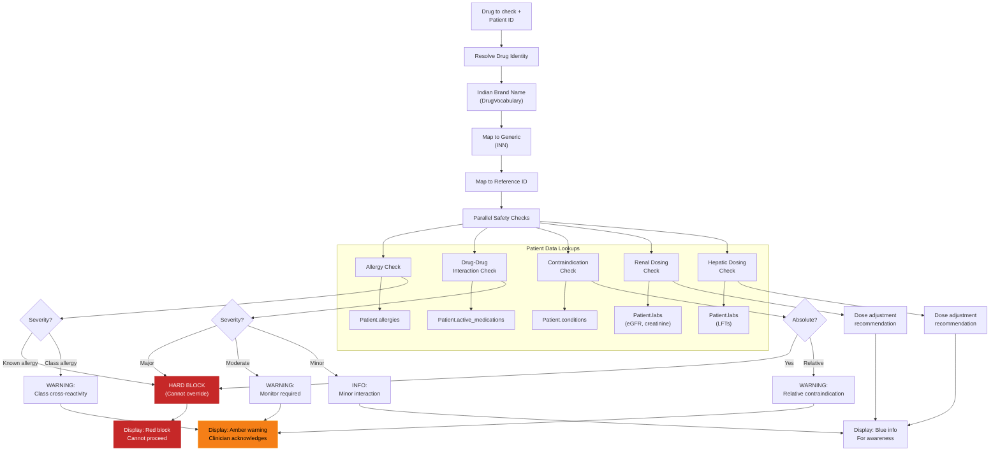
```mermaid
flowchart TD
    INPUT["Drug to check +<br/>Patient ID"]

    INPUT --> RESOLVE["Resolve Drug Identity"]
    RESOLVE --> BRAND["Indian Brand Name<br/>(DrugVocabulary)"]
    BRAND --> GENERIC["Map to Generic<br/>(INN)"]
    GENERIC --> REF_ID["Map to Reference ID"]

    REF_ID --> PAR["Parallel Safety Checks"]

    PAR --> ALLERGY["Allergy Check"]
    PAR --> INTERACT["Drug-Drug<br/>Interaction Check"]
    PAR --> CONTRA["Contraindication<br/>Check"]
    PAR --> RENAL["Renal Dosing<br/>Check"]
    PAR --> HEPATIC["Hepatic Dosing<br/>Check"]

    subgraph "Patient Data Lookups"
        ALLERGY --> PAT_ALG["Patient.allergies"]
        INTERACT --> PAT_MED["Patient.active_medications"]
        CONTRA --> PAT_COND["Patient.conditions"]
        RENAL --> PAT_LAB1["Patient.labs<br/>(eGFR, creatinine)"]
        HEPATIC --> PAT_LAB2["Patient.labs<br/>(LFTs)"]
    end

    ALLERGY --> SEV{"Severity?"}
    SEV -->|"Known allergy"| HARD["HARD BLOCK<br/>(Cannot override)"]
    SEV -->|"Class allergy"| WARN_A["WARNING:<br/>Class cross-reactivity"]

    INTERACT --> INT_SEV{"Severity?"}
    INT_SEV -->|"Major"| HARD
    INT_SEV -->|"Moderate"| WARN_I["WARNING:<br/>Monitor required"]
    INT_SEV -->|"Minor"| INFO_I["INFO:<br/>Minor interaction"]

    CONTRA --> HARD_C{"Absolute?"}
    HARD_C -->|"Yes"| HARD
    HARD_C -->|"Relative"| WARN_C["WARNING:<br/>Relative contraindication"]

    RENAL --> DOSE_R["Dose adjustment<br/>recommendation"]
    HEPATIC --> DOSE_H["Dose adjustment<br/>recommendation"]

    HARD --> BLOCK_DISPLAY["Display: Red block<br/>Cannot proceed"]
    WARN_A & WARN_I & WARN_C --> WARN_DISPLAY["Display: Amber warning<br/>Clinician acknowledges"]
    INFO_I & DOSE_R & DOSE_H --> INFO_DISPLAY["Display: Blue info<br/>For awareness"]

    style HARD fill:#c62828,stroke:#b71c1c,color:#fff
    style BLOCK_DISPLAY fill:#c62828,stroke:#b71c1c,color:#fff
    style WARN_DISPLAY fill:#f57f17,stroke:#f9a825,color:#000
```

---

## 5. Component Architecture

### 5.1 Monorepo Structure (Turborepo)

```
documedic/
├── apps/
│   ├── web/                          # Next.js 14 frontend
│   │   ├── app/                      # App Router
│   │   │   ├── (auth)/               # Login, signup
│   │   │   ├── (dashboard)/          # Patient list, overview
│   │   │   ├── patients/
│   │   │   │   ├── [id]/
│   │   │   │   │   ├── record/       # Longitudinal record view
│   │   │   │   │   ├── encounter/    # New encounter / reasoning
│   │   │   │   │   ├── documents/    # Document upload / review
│   │   │   │   │   └── safety/       # Drug safety dashboard
│   │   │   │   └── new/              # Create patient
│   │   │   └── settings/
│   │   ├── components/
│   │   │   ├── reasoning-theatre/    # Live agent activity display
│   │   │   ├── differential/         # Ranked diagnosis display
│   │   │   ├── intake/               # Adaptive questionnaire
│   │   │   ├── patient-record/       # Timeline, trends, meds
│   │   │   ├── drug-safety/          # Safety check UI
│   │   │   └── document-review/      # OCR confirmation UI
│   │   ├── hooks/
│   │   │   ├── useReasoningStream.ts # WebSocket hook
│   │   │   ├── useOfflineStatus.ts   # Connectivity detection
│   │   │   └── usePatientCache.ts    # IndexedDB sync
│   │   ├── lib/
│   │   │   ├── api-client.ts         # Typed API client
│   │   │   ├── offline-store.ts      # IndexedDB wrapper
│   │   │   └── ws-client.ts          # WebSocket client
│   │   └── public/
│   │       └── sw.js                 # Service worker
│   │
│   └── api/                          # FastAPI backend
│       ├── main.py                   # App entrypoint
│       ├── core/
│       │   ├── config.py             # Settings (pydantic-settings)
│       │   ├── security.py           # JWT, bcrypt, middleware
│       │   ├── dependencies.py       # DI container
│       │   └── exceptions.py         # Error hierarchy
│       ├── routers/
│       │   ├── auth.py               # /auth/*
│       │   ├── patients.py           # /patients/*
│       │   ├── documents.py          # /documents/*
│       │   ├── encounters.py         # /encounters/*
│       │   ├── reasoning.py          # /reasoning/* + WebSocket
│       │   ├── drug_safety.py        # /drug-safety/*
│       │   └── audit.py              # /audit/*
│       ├── services/
│       │   ├── patient_service.py
│       │   ├── document_service.py
│       │   ├── extraction_service.py
│       │   ├── reasoning_service.py
│       │   ├── drug_safety_service.py
│       │   ├── guideline_service.py
│       │   └── audit_service.py
│       ├── agents/
│       │   ├── graph.py              # LangGraph StateGraph definition
│       │   ├── state.py              # CaseState dataclass
│       │   ├── triage_intake.py
│       │   ├── hypothesis_panel.py
│       │   ├── cant_miss_sentinel.py
│       │   ├── devils_advocate.py
│       │   ├── investigation_strategist.py
│       │   ├── guideline_rag.py
│       │   ├── verifier.py
│       │   ├── synthesis.py
│       │   └── tools/
│       │       ├── patient_graph.py   # query_patient_graph, get_lab_trend
│       │       ├── drug_safety.py     # check_drug_safety
│       │       ├── guidelines.py      # retrieve_guidelines
│       │       ├── investigation.py   # compute_discriminating_test
│       │       └── cant_miss.py       # flag_cant_miss
│       ├── models/
│       │   ├── patient.py            # SQLAlchemy ORM models
│       │   ├── document.py
│       │   ├── encounter.py
│       │   ├── medication.py
│       │   ├── lab_result.py
│       │   ├── condition.py
│       │   ├── allergy.py
│       │   ├── clinical_suggestion.py
│       │   ├── drug_vocabulary.py
│       │   └── intake.py
│       ├── schemas/
│       │   ├── ...                   # Pydantic request/response schemas
│       ├── db/
│       │   ├── session.py            # Async SQLAlchemy session
│       │   └── migrations/           # Alembic
│       └── tests/
│
├── packages/
│   ├── shared-types/                 # Shared TypeScript types
│   ├── ui/                           # Shared React components
│   └── eslint-config/
│
├── infrastructure/
│   ├── docker-compose.yml
│   ├── docker-compose.dev.yml
│   └── nginx/
│
├── guidelines/                       # Guideline corpus management
│   ├── corpus/                       # Raw guideline documents
│   ├── chunks/                       # Processed chunks with metadata
│   ├── ingest.py                     # Chunking + embedding pipeline
│   └── version.json                  # Corpus version tracking
│
├── turbo.json
├── package.json
└── pyproject.toml
```

### 5.2 Frontend Architecture

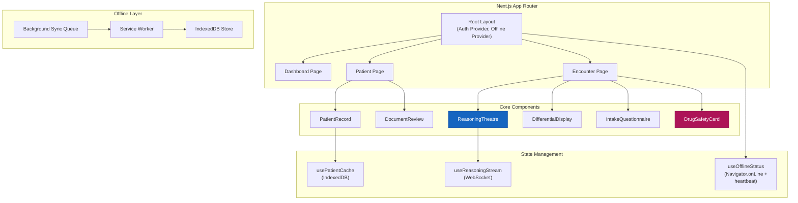
```mermaid
graph TD
    subgraph "Next.js App Router"
        LAYOUT["Root Layout<br/>(Auth Provider, Offline Provider)"]
        LAYOUT --> DASH["Dashboard Page"]
        LAYOUT --> PAT["Patient Page"]
        LAYOUT --> ENC["Encounter Page"]
    end

    subgraph "Core Components"
        RT["ReasoningTheatre"]
        DD["DifferentialDisplay"]
        IQ["IntakeQuestionnaire"]
        PR["PatientRecord"]
        DSC["DrugSafetyCard"]
        DR["DocumentReview"]
    end

    subgraph "State Management"
        WS_HOOK["useReasoningStream<br/>(WebSocket)"]
        OFF_HOOK["useOfflineStatus<br/>(Navigator.onLine +<br/>heartbeat)"]
        CACHE_HOOK["usePatientCache<br/>(IndexedDB)"]
    end

    subgraph "Offline Layer"
        SW["Service Worker"]
        IDB_STORE["IndexedDB Store"]
        SYNC_Q["Background Sync Queue"]
    end

    ENC --> RT & DD & IQ & DSC
    PAT --> PR & DR

    RT --> WS_HOOK
    PR --> CACHE_HOOK
    LAYOUT --> OFF_HOOK

    SW --> IDB_STORE
    SYNC_Q --> SW

    style RT fill:#1565c0,stroke:#0d47a1,color:#fff
    style DSC fill:#ad1457,stroke:#880e4f,color:#fff
```

**Reasoning Theatre** is the signature frontend component. It renders a live view of agent activity during reasoning:
- Each agent appears as a card that activates when the agent starts processing
- Hypotheses appear and shift in ranking as specialist agents report
- Can't-miss flags pulse with amber highlight
- Devil's-advocate critique renders in a distinct contrasting section
- Verifier verdict renders last with a clear pass/flag indicator
- State updates arrive via WebSocket and are applied to a local reducer

### 5.3 Backend Service Architecture

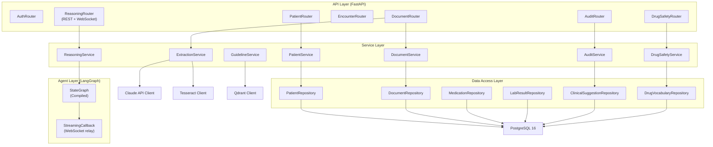
```mermaid
graph TD
    subgraph "API Layer (FastAPI)"
        R_AUTH["AuthRouter"]
        R_PAT["PatientRouter"]
        R_DOC["DocumentRouter"]
        R_ENC["EncounterRouter"]
        R_REAS["ReasoningRouter<br/>(REST + WebSocket)"]
        R_DRUG["DrugSafetyRouter"]
        R_AUDIT["AuditRouter"]
    end

    subgraph "Service Layer"
        S_PAT["PatientService"]
        S_DOC["DocumentService"]
        S_EXT["ExtractionService"]
        S_REAS["ReasoningService"]
        S_DRUG["DrugSafetyService"]
        S_GUIDE["GuidelineService"]
        S_AUDIT["AuditService"]
    end

    subgraph "Agent Layer (LangGraph)"
        GRAPH["StateGraph<br/>(Compiled)"]
        STREAM["StreamingCallback<br/>(WebSocket relay)"]
    end

    subgraph "Data Access Layer"
        REPO_PAT["PatientRepository"]
        REPO_DOC["DocumentRepository"]
        REPO_MED["MedicationRepository"]
        REPO_LAB["LabResultRepository"]
        REPO_CLIN["ClinicalSuggestionRepository"]
        REPO_DRUG["DrugVocabularyRepository"]
    end

    R_PAT --> S_PAT --> REPO_PAT
    R_DOC --> S_DOC --> REPO_DOC
    R_DOC --> S_EXT
    R_REAS --> S_REAS --> GRAPH
    GRAPH --> STREAM
    R_DRUG --> S_DRUG --> REPO_DRUG
    R_AUDIT --> S_AUDIT --> REPO_CLIN

    S_EXT --> LLM_CLIENT["Claude API Client"]
    S_EXT --> OCR_CLIENT["Tesseract Client"]
    S_GUIDE --> QD_CLIENT["Qdrant Client"]

    REPO_PAT & REPO_DOC & REPO_MED & REPO_LAB & REPO_CLIN & REPO_DRUG --> PG["PostgreSQL 16"]
```

---

## 6. Data Model

### 6.1 Entity-Relationship Diagram

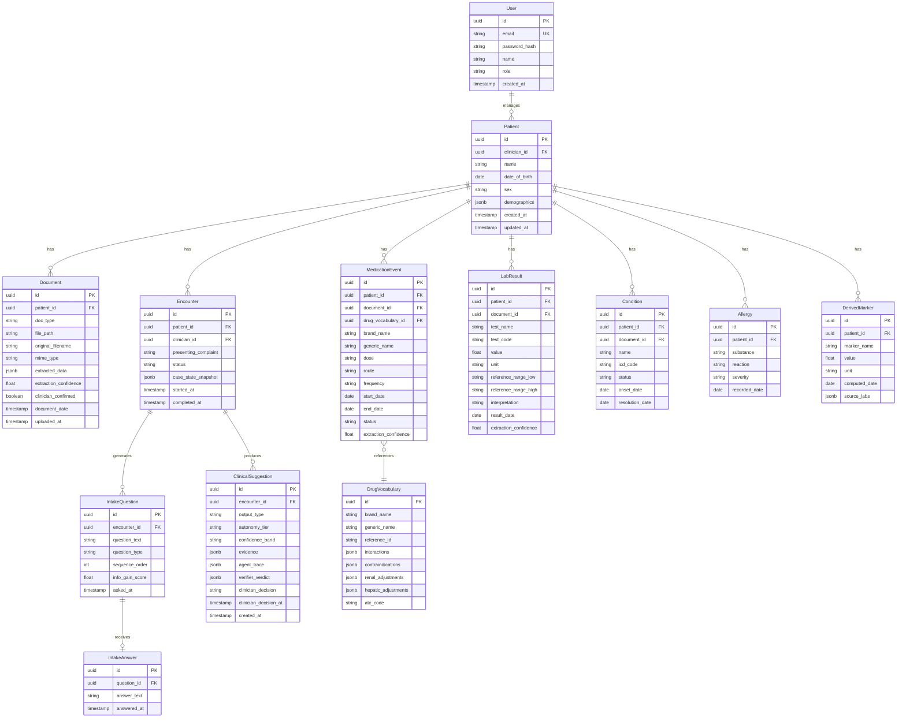
```mermaid
erDiagram
    User ||--o{ Patient : manages
    Patient ||--o{ Document : has
    Patient ||--o{ Encounter : has
    Patient ||--o{ MedicationEvent : has
    Patient ||--o{ LabResult : has
    Patient ||--o{ Condition : has
    Patient ||--o{ Allergy : has
    Patient ||--o{ DerivedMarker : has

    Encounter ||--o{ IntakeQuestion : generates
    IntakeQuestion ||--o| IntakeAnswer : receives
    Encounter ||--o{ ClinicalSuggestion : produces

    MedicationEvent }o--|| DrugVocabulary : references

    User {
        uuid id PK
        string email UK
        string password_hash
        string name
        string role
        timestamp created_at
    }

    Patient {
        uuid id PK
        uuid clinician_id FK
        string name
        date date_of_birth
        string sex
        jsonb demographics
        timestamp created_at
        timestamp updated_at
    }

    Document {
        uuid id PK
        uuid patient_id FK
        string doc_type
        string file_path
        string original_filename
        string mime_type
        jsonb extracted_data
        float extraction_confidence
        boolean clinician_confirmed
        timestamp document_date
        timestamp uploaded_at
    }

    MedicationEvent {
        uuid id PK
        uuid patient_id FK
        uuid document_id FK
        uuid drug_vocabulary_id FK
        string brand_name
        string generic_name
        string dose
        string route
        string frequency
        date start_date
        date end_date
        string status
        float extraction_confidence
    }

    LabResult {
        uuid id PK
        uuid patient_id FK
        uuid document_id FK
        string test_name
        string test_code
        float value
        string unit
        string reference_range_low
        string reference_range_high
        string interpretation
        date result_date
        float extraction_confidence
    }

    Condition {
        uuid id PK
        uuid patient_id FK
        uuid document_id FK
        string name
        string icd_code
        string status
        date onset_date
        date resolution_date
    }

    Allergy {
        uuid id PK
        uuid patient_id FK
        string substance
        string reaction
        string severity
        date recorded_date
    }

    DerivedMarker {
        uuid id PK
        uuid patient_id FK
        string marker_name
        float value
        string unit
        date computed_date
        jsonb source_labs
    }

    Encounter {
        uuid id PK
        uuid patient_id FK
        uuid clinician_id FK
        string presenting_complaint
        string status
        jsonb case_state_snapshot
        timestamp started_at
        timestamp completed_at
    }

    ClinicalSuggestion {
        uuid id PK
        uuid encounter_id FK
        string output_type
        string autonomy_tier
        string confidence_band
        jsonb evidence
        jsonb agent_trace
        jsonb verifier_verdict
        string clinician_decision
        timestamp clinician_decision_at
        timestamp created_at
    }

    IntakeQuestion {
        uuid id PK
        uuid encounter_id FK
        string question_text
        string question_type
        int sequence_order
        float info_gain_score
        timestamp asked_at
    }

    IntakeAnswer {
        uuid id PK
        uuid question_id FK
        string answer_text
        timestamp answered_at
    }

    DrugVocabulary {
        uuid id PK
        string brand_name
        string generic_name
        string reference_id
        jsonb interactions
        jsonb contraindications
        jsonb renal_adjustments
        jsonb hepatic_adjustments
        string atc_code
    }
```

### 6.2 Key Design Decisions

| Decision | Rationale |
|---|---|
| **ClinicalSuggestion is immutable** | Regulatory requirement. Once generated, a suggestion cannot be modified. Clinician decision is appended, not edited. Full agent trace stored for audit. |
| **DrugVocabulary maps Indian brands to generics** | Essential for Indian context. Clinicians write brand names; safety checks need generic/reference IDs. |
| **Extraction confidence stored per-field** | Enables selective clinician review. Only low-confidence fields need manual confirmation. |
| **case_state_snapshot on Encounter** | Captures the complete CaseState at reasoning completion for reproducibility. |
| **jsonb for flexible structures** | Agent traces, evidence, and extracted data have variable schemas. JSONB with application-level validation (Pydantic) provides flexibility with query capability. |

---

## 7. Integration Points

### 7.1 LLM Provider (Anthropic Claude)

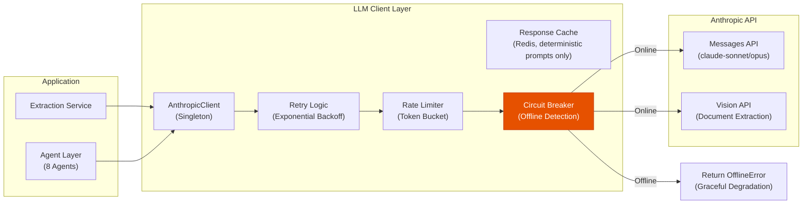
```mermaid
graph LR
    subgraph "Application"
        EXT["Extraction Service"]
        AGENTS["Agent Layer<br/>(8 Agents)"]
    end

    subgraph "LLM Client Layer"
        CLIENT["AnthropicClient<br/>(Singleton)"]
        RETRY["Retry Logic<br/>(Exponential Backoff)"]
        RATE["Rate Limiter<br/>(Token Bucket)"]
        CACHE["Response Cache<br/>(Redis, deterministic prompts only)"]
        CIRCUIT["Circuit Breaker<br/>(Offline Detection)"]
    end

    subgraph "Anthropic API"
        MSG["Messages API<br/>(claude-sonnet/opus)"]
        VIS["Vision API<br/>(Document Extraction)"]
    end

    EXT --> CLIENT
    AGENTS --> CLIENT
    CLIENT --> RETRY --> RATE --> CIRCUIT
    CIRCUIT -->|"Online"| MSG & VIS
    CIRCUIT -->|"Offline"| OFFLINE["Return OfflineError<br/>(Graceful Degradation)"]

    style CIRCUIT fill:#e65100,stroke:#bf360c,color:#fff
```

**Configuration:**

| Parameter | Value | Rationale |
|---|---|---|
| Model (reasoning) | `claude-sonnet-4-20250514` | Balance of capability, speed, cost for multi-agent calls |
| Model (verification) | `claude-sonnet-4-20250514` | Independent model instance for verifier |
| Model (extraction) | `claude-sonnet-4-20250514` with vision | Multimodal capability for document images |
| Max tokens (reasoning) | 4096 per agent | Sufficient for structured clinical output |
| Max tokens (extraction) | 8192 | Longer documents need more output space |
| Temperature | 0.0 | Deterministic clinical outputs |
| Retry policy | 3 attempts, exponential backoff (1s, 2s, 4s) | Handle transient API failures |
| Timeout | 60s per call | Prevent hung requests |
| Circuit breaker | Open after 3 consecutive failures, half-open after 30s | Detect offline state quickly |

### 7.2 Vector Store (Qdrant)

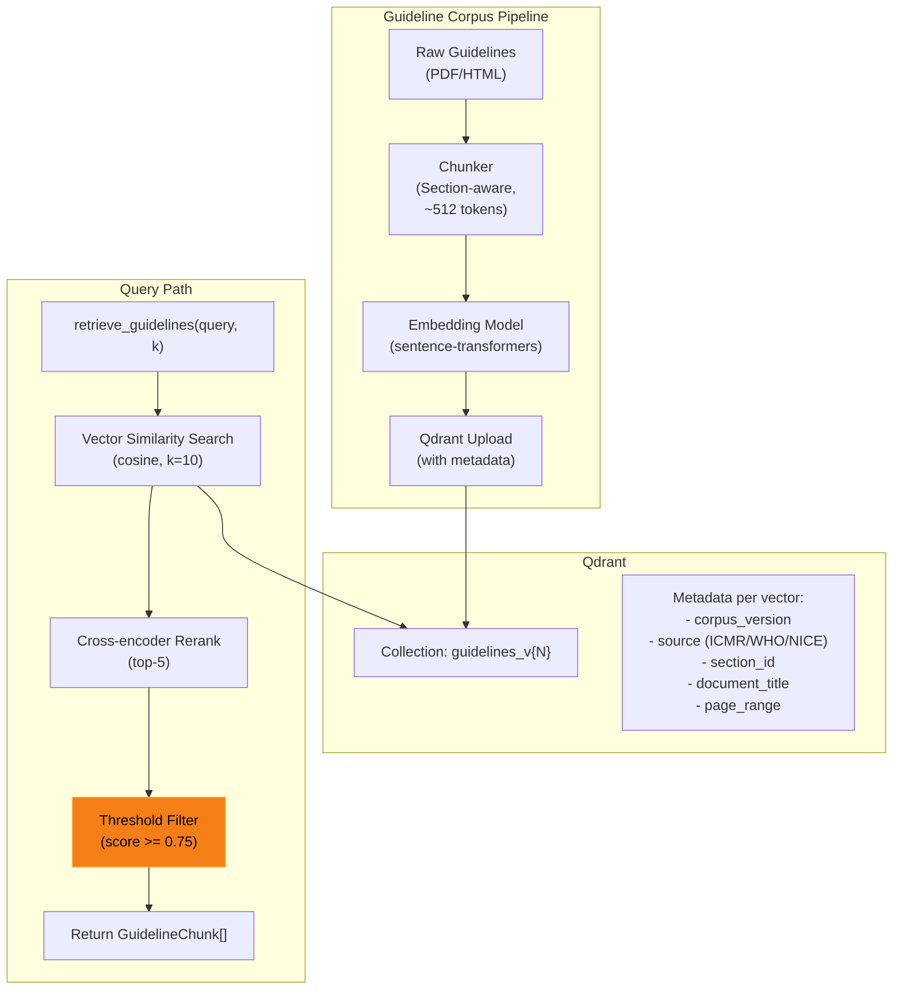
```mermaid
graph TD
    subgraph "Guideline Corpus Pipeline"
        RAW["Raw Guidelines<br/>(PDF/HTML)"]
        CHUNK["Chunker<br/>(Section-aware,<br/>~512 tokens)"]
        EMBED["Embedding Model<br/>(sentence-transformers)"]
        UPLOAD["Qdrant Upload<br/>(with metadata)"]
    end

    subgraph "Qdrant"
        COLL["Collection: guidelines_v{N}"]
        META["Metadata per vector:<br/>- corpus_version<br/>- source (ICMR/WHO/NICE)<br/>- section_id<br/>- document_title<br/>- page_range"]
    end

    subgraph "Query Path"
        QUERY["retrieve_guidelines(query, k)"]
        SEARCH["Vector Similarity Search<br/>(cosine, k=10)"]
        RERANK["Cross-encoder Rerank<br/>(top-5)"]
        THRESHOLD["Threshold Filter<br/>(score >= 0.75)"]
        RETURN["Return GuidelineChunk[]"]
    end

    RAW --> CHUNK --> EMBED --> UPLOAD --> COLL
    QUERY --> SEARCH --> RERANK --> THRESHOLD --> RETURN
    SEARCH --> COLL

    style THRESHOLD fill:#f57f17,stroke:#f9a825,color:#000
```

**Corpus Versioning:** Each guideline corpus version is stored as a separate Qdrant collection (`guidelines_v1`, `guidelines_v2`, ...). The active version is configured in application settings. Old versions are retained for audit trail reproducibility. The `corpus_version` is stored alongside every `ClinicalSuggestion` that references guideline chunks.

### 7.3 File Storage

| Concern | Implementation |
|---|---|
| Storage backend | Local filesystem (Phase 1) with path stored in PostgreSQL |
| File types accepted | JPEG, PNG, PDF |
| Max file size | 10 MB |
| Processing | Files are processed immediately on upload. Originals retained. |
| Retention | Indefinite (regulatory requirement) |
| Encryption | At-rest encryption via OS-level disk encryption (Phase 1), application-level AES-256 (Phase 2) |

### 7.4 OCR (Tesseract)

Tesseract is the **fallback** OCR engine, used only when Claude Vision API is unavailable (offline, rate-limited, or failed).

| Parameter | Value |
|---|---|
| Languages | `eng+hin+tam+tel+kan+mal+ben` (English + major Indian languages) |
| PSM mode | 6 (assume uniform block of text) for prescriptions, 3 (fully automatic) for reports |
| Post-processing | Spell-check against drug vocabulary, lab test name normalization |

---

## 8. Safety Architecture and Autonomy Tiers

### 8.1 Safety Principles

The safety architecture is designed around the principle that **the system must never increase clinical risk relative to the clinician practicing without it**. Every design decision is evaluated against this principle.

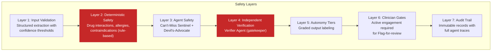
```mermaid
graph TD
    subgraph "Safety Layers"
        L1["Layer 1: Input Validation<br/>Structured extraction with<br/>confidence thresholds"]
        L2["Layer 2: Deterministic Safety<br/>Drug interactions, allergies,<br/>contraindications (rule-based)"]
        L3["Layer 3: Agent Safety<br/>Can't-Miss Sentinel +<br/>Devil's-Advocate"]
        L4["Layer 4: Independent Verification<br/>Verifier Agent (gatekeeper)"]
        L5["Layer 5: Autonomy Tiers<br/>Graded output labeling"]
        L6["Layer 6: Clinician Gates<br/>Active engagement required<br/>for Flag-for-review"]
        L7["Layer 7: Audit Trail<br/>Immutable records with<br/>full agent traces"]
    end

    L1 --> L2 --> L3 --> L4 --> L5 --> L6 --> L7

    style L2 fill:#c62828,stroke:#b71c1c,color:#fff
    style L4 fill:#c62828,stroke:#b71c1c,color:#fff
```

### 8.2 Autonomy Tiers

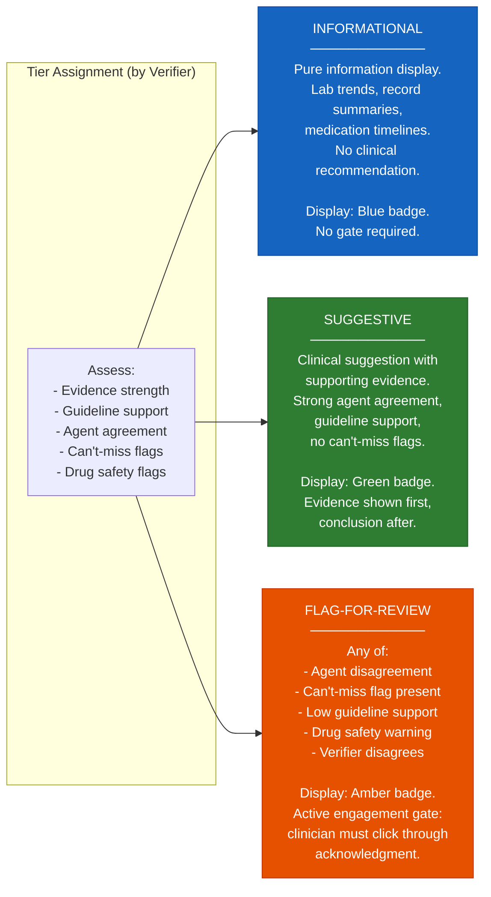
```mermaid
graph LR
    subgraph "Tier Assignment (by Verifier)"
        ASSESS["Assess:<br/>- Evidence strength<br/>- Guideline support<br/>- Agent agreement<br/>- Can't-miss flags<br/>- Drug safety flags"]
    end

    ASSESS --> T1["INFORMATIONAL<br/>────────────<br/>Pure information display.<br/>Lab trends, record summaries,<br/>medication timelines.<br/>No clinical recommendation.<br/><br/>Display: Blue badge.<br/>No gate required."]

    ASSESS --> T2["SUGGESTIVE<br/>────────────<br/>Clinical suggestion with<br/>supporting evidence.<br/>Strong agent agreement,<br/>guideline support,<br/>no can't-miss flags.<br/><br/>Display: Green badge.<br/>Evidence shown first,<br/>conclusion after."]

    ASSESS --> T3["FLAG-FOR-REVIEW<br/>────────────<br/>Any of:<br/>- Agent disagreement<br/>- Can't-miss flag present<br/>- Low guideline support<br/>- Drug safety warning<br/>- Verifier disagrees<br/><br/>Display: Amber badge.<br/>Active engagement gate:<br/>clinician must click through<br/>acknowledgment."]

    style T1 fill:#1565c0,stroke:#0d47a1,color:#fff
    style T2 fill:#2e7d32,stroke:#1b5e20,color:#fff
    style T3 fill:#e65100,stroke:#bf360c,color:#fff
```

### 8.3 Safety Rules Matrix

| Rule | Trigger | Action | Bypassable? |
|---|---|---|---|
| **Allergy hard-block** | `check_drug_safety` returns known allergy match | Block drug suggestion, red alert | No |
| **Major interaction block** | `check_drug_safety` returns major interaction | Block drug suggestion, red alert | No |
| **Absolute contraindication block** | `check_drug_safety` returns absolute contraindication | Block drug suggestion, red alert | No |
| **Can't-miss flag** | Sentinel or triage flags time-critical condition | Force onto differential, require acknowledgment | No (cannot be silently dropped) |
| **Verifier disagreement** | Verifier verdict conflicts with reasoning agents | Conservative output wins: downgrade confidence, add caveats, escalate tier | No (verifier cannot be bypassed) |
| **Low retrieval confidence** | Guideline retrieval score < 0.75 | Output includes "insufficient guideline support" | No |
| **Certainty prohibition** | Any clinical output | Must use hedged language, probability bands, not definitive statements | No |
| **Evidence-before-conclusion** | Differential display | Evidence for/against shown before diagnosis ranking | No (UI enforced) |
| **Devil's-advocate visibility** | Every reasoning session | Critique section always visible, not collapsible by default | No (UI enforced) |

### 8.4 Anti-Automation-Bias Mechanisms

| Mechanism | Implementation |
|---|---|
| **Evidence first** | UI renders evidence for/against before showing the ranked diagnosis |
| **Mandatory counter-evidence** | Devil's-Advocate critique is always generated and displayed |
| **Non-collapsible dissent** | The devil's-advocate section cannot be collapsed by default in the UI |
| **Probability bands, not percentages** | Outputs use HIGH / MODERATE / LOW / VERY_LOW, not misleading numerical probabilities |
| **Active engagement gates** | Flag-for-review outputs require clinician to actively click through an acknowledgment dialog |
| **Agent disagreement surfaced** | When specialist agents disagree, all perspectives are shown with attribution |
| **Can't-miss persistence** | Can't-miss conditions remain visible even if ranked low, with distinct visual treatment |

### 8.5 Verifier Disagreement Resolution

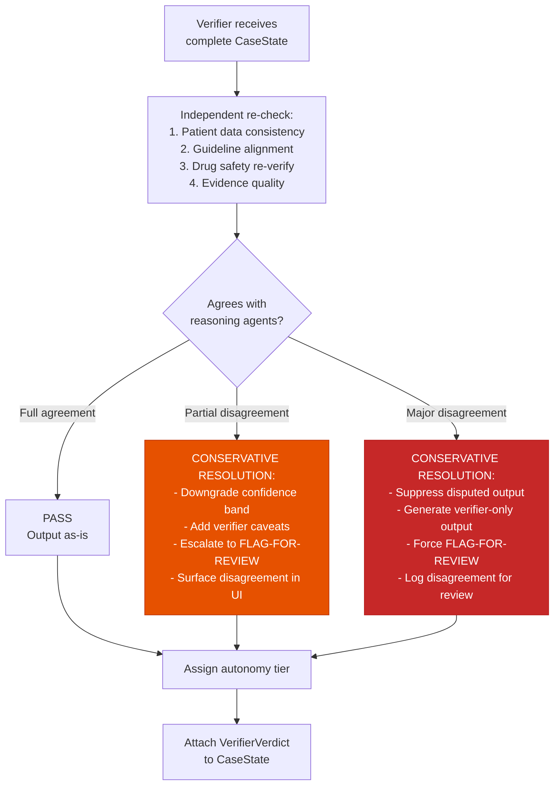
```mermaid
flowchart TD
    V_IN["Verifier receives<br/>complete CaseState"]
    V_IN --> V_CHECK["Independent re-check:<br/>1. Patient data consistency<br/>2. Guideline alignment<br/>3. Drug safety re-verify<br/>4. Evidence quality"]

    V_CHECK --> V_AGREE{"Agrees with<br/>reasoning agents?"}

    V_AGREE -->|"Full agreement"| V_PASS["PASS<br/>Output as-is"]

    V_AGREE -->|"Partial disagreement"| V_PARTIAL["CONSERVATIVE RESOLUTION:<br/>- Downgrade confidence band<br/>- Add verifier caveats<br/>- Escalate to FLAG-FOR-REVIEW<br/>- Surface disagreement in UI"]

    V_AGREE -->|"Major disagreement"| V_MAJOR["CONSERVATIVE RESOLUTION:<br/>- Suppress disputed output<br/>- Generate verifier-only output<br/>- Force FLAG-FOR-REVIEW<br/>- Log disagreement for review"]

    V_PASS --> V_TIER["Assign autonomy tier"]
    V_PARTIAL --> V_TIER
    V_MAJOR --> V_TIER

    V_TIER --> V_OUT["Attach VerifierVerdict<br/>to CaseState"]

    style V_PARTIAL fill:#e65100,stroke:#bf360c,color:#fff
    style V_MAJOR fill:#c62828,stroke:#b71c1c,color:#fff
```

---

## 9. Offline/Online Mode Architecture

### 9.1 Connectivity Model

The system is designed for environments with intermittent internet connectivity. The architecture separates functionality into three tiers based on connectivity requirements.

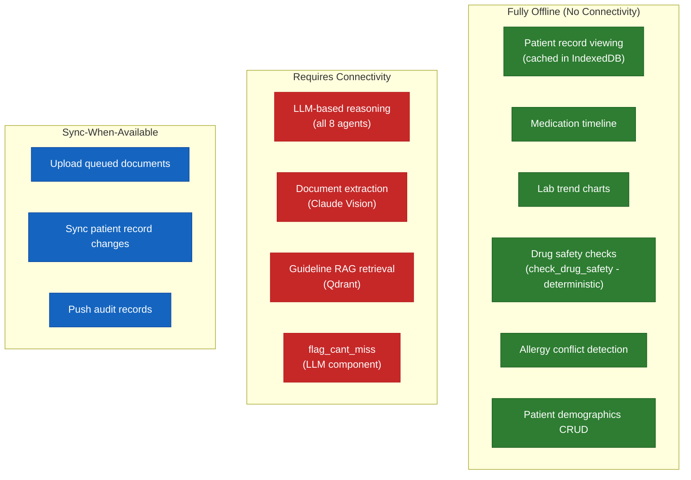
```mermaid
graph TD
    subgraph "Fully Offline (No Connectivity)"
        OFF1["Patient record viewing<br/>(cached in IndexedDB)"]
        OFF2["Medication timeline"]
        OFF3["Lab trend charts"]
        OFF4["Drug safety checks<br/>(check_drug_safety - deterministic)"]
        OFF5["Allergy conflict detection"]
        OFF6["Patient demographics CRUD"]
    end

    subgraph "Requires Connectivity"
        ON1["LLM-based reasoning<br/>(all 8 agents)"]
        ON2["Document extraction<br/>(Claude Vision)"]
        ON3["Guideline RAG retrieval<br/>(Qdrant)"]
        ON4["flag_cant_miss<br/>(LLM component)"]
    end

    subgraph "Sync-When-Available"
        SYNC1["Upload queued documents"]
        SYNC2["Sync patient record changes"]
        SYNC3["Push audit records"]
    end

    style OFF1 fill:#2e7d32,stroke:#1b5e20,color:#fff
    style OFF2 fill:#2e7d32,stroke:#1b5e20,color:#fff
    style OFF3 fill:#2e7d32,stroke:#1b5e20,color:#fff
    style OFF4 fill:#2e7d32,stroke:#1b5e20,color:#fff
    style OFF5 fill:#2e7d32,stroke:#1b5e20,color:#fff
    style OFF6 fill:#2e7d32,stroke:#1b5e20,color:#fff
    style ON1 fill:#c62828,stroke:#b71c1c,color:#fff
    style ON2 fill:#c62828,stroke:#b71c1c,color:#fff
    style ON3 fill:#c62828,stroke:#b71c1c,color:#fff
    style ON4 fill:#c62828,stroke:#b71c1c,color:#fff
    style SYNC1 fill:#1565c0,stroke:#0d47a1,color:#fff
    style SYNC2 fill:#1565c0,stroke:#0d47a1,color:#fff
    style SYNC3 fill:#1565c0,stroke:#0d47a1,color:#fff
```

### 9.2 Offline Data Architecture

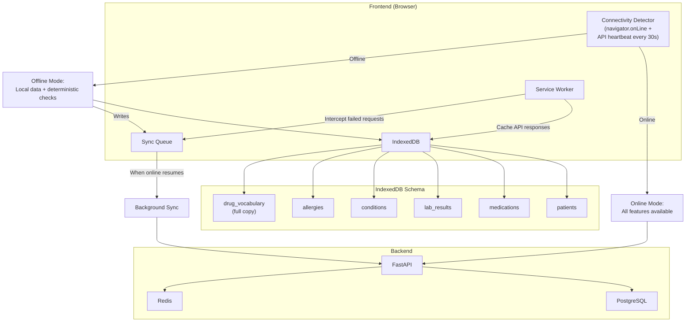
```mermaid
flowchart TD
    subgraph "Frontend (Browser)"
        SW["Service Worker"]
        IDB["IndexedDB"]
        QUEUE["Sync Queue"]
        DETECT["Connectivity Detector<br/>(navigator.onLine +<br/>API heartbeat every 30s)"]
    end

    subgraph "Backend"
        API["FastAPI"]
        PG["PostgreSQL"]
        REDIS["Redis"]
    end

    DETECT -->|"Online"| ONLINE_MODE["Online Mode:<br/>All features available"]
    DETECT -->|"Offline"| OFFLINE_MODE["Offline Mode:<br/>Local data + deterministic checks"]

    ONLINE_MODE --> API --> PG
    API --> REDIS

    OFFLINE_MODE --> IDB
    OFFLINE_MODE -->|"Writes"| QUEUE

    QUEUE -->|"When online resumes"| SYNC["Background Sync"]
    SYNC --> API

    SW -->|"Cache API responses"| IDB
    SW -->|"Intercept failed requests"| QUEUE

    subgraph "IndexedDB Schema"
        IDB_PAT["patients"]
        IDB_MED["medications"]
        IDB_LAB["lab_results"]
        IDB_COND["conditions"]
        IDB_ALG["allergies"]
        IDB_DRUG["drug_vocabulary<br/>(full copy)"]
    end

    IDB --> IDB_PAT & IDB_MED & IDB_LAB & IDB_COND & IDB_ALG & IDB_DRUG
```

### 9.3 Degradation Signals

The system **never silently produces degraded output**. When connectivity is unavailable:

| Scenario | User-Facing Signal |
|---|---|
| Clinician starts reasoning while offline | Banner: "AI reasoning paused --- offline. Drug safety checks and patient records are available." |
| Connectivity lost mid-reasoning | Reasoning halts at current step. Banner: "Connection lost. Reasoning paused at [step]. Partial results shown with caveat." |
| Document uploaded while offline | Document queued. Badge: "Extraction pending --- will process when online." |
| Guideline query while offline | Message: "Guideline search requires internet. Offline drug safety checks are still active." |

### 9.4 Local Drug Safety Engine

The `check_drug_safety` tool operates entirely offline using a local copy of the `DrugVocabulary` table synced to IndexedDB. This ensures that the most critical safety feature --- allergy and interaction checking --- is always available.

```python
# Simplified offline drug safety check flow
async def check_drug_safety_offline(drug_name: str, patient_id: str) -> DrugSafetyResult:
    # 1. Resolve drug identity from local vocabulary
    drug = await idb.drug_vocabulary.find_by_brand_or_generic(drug_name)

    # 2. Load patient safety-relevant data from IndexedDB
    allergies = await idb.allergies.find_by_patient(patient_id)
    active_meds = await idb.medications.find_active_by_patient(patient_id)
    conditions = await idb.conditions.find_active_by_patient(patient_id)
    labs = await idb.lab_results.find_latest_by_patient(patient_id)

    # 3. Run deterministic checks
    allergy_result = check_allergy_match(drug, allergies)
    interaction_results = check_interactions(drug, active_meds)
    contraindication_results = check_contraindications(drug, conditions)
    renal_result = check_renal_dosing(drug, labs)
    hepatic_result = check_hepatic_dosing(drug, labs)

    return DrugSafetyResult(
        allergy=allergy_result,
        interactions=interaction_results,
        contraindications=contraindication_results,
        renal=renal_result,
        hepatic=hepatic_result,
        hard_blocks=collect_hard_blocks(...)
    )
```

---

## 10. Cross-Cutting Concerns

### 10.1 Audit Logging

Every clinical decision and system action is logged to an immutable audit trail. This is a regulatory requirement for CDSCO SaMD classification and DPDP Act compliance.

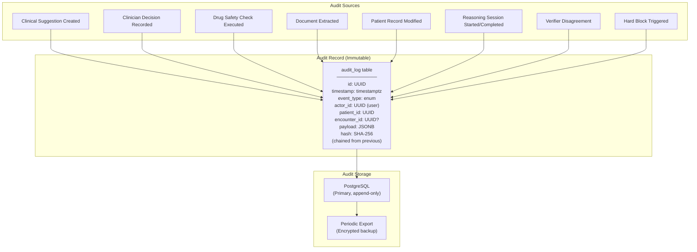
```mermaid
graph TD
    subgraph "Audit Sources"
        A1["Clinical Suggestion Created"]
        A2["Clinician Decision Recorded"]
        A3["Drug Safety Check Executed"]
        A4["Document Extracted"]
        A5["Patient Record Modified"]
        A6["Reasoning Session Started/Completed"]
        A7["Verifier Disagreement"]
        A8["Hard Block Triggered"]
    end

    subgraph "Audit Record (Immutable)"
        AR["audit_log table<br/>────────────<br/>id: UUID<br/>timestamp: timestamptz<br/>event_type: enum<br/>actor_id: UUID (user)<br/>patient_id: UUID<br/>encounter_id: UUID?<br/>payload: JSONB<br/>hash: SHA-256<br/>(chained from previous)"]
    end

    subgraph "Audit Storage"
        PG["PostgreSQL<br/>(Primary, append-only)"]
        EXPORT["Periodic Export<br/>(Encrypted backup)"]
    end

    A1 & A2 & A3 & A4 & A5 & A6 & A7 & A8 --> AR --> PG
    PG --> EXPORT
```

**Audit Record Integrity:** Each audit record includes a SHA-256 hash chained from the previous record, creating a tamper-evident log. The `audit_log` table uses PostgreSQL row-level security (RLS) to prevent deletion and UPDATE operations at the database level.

```sql
-- Audit table: append-only enforcement
CREATE TABLE audit_log (
    id UUID PRIMARY KEY DEFAULT gen_random_uuid(),
    timestamp TIMESTAMPTZ NOT NULL DEFAULT now(),
    event_type TEXT NOT NULL,
    actor_id UUID NOT NULL REFERENCES users(id),
    patient_id UUID REFERENCES patients(id),
    encounter_id UUID REFERENCES encounters(id),
    payload JSONB NOT NULL,
    prev_hash TEXT NOT NULL,
    hash TEXT NOT NULL GENERATED ALWAYS AS (
        encode(sha256(
            (prev_hash || id::text || timestamp::text || event_type || payload::text)::bytea
        ), 'hex')
    ) STORED
);

-- Prevent UPDATE and DELETE
CREATE POLICY audit_append_only ON audit_log
    FOR ALL
    USING (true)
    WITH CHECK (true);

REVOKE UPDATE, DELETE ON audit_log FROM app_user;
```

### 10.2 Error Handling

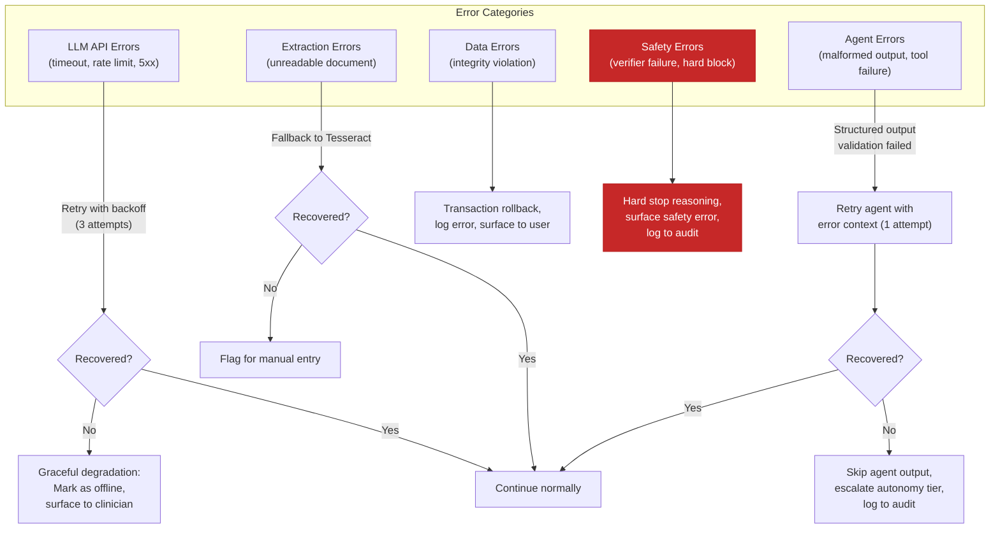
```mermaid
graph TD
    subgraph "Error Categories"
        E1["LLM API Errors<br/>(timeout, rate limit, 5xx)"]
        E2["Extraction Errors<br/>(unreadable document)"]
        E3["Agent Errors<br/>(malformed output, tool failure)"]
        E4["Data Errors<br/>(integrity violation)"]
        E5["Safety Errors<br/>(verifier failure, hard block)"]
    end

    E1 -->|"Retry with backoff<br/>(3 attempts)"| R1{"Recovered?"}
    R1 -->|"Yes"| CONTINUE["Continue normally"]
    R1 -->|"No"| DEGRADE["Graceful degradation:<br/>Mark as offline,<br/>surface to clinician"]

    E2 -->|"Fallback to Tesseract"| R2{"Recovered?"}
    R2 -->|"Yes"| CONTINUE
    R2 -->|"No"| MANUAL["Flag for manual entry"]

    E3 -->|"Structured output<br/>validation failed"| RETRY_AGENT["Retry agent with<br/>error context (1 attempt)"]
    RETRY_AGENT --> R3{"Recovered?"}
    R3 -->|"Yes"| CONTINUE
    R3 -->|"No"| SKIP_AGENT["Skip agent output,<br/>escalate autonomy tier,<br/>log to audit"]

    E4 --> ROLLBACK["Transaction rollback,<br/>log error, surface to user"]

    E5 --> HARD_STOP["Hard stop reasoning,<br/>surface safety error,<br/>log to audit"]

    style E5 fill:#c62828,stroke:#b71c1c,color:#fff
    style HARD_STOP fill:#c62828,stroke:#b71c1c,color:#fff
```

**Error Hierarchy:**

```python
class AetherError(Exception):
    """Base error for all Aether Clinician errors."""

class LLMError(AetherError):
    """LLM API communication errors."""

class ExtractionError(AetherError):
    """Document extraction failures."""

class AgentError(AetherError):
    """Agent execution failures."""

class SafetyError(AetherError):
    """Safety-critical errors that must halt processing."""

class HardBlockError(SafetyError):
    """Drug safety hard-block. Cannot be caught/suppressed by agent layer."""

class VerifierError(SafetyError):
    """Verifier agent failure. Reasoning cannot complete without verification."""

class OfflineError(AetherError):
    """Feature requires connectivity but system is offline."""
```

### 10.3 Observability

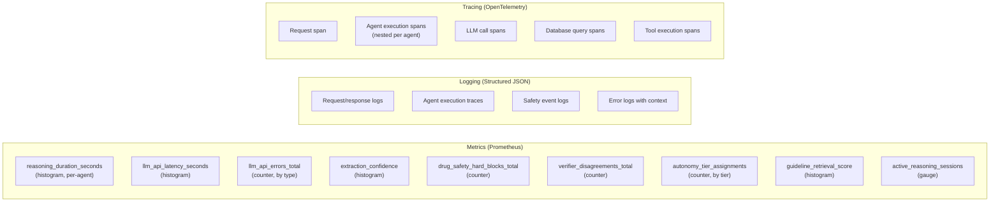
```mermaid
graph LR
    subgraph "Metrics (Prometheus)"
        M1["reasoning_duration_seconds<br/>(histogram, per-agent)"]
        M2["llm_api_latency_seconds<br/>(histogram)"]
        M3["llm_api_errors_total<br/>(counter, by type)"]
        M4["extraction_confidence<br/>(histogram)"]
        M5["drug_safety_hard_blocks_total<br/>(counter)"]
        M6["verifier_disagreements_total<br/>(counter)"]
        M7["autonomy_tier_assignments<br/>(counter, by tier)"]
        M8["guideline_retrieval_score<br/>(histogram)"]
        M9["active_reasoning_sessions<br/>(gauge)"]
    end

    subgraph "Logging (Structured JSON)"
        L1["Request/response logs"]
        L2["Agent execution traces"]
        L3["Safety event logs"]
        L4["Error logs with context"]
    end

    subgraph "Tracing (OpenTelemetry)"
        T1["Request span"]
        T2["Agent execution spans<br/>(nested per agent)"]
        T3["LLM call spans"]
        T4["Database query spans"]
        T5["Tool execution spans"]
    end
```

**Key SLIs (Service-Level Indicators):**

| SLI | Target | Measurement |
|---|---|---|
| Cached record view latency | < 1 second (p95) | Client-side timing |
| Document extraction latency | < 30 seconds (p95) | Server-side timing |
| Full reasoning pipeline latency | < 120 seconds (p95) | Server-side timing |
| LLM API availability | > 99.5% (as measured by us) | Circuit breaker state |
| Drug safety check latency | < 100ms (p99) | Server-side timing (deterministic) |
| Guideline citation faithfulness | >= 95% | Periodic manual audit |
| Extraction confidence (auto-accept) | >= 85% of fields | Histogram analysis |

### 10.4 Authentication and Authorization

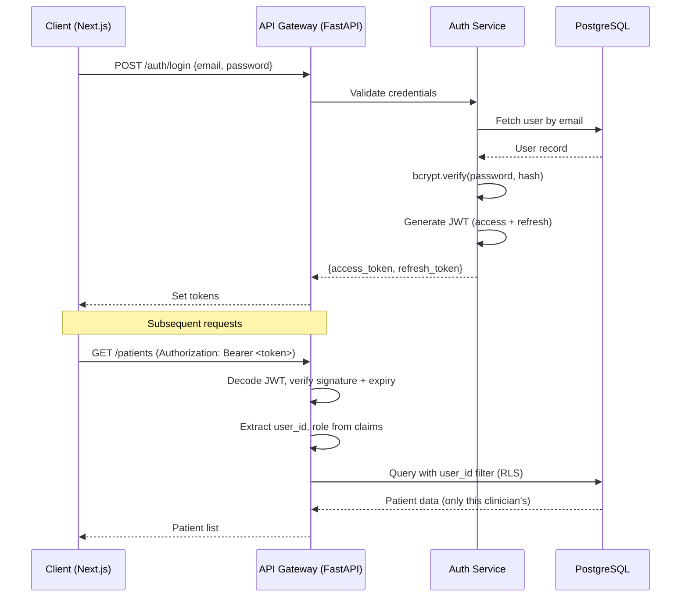
```mermaid
sequenceDiagram
    participant C as Client (Next.js)
    participant G as API Gateway (FastAPI)
    participant A as Auth Service
    participant DB as PostgreSQL

    C->>G: POST /auth/login {email, password}
    G->>A: Validate credentials
    A->>DB: Fetch user by email
    DB-->>A: User record
    A->>A: bcrypt.verify(password, hash)
    A->>A: Generate JWT (access + refresh)
    A-->>G: {access_token, refresh_token}
    G-->>C: Set tokens

    Note over C,G: Subsequent requests

    C->>G: GET /patients (Authorization: Bearer <token>)
    G->>G: Decode JWT, verify signature + expiry
    G->>G: Extract user_id, role from claims
    G->>DB: Query with user_id filter (RLS)
    DB-->>G: Patient data (only this clinician's)
    G-->>C: Patient list
```

| Parameter | Value |
|---|---|
| Password hashing | bcrypt (cost factor 12) |
| JWT signing | HS256 (symmetric, rotate key quarterly) |
| Access token TTL | 15 minutes |
| Refresh token TTL | 7 days |
| Token storage (client) | httpOnly cookie (access), secure cookie (refresh) |
| Row-Level Security | PostgreSQL RLS policies: clinicians see only their own patients |

### 10.5 Performance Targets

| Operation | Target | Strategy |
|---|---|---|
| Cached patient record render | < 1s | IndexedDB + React Server Components |
| Patient list load | < 2s | PostgreSQL index + Redis cache |
| Document upload + extraction | < 30s | Claude Vision API (async processing) |
| Full reasoning pipeline | < 2 min | Parallel specialist agents, streaming output |
| Drug safety check | < 100ms | Deterministic, local computation |
| Guideline retrieval | < 2s | Qdrant HNSW index + cross-encoder rerank |
| WebSocket message delivery | < 200ms | Redis pub/sub for multi-instance |

---

## 11. Deployment and Infrastructure

### 11.1 Deployment Architecture

```mermaid
graph TD
    subgraph "Production (Single Server - Phase 1)"
        NGINX["Nginx<br/>(Reverse Proxy + TLS)"]
        NEXT["Next.js<br/>(SSR + Static)"]
        FAST["FastAPI<br/>(Uvicorn, 4 workers)"]
        PG["PostgreSQL 16"]
        QD["Qdrant"]
        RD["Redis 7"]
    end

    subgraph "External"
        CLAUDE["Anthropic Claude API"]
    end

    CLIENT["Clinician's Browser"] --> NGINX
    NGINX --> NEXT
    NGINX --> FAST
    FAST --> PG & QD & RD
    FAST --> CLAUDE

    style NGINX fill:#1565c0,stroke:#0d47a1,color:#fff
```

**Phase 1 deployment** targets a single modest server (or laptop for development) with all services co-located. Docker Compose orchestrates the services.

```yaml
# docker-compose.yml (simplified)
services:
  web:
    build: ./apps/web
    ports: ["3000:3000"]
    depends_on: [api]

  api:
    build: ./apps/api
    ports: ["8000:8000"]
    depends_on: [postgres, redis, qdrant]
    environment:
      - DATABASE_URL=postgresql+asyncpg://...
      - REDIS_URL=redis://redis:6379
      - QDRANT_URL=http://qdrant:6333
      - ANTHROPIC_API_KEY=${ANTHROPIC_API_KEY}

  postgres:
    image: postgres:16
    volumes: ["pg_data:/var/lib/postgresql/data"]
    environment:
      - POSTGRES_DB=aether
      - POSTGRES_USER=aether
      - POSTGRES_PASSWORD=${PG_PASSWORD}

  redis:
    image: redis:7-alpine
    volumes: ["redis_data:/data"]

  qdrant:
    image: qdrant/qdrant:latest
    volumes: ["qdrant_data:/qdrant/storage"]

  nginx:
    image: nginx:alpine
    ports: ["80:80", "443:443"]
    volumes: ["./nginx/nginx.conf:/etc/nginx/nginx.conf"]
    depends_on: [web, api]
```

### 11.2 Data Residency and Compliance

| Requirement | Implementation |
|---|---|
| **India data residency** | All patient data stored on India-region servers. LLM API calls send patient data to Anthropic (processed, not stored --- verify DPA). |
| **DPDP Act** | Consent collection at signup, data minimization, purpose limitation, right to erasure (soft-delete with audit trail retention). |
| **CDSCO SaMD (Class B/C)** | Immutable audit logs, traceability, clinical validation plan, risk management file. Architecture supports required documentation. |
| **Data encryption** | TLS 1.3 in transit, AES-256 at rest (disk-level Phase 1, application-level Phase 2). |

---

## 12. Appendices

### Appendix A: Glossary

| Term | Definition |
|---|---|
| **CaseState** | The shared state object that flows through every agent in the reasoning pipeline |
| **Autonomy tier** | Classification of output assertiveness: Informational, Suggestive, or Flag-for-review |
| **Hard block** | An unbypassable safety alert (allergy, major interaction, absolute contraindication) |
| **Can't-miss condition** | A dangerous, time-critical, commonly-missed diagnosis that must remain on the differential |
| **Probability band** | Qualitative confidence level: HIGH, MODERATE, LOW, VERY_LOW (not numerical percentages) |
| **Conservative output** | The safer of two conflicting outputs; always preferred when verifier disagrees |
| **Reasoning Theatre** | The frontend component that displays live agent activity during reasoning |
| **Guideline chunk** | A semantically coherent segment of a clinical guideline, embedded and stored in Qdrant |
| **Citation faithfulness** | The proportion of guideline citations that accurately represent the source material |

### Appendix B: Technology Decision Log

| Decision | Chosen | Alternatives Considered | Rationale |
|---|---|---|---|
| LLM provider | Anthropic Claude | OpenAI GPT-4, Google Gemini | Multimodal (vision for document extraction), strong structured output, tool use support, safety-oriented design |
| Agent orchestration | LangGraph | CrewAI, AutoGen, custom | First-class state graph with conditional edges, streaming support, persistent state, Python-native |
| Vector store | Qdrant | Pinecone, Weaviate, pgvector | Self-hosted (data residency), HNSW performance, metadata filtering, payload storage |
| Database | PostgreSQL 16 | MySQL, MongoDB | JSONB for flexible schemas, RLS for tenant isolation, mature ecosystem, Alembic migrations |
| Frontend | Next.js 14 | Remix, SvelteKit | App Router with RSC, strong SSR, Turborepo integration, React ecosystem |
| Cache | Redis 7 | Memcached | Pub/sub for WebSocket fan-out, session storage, sorted sets for rate limiting |
| Monorepo | Turborepo | Nx, Lerna | Fast incremental builds, simple configuration, good Next.js integration |

### Appendix C: Phase Roadmap Summary

| Phase | Scope | Key Deliverables |
|---|---|---|
| **Phase 1** | Core CDSS | Patient record management, document extraction, 8-agent reasoning engine, drug safety checks, differential diagnosis |
| **Phase 2** | Enhanced safety + offline | Application-level encryption, enhanced offline capabilities, clinical validation study |
| **Phase 3** | Guideline management | Guideline-cited management options (full Guideline-RAG integration), corpus management tooling |
| **Phase 4** | Scale + compliance | Multi-clinic deployment, CDSCO submission, performance optimization |

---

*End of Architecture Design Document*
