# Aether Clinician -- Database Schema Design

**Document type:** Technical specification -- database layer
**Parent spec:** Documedic v2.0 (Multi-Agent Diagnostic Reasoning build)
**Status:** Ready for implementation
**Database engine:** PostgreSQL 16
**Migration framework:** Alembic (SQLAlchemy-based)
**Last updated:** 2026-06-27

---

## Table of Contents

1. [Design Principles](#1-design-principles)
2. [Naming Conventions](#2-naming-conventions)
3. [Common Column Patterns](#3-common-column-patterns)
4. [Complete Table Definitions](#4-complete-table-definitions)
5. [Entity-Relationship Diagram](#5-entity-relationship-diagram)
6. [Index Strategy](#6-index-strategy)
7. [Migration Plan](#7-migration-plan)
8. [Immutable Audit Log Design](#8-immutable-audit-log-design)
9. [Patient Graph Data Model](#9-patient-graph-data-model)
10. [Data Retention and Archival Strategy](#10-data-retention-and-archival-strategy)
11. [Encryption and Privacy Considerations](#11-encryption-and-privacy-considerations)
12. [Seed Data](#12-seed-data)

---

## 1. Design Principles

### 1.1 Immutability and Auditability

Every `ClinicalSuggestion` row is **append-only**. Once written, it is never updated or deleted. This is the foundation of the audit trail required for CDSCO SaMD submission. The append-only guarantee is enforced at three levels:

- **Database level:** A PostgreSQL trigger on `clinical_suggestions` rejects any `UPDATE` or `DELETE` operation.
- **Application level:** The SQLAlchemy model for `ClinicalSuggestion` omits update/delete methods. The ORM session is configured to raise on dirty instances of this model.
- **Migration level:** No Alembic migration may add `UPDATE` or `DELETE` grants on this table.

Clinician decisions (accept / override / edit) are recorded as **separate rows** in `clinician_decisions`, linked back to the original suggestion by foreign key. This preserves the original suggestion intact while capturing the clinician's response.

### 1.2 Source Linking

Every extracted clinical datum (medication, lab result, condition, allergy) carries a `source_document_id` foreign key pointing to the `documents` table and an `extraction_region` JSONB column encoding the bounding box or text span within the source document. This ensures full traceability from any patient-graph datum back to the original uploaded file and the exact region from which it was extracted.

### 1.3 Per-Field Confidence

Extracted data carries per-field confidence scores. The `extraction_confidence` JSONB column on clinical entities stores a map of `{ field_name: float }` pairs, where each float is in `[0.0, 1.0]`. Fields below the configurable confirmation threshold trigger clinician confirmation cards in the UI.

### 1.4 Soft Deletes Only

No clinical data is ever hard-deleted. All tables with patient data include an `is_deleted` boolean column (default `false`) and a `deleted_at` timestamp. Application queries filter on `is_deleted = false` by default. The `accounts` table also uses soft deletes for DPDP Act right-to-erasure compliance (with data anonymization rather than deletion).

### 1.5 UUID Primary Keys

All primary keys are UUIDv4 to prevent sequential ID exposure. Generated server-side via `gen_random_uuid()` (PostgreSQL 16 built-in).

### 1.6 Timestamps in UTC

All `TIMESTAMPTZ` columns store UTC. The application layer converts to IST (Asia/Kolkata, UTC+5:30) for display only. No `TIMESTAMP WITHOUT TIME ZONE` columns exist in the schema.

### 1.7 JSONB for Semi-Structured Data

Agent traces, evidence collections, extraction metadata, and other polymorphic/nested data use JSONB columns with documented schemas. GIN indexes are applied where query patterns require it.

### 1.8 India Data Residency

All PostgreSQL instances must run in the India region (`ap-south-1` or equivalent). This is an infrastructure constraint, not a schema constraint, but the schema documentation records it as a hard requirement. No replication outside India.

---

## 2. Naming Conventions

| Element | Convention | Example |
|---------|-----------|---------|
| Table names | `snake_case`, plural | `patients`, `lab_results` |
| Column names | `snake_case` | `patient_id`, `created_at` |
| Primary keys | `id` (UUID) | `id UUID PRIMARY KEY` |
| Foreign keys | `{referenced_table_singular}_id` | `patient_id`, `document_id` |
| Boolean columns | `is_` or `has_` prefix | `is_deleted`, `has_allergy_conflict` |
| Timestamp columns | `_at` suffix | `created_at`, `updated_at`, `deleted_at` |
| JSONB columns | Descriptive name, no suffix | `extraction_metadata`, `agent_trace` |
| Indexes | `ix_{table}_{columns}` | `ix_patients_account_id` |
| Unique constraints | `uq_{table}_{columns}` | `uq_accounts_email` |
| Check constraints | `ck_{table}_{description}` | `ck_lab_results_value_not_negative` |
| Enum types | `{domain}_enum` | `suggestion_type_enum` |

---

## 3. Common Column Patterns

Every table includes the following base columns unless explicitly noted:

```sql
id              UUID            PRIMARY KEY DEFAULT gen_random_uuid(),
created_at      TIMESTAMPTZ     NOT NULL    DEFAULT now(),
updated_at      TIMESTAMPTZ     NOT NULL    DEFAULT now()
```

Tables holding patient-related clinical data additionally include:

```sql
is_deleted      BOOLEAN         NOT NULL    DEFAULT false,
deleted_at      TIMESTAMPTZ                 -- NULL when not deleted
```

A PostgreSQL trigger `trg_{table}_set_updated_at` fires `BEFORE UPDATE` and sets `updated_at = now()` on every mutable table. The `clinical_suggestions` table is exempt (immutable).

---

## 4. Complete Table Definitions

### 4.1 Auth & Account Domain

#### `accounts`

Stores clinician/user accounts. Demo mode: no credential verification gate, but password is still hashed for structural readiness.

```sql
CREATE TABLE accounts (
    id              UUID            PRIMARY KEY DEFAULT gen_random_uuid(),
    email           VARCHAR(255)    NOT NULL,
    password_hash   VARCHAR(255)    NOT NULL,
    display_name    VARCHAR(255),
    is_deleted      BOOLEAN         NOT NULL DEFAULT false,
    deleted_at      TIMESTAMPTZ,
    created_at      TIMESTAMPTZ     NOT NULL DEFAULT now(),
    updated_at      TIMESTAMPTZ     NOT NULL DEFAULT now(),

    CONSTRAINT uq_accounts_email UNIQUE (email)
);

COMMENT ON TABLE accounts IS 'User accounts. Demo mode: anyone can sign up with email + password. No clinician-credential gate.';
COMMENT ON COLUMN accounts.password_hash IS 'bcrypt or argon2id hash. Never store plaintext.';
```

#### `sessions`

JWT session tracking for authentication.

```sql
CREATE TABLE sessions (
    id              UUID            PRIMARY KEY DEFAULT gen_random_uuid(),
    account_id      UUID            NOT NULL REFERENCES accounts(id),
    token_hash      VARCHAR(255)    NOT NULL,
    expires_at      TIMESTAMPTZ     NOT NULL,
    ip_address      INET,
    user_agent      TEXT,
    is_revoked      BOOLEAN         NOT NULL DEFAULT false,
    created_at      TIMESTAMPTZ     NOT NULL DEFAULT now(),
    updated_at      TIMESTAMPTZ     NOT NULL DEFAULT now()
);

COMMENT ON TABLE sessions IS 'JWT session tracking. Tokens are hashed; raw JWTs are never stored.';
COMMENT ON COLUMN sessions.token_hash IS 'SHA-256 hash of the JWT. Used for revocation lookups.';
```

---

### 4.2 Patient Domain

#### `patients`

Core patient record. One account can manage multiple patients.

```sql
CREATE TABLE patients (
    id                  UUID            PRIMARY KEY DEFAULT gen_random_uuid(),
    account_id          UUID            NOT NULL REFERENCES accounts(id),
    full_name           VARCHAR(500)    NOT NULL,
    date_of_birth       DATE,
    sex                 VARCHAR(20),
    phone               VARCHAR(20),
    address_text        TEXT,
    notes               TEXT,
    consent_given       BOOLEAN         NOT NULL DEFAULT false,
    consent_given_at    TIMESTAMPTZ,
    is_deleted          BOOLEAN         NOT NULL DEFAULT false,
    deleted_at          TIMESTAMPTZ,
    created_at          TIMESTAMPTZ     NOT NULL DEFAULT now(),
    updated_at          TIMESTAMPTZ     NOT NULL DEFAULT now(),

    CONSTRAINT ck_patients_sex CHECK (sex IN ('male', 'female', 'other', 'unknown'))
);

COMMENT ON TABLE patients IS 'Core patient record. One account manages many patients.';
COMMENT ON COLUMN patients.consent_given IS 'Mandatory consent capture per patient (DPDP Act). Must be true before any clinical data is stored.';
COMMENT ON COLUMN patients.sex IS 'Biological sex relevant for clinical calculations (e.g., eGFR). Not gender identity.';
```

---

### 4.3 Document & Ingestion Domain

#### `documents`

Original uploaded files with extraction metadata.

```sql
CREATE TABLE documents (
    id                      UUID            PRIMARY KEY DEFAULT gen_random_uuid(),
    patient_id              UUID            NOT NULL REFERENCES patients(id),
    account_id              UUID            NOT NULL REFERENCES accounts(id),
    file_name               VARCHAR(500)    NOT NULL,
    file_type               VARCHAR(50)     NOT NULL,
    file_size_bytes         INTEGER         NOT NULL,
    storage_path            TEXT            NOT NULL,
    storage_hash_sha256     VARCHAR(64)     NOT NULL,
    document_type           VARCHAR(50),
    document_date           DATE,
    extraction_status       VARCHAR(30)     NOT NULL DEFAULT 'pending',
    extraction_started_at   TIMESTAMPTZ,
    extraction_completed_at TIMESTAMPTZ,
    extraction_metadata     JSONB           NOT NULL DEFAULT '{}',
    extraction_model        VARCHAR(100),
    extraction_prompt_version VARCHAR(50),
    ocr_fallback_used       BOOLEAN         NOT NULL DEFAULT false,
    page_count              INTEGER,
    is_deleted              BOOLEAN         NOT NULL DEFAULT false,
    deleted_at              TIMESTAMPTZ,
    created_at              TIMESTAMPTZ     NOT NULL DEFAULT now(),
    updated_at              TIMESTAMPTZ     NOT NULL DEFAULT now(),

    CONSTRAINT ck_documents_file_type CHECK (file_type IN ('pdf', 'image/jpeg', 'image/png', 'image/webp', 'image/heic')),
    CONSTRAINT ck_documents_extraction_status CHECK (
        extraction_status IN ('pending', 'processing', 'completed', 'failed', 'needs_confirmation')
    ),
    CONSTRAINT ck_documents_document_type CHECK (
        document_type IS NULL OR document_type IN ('prescription', 'lab_report', 'discharge_summary', 'imaging_report', 'referral', 'other')
    )
);

COMMENT ON TABLE documents IS 'Original uploaded files. Source-of-truth for all extracted data. Files stored encrypted at rest.';
COMMENT ON COLUMN documents.storage_path IS 'Path to encrypted file in local/cloud storage. Never a public URL.';
COMMENT ON COLUMN documents.storage_hash_sha256 IS 'SHA-256 of the original file bytes for integrity verification.';
COMMENT ON COLUMN documents.extraction_metadata IS 'JSONB: { raw_text, page_extractions[], field_count, confirmation_required_count, model_version, ... }';
COMMENT ON COLUMN documents.extraction_model IS 'LLM model identifier used for extraction (for reproducibility).';
COMMENT ON COLUMN documents.extraction_prompt_version IS 'Prompt version hash used for extraction (for reproducibility).';
```

---

### 4.4 Clinical Entity Domain (Patient Graph)

#### `encounters`

Clinical encounters / visits.

```sql
CREATE TABLE encounters (
    id                      UUID            PRIMARY KEY DEFAULT gen_random_uuid(),
    patient_id              UUID            NOT NULL REFERENCES patients(id),
    source_document_id      UUID            REFERENCES documents(id),
    encounter_date          DATE            NOT NULL,
    encounter_type          VARCHAR(50),
    presenting_complaint    TEXT,
    clinician_notes         TEXT,
    extraction_region       JSONB,
    extraction_confidence   JSONB           NOT NULL DEFAULT '{}',
    is_deleted              BOOLEAN         NOT NULL DEFAULT false,
    deleted_at              TIMESTAMPTZ,
    created_at              TIMESTAMPTZ     NOT NULL DEFAULT now(),
    updated_at              TIMESTAMPTZ     NOT NULL DEFAULT now(),

    CONSTRAINT ck_encounters_type CHECK (
        encounter_type IS NULL OR encounter_type IN (
            'outpatient', 'inpatient', 'emergency', 'teleconsultation', 'follow_up', 'other'
        )
    )
);

COMMENT ON TABLE encounters IS 'Clinical encounters/visits. Source-linked to the document from which they were extracted.';
COMMENT ON COLUMN encounters.extraction_region IS 'JSONB: { page: int, bbox: {x, y, w, h} } or { page: int, char_start: int, char_end: int } -- region in source document.';
COMMENT ON COLUMN encounters.extraction_confidence IS 'JSONB: { field_name: confidence_float } for each extracted field.';
```

#### `medication_events`

Drug references with start/stop/change events and dosing.

```sql
CREATE TABLE medication_events (
    id                      UUID            PRIMARY KEY DEFAULT gen_random_uuid(),
    patient_id              UUID            NOT NULL REFERENCES patients(id),
    encounter_id            UUID            REFERENCES encounters(id),
    source_document_id      UUID            REFERENCES documents(id),
    drug_vocabulary_id      UUID            REFERENCES drug_vocabulary(id),
    brand_name_raw          VARCHAR(500),
    generic_name            VARCHAR(500),
    dose                    VARCHAR(100),
    dose_unit               VARCHAR(50),
    frequency               VARCHAR(100),
    route                   VARCHAR(50),
    event_type              VARCHAR(20)     NOT NULL,
    event_date              DATE,
    end_date                DATE,
    duration_text           VARCHAR(100),
    prescriber_name         VARCHAR(255),
    is_current              BOOLEAN         NOT NULL DEFAULT true,
    extraction_region       JSONB,
    extraction_confidence   JSONB           NOT NULL DEFAULT '{}',
    clinician_confirmed     BOOLEAN         NOT NULL DEFAULT false,
    clinician_confirmed_at  TIMESTAMPTZ,
    is_deleted              BOOLEAN         NOT NULL DEFAULT false,
    deleted_at              TIMESTAMPTZ,
    created_at              TIMESTAMPTZ     NOT NULL DEFAULT now(),
    updated_at              TIMESTAMPTZ     NOT NULL DEFAULT now(),

    CONSTRAINT ck_medication_events_event_type CHECK (
        event_type IN ('start', 'stop', 'change', 'continue', 'one_time')
    )
);

COMMENT ON TABLE medication_events IS 'Drug events: start/stop/dose-change. Each event is source-linked. brand_name_raw preserves original text; drug_vocabulary_id normalizes to reference identifier.';
COMMENT ON COLUMN medication_events.brand_name_raw IS 'Original brand name as extracted from the document, before normalization.';
COMMENT ON COLUMN medication_events.drug_vocabulary_id IS 'FK to drug_vocabulary for normalized drug identity. NULL if normalization failed or pending.';
COMMENT ON COLUMN medication_events.is_current IS 'Application-computed flag. True if this is the latest event and event_type is not stop.';
```

#### `lab_results`

Laboratory test results with reference ranges.

```sql
CREATE TABLE lab_results (
    id                      UUID            PRIMARY KEY DEFAULT gen_random_uuid(),
    patient_id              UUID            NOT NULL REFERENCES patients(id),
    encounter_id            UUID            REFERENCES encounters(id),
    source_document_id      UUID            REFERENCES documents(id),
    marker_name             VARCHAR(255)    NOT NULL,
    marker_code             VARCHAR(50),
    value_numeric           NUMERIC(18, 6),
    value_text              VARCHAR(500),
    unit                    VARCHAR(50),
    reference_range_low     NUMERIC(18, 6),
    reference_range_high    NUMERIC(18, 6),
    reference_range_text    VARCHAR(255),
    is_abnormal             BOOLEAN,
    abnormality_direction   VARCHAR(10),
    sample_date             TIMESTAMPTZ,
    reported_date           TIMESTAMPTZ,
    lab_name                VARCHAR(255),
    extraction_region       JSONB,
    extraction_confidence   JSONB           NOT NULL DEFAULT '{}',
    clinician_confirmed     BOOLEAN         NOT NULL DEFAULT false,
    clinician_confirmed_at  TIMESTAMPTZ,
    is_deleted              BOOLEAN         NOT NULL DEFAULT false,
    deleted_at              TIMESTAMPTZ,
    created_at              TIMESTAMPTZ     NOT NULL DEFAULT now(),
    updated_at              TIMESTAMPTZ     NOT NULL DEFAULT now(),

    CONSTRAINT ck_lab_results_abnormality_direction CHECK (
        abnormality_direction IS NULL OR abnormality_direction IN ('high', 'low', 'critical_high', 'critical_low')
    )
);

COMMENT ON TABLE lab_results IS 'Lab test results with reference ranges. Source-linked. Supports both numeric and text values.';
COMMENT ON COLUMN lab_results.marker_code IS 'Standardized marker code (e.g., LOINC) if available. Optional for MVP.';
COMMENT ON COLUMN lab_results.value_numeric IS 'Parsed numeric value. NULL for qualitative results (use value_text).';
COMMENT ON COLUMN lab_results.value_text IS 'Raw text value as extracted. Always populated even when value_numeric is set.';
COMMENT ON COLUMN lab_results.is_abnormal IS 'Computed from value vs reference range. NULL if reference range unavailable.';
```

#### `conditions`

Diagnosed conditions / problems.

```sql
CREATE TABLE conditions (
    id                      UUID            PRIMARY KEY DEFAULT gen_random_uuid(),
    patient_id              UUID            NOT NULL REFERENCES patients(id),
    encounter_id            UUID            REFERENCES encounters(id),
    source_document_id      UUID            REFERENCES documents(id),
    condition_name          VARCHAR(500)    NOT NULL,
    icd10_code              VARCHAR(20),
    status                  VARCHAR(30)     NOT NULL DEFAULT 'active',
    onset_date              DATE,
    resolution_date         DATE,
    severity                VARCHAR(30),
    notes                   TEXT,
    extraction_region       JSONB,
    extraction_confidence   JSONB           NOT NULL DEFAULT '{}',
    clinician_confirmed     BOOLEAN         NOT NULL DEFAULT false,
    clinician_confirmed_at  TIMESTAMPTZ,
    is_deleted              BOOLEAN         NOT NULL DEFAULT false,
    deleted_at              TIMESTAMPTZ,
    created_at              TIMESTAMPTZ     NOT NULL DEFAULT now(),
    updated_at              TIMESTAMPTZ     NOT NULL DEFAULT now(),

    CONSTRAINT ck_conditions_status CHECK (
        status IN ('active', 'resolved', 'inactive', 'recurrence', 'unknown')
    ),
    CONSTRAINT ck_conditions_severity CHECK (
        severity IS NULL OR severity IN ('mild', 'moderate', 'severe', 'unknown')
    )
);

COMMENT ON TABLE conditions IS 'Diagnosed conditions and problems. Source-linked to extraction document.';
COMMENT ON COLUMN conditions.icd10_code IS 'ICD-10 code if resolved. Optional for MVP; aids future interop.';
```

#### `allergies`

Patient allergies. Critical for drug-safety hard-blocks.

```sql
CREATE TABLE allergies (
    id                      UUID            PRIMARY KEY DEFAULT gen_random_uuid(),
    patient_id              UUID            NOT NULL REFERENCES patients(id),
    encounter_id            UUID            REFERENCES encounters(id),
    source_document_id      UUID            REFERENCES documents(id),
    allergen_name           VARCHAR(500)    NOT NULL,
    allergen_type           VARCHAR(50)     NOT NULL DEFAULT 'drug',
    reaction_description    TEXT,
    severity                VARCHAR(30),
    status                  VARCHAR(30)     NOT NULL DEFAULT 'active',
    onset_date              DATE,
    drug_vocabulary_id      UUID            REFERENCES drug_vocabulary(id),
    extraction_region       JSONB,
    extraction_confidence   JSONB           NOT NULL DEFAULT '{}',
    clinician_confirmed     BOOLEAN         NOT NULL DEFAULT false,
    clinician_confirmed_at  TIMESTAMPTZ,
    is_deleted              BOOLEAN         NOT NULL DEFAULT false,
    deleted_at              TIMESTAMPTZ,
    created_at              TIMESTAMPTZ     NOT NULL DEFAULT now(),
    updated_at              TIMESTAMPTZ     NOT NULL DEFAULT now(),

    CONSTRAINT ck_allergies_allergen_type CHECK (
        allergen_type IN ('drug', 'food', 'environmental', 'other')
    ),
    CONSTRAINT ck_allergies_severity CHECK (
        severity IS NULL OR severity IN ('mild', 'moderate', 'severe', 'life_threatening', 'unknown')
    ),
    CONSTRAINT ck_allergies_status CHECK (
        status IN ('active', 'resolved', 'refuted', 'unknown')
    )
);

COMMENT ON TABLE allergies IS 'Patient allergies. Drug allergies link to drug_vocabulary for deterministic safety checks. Allergy conflicts produce HARD BLOCKS -- the system may never override them.';
COMMENT ON COLUMN allergies.drug_vocabulary_id IS 'FK to drug_vocabulary if allergen_type=drug. Enables deterministic allergy-vs-medication cross-check.';
```

#### `derived_markers`

Computed clinical values (e.g., eGFR from serum creatinine).

```sql
CREATE TABLE derived_markers (
    id                      UUID            PRIMARY KEY DEFAULT gen_random_uuid(),
    patient_id              UUID            NOT NULL REFERENCES patients(id),
    source_lab_result_id    UUID            REFERENCES lab_results(id),
    marker_name             VARCHAR(255)    NOT NULL,
    marker_code             VARCHAR(50),
    value_numeric           NUMERIC(18, 6)  NOT NULL,
    unit                    VARCHAR(50),
    formula_name            VARCHAR(100)    NOT NULL,
    formula_version         VARCHAR(20)     NOT NULL,
    input_values            JSONB           NOT NULL,
    reference_range_low     NUMERIC(18, 6),
    reference_range_high    NUMERIC(18, 6),
    is_abnormal             BOOLEAN,
    computed_at             TIMESTAMPTZ     NOT NULL DEFAULT now(),
    is_deleted              BOOLEAN         NOT NULL DEFAULT false,
    deleted_at              TIMESTAMPTZ,
    created_at              TIMESTAMPTZ     NOT NULL DEFAULT now(),
    updated_at              TIMESTAMPTZ     NOT NULL DEFAULT now()
);

COMMENT ON TABLE derived_markers IS 'Computed clinical values (e.g., eGFR from creatinine + age + sex). Fully reproducible via formula_name + formula_version + input_values.';
COMMENT ON COLUMN derived_markers.formula_name IS 'e.g., CKD-EPI_2021, Cockcroft-Gault, MELD. Identifies the calculation method.';
COMMENT ON COLUMN derived_markers.input_values IS 'JSONB: { creatinine: 1.2, age: 45, sex: "male", ... } -- all inputs used in computation for reproducibility.';
COMMENT ON COLUMN derived_markers.source_lab_result_id IS 'Primary lab result that triggered this computation (e.g., creatinine result for eGFR).';
```

---

### 4.5 Drug Safety Domain

#### `drug_vocabulary`

Maps Indian brand names to generic names to reference identifiers.

```sql
CREATE TABLE drug_vocabulary (
    id                  UUID            PRIMARY KEY DEFAULT gen_random_uuid(),
    brand_name          VARCHAR(500),
    generic_name        VARCHAR(500)    NOT NULL,
    reference_id        VARCHAR(100)    NOT NULL,
    atc_code            VARCHAR(20),
    drug_class          VARCHAR(255),
    strength            VARCHAR(100),
    form                VARCHAR(100),
    manufacturer        VARCHAR(255),
    is_active           BOOLEAN         NOT NULL DEFAULT true,
    source              VARCHAR(100)    NOT NULL DEFAULT 'curated',
    source_version      VARCHAR(50),
    created_at          TIMESTAMPTZ     NOT NULL DEFAULT now(),
    updated_at          TIMESTAMPTZ     NOT NULL DEFAULT now(),

    CONSTRAINT uq_drug_vocabulary_reference_id UNIQUE (reference_id)
);

COMMENT ON TABLE drug_vocabulary IS 'Drug vocabulary mapping Indian brand names -> generic names -> reference identifiers. Built on curated open base (e.g., CDSCO drug database). Deterministic drug safety checks query this table.';
COMMENT ON COLUMN drug_vocabulary.reference_id IS 'Canonical drug identifier. All interaction/contraindication lookups key on this.';
COMMENT ON COLUMN drug_vocabulary.atc_code IS 'WHO ATC classification code for the drug.';
COMMENT ON COLUMN drug_vocabulary.source IS 'Data provenance: curated, cdsco, who, manual.';
```

#### `drug_interactions`

Known drug-drug interactions with severity classification.

```sql
CREATE TABLE drug_interactions (
    id                  UUID            PRIMARY KEY DEFAULT gen_random_uuid(),
    drug_a_reference_id VARCHAR(100)    NOT NULL,
    drug_b_reference_id VARCHAR(100)    NOT NULL,
    severity            VARCHAR(30)     NOT NULL,
    interaction_type    VARCHAR(100),
    description         TEXT            NOT NULL,
    clinical_effect     TEXT,
    management          TEXT,
    evidence_level      VARCHAR(30),
    source              VARCHAR(100)    NOT NULL,
    source_version      VARCHAR(50),
    is_active           BOOLEAN         NOT NULL DEFAULT true,
    created_at          TIMESTAMPTZ     NOT NULL DEFAULT now(),
    updated_at          TIMESTAMPTZ     NOT NULL DEFAULT now(),

    CONSTRAINT ck_drug_interactions_severity CHECK (
        severity IN ('minor', 'moderate', 'major', 'contraindicated')
    ),
    CONSTRAINT ck_drug_interactions_evidence_level CHECK (
        evidence_level IS NULL OR evidence_level IN ('established', 'probable', 'suspected', 'theoretical')
    ),
    CONSTRAINT uq_drug_interactions_pair UNIQUE (drug_a_reference_id, drug_b_reference_id)
);

COMMENT ON TABLE drug_interactions IS 'Known drug-drug interactions. Queried deterministically by the drug-safety tool. Severity=contraindicated produces a HARD BLOCK.';
COMMENT ON COLUMN drug_interactions.drug_a_reference_id IS 'References drug_vocabulary.reference_id. Stored alphabetically (drug_a < drug_b) to avoid duplicate pairs.';
COMMENT ON COLUMN drug_interactions.management IS 'Clinical management suggestion for the interaction.';
```

#### `contraindications`

Drug-condition contraindications.

```sql
CREATE TABLE contraindications (
    id                  UUID            PRIMARY KEY DEFAULT gen_random_uuid(),
    drug_reference_id   VARCHAR(100)    NOT NULL,
    condition_name      VARCHAR(500)    NOT NULL,
    icd10_code          VARCHAR(20),
    severity            VARCHAR(30)     NOT NULL,
    description         TEXT            NOT NULL,
    is_absolute         BOOLEAN         NOT NULL DEFAULT false,
    renal_threshold     JSONB,
    hepatic_threshold   JSONB,
    source              VARCHAR(100)    NOT NULL,
    source_version      VARCHAR(50),
    is_active           BOOLEAN         NOT NULL DEFAULT true,
    created_at          TIMESTAMPTZ     NOT NULL DEFAULT now(),
    updated_at          TIMESTAMPTZ     NOT NULL DEFAULT now(),

    CONSTRAINT ck_contraindications_severity CHECK (
        severity IN ('relative', 'absolute', 'dose_adjustment_required')
    )
);

COMMENT ON TABLE contraindications IS 'Drug-condition contraindications. Absolute contraindications produce HARD BLOCKS. Dose adjustments flag for review.';
COMMENT ON COLUMN contraindications.renal_threshold IS 'JSONB: { egfr_below: 30, action: "reduce_dose_50pct" } -- renal dose adjustment rules if applicable.';
COMMENT ON COLUMN contraindications.hepatic_threshold IS 'JSONB: { child_pugh: "C", action: "avoid" } -- hepatic dose adjustment rules if applicable.';
COMMENT ON COLUMN contraindications.is_absolute IS 'True = unconditional contraindication (hard block). False = conditional on thresholds or clinical context.';
```

---

### 4.6 Clinical Output Domain (Immutable)

#### `reasoning_sessions`

Groups a single run of the multi-agent diagnostic reasoning engine.

```sql
CREATE TABLE reasoning_sessions (
    id                      UUID            PRIMARY KEY DEFAULT gen_random_uuid(),
    patient_id              UUID            NOT NULL REFERENCES patients(id),
    account_id              UUID            NOT NULL REFERENCES accounts(id),
    encounter_id            UUID            REFERENCES encounters(id),
    presenting_complaint    TEXT            NOT NULL,
    session_status          VARCHAR(30)     NOT NULL DEFAULT 'intake',
    patient_snapshot        JSONB           NOT NULL,
    intake_complete         BOOLEAN         NOT NULL DEFAULT false,
    reasoning_started_at    TIMESTAMPTZ,
    reasoning_completed_at  TIMESTAMPTZ,
    model_identifier        VARCHAR(100),
    model_version           VARCHAR(100),
    orchestrator_version    VARCHAR(50),
    total_agent_calls       INTEGER         NOT NULL DEFAULT 0,
    total_tokens_used       INTEGER,
    is_deleted              BOOLEAN         NOT NULL DEFAULT false,
    deleted_at              TIMESTAMPTZ,
    created_at              TIMESTAMPTZ     NOT NULL DEFAULT now(),
    updated_at              TIMESTAMPTZ     NOT NULL DEFAULT now(),

    CONSTRAINT ck_reasoning_sessions_status CHECK (
        session_status IN ('intake', 'reasoning', 'completed', 'failed', 'cancelled')
    )
);

COMMENT ON TABLE reasoning_sessions IS 'Groups one complete run of the multi-agent reasoning engine. Contains the frozen patient snapshot at time of reasoning.';
COMMENT ON COLUMN reasoning_sessions.patient_snapshot IS 'JSONB: frozen copy of the patient graph at reasoning start. Ensures the audit trail records exactly what data the agents saw.';
COMMENT ON COLUMN reasoning_sessions.model_identifier IS 'LLM provider + model name used for this session (for reproducibility).';
```

#### `clinical_suggestions`

**Immutable** output of the reasoning engine. This is the core audit record.

```sql
CREATE TABLE clinical_suggestions (
    id                      UUID            PRIMARY KEY DEFAULT gen_random_uuid(),
    reasoning_session_id    UUID            NOT NULL REFERENCES reasoning_sessions(id),
    patient_id              UUID            NOT NULL REFERENCES patients(id),
    account_id              UUID            NOT NULL REFERENCES accounts(id),

    -- Output classification
    suggestion_type         VARCHAR(30)     NOT NULL,
    autonomy_tier           VARCHAR(30)     NOT NULL,

    -- Content
    title                   VARCHAR(500)    NOT NULL,
    body                    TEXT            NOT NULL,
    confidence_band         VARCHAR(30)     NOT NULL,
    rank_order              INTEGER,
    is_cant_miss            BOOLEAN         NOT NULL DEFAULT false,

    -- Evidence linking
    patient_data_refs       JSONB           NOT NULL DEFAULT '[]',
    guideline_citations     JSONB           NOT NULL DEFAULT '[]',

    -- Agent trace (full reasoning transparency)
    agent_trace             JSONB           NOT NULL,

    -- Verifier output
    verifier_verdict        VARCHAR(30)     NOT NULL,
    verifier_reasoning      TEXT,
    verifier_modifications  JSONB,

    -- Drug safety (if applicable)
    has_interaction_flag    BOOLEAN         NOT NULL DEFAULT false,
    has_contraindication_flag BOOLEAN       NOT NULL DEFAULT false,
    has_allergy_conflict    BOOLEAN         NOT NULL DEFAULT false,
    safety_details          JSONB,

    -- Corpus version for guideline-cited suggestions
    corpus_version          VARCHAR(50),

    -- Immutability
    created_at              TIMESTAMPTZ     NOT NULL DEFAULT now(),

    CONSTRAINT ck_cs_suggestion_type CHECK (
        suggestion_type IN ('differential', 'investigation', 'management', 'safety_flag', 'cant_miss')
    ),
    CONSTRAINT ck_cs_autonomy_tier CHECK (
        autonomy_tier IN ('informational', 'suggestive', 'flag_for_review')
    ),
    CONSTRAINT ck_cs_confidence_band CHECK (
        confidence_band IN ('high', 'moderate', 'low', 'very_low', 'insufficient_data')
    ),
    CONSTRAINT ck_cs_verifier_verdict CHECK (
        verifier_verdict IN ('approved', 'modified', 'downgraded', 'blocked')
    )
);

-- IMMUTABILITY ENFORCEMENT: reject UPDATE and DELETE
CREATE OR REPLACE FUNCTION fn_clinical_suggestions_immutable()
RETURNS TRIGGER AS $$
BEGIN
    RAISE EXCEPTION 'clinical_suggestions rows are immutable. UPDATE and DELETE are prohibited. Record clinician decisions in the clinician_decisions table.';
    RETURN NULL;
END;
$$ LANGUAGE plpgsql;

CREATE TRIGGER trg_clinical_suggestions_immutable
    BEFORE UPDATE OR DELETE ON clinical_suggestions
    FOR EACH ROW
    EXECUTE FUNCTION fn_clinical_suggestions_immutable();

COMMENT ON TABLE clinical_suggestions IS 'IMMUTABLE audit record. Every clinical output from the reasoning engine is logged here and can never be modified or deleted. This is the core of the audit trail for CDSCO SaMD compliance.';
COMMENT ON COLUMN clinical_suggestions.suggestion_type IS 'differential = ranked diagnosis, investigation = recommended test, management = guideline-cited option, safety_flag = drug interaction/contraindication/allergy alert, cant_miss = sentinel-forced entry.';
COMMENT ON COLUMN clinical_suggestions.autonomy_tier IS 'informational = low stakes (facts/links), suggestive = ranked options with evidence, flag_for_review = requires active clinician engagement.';
COMMENT ON COLUMN clinical_suggestions.patient_data_refs IS 'JSONB array: [ { entity_type: "lab_result", entity_id: UUID, field: "value_numeric", summary: "HbA1c 9.2%" }, ... ]';
COMMENT ON COLUMN clinical_suggestions.guideline_citations IS 'JSONB array: [ { guideline_document_id: UUID, chunk_id: UUID, section_id: "3.2", title: "ICMR STW: Hypertension", quote: "..." }, ... ]';
COMMENT ON COLUMN clinical_suggestions.agent_trace IS 'JSONB: { agents: [ { role: "hypothesis_panel", agent_name: "cardiology", output: "...", evidence_for: [...], evidence_against: [...], confidence: 0.72 }, { role: "devils_advocate", output: "...", counter_evidence: [...] }, { role: "cant_miss_sentinel", flags: [...] }, { role: "verifier", verdict: "approved", modifications: [...] } ], orchestrator_version: "1.0", model_version: "...", prompt_versions: { ... }, tool_calls: [ ... ], retrieved_chunk_ids: [...] }';
COMMENT ON COLUMN clinical_suggestions.verifier_verdict IS 'approved = passed as-is, modified = verifier changed content (conservative wins), downgraded = autonomy tier lowered, blocked = output suppressed entirely.';
COMMENT ON COLUMN clinical_suggestions.has_allergy_conflict IS 'True if the drug-safety tool detected an allergy conflict. Allergy conflicts are HARD BLOCKS.';
COMMENT ON COLUMN clinical_suggestions.corpus_version IS 'Version of the guideline corpus at time of retrieval. Matches guideline_chunks.corpus_version.';
```

**Note:** This table has NO `updated_at` column and NO `is_deleted` column. It is strictly append-only.

#### `clinician_decisions`

Records the clinician's response to each clinical suggestion. Separate table to preserve suggestion immutability.

```sql
CREATE TABLE clinician_decisions (
    id                      UUID            PRIMARY KEY DEFAULT gen_random_uuid(),
    clinical_suggestion_id  UUID            NOT NULL REFERENCES clinical_suggestions(id),
    account_id              UUID            NOT NULL REFERENCES accounts(id),
    decision                VARCHAR(20)     NOT NULL,
    override_reason         TEXT,
    edited_content          JSONB,
    engagement_acknowledged BOOLEAN         NOT NULL DEFAULT false,
    counter_evidence_viewed BOOLEAN         NOT NULL DEFAULT false,
    time_to_decision_ms     INTEGER,
    created_at              TIMESTAMPTZ     NOT NULL DEFAULT now(),

    CONSTRAINT ck_clinician_decisions_decision CHECK (
        decision IN ('accept', 'override', 'edit', 'dismiss', 'defer')
    )
);

-- IMMUTABILITY ENFORCEMENT: clinician decisions are also append-only
CREATE OR REPLACE FUNCTION fn_clinician_decisions_immutable()
RETURNS TRIGGER AS $$
BEGIN
    RAISE EXCEPTION 'clinician_decisions rows are immutable. UPDATE and DELETE are prohibited.';
    RETURN NULL;
END;
$$ LANGUAGE plpgsql;

CREATE TRIGGER trg_clinician_decisions_immutable
    BEFORE UPDATE OR DELETE ON clinician_decisions
    FOR EACH ROW
    EXECUTE FUNCTION fn_clinician_decisions_immutable();

COMMENT ON TABLE clinician_decisions IS 'IMMUTABLE record of clinician responses to clinical suggestions. Stored separately from clinical_suggestions to preserve suggestion immutability.';
COMMENT ON COLUMN clinician_decisions.decision IS 'accept = clinician agrees, override = clinician rejects with reason, edit = clinician modifies, dismiss = clinician explicitly dismisses, defer = deferred for later.';
COMMENT ON COLUMN clinician_decisions.engagement_acknowledged IS 'For flag_for_review items: true means clinician viewed and acknowledged the counter-evidence before deciding. Required for flag_for_review tier.';
COMMENT ON COLUMN clinician_decisions.counter_evidence_viewed IS 'True if the clinician expanded and viewed the counter-evidence / devils-advocate dissent.';
COMMENT ON COLUMN clinician_decisions.edited_content IS 'JSONB: if decision=edit, the clinician''s modified version of the suggestion content.';
COMMENT ON COLUMN clinician_decisions.time_to_decision_ms IS 'Milliseconds from suggestion display to clinician decision. Used for anti-bias monitoring (one-tap detection).';
```

**Note:** This table has NO `updated_at` column and NO `is_deleted` column. It is strictly append-only.

---

### 4.7 Adaptive Intake Domain

#### `intake_questions`

System-generated clarifying questions during adaptive intake.

```sql
CREATE TABLE intake_questions (
    id                      UUID            PRIMARY KEY DEFAULT gen_random_uuid(),
    reasoning_session_id    UUID            NOT NULL REFERENCES reasoning_sessions(id),
    patient_id              UUID            NOT NULL REFERENCES patients(id),
    question_text           TEXT            NOT NULL,
    question_type           VARCHAR(50)     NOT NULL,
    question_rationale      TEXT,
    information_gain_score  NUMERIC(5, 4),
    display_order           INTEGER         NOT NULL,
    is_answered             BOOLEAN         NOT NULL DEFAULT false,
    agent_name              VARCHAR(100)    NOT NULL DEFAULT 'triage_intake',
    model_version           VARCHAR(100),
    prompt_version          VARCHAR(50),
    created_at              TIMESTAMPTZ     NOT NULL DEFAULT now(),

    CONSTRAINT ck_intake_questions_type CHECK (
        question_type IN (
            'duration', 'character', 'red_flag_screen', 'relevant_negative',
            'associated_symptom', 'risk_factor', 'medication_history',
            'family_history', 'lifestyle', 'other'
        )
    )
);

COMMENT ON TABLE intake_questions IS 'System-generated adaptive intake questions. Part of the auditable reasoning record. Ordered by information gain.';
COMMENT ON COLUMN intake_questions.information_gain_score IS 'Estimated information gain for hypothesis splitting. Higher = more discriminating question.';
COMMENT ON COLUMN intake_questions.question_rationale IS 'Why the system asked this question (shown as subtle tooltip in UI).';
```

#### `intake_answers`

Clinician responses to intake questions.

```sql
CREATE TABLE intake_answers (
    id                      UUID            PRIMARY KEY DEFAULT gen_random_uuid(),
    intake_question_id      UUID            NOT NULL REFERENCES intake_questions(id),
    reasoning_session_id    UUID            NOT NULL REFERENCES reasoning_sessions(id),
    account_id              UUID            NOT NULL REFERENCES accounts(id),
    answer_text             TEXT            NOT NULL,
    answered_at             TIMESTAMPTZ     NOT NULL DEFAULT now(),
    created_at              TIMESTAMPTZ     NOT NULL DEFAULT now(),

    CONSTRAINT uq_intake_answers_question UNIQUE (intake_question_id)
);

COMMENT ON TABLE intake_answers IS 'Clinician responses to adaptive intake questions. One answer per question. Part of the auditable record.';
```

---

### 4.8 Guideline Corpus Domain

#### `guideline_documents`

Source document metadata for the curated guideline corpus.

```sql
CREATE TABLE guideline_documents (
    id                  UUID            PRIMARY KEY DEFAULT gen_random_uuid(),
    title               VARCHAR(500)    NOT NULL,
    source_organization VARCHAR(255)    NOT NULL,
    document_type       VARCHAR(50)     NOT NULL,
    publication_date    DATE,
    version             VARCHAR(50),
    url                 TEXT,
    file_hash_sha256    VARCHAR(64),
    corpus_version      VARCHAR(50)     NOT NULL,
    is_demo_subset      BOOLEAN         NOT NULL DEFAULT false,
    is_active           BOOLEAN         NOT NULL DEFAULT true,
    metadata            JSONB           NOT NULL DEFAULT '{}',
    created_at          TIMESTAMPTZ     NOT NULL DEFAULT now(),
    updated_at          TIMESTAMPTZ     NOT NULL DEFAULT now(),

    CONSTRAINT ck_guideline_documents_source CHECK (
        source_organization IN ('ICMR', 'WHO', 'NICE', 'other')
    ),
    CONSTRAINT ck_guideline_documents_type CHECK (
        document_type IN ('stw', 'guideline', 'protocol', 'consensus', 'review')
    )
);

COMMENT ON TABLE guideline_documents IS 'Curated guideline corpus source documents. ICMR STWs as spine, WHO and NICE supplementary.';
COMMENT ON COLUMN guideline_documents.corpus_version IS 'Version tag of the corpus at time of ingest. ClinicalSuggestion records which corpus_version it cited.';
COMMENT ON COLUMN guideline_documents.is_demo_subset IS 'True for the representative subset seeded for demo. // DESIGN-DECISION: expand with full ICMR STW corpus for production.';
```

#### `guideline_chunks`

Chunked sections with stable section identifiers. Embedding vectors are stored in Qdrant; metadata lives here.

```sql
CREATE TABLE guideline_chunks (
    id                  UUID            PRIMARY KEY DEFAULT gen_random_uuid(),
    guideline_document_id UUID          NOT NULL REFERENCES guideline_documents(id),
    section_id          VARCHAR(100)    NOT NULL,
    section_title       VARCHAR(500),
    chunk_index         INTEGER         NOT NULL,
    chunk_text          TEXT            NOT NULL,
    char_count          INTEGER         NOT NULL,
    token_count_approx  INTEGER,
    corpus_version      VARCHAR(50)     NOT NULL,
    embedding_model     VARCHAR(100),
    qdrant_point_id     VARCHAR(100),
    metadata            JSONB           NOT NULL DEFAULT '{}',
    is_active           BOOLEAN         NOT NULL DEFAULT true,
    created_at          TIMESTAMPTZ     NOT NULL DEFAULT now(),
    updated_at          TIMESTAMPTZ     NOT NULL DEFAULT now(),

    CONSTRAINT uq_guideline_chunks_section_index UNIQUE (guideline_document_id, section_id, chunk_index, corpus_version)
);

COMMENT ON TABLE guideline_chunks IS 'Chunked guideline sections. Embedding vectors stored in Qdrant (external vector store); metadata and text in PostgreSQL for audit/retrieval tracing.';
COMMENT ON COLUMN guideline_chunks.section_id IS 'Stable section identifier (e.g., "3.2.1") so citations point to a specific section, not a whole document.';
COMMENT ON COLUMN guideline_chunks.qdrant_point_id IS 'Point ID in the Qdrant vector store. Used to correlate retrieval results back to this metadata row.';
COMMENT ON COLUMN guideline_chunks.corpus_version IS 'Version tag. Enables corpus updates without breaking existing citations.';
COMMENT ON COLUMN guideline_chunks.embedding_model IS 'Model used to generate the embedding (e.g., text-embedding-3-small). For reproducibility.';
```

---

### 4.9 Drug Safety Check Results

#### `drug_safety_checks`

Results of deterministic drug-safety checks run against the patient record.

```sql
CREATE TABLE drug_safety_checks (
    id                      UUID            PRIMARY KEY DEFAULT gen_random_uuid(),
    reasoning_session_id    UUID            REFERENCES reasoning_sessions(id),
    patient_id              UUID            NOT NULL REFERENCES patients(id),
    account_id              UUID            NOT NULL REFERENCES accounts(id),
    drug_vocabulary_id      UUID            NOT NULL REFERENCES drug_vocabulary(id),
    check_type              VARCHAR(30)     NOT NULL,
    severity                VARCHAR(30)     NOT NULL,
    is_hard_block           BOOLEAN         NOT NULL DEFAULT false,
    summary                 TEXT            NOT NULL,
    details                 JSONB           NOT NULL,
    related_entity_type     VARCHAR(50),
    related_entity_id       UUID,
    drug_interaction_id     UUID            REFERENCES drug_interactions(id),
    contraindication_id     UUID            REFERENCES contraindications(id),
    allergy_id              UUID            REFERENCES allergies(id),
    created_at              TIMESTAMPTZ     NOT NULL DEFAULT now(),

    CONSTRAINT ck_dsc_check_type CHECK (
        check_type IN ('drug_interaction', 'contraindication', 'allergy_conflict', 'renal_dose', 'hepatic_dose')
    ),
    CONSTRAINT ck_dsc_severity CHECK (
        severity IN ('info', 'warning', 'critical', 'hard_block')
    )
);

COMMENT ON TABLE drug_safety_checks IS 'Results of deterministic drug-safety checks. Hard blocks (allergy conflicts, absolute contraindications) cannot be overridden by agents.';
COMMENT ON COLUMN drug_safety_checks.is_hard_block IS 'True = cannot be dismissed. Allergy conflicts and severity=contraindicated interactions are always hard blocks.';
COMMENT ON COLUMN drug_safety_checks.details IS 'JSONB: { interacting_drug: "...", patient_drug: "...", interaction_description: "...", affected_lab: { marker: "eGFR", value: 28, threshold: 30 }, ... }';
```

**Note:** This table has NO `updated_at` column and NO `is_deleted` column. Safety check results are append-only.

---

### 4.10 Export Domain

#### `patient_exports`

Records of clinician-facing patient summary exports.

```sql
CREATE TABLE patient_exports (
    id                      UUID            PRIMARY KEY DEFAULT gen_random_uuid(),
    patient_id              UUID            NOT NULL REFERENCES patients(id),
    account_id              UUID            NOT NULL REFERENCES accounts(id),
    export_format           VARCHAR(20)     NOT NULL,
    export_content          JSONB           NOT NULL,
    reasoning_session_id    UUID            REFERENCES reasoning_sessions(id),
    file_path               TEXT,
    created_at              TIMESTAMPTZ     NOT NULL DEFAULT now(),

    CONSTRAINT ck_patient_exports_format CHECK (
        export_format IN ('pdf', 'json', 'structured_json')
    )
);

COMMENT ON TABLE patient_exports IS 'Clinician summary exports. Content is captured at export time for audit trail.';
COMMENT ON COLUMN patient_exports.export_content IS 'JSONB: frozen snapshot of the export content (current meds, recent abnormals, key trends, working differential, clinician notes, recommended next steps).';
```

---

### 4.11 Custom Enum Types

All enums are implemented as `VARCHAR` with `CHECK` constraints rather than PostgreSQL `ENUM` types. This decision is deliberate:

- **Migration safety:** Adding values to a `CHECK` constraint is a simple `ALTER TABLE` with no table rewrite, whereas `ALTER TYPE ... ADD VALUE` in PostgreSQL cannot run inside a transaction in versions before 16 (and even in 16, `CHECK` is simpler for Alembic).
- **Readability:** The valid values are visible directly in the table DDL.
- **Flexibility:** No need to manage enum type lifecycle separately from table migrations.

---

## 5. Entity-Relationship Diagram

```mermaid
erDiagram
    accounts ||--o{ sessions : "has"
    accounts ||--o{ patients : "manages"
    accounts ||--o{ reasoning_sessions : "initiates"
    accounts ||--o{ clinician_decisions : "makes"
    accounts ||--o{ patient_exports : "creates"

    patients ||--o{ documents : "has"
    patients ||--o{ encounters : "has"
    patients ||--o{ medication_events : "has"
    patients ||--o{ lab_results : "has"
    patients ||--o{ conditions : "has"
    patients ||--o{ allergies : "has"
    patients ||--o{ derived_markers : "has"
    patients ||--o{ reasoning_sessions : "subject_of"
    patients ||--o{ clinical_suggestions : "about"
    patients ||--o{ drug_safety_checks : "checked_for"
    patients ||--o{ patient_exports : "exported"

    documents ||--o{ encounters : "source"
    documents ||--o{ medication_events : "source"
    documents ||--o{ lab_results : "source"
    documents ||--o{ conditions : "source"
    documents ||--o{ allergies : "source"

    encounters ||--o{ medication_events : "contains"
    encounters ||--o{ lab_results : "contains"
    encounters ||--o{ conditions : "contains"
    encounters ||--o{ allergies : "contains"

    drug_vocabulary ||--o{ medication_events : "normalizes"
    drug_vocabulary ||--o{ allergies : "normalizes"
    drug_vocabulary ||--o{ drug_safety_checks : "checks"

    drug_interactions }o--|| drug_vocabulary : "drug_a"
    drug_interactions }o--|| drug_vocabulary : "drug_b"
    contraindications }o--|| drug_vocabulary : "drug"

    lab_results ||--o{ derived_markers : "computes"

    reasoning_sessions ||--o{ clinical_suggestions : "produces"
    reasoning_sessions ||--o{ intake_questions : "generates"
    reasoning_sessions ||--o{ intake_answers : "collects"
    reasoning_sessions ||--o{ drug_safety_checks : "runs"
    reasoning_sessions ||--o{ patient_exports : "may_export"
    reasoning_sessions }o--|| encounters : "for_encounter"

    clinical_suggestions ||--o{ clinician_decisions : "decided_on"

    intake_questions ||--|| intake_answers : "answered_by"

    guideline_documents ||--o{ guideline_chunks : "chunked_into"

    accounts {
        UUID id PK
        VARCHAR email UK
        VARCHAR password_hash
        VARCHAR display_name
        BOOLEAN is_deleted
        TIMESTAMPTZ created_at
    }

    sessions {
        UUID id PK
        UUID account_id FK
        VARCHAR token_hash
        TIMESTAMPTZ expires_at
        BOOLEAN is_revoked
    }

    patients {
        UUID id PK
        UUID account_id FK
        VARCHAR full_name
        DATE date_of_birth
        VARCHAR sex
        BOOLEAN consent_given
        BOOLEAN is_deleted
    }

    documents {
        UUID id PK
        UUID patient_id FK
        UUID account_id FK
        VARCHAR file_name
        VARCHAR file_type
        VARCHAR storage_path
        VARCHAR extraction_status
        JSONB extraction_metadata
    }

    encounters {
        UUID id PK
        UUID patient_id FK
        UUID source_document_id FK
        DATE encounter_date
        VARCHAR encounter_type
        TEXT presenting_complaint
        JSONB extraction_region
    }

    medication_events {
        UUID id PK
        UUID patient_id FK
        UUID encounter_id FK
        UUID source_document_id FK
        UUID drug_vocabulary_id FK
        VARCHAR brand_name_raw
        VARCHAR generic_name
        VARCHAR dose
        VARCHAR event_type
        DATE event_date
        BOOLEAN is_current
    }

    lab_results {
        UUID id PK
        UUID patient_id FK
        UUID source_document_id FK
        VARCHAR marker_name
        NUMERIC value_numeric
        VARCHAR unit
        NUMERIC reference_range_low
        NUMERIC reference_range_high
        BOOLEAN is_abnormal
        TIMESTAMPTZ sample_date
    }

    conditions {
        UUID id PK
        UUID patient_id FK
        UUID source_document_id FK
        VARCHAR condition_name
        VARCHAR icd10_code
        VARCHAR status
    }

    allergies {
        UUID id PK
        UUID patient_id FK
        UUID source_document_id FK
        UUID drug_vocabulary_id FK
        VARCHAR allergen_name
        VARCHAR allergen_type
        VARCHAR severity
        VARCHAR status
    }

    derived_markers {
        UUID id PK
        UUID patient_id FK
        UUID source_lab_result_id FK
        VARCHAR marker_name
        NUMERIC value_numeric
        VARCHAR formula_name
        VARCHAR formula_version
        JSONB input_values
    }

    drug_vocabulary {
        UUID id PK
        VARCHAR brand_name
        VARCHAR generic_name
        VARCHAR reference_id UK
        VARCHAR atc_code
    }

    drug_interactions {
        UUID id PK
        VARCHAR drug_a_reference_id
        VARCHAR drug_b_reference_id
        VARCHAR severity
        TEXT description
    }

    contraindications {
        UUID id PK
        VARCHAR drug_reference_id
        VARCHAR condition_name
        VARCHAR severity
        BOOLEAN is_absolute
    }

    reasoning_sessions {
        UUID id PK
        UUID patient_id FK
        UUID account_id FK
        UUID encounter_id FK
        TEXT presenting_complaint
        VARCHAR session_status
        JSONB patient_snapshot
    }

    clinical_suggestions {
        UUID id PK
        UUID reasoning_session_id FK
        UUID patient_id FK
        UUID account_id FK
        VARCHAR suggestion_type
        VARCHAR autonomy_tier
        VARCHAR confidence_band
        JSONB agent_trace
        VARCHAR verifier_verdict
        BOOLEAN has_allergy_conflict
        TIMESTAMPTZ created_at
    }

    clinician_decisions {
        UUID id PK
        UUID clinical_suggestion_id FK
        UUID account_id FK
        VARCHAR decision
        TEXT override_reason
        BOOLEAN engagement_acknowledged
        TIMESTAMPTZ created_at
    }

    intake_questions {
        UUID id PK
        UUID reasoning_session_id FK
        UUID patient_id FK
        TEXT question_text
        VARCHAR question_type
        INTEGER display_order
    }

    intake_answers {
        UUID id PK
        UUID intake_question_id FK
        UUID reasoning_session_id FK
        UUID account_id FK
        TEXT answer_text
    }

    guideline_documents {
        UUID id PK
        VARCHAR title
        VARCHAR source_organization
        VARCHAR corpus_version
        BOOLEAN is_demo_subset
    }

    guideline_chunks {
        UUID id PK
        UUID guideline_document_id FK
        VARCHAR section_id
        TEXT chunk_text
        VARCHAR corpus_version
        VARCHAR qdrant_point_id
    }

    drug_safety_checks {
        UUID id PK
        UUID reasoning_session_id FK
        UUID patient_id FK
        UUID drug_vocabulary_id FK
        VARCHAR check_type
        VARCHAR severity
        BOOLEAN is_hard_block
    }

    patient_exports {
        UUID id PK
        UUID patient_id FK
        UUID account_id FK
        VARCHAR export_format
        JSONB export_content
    }
```



---

## 6. Index Strategy

### 6.1 Primary Access Patterns and Their Indexes

#### Authentication & Session Lookup

```sql
-- Fast login by email
CREATE UNIQUE INDEX ix_accounts_email ON accounts (email) WHERE is_deleted = false;

-- Session validation: find active session by token hash
CREATE INDEX ix_sessions_token_hash ON sessions (token_hash) WHERE is_revoked = false;

-- Session cleanup: find expired sessions
CREATE INDEX ix_sessions_expires_at ON sessions (expires_at) WHERE is_revoked = false;

-- Sessions by account (for listing active sessions)
CREATE INDEX ix_sessions_account_id ON sessions (account_id);
```

#### Patient Access

```sql
-- List patients for an account (the home screen query)
CREATE INDEX ix_patients_account_id ON patients (account_id) WHERE is_deleted = false;

-- Search patients by name within an account
CREATE INDEX ix_patients_account_name ON patients (account_id, full_name) WHERE is_deleted = false;
```

#### Document & Ingestion

```sql
-- List documents for a patient (patient record view)
CREATE INDEX ix_documents_patient_id ON documents (patient_id) WHERE is_deleted = false;

-- Find documents needing extraction or confirmation
CREATE INDEX ix_documents_extraction_status ON documents (extraction_status)
    WHERE extraction_status IN ('pending', 'processing', 'needs_confirmation');
```

#### Patient Graph (Longitudinal Record)

```sql
-- Medication timeline: all meds for a patient, ordered by date
CREATE INDEX ix_medication_events_patient_date ON medication_events (patient_id, event_date DESC)
    WHERE is_deleted = false;

-- Current medications: fast lookup for drug-safety checks
CREATE INDEX ix_medication_events_patient_current ON medication_events (patient_id)
    WHERE is_current = true AND is_deleted = false;

-- Medication normalization: lookup by drug_vocabulary_id
CREATE INDEX ix_medication_events_drug_vocab ON medication_events (drug_vocabulary_id)
    WHERE drug_vocabulary_id IS NOT NULL AND is_deleted = false;

-- Lab trends: all results for a patient + marker, ordered by date
CREATE INDEX ix_lab_results_patient_marker_date ON lab_results (patient_id, marker_name, sample_date DESC)
    WHERE is_deleted = false;

-- Abnormal labs: quick retrieval of abnormal results
CREATE INDEX ix_lab_results_patient_abnormal ON lab_results (patient_id)
    WHERE is_abnormal = true AND is_deleted = false;

-- Conditions: all active conditions for a patient (drug-safety checks)
CREATE INDEX ix_conditions_patient_status ON conditions (patient_id, status)
    WHERE is_deleted = false;

-- Allergies: all active allergies for a patient (hard-block checks)
CREATE INDEX ix_allergies_patient_status ON allergies (patient_id, status)
    WHERE status = 'active' AND is_deleted = false;

-- Allergies by drug_vocabulary_id (deterministic allergy check)
CREATE INDEX ix_allergies_drug_vocab ON allergies (drug_vocabulary_id)
    WHERE drug_vocabulary_id IS NOT NULL AND status = 'active' AND is_deleted = false;

-- Derived markers: by patient and marker name
CREATE INDEX ix_derived_markers_patient_marker ON derived_markers (patient_id, marker_name, computed_at DESC)
    WHERE is_deleted = false;

-- Encounters by patient and date
CREATE INDEX ix_encounters_patient_date ON encounters (patient_id, encounter_date DESC)
    WHERE is_deleted = false;
```

#### Drug Safety Vocabulary

```sql
-- Drug lookup by brand name (prescription normalization)
CREATE INDEX ix_drug_vocabulary_brand ON drug_vocabulary (lower(brand_name))
    WHERE brand_name IS NOT NULL AND is_active = true;

-- Drug lookup by generic name
CREATE INDEX ix_drug_vocabulary_generic ON drug_vocabulary (lower(generic_name))
    WHERE is_active = true;

-- Drug lookup by reference_id (interaction checks)
-- Already covered by uq_drug_vocabulary_reference_id

-- Drug interaction lookup: find all interactions for a given drug
CREATE INDEX ix_drug_interactions_drug_a ON drug_interactions (drug_a_reference_id)
    WHERE is_active = true;
CREATE INDEX ix_drug_interactions_drug_b ON drug_interactions (drug_b_reference_id)
    WHERE is_active = true;

-- Contraindication lookup by drug
CREATE INDEX ix_contraindications_drug ON contraindications (drug_reference_id)
    WHERE is_active = true;

-- Contraindication lookup by condition (for checking patient conditions)
CREATE INDEX ix_contraindications_condition ON contraindications (lower(condition_name))
    WHERE is_active = true;
```

#### Clinical Suggestions & Audit

```sql
-- All suggestions for a reasoning session (primary display query)
CREATE INDEX ix_clinical_suggestions_session ON clinical_suggestions (reasoning_session_id, rank_order);

-- All suggestions for a patient (patient audit trail)
CREATE INDEX ix_clinical_suggestions_patient ON clinical_suggestions (patient_id, created_at DESC);

-- Clinician decisions for a suggestion
CREATE INDEX ix_clinician_decisions_suggestion ON clinician_decisions (clinical_suggestion_id);

-- Clinician decisions by account (agreement/override rate monitoring)
CREATE INDEX ix_clinician_decisions_account ON clinician_decisions (account_id, created_at DESC);

-- Reasoning sessions for a patient
CREATE INDEX ix_reasoning_sessions_patient ON reasoning_sessions (patient_id, created_at DESC)
    WHERE is_deleted = false;

-- Drug safety checks for a session
CREATE INDEX ix_drug_safety_checks_session ON drug_safety_checks (reasoning_session_id);

-- Drug safety checks for a patient (safety history)
CREATE INDEX ix_drug_safety_checks_patient ON drug_safety_checks (patient_id, created_at DESC);
```

#### Adaptive Intake

```sql
-- Questions for a reasoning session (ordered display)
CREATE INDEX ix_intake_questions_session ON intake_questions (reasoning_session_id, display_order);

-- Answers for a reasoning session
CREATE INDEX ix_intake_answers_session ON intake_answers (reasoning_session_id);
```

#### Guideline Corpus

```sql
-- Chunks for a guideline document
CREATE INDEX ix_guideline_chunks_document ON guideline_chunks (guideline_document_id)
    WHERE is_active = true;

-- Chunk lookup by corpus version (for version-specific retrieval)
CREATE INDEX ix_guideline_chunks_corpus_version ON guideline_chunks (corpus_version)
    WHERE is_active = true;

-- Chunk lookup by qdrant_point_id (correlate vector search results back to metadata)
CREATE INDEX ix_guideline_chunks_qdrant ON guideline_chunks (qdrant_point_id)
    WHERE qdrant_point_id IS NOT NULL AND is_active = true;

-- Active guideline documents by source
CREATE INDEX ix_guideline_documents_source ON guideline_documents (source_organization)
    WHERE is_active = true;
```

#### JSONB Indexes

```sql
-- GIN index on agent_trace for querying agent names, roles, verdicts
CREATE INDEX ix_clinical_suggestions_agent_trace ON clinical_suggestions
    USING GIN (agent_trace jsonb_path_ops);

-- GIN index on patient_data_refs for finding suggestions referencing a specific entity
CREATE INDEX ix_clinical_suggestions_patient_refs ON clinical_suggestions
    USING GIN (patient_data_refs jsonb_path_ops);

-- GIN index on guideline_citations for finding suggestions citing specific guidelines
CREATE INDEX ix_clinical_suggestions_guideline_citations ON clinical_suggestions
    USING GIN (guideline_citations jsonb_path_ops);

-- GIN index on safety_details
CREATE INDEX ix_clinical_suggestions_safety ON clinical_suggestions
    USING GIN (safety_details jsonb_path_ops)
    WHERE safety_details IS NOT NULL;
```

### 6.2 Covering Indexes for Hot Paths

```sql
-- Patient list with name (avoids table lookup for the home screen)
CREATE INDEX ix_patients_account_list ON patients (account_id, created_at DESC)
    INCLUDE (full_name, date_of_birth, sex)
    WHERE is_deleted = false;

-- Current medications covering index (avoids table lookup for drug-safety)
CREATE INDEX ix_medication_events_current_covering ON medication_events (patient_id)
    INCLUDE (drug_vocabulary_id, generic_name, dose, dose_unit, frequency)
    WHERE is_current = true AND is_deleted = false;

-- Active allergies covering index (avoids table lookup for allergy hard-block checks)
CREATE INDEX ix_allergies_active_covering ON allergies (patient_id)
    INCLUDE (drug_vocabulary_id, allergen_name, allergen_type, severity)
    WHERE status = 'active' AND is_deleted = false;
```

---

## 7. Migration Plan

### 7.1 Framework and Tooling

- **Alembic** with SQLAlchemy ORM models as the source of truth.
- `env.py` configured for `autogenerate` from SQLAlchemy models.
- All migrations run in a transaction (PostgreSQL default).
- Migration files are version-controlled in `alembic/versions/`.

### 7.2 Migration Versioning

```
alembic/
  alembic.ini
  env.py
  script.py.mako
  versions/
    001_initial_schema.py          -- accounts, sessions, patients
    002_document_ingestion.py      -- documents
    003_patient_graph.py           -- encounters, medication_events, lab_results,
                                      conditions, allergies, derived_markers
    004_drug_safety.py             -- drug_vocabulary, drug_interactions,
                                      contraindications
    005_reasoning_engine.py        -- reasoning_sessions, clinical_suggestions,
                                      clinician_decisions, drug_safety_checks
    006_adaptive_intake.py         -- intake_questions, intake_answers
    007_guideline_corpus.py        -- guideline_documents, guideline_chunks
    008_patient_exports.py         -- patient_exports
    009_immutability_triggers.py   -- immutability triggers on clinical_suggestions
                                      and clinician_decisions
    010_indexes.py                 -- all indexes (separated for clarity)
    011_seed_data.py               -- initial drug vocabulary and guideline metadata
```

### 7.3 Migration Discipline

1. **Never modify a released migration.** Create a new migration to alter schema.
2. **Every migration must be reversible** (`downgrade()` must undo `upgrade()`), except for data-loss operations which are explicitly marked `# IRREVERSIBLE`.
3. **No raw SQL in migrations** unless implementing triggers or functions. Use Alembic operations for DDL.
4. **Test migrations against a clean database and against the latest state** before merging.
5. **Naming convention:** `{NNN}_{description}.py` where NNN is zero-padded sequential.

### 7.4 Initial Migration Structure (001)

```python
"""001_initial_schema: accounts and sessions

Revision ID: 001
Create Date: 2026-06-27
"""
from alembic import op
import sqlalchemy as sa
from sqlalchemy.dialects.postgresql import UUID

revision = '001'
down_revision = None
branch_labels = None
depends_on = None


def upgrade():
    # Enable pgcrypto for gen_random_uuid() -- built into PG16 but explicit
    op.execute('CREATE EXTENSION IF NOT EXISTS pgcrypto')

    op.create_table(
        'accounts',
        sa.Column('id', UUID(), primary_key=True,
                  server_default=sa.text('gen_random_uuid()')),
        sa.Column('email', sa.String(255), nullable=False),
        sa.Column('password_hash', sa.String(255), nullable=False),
        sa.Column('display_name', sa.String(255)),
        sa.Column('is_deleted', sa.Boolean(), nullable=False,
                  server_default=sa.text('false')),
        sa.Column('deleted_at', sa.DateTime(timezone=True)),
        sa.Column('created_at', sa.DateTime(timezone=True), nullable=False,
                  server_default=sa.text('now()')),
        sa.Column('updated_at', sa.DateTime(timezone=True), nullable=False,
                  server_default=sa.text('now()')),
        sa.UniqueConstraint('email', name='uq_accounts_email'),
    )

    op.create_table(
        'sessions',
        sa.Column('id', UUID(), primary_key=True,
                  server_default=sa.text('gen_random_uuid()')),
        sa.Column('account_id', UUID(), sa.ForeignKey('accounts.id'),
                  nullable=False),
        sa.Column('token_hash', sa.String(255), nullable=False),
        sa.Column('expires_at', sa.DateTime(timezone=True), nullable=False),
        sa.Column('ip_address', sa.dialects.postgresql.INET()),
        sa.Column('user_agent', sa.Text()),
        sa.Column('is_revoked', sa.Boolean(), nullable=False,
                  server_default=sa.text('false')),
        sa.Column('created_at', sa.DateTime(timezone=True), nullable=False,
                  server_default=sa.text('now()')),
        sa.Column('updated_at', sa.DateTime(timezone=True), nullable=False,
                  server_default=sa.text('now()')),
    )

    # Auto-update updated_at trigger function
    op.execute("""
        CREATE OR REPLACE FUNCTION fn_set_updated_at()
        RETURNS TRIGGER AS $$
        BEGIN
            NEW.updated_at = now();
            RETURN NEW;
        END;
        $$ LANGUAGE plpgsql;
    """)

    for table in ['accounts', 'sessions']:
        op.execute(f"""
            CREATE TRIGGER trg_{table}_set_updated_at
                BEFORE UPDATE ON {table}
                FOR EACH ROW
                EXECUTE FUNCTION fn_set_updated_at();
        """)


def downgrade():
    op.drop_table('sessions')
    op.drop_table('accounts')
    op.execute('DROP FUNCTION IF EXISTS fn_set_updated_at() CASCADE')
```

### 7.5 Environment Configuration

```ini
# alembic.ini (relevant settings)
[alembic]
script_location = alembic
sqlalchemy.url = postgresql+asyncpg://%(DB_USER)s:%(DB_PASS)s@%(DB_HOST)s:%(DB_PORT)s/%(DB_NAME)s
# Never store credentials in this file; use environment variables.

[alembic:exclude]
# Tables managed externally (if any)
tables =
```

---

## 8. Immutable Audit Log Design

### 8.1 Architecture

The audit trail is the `clinical_suggestions` + `clinician_decisions` table pair. Together they form an **append-only, immutable log** of every clinical output and every clinician response.

```
┌─────────────────────────────────────────────────────────┐
│                   reasoning_sessions                     │
│  (groups one diagnostic run; contains patient_snapshot)  │
└──────────────────────────┬──────────────────────────────┘
                           │ 1:N
          ┌────────────────┴────────────────┐
          │       clinical_suggestions       │
          │  (IMMUTABLE -- no UPDATE/DELETE)  │
          │  suggestion_type, autonomy_tier,  │
          │  confidence_band, agent_trace,    │
          │  verifier_verdict, evidence refs   │
          └────────────────┬────────────────┘
                           │ 1:N
          ┌────────────────┴────────────────┐
          │       clinician_decisions        │
          │  (IMMUTABLE -- no UPDATE/DELETE)  │
          │  decision, override_reason,       │
          │  engagement_acknowledged,         │
          │  time_to_decision_ms              │
          └─────────────────────────────────┘
```

### 8.2 Immutability Enforcement (Three Layers)

**Layer 1: Database triggers** (defined above) reject any `UPDATE` or `DELETE` on `clinical_suggestions` and `clinician_decisions`. This is the last line of defense.

**Layer 2: Application-level ORM protection.** The SQLAlchemy model classes:

```python
class ClinicalSuggestion(Base):
    __tablename__ = 'clinical_suggestions'
    # ... columns ...

    def __setattr__(self, key, value):
        if key != '_sa_instance_state' and hasattr(self, 'id') and self.id is not None:
            raise AttributeError(
                f"ClinicalSuggestion is immutable. Cannot modify '{key}' after creation."
            )
        super().__setattr__(key, value)
```

**Layer 3: Migration discipline.** No Alembic migration may:
- Add `UPDATE` or `DELETE` permissions on these tables.
- Drop or disable the immutability triggers.
- Add an `updated_at` column to these tables.

### 8.3 Agent Trace Schema

The `agent_trace` JSONB column captures the full multi-agent reasoning process:

```json
{
  "orchestrator_version": "1.0.0",
  "model_identifier": "claude-sonnet-4-20250514",
  "model_version": "20250514",
  "prompt_versions": {
    "triage_intake": "v1.2",
    "hypothesis_panel": "v1.0",
    "cardiology_agent": "v1.0",
    "internal_medicine_agent": "v1.0",
    "devils_advocate": "v1.1",
    "cant_miss_sentinel": "v1.0",
    "investigation_strategist": "v1.0",
    "verifier": "v1.0",
    "synthesizer": "v1.0"
  },
  "agents": [
    {
      "role": "hypothesis_panel",
      "agent_name": "cardiology",
      "output": "ACS is the leading hypothesis given...",
      "hypotheses": [
        {
          "diagnosis": "Acute Coronary Syndrome",
          "confidence": 0.72,
          "evidence_for": [
            { "entity_type": "lab_result", "entity_id": "uuid", "summary": "Troponin elevated 0.8 ng/mL" }
          ],
          "evidence_against": [
            { "entity_type": "lab_result", "entity_id": "uuid", "summary": "Normal ECG 3 days ago" }
          ]
        }
      ]
    },
    {
      "role": "devils_advocate",
      "agent_name": "devils_advocate",
      "output": "Atypical features: normal prior ECG, age 32, no family history...",
      "counter_evidence": [
        { "point": "Age 32 is atypical for ACS", "source": "patient_data" },
        { "point": "Prior ECG was normal", "entity_id": "uuid", "source": "patient_data" }
      ],
      "alternative_explanations": ["Costochondritis", "GERD"]
    },
    {
      "role": "cant_miss_sentinel",
      "agent_name": "cant_miss_sentinel",
      "flags": [
        {
          "condition": "Pulmonary Embolism",
          "reason": "Pleuritic chest pain + recent immobilization",
          "forced_onto_differential": true
        }
      ]
    },
    {
      "role": "verifier",
      "agent_name": "verifier",
      "verdict": "approved",
      "modifications": [],
      "autonomy_tier_assignment": "flag_for_review",
      "reasoning": "High clinical stakes, moderate confidence, agent disagreement present."
    }
  ],
  "tool_calls": [
    { "tool": "query_patient_graph", "args": {"filter": "medications"}, "result_summary": "5 active medications" },
    { "tool": "check_drug_safety", "args": {"drug": "aspirin", "patient_id": "uuid"}, "result_summary": "No conflicts" },
    { "tool": "retrieve_guidelines", "args": {"query": "chest pain evaluation"}, "chunk_ids": ["uuid1", "uuid2"] }
  ],
  "retrieved_chunk_ids": ["uuid1", "uuid2", "uuid3"]
}
```

### 8.4 Audit Query Patterns

```sql
-- Full audit trail for a patient (for regulatory export)
SELECT
    cs.created_at,
    cs.suggestion_type,
    cs.title,
    cs.autonomy_tier,
    cs.confidence_band,
    cs.verifier_verdict,
    cs.agent_trace,
    cd.decision,
    cd.override_reason,
    cd.engagement_acknowledged,
    cd.created_at AS decision_at
FROM clinical_suggestions cs
LEFT JOIN clinician_decisions cd ON cd.clinical_suggestion_id = cs.id
WHERE cs.patient_id = :patient_id
ORDER BY cs.created_at DESC;

-- Agreement/override rate monitoring (anti-bias metric)
SELECT
    cd.decision,
    COUNT(*) AS count,
    AVG(cd.time_to_decision_ms) AS avg_time_to_decision_ms
FROM clinician_decisions cd
JOIN clinical_suggestions cs ON cs.id = cd.clinical_suggestion_id
WHERE cd.account_id = :account_id
  AND cd.created_at >= :since
GROUP BY cd.decision;

-- Verifier overrule frequency
SELECT
    cs.verifier_verdict,
    COUNT(*) AS count
FROM clinical_suggestions cs
WHERE cs.reasoning_session_id = :session_id
GROUP BY cs.verifier_verdict;
```

---

## 9. Patient Graph Data Model

### 9.1 Entity Interconnection

The patient graph is a **document-centric, source-linked knowledge graph** stored in relational tables. Every clinical entity links back to its source through three connection points:

```
Patient
  ├── Document (original file)
  │     ├── extraction_metadata (how it was extracted)
  │     └── storage_path (where the file lives)
  │
  ├── Encounter (visit context)
  │     ├── source_document_id → Document
  │     └── extraction_region → { page, bbox }
  │
  ├── MedicationEvent
  │     ├── source_document_id → Document
  │     ├── encounter_id → Encounter
  │     ├── drug_vocabulary_id → DrugVocabulary (normalization)
  │     ├── extraction_region → { page, bbox }
  │     └── extraction_confidence → { brand_name: 0.92, dose: 0.67 }
  │
  ├── LabResult
  │     ├── source_document_id → Document
  │     ├── encounter_id → Encounter
  │     ├── extraction_region → { page, bbox }
  │     └── extraction_confidence → { marker_name: 0.95, value_numeric: 0.88 }
  │
  ├── Condition
  │     ├── source_document_id → Document
  │     ├── encounter_id → Encounter
  │     └── extraction_region → { page, bbox }
  │
  ├── Allergy
  │     ├── source_document_id → Document
  │     ├── drug_vocabulary_id → DrugVocabulary (for drug allergies)
  │     └── extraction_region → { page, bbox }
  │
  └── DerivedMarker
        ├── source_lab_result_id → LabResult
        ├── formula_name + formula_version (computation method)
        └── input_values → { creatinine: 1.2, age: 45, sex: "male" }
```

### 9.2 Source Linking Detail

The `extraction_region` JSONB column follows one of two schemas depending on extraction method:

**Bounding-box extraction (image/PDF):**
```json
{
  "type": "bbox",
  "page": 1,
  "bbox": { "x": 120, "y": 340, "w": 280, "h": 45 },
  "source_image_region_url": "/api/documents/{id}/region?page=1&x=120&y=340&w=280&h=45"
}
```

**Text-span extraction (OCR/text):**
```json
{
  "type": "text_span",
  "page": 1,
  "char_start": 450,
  "char_end": 512,
  "extracted_text": "Tab. Metformin 500mg 1-0-1"
}
```

### 9.3 Patient Graph Query API

The application exposes a `query_patient_graph(patient_id, filter)` tool for agents. This translates to queries across the patient graph tables:

```sql
-- Example: get full patient snapshot for reasoning
WITH patient_data AS (
    SELECT
        p.id, p.full_name, p.date_of_birth, p.sex,

        -- Current medications
        (SELECT json_agg(json_build_object(
            'id', me.id, 'generic_name', me.generic_name,
            'dose', me.dose, 'frequency', me.frequency,
            'event_type', me.event_type, 'event_date', me.event_date
        )) FROM medication_events me
         WHERE me.patient_id = p.id AND me.is_current = true AND me.is_deleted = false
        ) AS current_medications,

        -- Active conditions
        (SELECT json_agg(json_build_object(
            'id', c.id, 'condition_name', c.condition_name,
            'status', c.status, 'onset_date', c.onset_date
        )) FROM conditions c
         WHERE c.patient_id = p.id AND c.status = 'active' AND c.is_deleted = false
        ) AS active_conditions,

        -- Active allergies
        (SELECT json_agg(json_build_object(
            'id', a.id, 'allergen_name', a.allergen_name,
            'allergen_type', a.allergen_type, 'severity', a.severity
        )) FROM allergies a
         WHERE a.patient_id = p.id AND a.status = 'active' AND a.is_deleted = false
        ) AS active_allergies,

        -- Recent lab results (last 6 months)
        (SELECT json_agg(json_build_object(
            'id', lr.id, 'marker_name', lr.marker_name,
            'value_numeric', lr.value_numeric, 'unit', lr.unit,
            'is_abnormal', lr.is_abnormal, 'sample_date', lr.sample_date
        ) ORDER BY lr.sample_date DESC) FROM lab_results lr
         WHERE lr.patient_id = p.id AND lr.is_deleted = false
           AND lr.sample_date >= now() - interval '6 months'
        ) AS recent_labs

    FROM patients p
    WHERE p.id = :patient_id AND p.is_deleted = false
)
SELECT * FROM patient_data;
```

### 9.4 Lab Trend Query

```sql
-- get_lab_trend(patient_id, marker_name) -- time series for sparklines
SELECT
    lr.id,
    lr.value_numeric,
    lr.unit,
    lr.reference_range_low,
    lr.reference_range_high,
    lr.is_abnormal,
    lr.sample_date,
    lr.source_document_id
FROM lab_results lr
WHERE lr.patient_id = :patient_id
  AND lr.marker_name = :marker_name
  AND lr.is_deleted = false
ORDER BY lr.sample_date ASC;
```

---

## 10. Data Retention and Archival Strategy

### 10.1 Retention Periods

| Data Category | Retention Period | Rationale |
|--------------|-----------------|-----------|
| Clinical suggestions + clinician decisions | Indefinite (never deleted) | Regulatory requirement for SaMD audit trail. CDSCO mandates traceable records. |
| Patient graph data (meds, labs, conditions, allergies) | Indefinite (soft-delete only) | Medical records retention. Indian law requires minimum 3 years; best practice is indefinite. |
| Documents (uploaded files) | Indefinite (soft-delete only) | Source of truth for all extracted data. Cannot delete without breaking source links. |
| Reasoning sessions | Indefinite | Part of the audit trail. Contains patient snapshots at time of reasoning. |
| Sessions (JWT tracking) | 90 days after expiry | No clinical value. Cleanup via scheduled job. |
| Drug vocabulary, interactions, contraindications | Versioned; old versions retained | Never deleted; new versions added alongside old for citation stability. |
| Guideline chunks | Versioned; old versions retained | Citations reference specific corpus_version. Old chunks must remain for audit. |
| Patient exports | Indefinite | Audit record of what was exported and when. |

### 10.2 Archival Strategy

For the MVP, no archival is needed -- the data volumes are small. As the system scales:

1. **Hot/warm split:** After 2 years of inactivity on a patient, move patient graph data to a partitioned warm table. The `clinical_suggestions` and `clinician_decisions` tables remain in the hot partition indefinitely (regulatory).

2. **Table partitioning:** When `clinical_suggestions` exceeds 10M rows, partition by `created_at` (range partitioning, monthly). This is transparent to the application via PostgreSQL declarative partitioning:

```sql
-- Future partitioning (not in MVP)
CREATE TABLE clinical_suggestions (
    -- ... same columns ...
) PARTITION BY RANGE (created_at);

CREATE TABLE clinical_suggestions_2026_q3
    PARTITION OF clinical_suggestions
    FOR VALUES FROM ('2026-07-01') TO ('2026-10-01');
```

3. **Document storage archival:** Uploaded files older than 2 years with no active patient activity move to cold storage (e.g., S3 Glacier equivalent in ap-south-1). The `documents.storage_path` is updated to reflect the new location, but the metadata row is never deleted.

### 10.3 DPDP Act Right-to-Erasure

India's Digital Personal Data Protection Act (2023) grants data principals the right to erasure. For Aether Clinician:

- **Patient personal data** (name, date of birth, phone, address) can be **anonymized** on request: replace with pseudonymized identifiers. The clinical data (lab values, conditions, medications) is retained in anonymized form for regulatory audit.
- **Account data** is soft-deleted and anonymized: email replaced with a hash, display_name cleared.
- **Clinical suggestions and clinician decisions are never deleted** -- they are regulatory records. Patient identifiers within them are anonymized in the `patient_snapshot` JSONB.
- A `data_erasure_requests` table (future migration) tracks erasure requests and their execution status.

---

## 11. Encryption and Privacy Considerations

### 11.1 Encryption at Rest

**Database level:**
- PostgreSQL 16 Transparent Data Encryption (TDE) is enabled on the database cluster. All data files, WAL, and temporary files are encrypted with AES-256.
- The encryption key is managed via the cloud provider's KMS (AWS KMS in ap-south-1) and never stored alongside the database.

**Application level (defense in depth):**
- Uploaded document files (`documents.storage_path`) are encrypted with AES-256-GCM before writing to storage. The encryption key is derived from a per-patient key, itself wrapped by a master key in KMS.
- Sensitive patient fields (`full_name`, `phone`, `address_text`) are encrypted at the application level using AES-256-GCM with authenticated encryption. The ORM handles transparent encrypt/decrypt.
- Password hashes use Argon2id (memory-hard, timing-safe).

### 11.2 Encryption in Transit

- All database connections use TLS 1.3 with certificate verification.
- The application enforces HTTPS-only with HSTS.
- Inter-service communication (if any future microservices) uses mTLS.

### 11.3 Key Management

```
┌──────────────────────────────────┐
│         KMS (ap-south-1)         │
│    Master Key (AES-256, HSM)     │
└──────────────┬───────────────────┘
               │ wraps
    ┌──────────┴──────────┐
    │  Data Encryption    │
    │  Key (DEK)          │
    └──────────┬──────────┘
               │ encrypts
    ┌──────────┴──────────────────┐
    │  Per-patient keys           │
    │  (encrypted with DEK)       │
    │  stored in patients table   │
    │  as encrypted_key_material  │
    └─────────────────────────────┘
```

### 11.4 Access Control

- **Row-level security (RLS)** is enabled on all patient-data tables. A clinician can only query patients belonging to their `account_id`:

```sql
-- RLS policy (applied per-table in the patient domain)
ALTER TABLE patients ENABLE ROW LEVEL SECURITY;

CREATE POLICY patients_account_isolation ON patients
    USING (account_id = current_setting('app.current_account_id')::uuid);
```

- The application sets `app.current_account_id` at the start of each database session via `SET LOCAL`.
- Database credentials use least-privilege roles: the application role cannot `DROP`, `TRUNCATE`, or bypass RLS.

### 11.5 Audit Logging (Database Level)

PostgreSQL `pgaudit` extension is enabled to log:
- All DDL statements.
- All access to `clinical_suggestions` and `clinician_decisions`.
- All `INSERT` operations on patient-data tables.
- Failed authentication attempts.

Audit logs are shipped to a write-once log store (separate from the application database) for tamper resistance.

### 11.6 No Plaintext Keys

- JWT secrets are loaded from environment variables or KMS, never stored in the database.
- API keys (for the LLM provider) are loaded from environment variables or a secrets manager, never logged or stored in any table.
- The `sessions.token_hash` column stores a SHA-256 hash of the JWT, not the JWT itself.

---

## 12. Seed Data

### 12.1 Drug Vocabulary Seed

The drug vocabulary is seeded from a curated dataset of common Indian medications. The initial seed covers the most prescribed drugs in Indian primary care.

```sql
-- Example seed data for drug_vocabulary (representative entries)
INSERT INTO drug_vocabulary (id, brand_name, generic_name, reference_id, atc_code, drug_class, strength, form, source) VALUES
-- Antidiabetics
(gen_random_uuid(), 'Glycomet',     'Metformin',            'MET-500',      'A10BA02', 'Biguanide',              '500mg',   'tablet',    'curated'),
(gen_random_uuid(), 'Glycomet GP',  'Metformin + Glimepiride','MET-GLM-1-500','A10BD02','Biguanide + Sulfonylurea','500mg+1mg','tablet',  'curated'),
(gen_random_uuid(), 'Amaryl',       'Glimepiride',          'GLM-1',        'A10BB12', 'Sulfonylurea',           '1mg',     'tablet',    'curated'),
(gen_random_uuid(), 'Amaryl',       'Glimepiride',          'GLM-2',        'A10BB12', 'Sulfonylurea',           '2mg',     'tablet',    'curated'),
(gen_random_uuid(), 'Januvia',      'Sitagliptin',          'SIT-100',      'A10BH01', 'DPP-4 Inhibitor',       '100mg',   'tablet',    'curated'),
(gen_random_uuid(), 'Galvus',       'Vildagliptin',         'VIL-50',       'A10BH02', 'DPP-4 Inhibitor',       '50mg',    'tablet',    'curated'),
(gen_random_uuid(), 'Ryzodeg',      'Insulin degludec + aspart','INS-DEG-ASP','A10AD06','Insulin combination',  '100U/mL', 'injection', 'curated'),

-- Antihypertensives
(gen_random_uuid(), 'Telma',        'Telmisartan',          'TEL-40',       'C09CA07', 'ARB',                    '40mg',    'tablet',    'curated'),
(gen_random_uuid(), 'Telma H',      'Telmisartan + HCTZ',   'TEL-HCTZ-40', 'C09DA07', 'ARB + Thiazide',        '40mg+12.5mg','tablet', 'curated'),
(gen_random_uuid(), 'Amlong',       'Amlodipine',           'AML-5',        'C08CA01', 'CCB',                    '5mg',     'tablet',    'curated'),
(gen_random_uuid(), 'Amlong',       'Amlodipine',           'AML-10',       'C08CA01', 'CCB',                    '10mg',    'tablet',    'curated'),
(gen_random_uuid(), 'Aten',         'Atenolol',             'ATE-50',       'C07AB03', 'Beta-blocker',           '50mg',    'tablet',    'curated'),
(gen_random_uuid(), 'Envas',        'Enalapril',            'ENA-5',        'C09AA02', 'ACE Inhibitor',          '5mg',     'tablet',    'curated'),
(gen_random_uuid(), 'Ramistar',     'Ramipril',             'RAM-5',        'C09AA05', 'ACE Inhibitor',          '5mg',     'tablet',    'curated'),

-- Statins / Lipid-lowering
(gen_random_uuid(), 'Atorva',       'Atorvastatin',         'ATV-10',       'C10AA05', 'Statin',                 '10mg',    'tablet',    'curated'),
(gen_random_uuid(), 'Atorva',       'Atorvastatin',         'ATV-20',       'C10AA05', 'Statin',                 '20mg',    'tablet',    'curated'),
(gen_random_uuid(), 'Rosuvas',      'Rosuvastatin',         'RSV-10',       'C10AA07', 'Statin',                 '10mg',    'tablet',    'curated'),

-- Antiplatelet / Anticoagulant
(gen_random_uuid(), 'Ecosprin',     'Aspirin',              'ASP-75',       'B01AC06', 'Antiplatelet',           '75mg',    'tablet',    'curated'),
(gen_random_uuid(), 'Ecosprin',     'Aspirin',              'ASP-150',      'B01AC06', 'Antiplatelet',           '150mg',   'tablet',    'curated'),
(gen_random_uuid(), 'Clopitab',     'Clopidogrel',          'CLO-75',       'B01AC04', 'Antiplatelet',           '75mg',    'tablet',    'curated'),

-- Antibiotics
(gen_random_uuid(), 'Augmentin',    'Amoxicillin + Clavulanic acid', 'AMX-CLV-625', 'J01CR02', 'Penicillin + BLI', '625mg', 'tablet', 'curated'),
(gen_random_uuid(), 'Azee',         'Azithromycin',         'AZI-500',      'J01FA10', 'Macrolide',              '500mg',   'tablet',    'curated'),
(gen_random_uuid(), 'Ciplox',       'Ciprofloxacin',        'CIP-500',      'J01MA02', 'Fluoroquinolone',        '500mg',   'tablet',    'curated'),
(gen_random_uuid(), 'Monocef',      'Ceftriaxone',          'CTX-1G',       'J01DD04', 'Cephalosporin',          '1g',      'injection', 'curated'),

-- Analgesics / Anti-inflammatory
(gen_random_uuid(), 'Crocin',       'Paracetamol',          'PCM-500',      'N02BE01', 'Analgesic',              '500mg',   'tablet',    'curated'),
(gen_random_uuid(), 'Crocin',       'Paracetamol',          'PCM-650',      'N02BE01', 'Analgesic',              '650mg',   'tablet',    'curated'),
(gen_random_uuid(), 'Voveran',      'Diclofenac',           'DIC-50',       'M01AB05', 'NSAID',                  '50mg',    'tablet',    'curated'),
(gen_random_uuid(), 'Brufen',       'Ibuprofen',            'IBU-400',      'M01AE01', 'NSAID',                  '400mg',   'tablet',    'curated'),

-- GI / Acid suppressants
(gen_random_uuid(), 'Pan',          'Pantoprazole',         'PAN-40',       'A02BC02', 'PPI',                    '40mg',    'tablet',    'curated'),
(gen_random_uuid(), 'Rantac',       'Ranitidine',           'RAN-150',      'A02BA02', 'H2 Blocker',             '150mg',   'tablet',    'curated'),
(gen_random_uuid(), 'Mucaine',      'Aluminium hydroxide + Magnesium hydroxide + Oxethazaine', 'ANT-MUC', 'A02AD', 'Antacid', '15mL', 'suspension', 'curated'),

-- Respiratory
(gen_random_uuid(), 'Asthalin',     'Salbutamol',           'SAL-100',      'R03AC02', 'SABA',                   '100mcg',  'inhaler',   'curated'),
(gen_random_uuid(), 'Foracort',     'Formoterol + Budesonide','FOR-BUD-200','R03AK07', 'LABA + ICS',            '6/200mcg','inhaler',   'curated'),
(gen_random_uuid(), 'Montair LC',   'Montelukast + Levocetirizine','MON-LCZ-10','R03DC03','LTRA + Antihistamine','10mg+5mg','tablet',   'curated'),

-- Thyroid
(gen_random_uuid(), 'Thyronorm',    'Levothyroxine',        'LT4-50',       'H03AA01', 'Thyroid hormone',        '50mcg',   'tablet',    'curated'),
(gen_random_uuid(), 'Thyronorm',    'Levothyroxine',        'LT4-100',      'H03AA01', 'Thyroid hormone',        '100mcg',  'tablet',    'curated'),

-- Corticosteroids
(gen_random_uuid(), 'Wysolone',     'Prednisolone',         'PRD-10',       'H02AB06', 'Corticosteroid',         '10mg',    'tablet',    'curated'),
(gen_random_uuid(), 'Defcort',      'Deflazacort',          'DFZ-6',        'H02AB13', 'Corticosteroid',         '6mg',     'tablet',    'curated'),

-- Anticonvulsants / Neuro
(gen_random_uuid(), 'Eptoin',       'Phenytoin',            'PHT-100',      'N03AB02', 'Anticonvulsant',         '100mg',   'tablet',    'curated'),
(gen_random_uuid(), 'Levipil',      'Levetiracetam',        'LEV-500',      'N03AX14', 'Anticonvulsant',         '500mg',   'tablet',    'curated'),

-- Vitamins / Supplements
(gen_random_uuid(), 'Shelcal',      'Calcium + Vitamin D3', 'CAL-D3-500',   'A12AX',   'Supplement',             '500mg+250IU','tablet','curated'),
(gen_random_uuid(), 'Fefol-Z',      'Ferrous fumarate + Folic acid + Zinc','FE-FOL-Z','B03AD','Supplement',     '150mg+0.5mg+22.5mg','capsule','curated')
;
```

### 12.2 Drug Interactions Seed (Representative)

```sql
-- Representative drug interactions for demo
INSERT INTO drug_interactions (id, drug_a_reference_id, drug_b_reference_id, severity, interaction_type, description, clinical_effect, management, evidence_level, source) VALUES
-- Metformin + Contrast dye (renal risk)
(gen_random_uuid(), 'MET-500', 'CONTRAST-IODINE', 'major', 'pharmacodynamic', 'Metformin and iodinated contrast agents increase risk of lactic acidosis', 'Lactic acidosis in patients with renal impairment', 'Withhold metformin 48h before and after contrast. Check renal function before restarting.', 'established', 'curated'),

-- ACE inhibitors + Potassium-sparing diuretics (hyperkalemia)
(gen_random_uuid(), 'ENA-5', 'SPIRO-25', 'major', 'pharmacodynamic', 'ACE inhibitors and potassium-sparing diuretics increase risk of hyperkalemia', 'Potentially fatal hyperkalemia', 'Monitor serum potassium closely. Avoid combination in renal impairment.', 'established', 'curated'),

-- NSAIDs + Anticoagulants (bleeding)
(gen_random_uuid(), 'DIC-50', 'ASP-75', 'major', 'pharmacodynamic', 'NSAIDs increase antiplatelet effect and GI bleeding risk with aspirin', 'Increased GI bleeding risk', 'Avoid combination. Use paracetamol for analgesia if patient is on aspirin.', 'established', 'curated'),

-- Ciprofloxacin + Theophylline (toxicity)
(gen_random_uuid(), 'CIP-500', 'THEO-300', 'major', 'pharmacokinetic', 'Ciprofloxacin inhibits CYP1A2, increasing theophylline levels', 'Theophylline toxicity: seizures, arrhythmias', 'Monitor theophylline levels. Reduce dose by 30-50% or use alternative antibiotic.', 'established', 'curated'),

-- Metformin + Enalapril (actually beneficial, but monitor)
(gen_random_uuid(), 'ENA-5', 'MET-500', 'minor', 'pharmacodynamic', 'ACE inhibitors may enhance the hypoglycemic effect of metformin', 'Potential for enhanced blood glucose lowering', 'Monitor blood glucose more frequently when initiating or changing dose.', 'probable', 'curated'),

-- Atorvastatin + Azithromycin (myopathy risk)
(gen_random_uuid(), 'ATV-20', 'AZI-500', 'moderate', 'pharmacokinetic', 'Macrolide antibiotics may increase statin exposure via CYP3A4 inhibition', 'Increased risk of myopathy/rhabdomyolysis', 'Short courses acceptable with monitoring. Watch for muscle pain/weakness.', 'probable', 'curated'),

-- Clopidogrel + PPI (reduced antiplatelet effect)
(gen_random_uuid(), 'CLO-75', 'PAN-40', 'moderate', 'pharmacokinetic', 'PPIs (especially omeprazole) may reduce the antiplatelet effect of clopidogrel via CYP2C19 inhibition', 'Reduced clopidogrel efficacy, increased cardiovascular risk', 'Pantoprazole has least interaction. Consider H2 blocker alternative if possible.', 'probable', 'curated')
;
```

### 12.3 Contraindications Seed (Representative)

```sql
-- Representative contraindications for demo
INSERT INTO contraindications (id, drug_reference_id, condition_name, severity, description, is_absolute, renal_threshold, hepatic_threshold, source) VALUES
-- Metformin in severe renal impairment
(gen_random_uuid(), 'MET-500', 'Chronic Kidney Disease', 'dose_adjustment_required',
 'Metformin is contraindicated in severe renal impairment due to lactic acidosis risk',
 false,
 '{"egfr_below": 30, "action": "contraindicated"}',
 NULL, 'curated'),

-- NSAIDs in peptic ulcer
(gen_random_uuid(), 'DIC-50', 'Peptic Ulcer Disease', 'absolute',
 'NSAIDs are contraindicated in active peptic ulcer disease due to bleeding and perforation risk',
 true, NULL, NULL, 'curated'),

(gen_random_uuid(), 'IBU-400', 'Peptic Ulcer Disease', 'absolute',
 'NSAIDs are contraindicated in active peptic ulcer disease due to bleeding and perforation risk',
 true, NULL, NULL, 'curated'),

-- Beta-blockers in severe asthma
(gen_random_uuid(), 'ATE-50', 'Bronchial Asthma', 'absolute',
 'Non-selective and some selective beta-blockers contraindicated in asthma due to bronchospasm risk',
 true, NULL, NULL, 'curated'),

-- ACE inhibitors in pregnancy
(gen_random_uuid(), 'ENA-5', 'Pregnancy', 'absolute',
 'ACE inhibitors are teratogenic and contraindicated in pregnancy (especially 2nd/3rd trimester)',
 true, NULL, NULL, 'curated'),

(gen_random_uuid(), 'RAM-5', 'Pregnancy', 'absolute',
 'ACE inhibitors are teratogenic and contraindicated in pregnancy (especially 2nd/3rd trimester)',
 true, NULL, NULL, 'curated'),

-- Statins in pregnancy
(gen_random_uuid(), 'ATV-10', 'Pregnancy', 'absolute',
 'Statins are contraindicated in pregnancy due to potential harm to fetal development',
 true, NULL, NULL, 'curated'),

(gen_random_uuid(), 'ATV-20', 'Pregnancy', 'absolute',
 'Statins are contraindicated in pregnancy due to potential harm to fetal development',
 true, NULL, NULL, 'curated'),

-- Metformin dose adjustment for moderate renal impairment
(gen_random_uuid(), 'MET-500', 'Moderate Renal Impairment', 'dose_adjustment_required',
 'Reduce metformin dose when eGFR is between 30-45 mL/min',
 false,
 '{"egfr_below": 45, "egfr_above": 30, "action": "reduce_dose_50pct"}',
 NULL, 'curated'),

-- Ciprofloxacin in G6PD deficiency
(gen_random_uuid(), 'CIP-500', 'G6PD Deficiency', 'relative',
 'Fluoroquinolones may precipitate hemolysis in G6PD deficiency. Use with caution.',
 false, NULL, NULL, 'curated')
;
```

### 12.4 Guideline Corpus Metadata Seed

```sql
-- // DESIGN-DECISION: Demo subset of ICMR STWs covering common primary-care
-- presentations. Expand with full ICMR STW corpus for production.

INSERT INTO guideline_documents (id, title, source_organization, document_type, publication_date, version, corpus_version, is_demo_subset, metadata) VALUES
-- ICMR Standard Treatment Workflows
(gen_random_uuid(), 'ICMR STW: Hypertension',               'ICMR', 'stw', '2019-01-01', '1.0', '1.0.0-demo', true,
 '{"conditions_covered": ["Essential Hypertension", "Hypertensive Crisis"], "icd10": ["I10", "I11", "I16"]}'),

(gen_random_uuid(), 'ICMR STW: Type 2 Diabetes Mellitus',   'ICMR', 'stw', '2019-01-01', '1.0', '1.0.0-demo', true,
 '{"conditions_covered": ["Type 2 Diabetes Mellitus", "Diabetic Complications"], "icd10": ["E11"]}'),

(gen_random_uuid(), 'ICMR STW: Acute Coronary Syndrome',    'ICMR', 'stw', '2019-01-01', '1.0', '1.0.0-demo', true,
 '{"conditions_covered": ["STEMI", "NSTEMI", "Unstable Angina"], "icd10": ["I21", "I20.0"]}'),

(gen_random_uuid(), 'ICMR STW: Chronic Obstructive Pulmonary Disease', 'ICMR', 'stw', '2019-01-01', '1.0', '1.0.0-demo', true,
 '{"conditions_covered": ["COPD", "Acute Exacerbation of COPD"], "icd10": ["J44"]}'),

(gen_random_uuid(), 'ICMR STW: Bronchial Asthma',           'ICMR', 'stw', '2019-01-01', '1.0', '1.0.0-demo', true,
 '{"conditions_covered": ["Bronchial Asthma", "Acute Asthma Exacerbation"], "icd10": ["J45"]}'),

(gen_random_uuid(), 'ICMR STW: Urinary Tract Infection',    'ICMR', 'stw', '2019-01-01', '1.0', '1.0.0-demo', true,
 '{"conditions_covered": ["Lower UTI", "Upper UTI", "Pyelonephritis"], "icd10": ["N39.0", "N10"]}'),

(gen_random_uuid(), 'ICMR STW: Pneumonia',                  'ICMR', 'stw', '2019-01-01', '1.0', '1.0.0-demo', true,
 '{"conditions_covered": ["Community-acquired Pneumonia", "Hospital-acquired Pneumonia"], "icd10": ["J18", "J15"]}'),

(gen_random_uuid(), 'ICMR STW: Hypothyroidism',             'ICMR', 'stw', '2019-01-01', '1.0', '1.0.0-demo', true,
 '{"conditions_covered": ["Hypothyroidism", "Subclinical Hypothyroidism"], "icd10": ["E03"]}'),

(gen_random_uuid(), 'ICMR STW: Iron Deficiency Anaemia',    'ICMR', 'stw', '2019-01-01', '1.0', '1.0.0-demo', true,
 '{"conditions_covered": ["Iron Deficiency Anaemia"], "icd10": ["D50"]}'),

(gen_random_uuid(), 'ICMR STW: Dengue Fever',               'ICMR', 'stw', '2019-01-01', '1.0', '1.0.0-demo', true,
 '{"conditions_covered": ["Dengue Fever", "Dengue Hemorrhagic Fever", "Dengue Shock Syndrome"], "icd10": ["A90", "A91"]}'),

(gen_random_uuid(), 'ICMR STW: Acute Gastroenteritis',      'ICMR', 'stw', '2019-01-01', '1.0', '1.0.0-demo', true,
 '{"conditions_covered": ["Acute Gastroenteritis", "Acute Diarrheal Disease"], "icd10": ["A09", "K52.9"]}'),

(gen_random_uuid(), 'ICMR STW: Tuberculosis',               'ICMR', 'stw', '2019-01-01', '1.0', '1.0.0-demo', true,
 '{"conditions_covered": ["Pulmonary TB", "Extrapulmonary TB"], "icd10": ["A15", "A16"]}'),

-- WHO supplementary (where ICMR STWs are silent)
(gen_random_uuid(), 'WHO: Integrated Management of Childhood Illness (IMCI)', 'WHO', 'guideline', '2014-01-01', '2014', '1.0.0-demo', true,
 '{"conditions_covered": ["Pediatric febrile illness", "Childhood pneumonia", "Dehydration"], "note": "Supplementary where ICMR STW is silent on pediatric presentations"}'),

(gen_random_uuid(), 'WHO: Management of Substance Abuse',    'WHO', 'guideline', '2018-01-01', '2018', '1.0.0-demo', true,
 '{"conditions_covered": ["Alcohol Use Disorder", "Tobacco Dependence"], "note": "Supplementary"}'),

-- NICE supplementary
(gen_random_uuid(), 'NICE CG181: Chronic Kidney Disease',    'NICE', 'guideline', '2021-01-01', 'CG181-2021', '1.0.0-demo', true,
 '{"conditions_covered": ["Chronic Kidney Disease"], "icd10": ["N18"], "note": "Supplementary for CKD staging and management where ICMR STW coverage is limited"}')
;
```

### 12.5 Seed Data Loading Strategy

Seed data is loaded via Alembic data migrations (migration `011_seed_data.py`). The approach:

1. **Idempotent inserts:** Use `INSERT ... ON CONFLICT DO NOTHING` keyed on `reference_id` (drug_vocabulary) or `title + corpus_version` (guideline_documents).
2. **Version tracking:** Each seed batch is tagged with a `source_version` so updates can be applied incrementally.
3. **Demo subset marking:** All demo seed data has `is_demo_subset = true` or `source = 'curated'` for easy identification and future expansion.
4. **No deletion of seed data:** Updated seed data is added as new rows with new version tags. Old rows remain for citation stability.

---

## Appendix A: PostgreSQL Extensions Required

```sql
-- Required extensions (checked/created in migration 001)
CREATE EXTENSION IF NOT EXISTS pgcrypto;    -- gen_random_uuid(), digest()
CREATE EXTENSION IF NOT EXISTS pgaudit;     -- audit logging
CREATE EXTENSION IF NOT EXISTS pg_trgm;     -- trigram similarity for drug name fuzzy matching
```

## Appendix B: Trigger Catalog

| Trigger | Table | Event | Function | Purpose |
|---------|-------|-------|----------|---------|
| `trg_{table}_set_updated_at` | All mutable tables | BEFORE UPDATE | `fn_set_updated_at()` | Auto-update `updated_at` timestamp |
| `trg_clinical_suggestions_immutable` | `clinical_suggestions` | BEFORE UPDATE OR DELETE | `fn_clinical_suggestions_immutable()` | Reject mutations (immutability enforcement) |
| `trg_clinician_decisions_immutable` | `clinician_decisions` | BEFORE UPDATE OR DELETE | `fn_clinician_decisions_immutable()` | Reject mutations (immutability enforcement) |

## Appendix C: JSONB Column Schema Reference

| Table | Column | Schema |
|-------|--------|--------|
| `documents` | `extraction_metadata` | `{ raw_text?: string, page_extractions?: array, field_count?: int, confirmation_required_count?: int, model_version?: string }` |
| `encounters` | `extraction_region` | `{ type: "bbox"\|"text_span", page: int, bbox?: {x,y,w,h}, char_start?: int, char_end?: int }` |
| `medication_events` | `extraction_region` | Same as encounters |
| `medication_events` | `extraction_confidence` | `{ [field_name]: float }` e.g. `{ brand_name: 0.92, dose: 0.67 }` |
| `lab_results` | `extraction_region` | Same as encounters |
| `lab_results` | `extraction_confidence` | `{ [field_name]: float }` e.g. `{ marker_name: 0.95, value_numeric: 0.88 }` |
| `conditions` | `extraction_region` | Same as encounters |
| `conditions` | `extraction_confidence` | `{ [field_name]: float }` |
| `allergies` | `extraction_region` | Same as encounters |
| `allergies` | `extraction_confidence` | `{ [field_name]: float }` |
| `derived_markers` | `input_values` | `{ [input_name]: value }` e.g. `{ creatinine: 1.2, age: 45, sex: "male" }` |
| `clinical_suggestions` | `patient_data_refs` | `[ { entity_type: string, entity_id: uuid, field?: string, summary: string } ]` |
| `clinical_suggestions` | `guideline_citations` | `[ { guideline_document_id: uuid, chunk_id: uuid, section_id: string, title: string, quote?: string } ]` |
| `clinical_suggestions` | `agent_trace` | See section 8.3 for full schema |
| `clinical_suggestions` | `verifier_modifications` | `[ { field: string, original: any, modified: any, reason: string } ]` |
| `clinical_suggestions` | `safety_details` | `{ checks: [ { check_type: string, drug: string, severity: string, description: string } ] }` |
| `clinician_decisions` | `edited_content` | `{ title?: string, body?: string, notes?: string }` |
| `contraindications` | `renal_threshold` | `{ egfr_below?: float, egfr_above?: float, action: string }` |
| `contraindications` | `hepatic_threshold` | `{ child_pugh?: string, action: string }` |
| `drug_safety_checks` | `details` | `{ interacting_drug?: string, patient_drug?: string, affected_lab?: { marker, value, threshold }, ... }` |
| `reasoning_sessions` | `patient_snapshot` | Full patient graph JSON at time of reasoning (see section 9.3 query output) |
| `patient_exports` | `export_content` | `{ current_meds: [], recent_abnormals: [], key_trends: [], working_differential: [], clinician_notes: string, next_steps: [] }` |
| `guideline_documents` | `metadata` | `{ conditions_covered: string[], icd10?: string[], note?: string }` |
| `guideline_chunks` | `metadata` | `{ keywords?: string[], original_heading?: string }` |

## Appendix D: Row-Level Security Policies

```sql
-- Apply to all patient-data tables
-- The application sets: SET LOCAL app.current_account_id = '<uuid>';

ALTER TABLE patients ENABLE ROW LEVEL SECURITY;
CREATE POLICY rls_patients ON patients
    USING (account_id = current_setting('app.current_account_id')::uuid);

ALTER TABLE documents ENABLE ROW LEVEL SECURITY;
CREATE POLICY rls_documents ON documents
    USING (account_id = current_setting('app.current_account_id')::uuid);

ALTER TABLE reasoning_sessions ENABLE ROW LEVEL SECURITY;
CREATE POLICY rls_reasoning_sessions ON reasoning_sessions
    USING (account_id = current_setting('app.current_account_id')::uuid);

ALTER TABLE clinical_suggestions ENABLE ROW LEVEL SECURITY;
CREATE POLICY rls_clinical_suggestions ON clinical_suggestions
    USING (account_id = current_setting('app.current_account_id')::uuid);

ALTER TABLE clinician_decisions ENABLE ROW LEVEL SECURITY;
CREATE POLICY rls_clinician_decisions ON clinician_decisions
    USING (account_id = current_setting('app.current_account_id')::uuid);

ALTER TABLE patient_exports ENABLE ROW LEVEL SECURITY;
CREATE POLICY rls_patient_exports ON patient_exports
    USING (account_id = current_setting('app.current_account_id')::uuid);

-- Patient-graph tables use patient_id; RLS joins through patients table
-- For simplicity and performance, these tables also carry account_id
-- (denormalized) for direct RLS filtering. The FK to patients.id provides
-- the authoritative ownership chain.
ALTER TABLE encounters ENABLE ROW LEVEL SECURITY;
CREATE POLICY rls_encounters ON encounters
    USING (patient_id IN (
        SELECT id FROM patients WHERE account_id = current_setting('app.current_account_id')::uuid
    ));

ALTER TABLE medication_events ENABLE ROW LEVEL SECURITY;
CREATE POLICY rls_medication_events ON medication_events
    USING (patient_id IN (
        SELECT id FROM patients WHERE account_id = current_setting('app.current_account_id')::uuid
    ));

ALTER TABLE lab_results ENABLE ROW LEVEL SECURITY;
CREATE POLICY rls_lab_results ON lab_results
    USING (patient_id IN (
        SELECT id FROM patients WHERE account_id = current_setting('app.current_account_id')::uuid
    ));

ALTER TABLE conditions ENABLE ROW LEVEL SECURITY;
CREATE POLICY rls_conditions ON conditions
    USING (patient_id IN (
        SELECT id FROM patients WHERE account_id = current_setting('app.current_account_id')::uuid
    ));

ALTER TABLE allergies ENABLE ROW LEVEL SECURITY;
CREATE POLICY rls_allergies ON allergies
    USING (patient_id IN (
        SELECT id FROM patients WHERE account_id = current_setting('app.current_account_id')::uuid
    ));

ALTER TABLE derived_markers ENABLE ROW LEVEL SECURITY;
CREATE POLICY rls_derived_markers ON derived_markers
    USING (patient_id IN (
        SELECT id FROM patients WHERE account_id = current_setting('app.current_account_id')::uuid
    ));

ALTER TABLE drug_safety_checks ENABLE ROW LEVEL SECURITY;
CREATE POLICY rls_drug_safety_checks ON drug_safety_checks
    USING (account_id = current_setting('app.current_account_id')::uuid);
```

---

*End of document. This schema is designed to be directly translatable to Alembic migrations and SQLAlchemy ORM models.*
