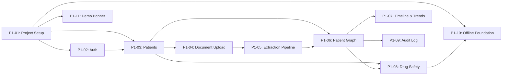
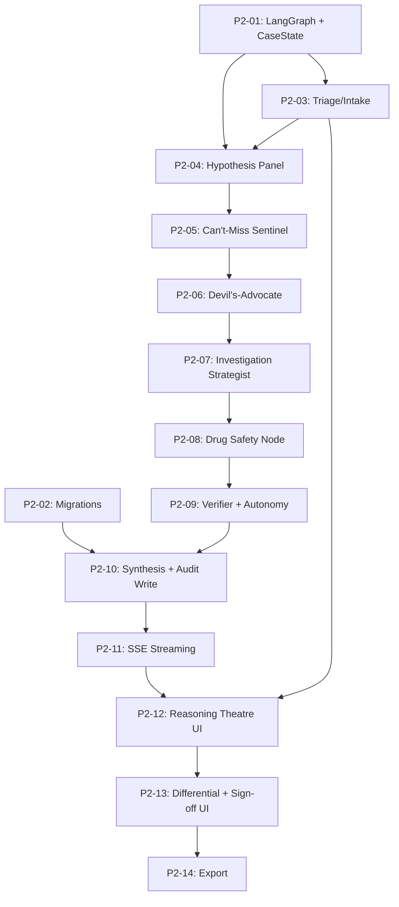
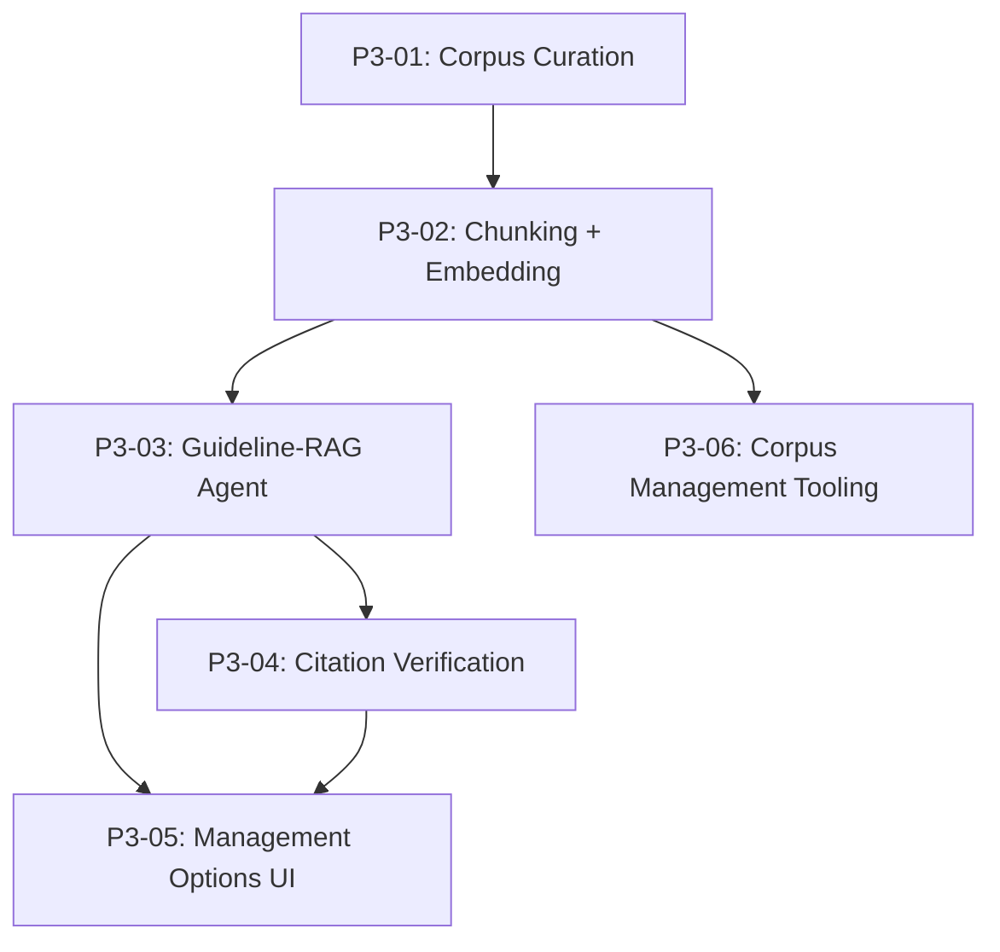
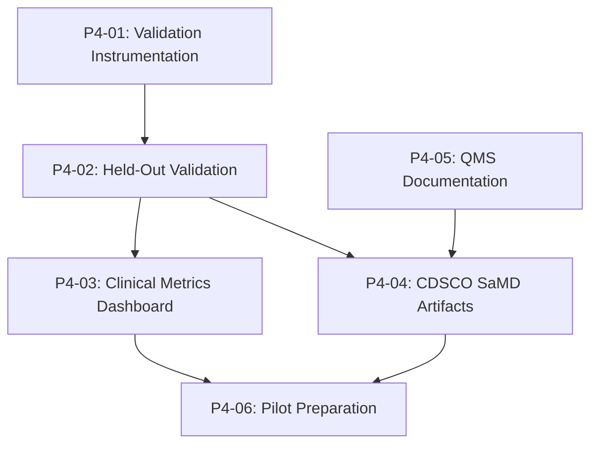
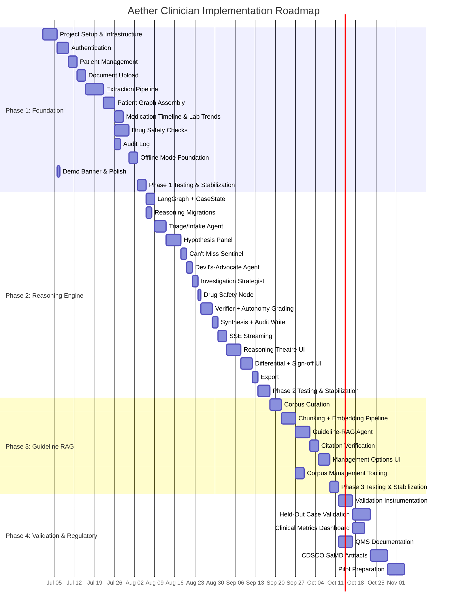
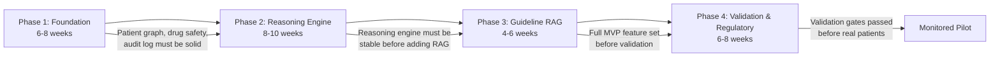

# Aether Clinician -- Implementation Plan

**Document type:** Phased implementation roadmap  
**Parent spec:** Documedic v2.0 (Multi-Agent Diagnostic Reasoning build)  
**Status:** Ready for execution  
**Last updated:** 2026-06-27  
**Audience:** Engineering, Product, Clinical Safety, Regulatory

---

## Table of Contents

1. [Overview and Planning Assumptions](#1-overview-and-planning-assumptions)
2. [Phase 1: Foundation (6-8 weeks)](#2-phase-1-foundation-6-8-weeks)
3. [Phase 2: Reasoning Engine (8-10 weeks)](#3-phase-2-reasoning-engine-8-10-weeks)
4. [Phase 3: Guideline RAG (4-6 weeks)](#4-phase-3-guideline-rag-4-6-weeks)
5. [Phase 4: Validation and Regulatory (6-8 weeks)](#5-phase-4-validation-and-regulatory-6-8-weeks)
6. [Dependency Graph](#6-dependency-graph)
7. [Risk Register](#7-risk-register)
8. [Testing Strategy Overview](#8-testing-strategy-overview)
9. [MVP Success Criteria Checklist](#9-mvp-success-criteria-checklist)

---

## 1. Overview and Planning Assumptions

### 1.1 Product Summary

Aether Clinician is a clinician-facing diagnostic CDSS for primary-care physicians in rural and semi-urban India. It transforms fragmented patient histories into structured longitudinal records, conducts adaptive intake interviews, produces grounded differential diagnoses via an 8-agent reasoning engine, performs deterministic drug-safety checks, and surfaces guideline-cited management options. The system is designed for environments with intermittent connectivity, mandates clinician-in-the-loop for all clinical decisions, and maintains an immutable audit trail for regulatory compliance.

### 1.2 Planning Assumptions

| Assumption | Detail |
|---|---|
| **Team size** | 2-3 full-stack engineers, 1 ML/AI engineer, 1 part-time clinical advisor |
| **Workday** | 1 developer-day = 6 productive hours of focused engineering |
| **Velocity buffer** | Estimates include a 20% buffer for integration issues, code review, and unexpected complexity |
| **LLM dependency** | Claude API (claude-sonnet-4-20250514) is the sole LLM provider. No fallback LLM is planned for MVP. |
| **Infrastructure** | Single-server Docker Compose deployment for all phases through pilot |
| **Regulatory** | CDSCO SaMD Class B/C pathway. No patient-facing deployment before Phase 4 validation gates are passed. |
| **Clinical data** | Synthetic/de-identified data only until Phase 4 pilot. Real patient data only under IRB/ethics approval. |
| **Offline scope** | Phase 1 builds the offline foundation (service worker shell, IndexedDB caching, deterministic safety checks). Full offline sync is progressive across phases. |
| **No feature creep** | Each phase must reach its exit criteria before work begins on the next phase. Phases do not overlap. |

### 1.3 Phasing Philosophy

The phases are structured around a critical safety rule: **do not build Phase 2 reasoning before Phase 1 foundation is solid; do not deploy to real patients before Phase 4 validation.** Each phase is independently shippable and useful:

- **Phase 1** delivers a fully functional patient record management system with document ingestion, longitudinal views, and deterministic drug-safety checks. A clinician can use this standalone.
- **Phase 2** adds the multi-agent diagnostic reasoning engine. The system now assists with clinical reasoning, but management options are not yet guideline-cited.
- **Phase 3** adds guideline RAG. Management suggestions are now grounded in cited clinical guidelines.
- **Phase 4** instruments the system for clinical validation, generates regulatory artifacts, and prepares for a monitored pilot with real clinicians and real (consented) patients.

### 1.4 Tech Stack Reference

| Component | Technology | Version |
|---|---|---|
| Backend | Python / FastAPI | 3.12+ / 0.110+ |
| Frontend | Next.js / React / TypeScript | 14 / 18 / 5.4+ |
| Database | PostgreSQL | 16 |
| Vector Store | Qdrant | 1.9+ |
| Cache | Redis | 7+ |
| AI/LLM | Anthropic Claude | claude-sonnet-4-20250514 |
| OCR | Tesseract | 5.x |
| Agent Orchestration | LangGraph | 0.2+ |
| Monorepo | Turborepo | latest |
| Containerization | Docker / Docker Compose | latest |

---

## 2. Phase 1: Foundation (6-8 weeks)

**Goal:** Deliver a shippable patient record management system with document ingestion, structured longitudinal views, deterministic drug-safety checks, and an immutable audit log. A clinician can sign up, create patients, upload documents, view structured records, and get safety alerts -- all without any LLM-powered reasoning.

**Estimated total effort:** 38-48 developer-days

### 2.1 Task Breakdown

#### P1-01: Project Setup and Infrastructure (5 days)

| Sub-task | Deliverable | Effort | Depends On |
|---|---|---|---|
| P1-01a | Turborepo monorepo scaffold: `apps/web/`, `apps/api/`, `packages/shared-types/`, `packages/ui/`, `packages/config/` | 1d | -- |
| P1-01b | Docker Compose stack: PostgreSQL 16, Redis 7, MinIO (S3-compatible), Nginx | 1d | -- |
| P1-01c | FastAPI project structure: `core/`, `routers/`, `services/`, `models/`, `schemas/`, `db/` with async SQLAlchemy session factory, Alembic configuration | 1d | P1-01a |
| P1-01d | Next.js 14 project structure: App Router layout, shared UI package integration, Tailwind CSS, API client foundation | 1d | P1-01a |
| P1-01e | CI pipeline: linting (Ruff + ESLint), type-checking (mypy + tsc), test runners (pytest + vitest), Docker build verification | 0.5d | P1-01a,c,d |
| P1-01f | Environment configuration: `.env` templates, pydantic-settings config module, health check endpoints (`/health`, `/health/ready`, `/health/live`, `/health/dependencies`) | 0.5d | P1-01c |

#### P1-02: Authentication and Account Management (4 days)

| Sub-task | Deliverable | Effort | Depends On |
|---|---|---|---|
| P1-02a | Alembic migration 001: `accounts` and `sessions` tables with `fn_set_updated_at` trigger | 0.5d | P1-01c |
| P1-02b | Auth service: signup (email + password, bcrypt cost=12), login, JWT access tokens (15min, HS256), opaque refresh tokens (7d, stored in Redis), token rotation, logout (Redis blocklist) | 1.5d | P1-02a |
| P1-02c | Auth middleware: JWT decode/verify, session validation against Redis, CSRF token generation and validation | 0.5d | P1-02b |
| P1-02d | Auth API routes: `POST /auth/signup`, `POST /auth/login`, `POST /auth/refresh`, `POST /auth/logout`, `GET /auth/me` | 0.5d | P1-02b,c |
| P1-02e | Frontend auth pages: signup form, login form, auth context provider, protected route wrapper, httpOnly cookie handling, token refresh interceptor | 1d | P1-02d, P1-01d |

#### P1-03: Patient Management (3 days)

| Sub-task | Deliverable | Effort | Depends On |
|---|---|---|---|
| P1-03a | Alembic migration 002: `patients` table with consent fields, soft-delete columns, covering index for patient list | 0.5d | P1-02a |
| P1-03b | Patient service: CRUD operations (create with consent gate, read, update, soft-delete), patient search (PostgreSQL full-text on name/phone), pagination (offset-based) | 1d | P1-03a |
| P1-03c | Patient API routes: `POST /patients`, `GET /patients` (with search, filter, sort, pagination), `GET /patients/{id}`, `PUT /patients/{id}`, `DELETE /patients/{id}` | 0.5d | P1-03b |
| P1-03d | Frontend patient pages: patient list (dashboard home screen), patient create form, patient detail view, patient edit form, patient search | 1d | P1-03c, P1-02e |

#### P1-04: Document Upload and Storage (3 days)

| Sub-task | Deliverable | Effort | Depends On |
|---|---|---|---|
| P1-04a | Alembic migration 003: `documents` table with extraction status, storage path, SHA-256 hash, file type checks | 0.5d | P1-03a |
| P1-04b | Document service: file upload (multipart/form-data), MIME type validation (magic bytes), size validation (max 20MB), SHA-256 deduplication check, MinIO/local storage write, document metadata persistence | 1d | P1-04a |
| P1-04c | Document API routes: `POST /patients/{id}/documents` (upload), `GET /patients/{id}/documents` (list with filters), `GET /patients/{id}/documents/{id}` (detail), `GET /patients/{id}/documents/{id}/file` (download original) | 0.5d | P1-04b |
| P1-04d | Frontend document pages: document upload component (drag-and-drop + file picker + camera capture), upload progress indicator, document list per patient, document preview (thumbnail + original view) | 1d | P1-04c, P1-03d |

#### P1-05: Extraction Pipeline (6 days)

| Sub-task | Deliverable | Effort | Depends On |
|---|---|---|---|
| P1-05a | Claude Vision extraction: structured extraction prompts for prescriptions (medications, dosing, prescriber, date), lab reports (test name, value, unit, reference range, date), and discharge summaries (diagnoses, procedures, medications at discharge). Per-field confidence scores. Pydantic response schema validation. | 2d | P1-04b |
| P1-05b | Tesseract OCR fallback: triggered on Claude Vision failure, low confidence (<0.5), or offline. Hindi + English language packs. Raw text passed to Claude text-only mode for structuring. | 1d | P1-05a |
| P1-05c | Extraction worker: Redis Stream consumer for async extraction jobs. Job queuing on upload. Status tracking (pending, processing, completed, failed, needs_confirmation). SSE endpoint for live extraction progress (`/documents/{id}/extraction/stream`). | 1d | P1-05a,b |
| P1-05d | Normalization pipeline: drug name resolution via `DrugVocabulary` table (fuzzy matching with Levenshtein distance for misspellings), unit standardization (SI conversion), date parsing (multiple Indian formats to ISO 8601), physiological range validation | 1d | P1-05c, P1-08a |
| P1-05e | Frontend extraction review: extraction result display with per-field confidence highlighting (green >= 0.85, amber 0.50-0.84, red < 0.50), editable fields for clinician correction, confirm/reject controls, bulk approve. API: `GET /documents/{id}/extraction`, `PUT /documents/{id}/extraction/fields/{id}`, `POST /documents/{id}/approve` | 1d | P1-05c, P1-04d |

#### P1-06: Patient Graph Assembly (4 days)

| Sub-task | Deliverable | Effort | Depends On |
|---|---|---|---|
| P1-06a | Alembic migration 004: `encounters`, `medication_events`, `lab_results`, `conditions`, `allergies`, `derived_markers` tables. Source-linking foreign keys, extraction confidence JSONB, clinician confirmation flags. | 1d | P1-04a |
| P1-06b | Patient graph service: merge approved extractions into the patient graph. Deduplication logic (same medication from multiple documents, same lab result). Conflict resolution (latest document wins, clinician notified). Derived marker computation (eGFR from creatinine + age + sex via CKD-EPI 2021). | 1.5d | P1-06a, P1-05d |
| P1-06c | Longitudinal record API: `GET /patients/{id}/record` (assembled view with sections: medications, labs, conditions, allergies, vitals). Date range filtering. Section filtering. Redis caching (30min TTL, invalidated on new document approval). | 1d | P1-06b |
| P1-06d | Frontend patient record view: longitudinal record page with tabbed sections (medications, labs, conditions, allergies). Source-document links on every datum (click to view original). Summary cards for active medications, recent abnormal labs, active conditions. | 0.5d | P1-06c, P1-03d |

#### P1-07: Medication Timeline and Lab Trends (3 days)

| Sub-task | Deliverable | Effort | Depends On |
|---|---|---|---|
| P1-07a | Medication timeline API: `GET /patients/{id}/record/medications/timeline` with start/stop dates, overlaps, events (started, stopped, changed, continued), date range filtering | 0.5d | P1-06b |
| P1-07b | Lab trends API: `GET /patients/{id}/record/labs/{marker}/trends` with historical data points, reference ranges, trend direction computation (improving/worsening/stable) | 0.5d | P1-06b |
| P1-07c | Frontend medication timeline: visual timeline component (horizontal bar chart showing medication periods with start/end dates, overlaps, and event markers). Interactive: hover for details, click for source document. | 1d | P1-07a, P1-06d |
| P1-07d | Frontend lab trend charts: line chart component for individual lab markers (plotted against reference range bands). Abnormal values highlighted. Trend direction indicator. Multiple markers selectable. | 1d | P1-07b, P1-06d |

#### P1-08: Drug Safety Checks (5 days)

| Sub-task | Deliverable | Effort | Depends On |
|---|---|---|---|
| P1-08a | Alembic migration 005: `drug_vocabulary`, `drug_interactions`, `contraindications` tables. Seed data: curated Indian drug vocabulary (brand -> generic -> reference_id), interaction pairs with severity, contraindication rules with renal/hepatic thresholds. | 1d | P1-03a |
| P1-08b | Drug safety service (deterministic, no LLM): allergy conflict check (patient allergies vs proposed drug, including cross-class matching), drug-drug interaction check (current medications vs proposed drug, severity grading), contraindication check (patient conditions vs proposed drug), renal dosing check (eGFR-based), hepatic dosing check (LFT-based). All checks work offline against local data. | 2d | P1-08a, P1-06b |
| P1-08c | Drug safety API: `POST /patients/{id}/drug-safety/check` (check proposed medication), `GET /patients/{id}/drug-safety/flags` (all active flags for current medications). Hard block response format: `is_blocked: true`, `is_hard_block: true` for allergy/absolute contraindication conflicts -- these cannot be dismissed. | 0.5d | P1-08b |
| P1-08d | Alembic migration 006: `drug_safety_checks` table (append-only results of safety checks). | 0.5d | P1-08c |
| P1-08e | Frontend drug safety UI: safety check trigger on encounter context, flag display (red=hard block, amber=warning, blue=info), hard block modal (non-dismissible, requires alternative selection), interaction detail cards with severity badges, checked-against summary | 1d | P1-08c, P1-06d |

#### P1-09: Audit Log (2 days)

| Sub-task | Deliverable | Effort | Depends On |
|---|---|---|---|
| P1-09a | Audit service: append-only audit log writes for all clinical actions (document uploaded, extraction approved, field corrected, patient created/updated, drug safety check executed). JSONB payload with action-specific detail. SHA-256 hash chain (each record hashes previous record's hash). | 1d | P1-06a |
| P1-09b | Audit API: `GET /patients/{id}/audit` (patient audit trail with filters: action type, date range, actor). Cursor-based pagination. | 0.5d | P1-09a |
| P1-09c | Frontend audit log: audit trail view per patient, filterable and sortable, with expandable detail per entry | 0.5d | P1-09b, P1-06d |

#### P1-10: Offline Mode Foundation (3 days)

| Sub-task | Deliverable | Effort | Depends On |
|---|---|---|---|
| P1-10a | Service worker: app shell caching (Next.js static assets, HTML shell), API response caching for patient records and drug vocabulary, background sync queue for pending operations (document uploads, patient edits queued when offline) | 1d | P1-01d |
| P1-10b | IndexedDB store: client-side stores for `patients`, `medications`, `lab_results`, `conditions`, `allergies`, `drug_vocabulary` (full copy). Sync strategy: full refresh on login, incremental on record change. | 1d | P1-10a |
| P1-10c | Connectivity detection: `navigator.onLine` + `/api/health` heartbeat (30s interval). Offline mode banner ("Offline Mode -- patient records and drug safety checks available. AI features paused."). Feature gating: disable upload/extraction when offline, enable record viewing and drug safety checks. | 0.5d | P1-10a,b |
| P1-10d | Offline drug safety: client-side implementation of the deterministic drug safety checks against IndexedDB-stored drug vocabulary and patient data. Same logic as server-side P1-08b, ported to TypeScript. | 0.5d | P1-10b, P1-08b |

#### P1-11: Demo Banner and Polish (1 day)

| Sub-task | Deliverable | Effort | Depends On |
|---|---|---|---|
| P1-11a | Persistent demo banner: dismissible banner that re-appears on every session start. Text: "Demo build -- decision-support only, not for real patient care." Controlled by `DEMO_MODE` env var. Present on every page. | 0.5d | P1-01d |
| P1-11b | Security headers: `Strict-Transport-Security`, `X-Content-Type-Options`, `X-Frame-Options`, `Content-Security-Policy`, `X-Request-Id` correlation header flowing through all layers | 0.5d | P1-01c |

### 2.2 Phase 1 Dependencies



**Critical path:** P1-01 -> P1-02 -> P1-03 -> P1-04 -> P1-05 -> P1-06 -> P1-08 (26 days on critical path)

**Parallel tracks:**
- P1-07 (Timeline & Trends) can start once P1-06 is complete, parallel with P1-08
- P1-09 (Audit Log) can start once P1-06 is complete, parallel with P1-07/P1-08
- P1-10 (Offline Foundation) can start once P1-01d is complete, with P1-10d waiting for P1-08b
- P1-11 (Demo Banner) can start once P1-01d is complete

### 2.3 Phase 1 Testing Strategy

| Test Level | Scope | Tools | Coverage Target |
|---|---|---|---|
| **Unit tests** | Service functions, data models, normalization logic, drug safety check logic, derived marker formulas | pytest + pytest-asyncio | >= 85% line coverage on service layer |
| **Integration tests** | API endpoints with real PostgreSQL + Redis (Docker testcontainers), extraction pipeline with mocked LLM responses, document upload-to-graph flow | pytest + httpx.AsyncClient + testcontainers | Every API endpoint has at least one happy-path and one error-path test |
| **E2E tests** | Signup -> create patient -> upload document -> review extraction -> view longitudinal record -> run drug safety check | Playwright | Critical user flows covered |
| **Drug safety tests** | Allergy hard-block enforcement, interaction severity grading, contraindication detection, renal/hepatic dosing. Parameterized test matrix with known drug pairs and expected outcomes. | pytest (parameterized) | 100% coverage of hard-block paths, >= 90% of safety check branches |
| **Extraction tests** | Mock LLM responses for each document type (prescription, lab report, discharge summary). Verify schema validation, confidence scoring, normalization, and OCR fallback trigger. | pytest with fixtures | Each extraction prompt type has >= 5 representative test fixtures |
| **Offline tests** | Verify drug safety checks produce identical results in offline (TypeScript/IndexedDB) and online (Python/PostgreSQL) modes for the same inputs | Vitest + manual cross-validation | Parity test suite with >= 20 shared test cases |

### 2.4 Phase 1 Exit Criteria / Definition of Done

Phase 1 is complete when ALL of the following are true:

- [ ] A new user can sign up with email + password and log in
- [ ] A logged-in user can create, search, edit, and soft-delete patients
- [ ] A user can upload PDF and image documents for a patient
- [ ] Uploaded documents are extracted via Claude Vision API with per-field confidence scores
- [ ] Low-confidence fields are flagged for clinician review and can be confirmed or corrected
- [ ] Tesseract OCR fallback triggers when Claude Vision fails or returns low confidence
- [ ] Approved extractions are merged into the patient's longitudinal graph with deduplication
- [ ] The longitudinal record view shows medications (active/past), lab results, conditions, and allergies with source-document links
- [ ] Medication timeline visualization shows start/stop dates and overlaps
- [ ] Lab trend charts show historical values against reference ranges with trend direction
- [ ] Drug safety check (allergy, interaction, contraindication, renal dosing, hepatic dosing) runs deterministically without LLM
- [ ] Allergy conflicts and absolute contraindications produce hard blocks that cannot be dismissed
- [ ] Drug safety checks work offline (TypeScript implementation against IndexedDB)
- [ ] Extraction produces structured, confirmable output in < 30 seconds (p95)
- [ ] Every clinical action is logged to the immutable audit trail with SHA-256 hash chain
- [ ] Audit trail is viewable per patient with filters
- [ ] Service worker caches app shell and patient records for offline access
- [ ] Offline mode banner displays when connectivity is lost; online features are correctly gated
- [ ] Demo banner is visible on every page and re-appears on session start
- [ ] All unit tests pass with >= 85% coverage on the service layer
- [ ] All integration tests pass
- [ ] E2E tests cover the critical user flow
- [ ] Drug safety parity tests pass between online and offline implementations
- [ ] No known P0 or P1 bugs remain

---

## 3. Phase 2: Reasoning Engine (8-10 weeks)

**Goal:** Build and ship the multi-agent diagnostic reasoning engine. A clinician can enter a presenting complaint, engage in an adaptive intake interview, watch multi-agent reasoning produce a ranked differential with evidence and dissent, receive investigation recommendations with cost/availability framing, and have all outputs immutably logged.

**Prerequisite:** Phase 1 exit criteria met. The patient graph, drug safety checks, and audit log must be solid before building reasoning on top of them.

**Estimated total effort:** 50-62 developer-days

### 3.1 Task Breakdown

#### P2-01: LangGraph Setup and CaseState Design (3 days)

| Sub-task | Deliverable | Effort | Depends On |
|---|---|---|---|
| P2-01a | CaseState dataclass: patient_id, patient_graph_snapshot, presenting_complaint, intake_questions/answers/complete/info_gain_score, hypothesis_set (with evidence_for/against, probability_band, cant_miss_flag, source_agent), agent_messages, agent_trace, verifier_verdicts, autonomy_tier, drug_safety_results, hard_blocks, recommended_investigations, case_id, timestamps, online flag | 1d | Phase 1 complete |
| P2-01b | LangGraph StateGraph skeleton: node registration for all 7 agents (Guideline-RAG is Phase 3 placeholder), conditional edges (intake loop, verifier decision), entry point, compilation. Dry-run validation (graph compiles without LLM calls). | 1d | P2-01a |
| P2-01c | LLM client wrapper: Anthropic Claude client singleton with retry policy (3 attempts, exponential backoff 1s/2s/4s), circuit breaker (open after 3 consecutive failures, half-open after 30s), rate limiter, token usage tracking, structured output parsing, temperature=0.0 for clinical determinism | 1d | P2-01a |

#### P2-02: Alembic Migrations for Reasoning Domain (2 days)

| Sub-task | Deliverable | Effort | Depends On |
|---|---|---|---|
| P2-02a | Migration 007: `reasoning_sessions` table (session status, patient snapshot, model/orchestrator version, token usage tracking) | 0.5d | Phase 1 complete |
| P2-02b | Migration 008: `clinical_suggestions` table (IMMUTABLE -- suggestion_type, autonomy_tier, confidence_band, agent_trace JSONB, verifier_verdict, safety flags, guideline citations, patient data refs) with UPDATE/DELETE trigger rejection. `clinician_decisions` table (IMMUTABLE -- decision, override_reason, engagement_acknowledged, counter_evidence_viewed, time_to_decision_ms) with UPDATE/DELETE trigger rejection. | 1d | P2-02a |
| P2-02c | Migration 009: `intake_questions` and `intake_answers` tables. Migration 010: `drug_safety_checks` results table. Migration 011: `patient_exports` table. | 0.5d | P2-02b |

#### P2-03: Triage/Intake Agent (4 days)

| Sub-task | Deliverable | Effort | Depends On |
|---|---|---|---|
| P2-03a | Intake agent implementation: system prompt (triage nurse persona, information-theoretic question selection, red-flag recognition, relevant negatives), `query_patient_graph` tool, `flag_cant_miss` tool (rule-based component), intake loop with info_gain_score threshold and question cap, question type taxonomy (duration, character, red_flag_screen, relevant_negative, associated_symptom, risk_factor, medication_history, family_history, lifestyle) | 2d | P2-01b |
| P2-03b | Intake service: create consult session, submit answers, skip questions, force-complete intake. Consult API: `POST /encounters/{id}/consult`, `POST /consult/{id}/answers`, `POST /consult/{id}/skip`, `POST /consult/{id}/complete`, `GET /consult/{id}` | 1d | P2-03a |
| P2-03c | Intake agent tests: mock LLM responses for question generation, verify info_gain loop termination, verify red-flag screen inclusion, verify question cap enforcement, verify intake summary generation | 1d | P2-03a |

#### P2-04: Hypothesis Panel (Specialist Agents) (5 days)

| Sub-task | Deliverable | Effort | Depends On |
|---|---|---|---|
| P2-04a | Hypothesis panel node: runs 4 role-primed specialist agents in parallel via `asyncio.gather()`. Specialist roles: General Internal Medicine, Cardiology, Infectious Disease, Primary Care. Each receives a domain-specific system prompt requiring explicit patient-data citation for every evidence item. | 2d | P2-01b |
| P2-04b | Agent tools: `query_patient_graph(filter)` -- query patient record with structured filters (medications by status, labs by marker/date range, conditions by status, allergies). `get_lab_trend(marker)` -- retrieve historical trend for a specific lab marker with trend direction. Both are deterministic, work offline, and query the patient graph snapshot in CaseState. | 1d | P2-04a |
| P2-04c | Hypothesis merge node: union all hypotheses from 4 specialists, deduplicate by ICD code, preserve source attribution, merge evidence lists, compute merged probability bands. Disagreement between specialists is preserved as metadata (which agents support/oppose each hypothesis). | 1d | P2-04a |
| P2-04d | Hypothesis panel tests: verify parallel execution, verify each specialist produces structured hypotheses, verify merge deduplication preserves disagreement, verify evidence citation format | 1d | P2-04a,b,c |

#### P2-05: Can't-Miss Sentinel (2 days)

| Sub-task | Deliverable | Effort | Depends On |
|---|---|---|---|
| P2-05a | Sentinel agent implementation: system prompt focused on dangerous, time-critical, commonly-missed conditions. Scans presenting complaint, intake answers, and patient history for sentinel triggers. Output is append-only to hypothesis set. `cant_miss_flag: true` items require explicit clinician acknowledgment before case closure. Uses `flag_cant_miss(symptoms, context)` tool (hybrid: rule-based red-flag list + LLM augmentation). | 1d | P2-04c |
| P2-05b | Sentinel tests: verify sentinel always runs, verify cant_miss items appear even if not in specialist panel output, verify cant_miss items cannot be removed by downstream agents, verify explicit acknowledgment requirement is set | 1d | P2-05a |

#### P2-06: Devil's-Advocate Agent (2 days)

| Sub-task | Deliverable | Effort | Depends On |
|---|---|---|---|
| P2-06a | Devil's-advocate implementation: adversarial/skeptic persona system prompt. Attacks leading hypothesis with disconfirming evidence, alternative explanations, base-rate context. Uses `query_patient_graph` and `get_lab_trend` tools. Output: `devil_advocate_critique` attached to each top hypothesis. Output is always shown to clinician (non-collapsible, non-suppressible). | 1d | P2-05a |
| P2-06b | Devil's-advocate tests: verify critique is generated for every top hypothesis, verify disconfirming evidence cites patient data, verify output is never empty, verify output survives downstream processing without suppression | 1d | P2-06a |

#### P2-07: Investigation Strategist (2 days)

| Sub-task | Deliverable | Effort | Depends On |
|---|---|---|---|
| P2-07a | Investigation strategist implementation: compute the single most discriminating next test (the one whose result most changes posterior probabilities across the hypothesis set). `compute_discriminating_test(hypotheses)` tool for information-gain calculation. LLM augmentation for cost estimate and availability framing (PHC/CHC/District Hospital/Referral tiers for India context). | 1d | P2-06a |
| P2-07b | Investigation strategist tests: verify single primary recommendation with information-gain justification, verify cost/availability framing is present, verify recommendation changes appropriately when hypothesis rankings change | 1d | P2-07a |

#### P2-08: Drug Safety Integration in Reasoning Pipeline (1 day)

| Sub-task | Deliverable | Effort | Depends On |
|---|---|---|---|
| P2-08a | Drug safety check node: runs the deterministic drug safety service (P1-08b) as a graph node. If hard blocks are detected (allergy conflict, absolute contraindication, major interaction severity=contraindicated), they are written to CaseState as `hard_blocks` and processing continues to the verifier with safety flags set. Drug safety results are persisted to `drug_safety_checks` table. | 1d | P2-07a, P1-08b |

#### P2-09: Verifier Agent and Autonomy Grading (4 days)

| Sub-task | Deliverable | Effort | Depends On |
|---|---|---|---|
| P2-09a | Verifier agent implementation: independent system prompt (no access to other agents' chain-of-thought). Re-checks every output against patient data (`query_patient_graph`). Verifies evidence citations are accurate. Checks for certainty language violations. Assigns autonomy tier (INFORMATIONAL / SUGGESTIVE / FLAG_FOR_REVIEW) based on: evidence strength, agent agreement level, cant_miss flags present, drug safety flags, confidence band. | 2d | P2-08a |
| P2-09b | Conservative resolution node: triggered when verifier disagrees. Downgrade confidence band, add verifier caveats to output, escalate autonomy tier to FLAG_FOR_REVIEW, surface disagreement metadata. Verifier's conservative view always wins. | 0.5d | P2-09a |
| P2-09c | Verifier cannot-bypass enforcement: integration test that verifies no code path routes clinical output to the frontend without a verifier verdict. Architectural test that the graph definition does not contain any edge from a pre-verifier node to the synthesis/output node. | 0.5d | P2-09a,b |
| P2-09d | Verifier tests: verify independent re-check detects planted evidence errors, verify autonomy tier assignment logic, verify conservative resolution triggers on disagreement, verify cannot-bypass enforcement | 1d | P2-09a,b,c |

#### P2-10: Synthesis/Orchestrator and Audit Write (2 days)

| Sub-task | Deliverable | Effort | Depends On |
|---|---|---|---|
| P2-10a | Synthesis node: reconcile all agent outputs into final CaseState. Preserve all disagreement (do not flatten). Write complete agent trace to CaseState. Generate final ranked differential with evidence, cant_miss items, devil's-advocate critiques, investigation recommendations, drug safety results. | 1d | P2-09b |
| P2-10b | Audit write node: persist complete reasoning output to `clinical_suggestions` (one row per suggestion, each with full agent_trace JSONB), `drug_safety_checks`, and update `reasoning_sessions` status. Patient snapshot frozen at reasoning start is already stored. All writes in a single database transaction. | 1d | P2-10a |

#### P2-11: SSE Streaming for Reasoning Theatre (3 days)

| Sub-task | Deliverable | Effort | Depends On |
|---|---|---|---|
| P2-11a | SSE streaming infrastructure: Redis pub/sub for agent state updates. Reasoning service publishes events as each agent starts/completes. SSE endpoint: `GET /reasoning/{session_id}/stream`. Event types: `session_started`, `agent_state` (agent name + state + message), `hypothesis_formed`, `hypothesis_revised`, `cant_miss_flagged`, `devils_advocate_critique`, `investigation_recommended`, `drug_safety_checked`, `verifier_verdict`, `session_completed`, `session_error`. | 1.5d | P2-10a |
| P2-11b | Reasoning API: `POST /encounters/{id}/reasoning` (trigger reasoning, returns 202 with session_id and stream URL), `GET /reasoning/{session_id}` (status/results), `GET /reasoning/{session_id}/stream` (SSE), `GET /reasoning/{session_id}/investigations` (investigation recommendations) | 1d | P2-11a |
| P2-11c | SSE reconnection handling: client-side reconnection with `Last-Event-ID`, server-side event replay from Redis for reconnecting clients, heartbeat keepalive (15s) | 0.5d | P2-11a |

#### P2-12: Frontend -- Reasoning Theatre UI (5 days)

| Sub-task | Deliverable | Effort | Depends On |
|---|---|---|---|
| P2-12a | `useReasoningStream` hook: SSE client with reconnection logic, event parsing, state reducer for accumulating agent updates. Connection lifecycle management (connect on reasoning start, disconnect on completion/unmount). | 1d | P2-11c |
| P2-12b | Reasoning Theatre component: live agent activity cards (each agent appears as a card that activates when processing). Hypothesis cards that appear and shift ranking as specialists report. Can't-miss items pulse with amber highlight. Verifier verdict renders last with clear pass/flag indicator. Progress bar showing pipeline stage. | 2d | P2-12a |
| P2-12c | Anti-bias UX enforcement: evidence-before-conclusion rendering order (evidence for/against renders first, ranked diagnosis list renders after). Devil's-advocate critique section is always visible, not collapsed by default, rendered in a visually distinct contrasting section. Agent disagreement surfaced with attribution. Probability bands (HIGH/MODERATE/LOW/VERY_LOW), never misleading numerical percentages. | 1d | P2-12b |
| P2-12d | Adaptive intake UI: conversational question-answer flow (one question at a time), question type visualization (different input types for yes/no, single-choice, multi-select, free-text), clinical context tooltip (why this question was asked), skip button, force-complete button, intake summary at completion | 1d | P2-03b |

#### P2-13: Frontend -- Differential Output and Sign-off UI (4 days)

| Sub-task | Deliverable | Effort | Depends On |
|---|---|---|---|
| P2-13a | Differential display: ranked hypothesis cards with confidence bands, evidence for/against lists (each citing source patient data), ICD-10 codes, source agent attribution. Can't-miss items with persistent visual treatment. Investigation recommendations with cost/availability framing. | 1d | P2-12b |
| P2-13b | Drug safety display in reasoning context: inline safety flags on relevant hypotheses/management options. Hard block rendering (red, non-dismissible). Warning/info rendering with severity badges. Checked-against summary. | 0.5d | P2-13a |
| P2-13c | Sign-off and decision UI: per-suggestion decision controls (accept, override with reason, edit, dismiss, defer). Autonomy tier gates: FLAG_FOR_REVIEW items require active engagement acknowledgment (clinician must scroll through counter-evidence and explicitly acknowledge before deciding). Can't-miss items require explicit acknowledgment checkbox. `time_to_decision_ms` captured for anti-bias monitoring (one-tap detection). Clinician decision API: `POST /suggestions/{id}/decisions` | 1.5d | P2-13a,b |
| P2-13d | Sign-off audit integration: every decision writes to `clinician_decisions` (immutable). `engagement_acknowledged` and `counter_evidence_viewed` flags captured. Full trail visible in patient audit log. | 1d | P2-13c |

#### P2-14: Export (2 days)

| Sub-task | Deliverable | Effort | Depends On |
|---|---|---|---|
| P2-14a | Export service: generate clinician summary as structured JSON (current medications, recent abnormal labs, key trends, working differential, clinician notes, recommended next steps). PDF export (server-side PDF generation from structured data). Snapshot captured at export time for audit. `patient_exports` table write. | 1d | P2-13c |
| P2-14b | Export API and frontend: `POST /patients/{id}/export` (generate export), `GET /exports/{id}/download` (download). Frontend: export button on patient record and post-reasoning views, format selection (PDF / JSON). | 1d | P2-14a |

### 3.2 Phase 2 Dependencies



**Critical path:** P2-01 -> P2-03 -> P2-04 -> P2-05 -> P2-06 -> P2-07 -> P2-08 -> P2-09 -> P2-10 -> P2-11 -> P2-12 -> P2-13 -> P2-14 (39 days on critical path)

**Parallel tracks:**
- P2-02 (Migrations) can start immediately, parallel with P2-01
- P2-12d (Adaptive Intake UI) can start once P2-03b is complete, parallel with later agent work
- Frontend work (P2-12, P2-13, P2-14) depends on backend but can be developed in parallel using mock SSE event streams

### 3.3 Phase 2 Testing Strategy

| Test Level | Scope | Tools | Coverage Target |
|---|---|---|---|
| **Agent unit tests** | Each agent in isolation with mock LLM responses. Verify structured output format, evidence citation format, tool call patterns, error handling. | pytest + mock Anthropic client | Every agent has >= 3 representative input/output test cases |
| **Agent integration tests** | Full pipeline with mocked LLM responses. Verify CaseState flows correctly through all nodes. Verify conditional edges fire correctly (intake loop, verifier disagreement). | pytest + LangGraph test mode (dry-run with recorded responses) | >= 5 end-to-end pipeline test scenarios covering happy path, partial agent failure, verifier disagreement, and hard block |
| **Verifier bypass test** | Architectural test: inspect the compiled LangGraph to verify no edge exists from any pre-verifier node to the output. Integration test: verify all clinical_suggestions rows have a non-null verifier_verdict. | pytest | 100% -- this is a safety-critical invariant |
| **Immutability tests** | Verify UPDATE and DELETE on `clinical_suggestions` and `clinician_decisions` raise database errors. Verify ORM models cannot dirty-update these entities. | pytest + direct SQL | 100% -- this is a regulatory requirement |
| **Anti-bias UI tests** | Verify evidence renders before conclusion in DOM order. Verify devil's-advocate section is not collapsed. Verify cant_miss items are visually distinct. Verify autonomy tier gates enforce engagement. | Playwright | Critical anti-bias invariants covered |
| **SSE streaming tests** | Verify event sequence (correct event types in correct order), reconnection with replay, heartbeat keepalive. | pytest + httpx SSE client | Happy path + reconnection scenario |
| **Performance tests** | Full reasoning pipeline completes in < 120 seconds (with mocked LLM latencies simulating real API). | pytest with timing assertions | p95 < 120s |

### 3.4 Phase 2 Exit Criteria / Definition of Done

Phase 2 is complete when ALL of the following are true:

- [ ] A clinician can enter a presenting complaint for a patient
- [ ] The intake agent asks specialist-style clarifying questions adaptively (questions vary based on complaint and patient history)
- [ ] The intake loop terminates on info_gain threshold or question cap
- [ ] The clinician can skip questions or force-complete intake
- [ ] 4 specialist agents run in parallel and produce hypotheses with evidence for/against
- [ ] Can't-miss sentinel flags dangerous conditions even if not in specialist output
- [ ] Devil's-advocate critique is generated for every top hypothesis and is always visible
- [ ] Investigation strategist recommends the single most discriminating next test with cost/availability framing
- [ ] Drug safety checks run against the full patient record during reasoning
- [ ] Allergy/contraindication hard blocks halt the relevant suggestion (not the entire pipeline)
- [ ] Verifier agent independently re-checks all outputs and assigns autonomy tiers
- [ ] When verifier disagrees, conservative output wins (confidence downgraded, tier escalated)
- [ ] No code path routes clinical output to the frontend without a verifier verdict
- [ ] Reasoning Theatre streams live agent activity via SSE
- [ ] Evidence is rendered before conclusions in the UI (anti-automation-bias)
- [ ] Devil's-advocate section is not collapsed by default
- [ ] Agent disagreement is surfaced with attribution, not hidden
- [ ] FLAG_FOR_REVIEW items require active clinician engagement before decision
- [ ] Can't-miss items require explicit acknowledgment
- [ ] Every suggestion, agent trace, and clinician decision is logged immutably
- [ ] `clinical_suggestions` and `clinician_decisions` tables reject UPDATE and DELETE at the database level
- [ ] `time_to_decision_ms` is captured for every clinician decision
- [ ] Clinician summary export works (PDF + JSON)
- [ ] Full reasoning pipeline completes in < 120 seconds (p95)
- [ ] All agent unit and integration tests pass
- [ ] Verifier bypass test passes
- [ ] Anti-bias UI tests pass
- [ ] No certainty language in any clinical output or UI microcopy

---

## 4. Phase 3: Guideline RAG (4-6 weeks)

**Goal:** Add the Guideline-RAG agent so management options are grounded in cited clinical guidelines. The system now produces management suggestions that are verifiably supported by source guidelines, with no uncited management text.

**Prerequisite:** Phase 2 exit criteria met. The reasoning engine must be stable before adding guideline retrieval.

**Estimated total effort:** 28-36 developer-days

### 4.1 Task Breakdown

#### P3-01: Guideline Corpus Curation (4 days)

| Sub-task | Deliverable | Effort | Depends On |
|---|---|---|---|
| P3-01a | Corpus assembly: collect ICMR Standard Treatment Workflows (spine), select WHO Essential Medicines List sections, select NICE guidelines for common primary-care conditions (diabetes, hypertension, COPD, asthma, UTI, pneumonia, anemia, thyroid disorders). Establish provenance metadata for each document (title, source organization, publication date, version, URL). | 2d | Phase 2 complete |
| P3-01b | Corpus licensing and attribution review: verify each guideline document can be used for commercial CDSS purposes. Document licensing status and attribution requirements. | 1d | P3-01a |
| P3-01c | Alembic migration 012: `guideline_documents` and `guideline_chunks` tables. Seed guideline_documents metadata. | 1d | P3-01a |

#### P3-02: Chunking and Embedding Pipeline (5 days)

| Sub-task | Deliverable | Effort | Depends On |
|---|---|---|---|
| P3-02a | Section-aware chunker: parse guidelines into semantically coherent chunks (~512 tokens). Preserve section hierarchy (e.g., "3.2.1: First-line therapy"). Assign stable section identifiers. Handle tables, figures, and bulleted lists as atomic units (do not split mid-table). | 2d | P3-01a |
| P3-02b | Embedding pipeline: generate embeddings for each chunk using a sentence-transformer model (e.g., `all-MiniLM-L6-v2` or `PubMedBERT` for medical domain). Store embeddings with metadata (corpus_version, section_id, document_title, source_organization, page_range). | 1d | P3-02a |
| P3-02c | Qdrant setup: create versioned collection (`guidelines_v{N}`). Upload embedded chunks with metadata payloads. Configure HNSW index parameters. Verify similarity search returns relevant results for test queries (e.g., "management of newly diagnosed type 2 diabetes" should retrieve ICMR T2DM treatment sections). | 1d | P3-02b |
| P3-02d | Corpus versioning: version control system for the guideline corpus. Each update creates a new collection version. The active version is configurable. Old versions retained for audit trail reproducibility. `corpus_version` is stamped on every `clinical_suggestion` that cites a guideline chunk. | 1d | P3-02c |

#### P3-03: Guideline-RAG Agent (5 days)

| Sub-task | Deliverable | Effort | Depends On |
|---|---|---|---|
| P3-03a | Retrieval tool: `retrieve_guidelines(query, k=10)` -- vector similarity search (cosine) in Qdrant, cross-encoder rerank (top-5), threshold filter (score >= 0.75). Returns `GuidelineChunk[]` with corpus_version, section_id, chunk_text, similarity_score. Below-threshold results trigger explicit "insufficient guideline support" warning. | 1.5d | P3-02c |
| P3-03b | Guideline-RAG agent implementation: system prompt requiring strict grounding in retrieved chunks. Draft management options with inline citations (guideline name, section_id, quote). If retrieval confidence is below threshold for a topic, output includes "Insufficient guideline support for this management area -- manual guideline review recommended" instead of generating uncited text. No hallucinated guidelines. | 2d | P3-03a |
| P3-03c | Guideline-RAG integration into LangGraph: replace Phase 2 placeholder node with real agent. Runs after Investigation Strategist, before Drug Safety Check. Output feeds into Verifier for citation verification. | 0.5d | P3-03b |
| P3-03d | Guideline-RAG tests: verify retrieval returns relevant chunks for test queries, verify citation format, verify below-threshold warning, verify no uncited management text in output, verify corpus_version is recorded on clinical_suggestions | 1d | P3-03b,c |

#### P3-04: Citation Verification (3 days)

| Sub-task | Deliverable | Effort | Depends On |
|---|---|---|---|
| P3-04a | Citation verification in Verifier agent: extend the Verifier to cross-check every management citation against the actual guideline chunk text. Verify that the cited section supports the stated recommendation. Flag misrepresented or fabricated citations. Target: >= 95% citation faithfulness. | 1.5d | P3-03c |
| P3-04b | Citation faithfulness metric: automated measurement of citation accuracy. For each management statement with a citation, extract the cited chunk and use the Verifier (or a separate LLM call) to determine if the citation faithfully represents the source material. Log metric per reasoning session. | 1d | P3-04a |
| P3-04c | Citation faithfulness tests: test suite with known-good and known-bad citations. Verify Verifier detects fabricated citations and misrepresented sources. | 0.5d | P3-04a |

#### P3-05: Management Options UI (4 days)

| Sub-task | Deliverable | Effort | Depends On |
|---|---|---|---|
| P3-05a | Management options display: per-diagnosis management sections (pharmacological, lifestyle, monitoring). Each recommendation carries a citation badge linking to the source guideline section. Recommendations are framed with prescriber language ("Guidelines support considering..."), never imperative. Patient-specific contraindication notes inline. | 1.5d | P3-03c |
| P3-05b | Guideline citation viewer: expandable section showing the actual guideline text being cited. Includes guideline name, organization, publication date, section reference. Links to full guideline document when available. | 1d | P3-05a |
| P3-05c | "Insufficient guideline support" display: for management areas where retrieval confidence is below threshold, display an explicit warning in the UI. No management text appears without a citation. This is a hard UX requirement: empty management + warning is better than uncited text. | 0.5d | P3-05a |
| P3-05d | Management decision UI: accept/override/edit controls for management options (same pattern as differential sign-off). Override requires documented reason. Decision logged immutably. | 1d | P3-05a |

#### P3-06: Corpus Management Tooling (3 days)

| Sub-task | Deliverable | Effort | Depends On |
|---|---|---|---|
| P3-06a | Ingestion CLI: command-line tool to add new guidelines to the corpus. Handles PDF/HTML input, runs chunker and embedding pipeline, uploads to Qdrant with new corpus version tag. | 1.5d | P3-02d |
| P3-06b | Retrieval quality testing: test suite with curated query/expected-result pairs. Run after every corpus update to verify retrieval quality has not regressed. Report with recall@5 and precision@5 metrics. | 1d | P3-06a |
| P3-06c | Corpus version management: API endpoint to query active corpus version, list available versions, switch active version. Admin-only access. | 0.5d | P3-06a |

### 4.2 Phase 3 Dependencies



**Critical path:** P3-01 -> P3-02 -> P3-03 -> P3-04 -> P3-05 (21 days on critical path)

**Parallel tracks:**
- P3-06 (Corpus Management Tooling) can start once P3-02d is complete, parallel with P3-03/P3-04
- P3-05 (Management Options UI) can be partially developed with mock data while P3-03/P3-04 are in progress

### 4.3 Phase 3 Testing Strategy

| Test Level | Scope | Tools | Coverage Target |
|---|---|---|---|
| **Retrieval quality tests** | Query/expected-result pairs for common conditions. Verify recall@5 >= 0.8 and precision@5 >= 0.7 for the curated test set. | pytest + Qdrant test collection | >= 20 curated query/result pairs |
| **Citation faithfulness tests** | Known-good and known-bad citations. Verify Verifier catches fabricated citations. Automated faithfulness scoring. | pytest with LLM evaluation | >= 95% faithfulness on test set |
| **No-uncited-text tests** | Verify that every management statement in output carries a citation. Verify that below-threshold retrieval produces a warning instead of uncited text. | pytest (output schema validation) | 100% -- hard requirement |
| **Integration tests** | Full pipeline with Guideline-RAG enabled. Verify citations flow through to clinical_suggestions, corpus_version is recorded, Verifier checks citations. | pytest with test Qdrant collection | >= 3 end-to-end scenarios |
| **Corpus regression tests** | Run after every corpus update. Verify retrieval quality has not regressed. | pytest with curated query set | All queries maintain recall@5 >= 0.8 |

### 4.4 Phase 3 Exit Criteria / Definition of Done

Phase 3 is complete when ALL of the following are true:

- [ ] Guideline corpus is assembled with ICMR STWs (spine), WHO, and NICE guidelines for common primary-care conditions
- [ ] Corpus is chunked with stable section identifiers and embedded in Qdrant
- [ ] Guideline-RAG agent retrieves relevant chunks and drafts management options with inline citations
- [ ] Every management statement carries a citation to a specific guideline section
- [ ] No uncited management text appears in any output (verified by automated test)
- [ ] Below-threshold retrieval produces an explicit "insufficient guideline support" warning
- [ ] Verifier cross-checks citations against actual guideline chunk text
- [ ] Citation faithfulness >= 95% on the curated test set
- [ ] Corpus version is recorded on every clinical_suggestion that cites guidelines
- [ ] Management options UI displays recommendations with citation badges and expandable source text
- [ ] Clinician can accept/override/edit management options with immutable audit logging
- [ ] Ingestion CLI can add new guidelines and create new corpus versions
- [ ] Retrieval quality test suite passes with recall@5 >= 0.8
- [ ] Corpus version management API is functional

---

## 5. Phase 4: Validation and Regulatory (6-8 weeks)

**Goal:** Instrument the system for clinical validation, run held-out case validation, generate CDSCO SaMD regulatory pathway artifacts, establish QMS documentation, and prepare for a monitored pilot with real clinicians.

**Prerequisite:** Phase 3 exit criteria met. The full MVP feature set must be complete and stable before validation begins.

**Critical rule:** No real patient data enters the system until Phase 4 validation gates and ethics approvals are complete.

**Estimated total effort:** 36-48 developer-days

### 5.1 Task Breakdown

#### P4-01: Validation Instrumentation (5 days)

| Sub-task | Deliverable | Effort | Depends On |
|---|---|---|---|
| P4-01a | Validation case schema: define the structure for held-out validation cases. Each case includes: presenting complaint, patient history (medications, labs, conditions, allergies), intake answers, expected differential (with ranking), expected can't-miss items, expected investigation, expected management (if guideline-supported). Separate case sets for different complexity levels. | 1d | Phase 3 complete |
| P4-01b | Automated evaluation harness: load a validation case, run the full reasoning pipeline (intake with scripted answers, hypothesis generation, sentinel, devil's-advocate, investigation, guideline-RAG, verifier), compare output differential against expected. Metrics: top-1 accuracy, top-3 accuracy, top-5 accuracy, can't-miss recall, citation faithfulness, false positive rate. | 2d | P4-01a |
| P4-01c | Agreement/override tracking instrumentation: extend `clinician_decisions` analysis to compute agreement rate, override rate, time-to-decision distribution, one-tap detection rate (decisions < 3 seconds are flagged for review). Surface these metrics in the admin dashboard. | 1d | P4-01b |
| P4-01d | Performance instrumentation: per-agent execution time tracking, LLM token usage per session, extraction latency histogram, end-to-end pipeline latency tracking. All metrics exposed at `/metrics` endpoint (Prometheus-compatible). | 1d | P4-01b |

#### P4-02: Held-Out Case Validation (6 days)

| Sub-task | Deliverable | Effort | Depends On |
|---|---|---|---|
| P4-02a | Validation case curation: assemble >= 50 held-out clinical cases spanning common primary-care presentations in India (diabetes, hypertension, respiratory infections, anemia, thyroid disorders, GI conditions, musculoskeletal, dermatological, psychiatric). Cases reviewed by clinical advisor for accuracy and completeness. Stratified by complexity (straightforward, moderate, complex). | 3d | P4-01a |
| P4-02b | Validation run execution: run all held-out cases through the automated evaluation harness. Collect metrics. Identify failure patterns. Iterate on agent prompts for systematic errors (without overfitting to the validation set). | 2d | P4-02a, P4-01b |
| P4-02c | Validation report: document results with per-condition breakdowns. Correct diagnosis in top-5 rate. Can't-miss recall (weighted highest). Citation faithfulness rate. False positive rate. Failure analysis for missed diagnoses. Report format suitable for regulatory submission. | 1d | P4-02b |

#### P4-03: Clinical Metrics Dashboard (4 days)

| Sub-task | Deliverable | Effort | Depends On |
|---|---|---|---|
| P4-03a | Admin dashboard backend: aggregate metrics API endpoints. Agreement/override rates over time. Agent performance metrics. Extraction confidence distribution. Drug safety check frequency and hard block rate. Token usage and cost tracking. | 2d | P4-01c,d |
| P4-03b | Admin dashboard frontend: dashboard page with charts (agreement rate, override rate, time-to-decision distribution, agent execution times, LLM cost tracking, extraction confidence histogram, top conditions diagnosed). Accessible to admin role only. | 2d | P4-03a |

#### P4-04: CDSCO SaMD Pathway Artifacts (6 days)

| Sub-task | Deliverable | Effort | Depends On |
|---|---|---|---|
| P4-04a | Software as Medical Device (SaMD) classification documentation: intended use statement, risk classification rationale (Class B or C), clinical benefit-risk analysis, safety architecture summary. | 2d | P4-02c |
| P4-04b | Clinical evaluation report: summary of validation results, comparison with predicate devices (if applicable), literature review of AI-CDSS performance in primary care, limitations and residual risks. | 2d | P4-04a |
| P4-04c | Post-market surveillance plan: define monitoring approach for pilot and production. Adverse event reporting procedures. Agreement/override rate monitoring thresholds (alert if override rate changes significantly). Regular validation rerun schedule. | 1d | P4-04a |
| P4-04d | Technical file: system architecture summary, data flow diagrams, safety architecture description, audit trail design, verification and validation summary. References to system-design.md and architecture-design.md. | 1d | P4-04a |

#### P4-05: Quality Management System Documentation (5 days)

| Sub-task | Deliverable | Effort | Depends On |
|---|---|---|---|
| P4-05a | Software development lifecycle (SDLC) documentation: development process description, code review requirements, testing strategy, release management, version control practices. Based on existing engineering practices, formalized for regulatory. | 1.5d | Phase 3 complete |
| P4-05b | Risk management file: hazard analysis (FMEA approach), risk control measures, residual risk assessment. Covers: incorrect diagnosis, missed diagnosis, wrong drug safety alert, missed drug safety alert, data loss, unauthorized access, offline mode degradation. | 2d | P4-05a |
| P4-05c | Traceability matrix: requirements -> design -> implementation -> test mapping. Each requirement from the product spec traces through architecture decisions, code modules, and test cases. | 1d | P4-05b |
| P4-05d | Change management procedure: process for handling changes to clinical logic, agent prompts, drug vocabulary, guideline corpus. Impact assessment required before deployment. | 0.5d | P4-05a |

#### P4-06: Pilot Preparation (6 days)

| Sub-task | Deliverable | Effort | Depends On |
|---|---|---|---|
| P4-06a | Pilot site selection criteria: identify 2-3 primary-care clinics in semi-urban India. Criteria: willing clinicians, diverse patient population, internet connectivity (at least intermittent), existing relationship for follow-up. | 1d | P4-04c |
| P4-06b | Ethics/IRB approval: prepare ethics application for monitored pilot with real patients. Patient consent forms. Data handling agreement. De-identification procedures. DPDP Act compliance documentation. | 2d | P4-06a |
| P4-06c | Pilot deployment infrastructure: production-ready Docker Compose configuration (with real TLS certificates, production database passwords, India-region server). Data backup procedures. Monitoring and alerting setup. Incident response runbook. | 1.5d | P4-06b |
| P4-06d | Clinician training materials: user guide, video walkthrough of key workflows, FAQ document, support contact information. Emphasis on: this is decision support not autonomous diagnosis, override when clinical judgment disagrees, demo mode vs production mode. | 1d | P4-06c |
| P4-06e | Pilot monitoring plan: define success metrics for the pilot (clinician satisfaction, agreement rate, time savings, missed diagnosis detection, adverse event rate). Data collection schedule. Interim review points. Pilot duration (recommended: 4-8 weeks). Exit criteria for scaling. | 0.5d | P4-06d |

### 5.2 Phase 4 Dependencies



**Critical path:** P4-01 -> P4-02 -> P4-04 -> P4-06 (23 days on critical path)

**Parallel tracks:**
- P4-05 (QMS Documentation) can start immediately, parallel with P4-01/P4-02
- P4-03 (Clinical Metrics Dashboard) can start once P4-01c,d are complete, parallel with P4-02

### 5.3 Phase 4 Exit Criteria / Definition of Done

Phase 4 is complete when ALL of the following are true:

- [ ] >= 50 held-out validation cases curated and reviewed by clinical advisor
- [ ] Correct diagnosis appears in top-5 on the held-out validation set
- [ ] Can't-miss recall is the highest weighted metric and meets the clinical advisor's threshold
- [ ] Citation faithfulness >= 95% on the validation set
- [ ] Validation report is complete and suitable for regulatory submission
- [ ] Clinical metrics dashboard is operational with agreement rate, override rate, time-to-decision, agent performance, and cost tracking
- [ ] CDSCO SaMD classification documentation is complete
- [ ] Clinical evaluation report is complete
- [ ] Post-market surveillance plan is defined
- [ ] Technical file is complete
- [ ] Risk management file (FMEA) is complete
- [ ] Traceability matrix maps requirements through to tests
- [ ] SDLC and change management procedures are documented
- [ ] Ethics/IRB approval obtained for monitored pilot
- [ ] Production deployment infrastructure is ready (TLS, backups, monitoring, incident response)
- [ ] Clinician training materials are complete
- [ ] Pilot monitoring plan with success metrics is defined
- [ ] No real patient data has been processed without ethics approval

---

## 6. Dependency Graph

### 6.1 Cross-Phase Gantt Chart



### 6.2 Phase-Level Dependencies



---

## 7. Risk Register

| ID | Risk | Probability | Impact | Mitigation | Phase |
|---|---|---|---|---|---|
| R01 | **Claude API latency/availability degrades** reasoning pipeline performance below target | Medium | High | Circuit breaker pattern with automatic offline mode transition. Agent-level timeout (60s per agent). Parallel specialist agents reduce total wall-clock time. SSE streaming provides progressive output even if pipeline is slow. | P2 |
| R02 | **Extraction accuracy insufficient** for Indian clinical documents (handwritten prescriptions, variable formats, Hindi/English mix) | Medium | High | Tesseract OCR fallback. Clinician confirmation loop for low-confidence fields. Iterative prompt engineering against a test set of real Indian clinical documents. Normalization pipeline with fuzzy matching for drug names. | P1 |
| R03 | **Drug vocabulary coverage gaps** for Indian brand-name medications | Medium | Medium | Start with curated seed vocabulary from CDSCO database. Build an "unmatched drug" queue that flags medications not found in vocabulary for manual curation. Track coverage metrics. Plan for continuous vocabulary expansion. | P1 |
| R04 | **Guideline corpus insufficient** for the breadth of primary-care conditions encountered | Medium | Medium | Start with common conditions (diabetes, hypertension, respiratory). Explicit "insufficient guideline support" warnings when retrieval confidence is low. Corpus expansion plan prioritized by condition frequency in pilot data. | P3 |
| R05 | **Automation bias despite anti-bias UX** -- clinicians one-tap accept without reviewing evidence | Medium | High | `time_to_decision_ms` monitoring. FLAG_FOR_REVIEW engagement gates. Evidence-before-conclusion rendering. Devil's-advocate always visible. Mandatory acknowledgment for can't-miss items. One-tap detection alerting in clinical metrics dashboard. | P2-P4 |
| R06 | **CDSCO regulatory pathway uncertainty** -- classification requirements may change or be more stringent than anticipated | Medium | High | Early engagement with regulatory consultant. Architecture designed for audit trail completeness from Phase 1. QMS documentation prepared in parallel. Post-market surveillance plan defined before pilot. | P4 |
| R07 | **Offline mode data staleness** -- patient record in IndexedDB becomes stale if not synced | Low | Medium | Last-sync timestamp displayed prominently. Stale data warning if record is > 24 hours old. Background sync on every connectivity restoration. Full refresh on login. | P1 |
| R08 | **LLM cost escalation** -- 8-agent pipeline with multiple LLM calls per session could be expensive at scale | Medium | Medium | Token usage tracking per session. Agent-level token budgets. Prompt caching where supported. Consider model tiering (use lighter models for less critical agents, e.g., intake). Cost dashboard in admin panel. | P2 |
| R09 | **Verifier agent fails to catch errors** -- an imperfect safety net | Low | Critical | Verifier uses independent prompt (no access to other agents' chain-of-thought). Conservative resolution on any disagreement. Held-out validation set specifically tests verifier error detection. Regular prompt review by clinical advisor. | P2 |
| R10 | **Pilot clinician adoption resistance** -- clinicians find the tool disruptive to workflow | Medium | Medium | Design for minimal workflow disruption. Clinician training materials. Start with willing early adopters. Collect qualitative feedback during pilot. Iterate on UX based on real-world usage patterns. | P4 |
| R11 | **DPDP Act compliance gaps** during pilot | Low | High | Consent collection at patient creation. Data residency in India. No patient data in LLM API calls beyond structured clinical content. Audit trail for all data access. Soft-delete with anonymization for right-to-erasure. Legal review before pilot. | P1-P4 |
| R12 | **Scope creep within phases** -- pressure to add features before exit criteria are met | Medium | Medium | Strict phase gating: each phase must meet all exit criteria before the next begins. Product owner has authority to defer non-critical features. "Not in this phase" is an acceptable answer. | All |

---

## 8. Testing Strategy Overview

### 8.1 Testing Pyramid

```
                    /\
                   /  \
                  / E2E \           Playwright: critical user flows
                 /--------\         5-10 scenarios per phase
                / Integration\      pytest + testcontainers: API endpoints,
               /--------------\     pipeline flows, database interactions
              /   Agent Tests   \   200+ test cases across all agents
             /------------------\
            /     Unit Tests      \ pytest + vitest: service functions,
           /------------------------\ data models, normalization, safety checks
                                      >= 85% coverage target
```

### 8.2 Test Categories

| Category | Purpose | Cadence | Tools |
|---|---|---|---|
| **Unit tests** | Verify individual functions, data transformations, business logic in isolation | On every commit (CI) | pytest (Python), vitest (TypeScript) |
| **Integration tests** | Verify service interactions, database operations, API endpoint behavior with real dependencies (PostgreSQL, Redis via testcontainers) | On every PR (CI) | pytest + httpx.AsyncClient + testcontainers |
| **Agent tests** | Verify each agent produces correctly structured output, uses tools appropriately, handles errors gracefully. Uses mock LLM responses. | On every PR touching agent code (CI) | pytest + mock Anthropic client |
| **Pipeline tests** | Verify the full LangGraph pipeline flows correctly with mocked LLM responses. Tests conditional edges, state propagation, error handling, partial failures. | On every PR touching pipeline code (CI) | pytest + LangGraph test utilities |
| **Safety invariant tests** | Verify hard safety properties: verifier cannot be bypassed, clinical_suggestions are immutable, allergy hard blocks cannot be dismissed, conservative output wins on disagreement | On every PR (CI) | pytest (architectural + integration) |
| **Anti-bias UI tests** | Verify evidence-before-conclusion rendering order, devil's-advocate visibility, autonomy tier gate enforcement | On every PR touching UI (CI) | Playwright |
| **E2E tests** | Verify critical user journeys end-to-end: signup -> create patient -> upload document -> review extraction -> enter complaint -> intake -> reasoning -> sign-off -> export | Nightly (CI) | Playwright |
| **Offline parity tests** | Verify drug safety checks produce identical results in online (Python) and offline (TypeScript) modes | On every PR touching safety logic (CI) | pytest + vitest (shared test case definitions) |
| **Performance tests** | Verify latency targets: extraction < 30s, reasoning pipeline < 120s, drug safety < 200ms offline | Weekly (CI) | pytest with timing assertions + k6 for load testing |
| **Validation tests** | Verify diagnostic accuracy on held-out case set. Not part of regular CI -- run manually during validation phase. | Phase 4 (manual) | Custom evaluation harness |
| **Retrieval quality tests** | Verify guideline retrieval recall and precision against curated query set | On every corpus update | pytest + Qdrant test collection |

### 8.3 Test Data Strategy

| Data Type | Source | Management |
|---|---|---|
| **Unit test fixtures** | Handcrafted minimal inputs/outputs per function | In-repo, version-controlled |
| **Integration test fixtures** | Representative patient records, documents, drug vocabulary entries | In-repo factory functions (pytest-factoryboy or equivalent) |
| **Mock LLM responses** | Recorded/handcrafted responses for each agent | In-repo JSON fixtures, version-controlled |
| **Extraction test documents** | De-identified sample prescriptions, lab reports (PDF/images) | In-repo `tests/fixtures/documents/` |
| **Drug safety test matrix** | Parameterized drug pairs with expected severity, known allergy-drug matches with expected hard blocks | In-repo CSV or JSON, reviewed by clinical advisor |
| **Validation cases** | Curated clinical vignettes with expected differentials | Separate repository, access-controlled, reviewed by clinical advisor |
| **Guideline test queries** | Query/expected-chunk pairs for retrieval quality testing | In-repo, version-controlled |

### 8.4 CI/CD Pipeline

```
On every push:
  1. Lint (Ruff + ESLint)
  2. Type-check (mypy + tsc)
  3. Unit tests
  4. Integration tests (with testcontainers)
  5. Safety invariant tests

On every PR merge to main:
  6. E2E tests (Playwright)
  7. Docker build verification
  8. Agent pipeline tests

Nightly:
  9. Full E2E suite
  10. Performance benchmark tests

On corpus update:
  11. Retrieval quality regression tests
```

---

## 9. MVP Success Criteria Checklist

The MVP is complete when any user who signs up with email + password can perform ALL of the following:

### Record Management

- [ ] Create and select a patient (with consent capture)
- [ ] Upload multiple historical prescriptions and lab reports (PDF, images)
- [ ] Confirm low-confidence extractions with per-field review and correction
- [ ] View a longitudinal patient record with source-linked lab trends and medication timeline
- [ ] See active medications, recent abnormal labs, active conditions, and allergies in a structured view

### Diagnostic Reasoning (Phase 2)

- [ ] Enter a presenting complaint and be asked specialist-style clarifying questions by the intake agent
- [ ] Watch multi-agent reasoning produce a ranked differential with evidence for and against each hypothesis
- [ ] See confidence bands (HIGH/MODERATE/LOW/VERY_LOW) on each hypothesis -- never misleading percentages
- [ ] See can't-miss flags on dangerous conditions, even if ranked low
- [ ] See visible agent disagreement and devil's-advocate dissent (always visible, not collapsible)
- [ ] Receive the single most discriminating next investigation with cost/availability framing

### Drug Safety

- [ ] Receive interaction/contraindication/allergy checks against the full patient record
- [ ] See allergy conflicts produce hard blocks that cannot be dismissed
- [ ] Drug safety checks work offline (deterministic, no LLM dependency)

### Guideline-Cited Management (Phase 3)

- [ ] Receive guideline-cited management options with inline citations to specific guideline sections
- [ ] See no uncited management text -- if guidelines are insufficient, an explicit warning appears instead
- [ ] View the cited guideline text by expanding citation badges

### Safety and Audit

- [ ] Be required to actively engage with FLAG_FOR_REVIEW outputs (not one-tap accept)
- [ ] Acknowledge can't-miss items before case closure
- [ ] Have every suggestion, agent trace, and accept/override decision logged immutably
- [ ] View the audit trail per patient

### Export and Offline

- [ ] Export a clinician summary (PDF or JSON)
- [ ] Use patient records and drug safety checks offline
- [ ] See clear offline/online mode indicators

### System Behavior

- [ ] Extraction produces structured, confirmable output in < 30 seconds (p95)
- [ ] Full reasoning pipeline completes in < 120 seconds (p95)
- [ ] Offline drug safety checks complete in < 200 milliseconds
- [ ] Correct diagnosis appears in top-5 on held-out validation set (Phase 4)
- [ ] Can't-miss recall is weighted highest (Phase 4)
- [ ] Citation faithfulness >= 95% of management statements verifiably supported (Phase 3/4)
- [ ] Demo banner is persistently visible
- [ ] No certainty language in any clinical output or UI microcopy
- [ ] No external dependency beyond the LLM for reasoning (all other features work without external services)

### Non-Functional

- [ ] All patient data stored in India region (DPDP Act compliance)
- [ ] Immutable audit trail with SHA-256 hash chain
- [ ] `clinical_suggestions` and `clinician_decisions` tables reject UPDATE/DELETE at the database level
- [ ] Verifier agent cannot be bypassed (architectural invariant verified by tests)
- [ ] Conservative output wins on agent disagreement (safety invariant verified by tests)

---

*This is a living document. Update it as implementation progresses and estimates are refined against actual velocity.*
