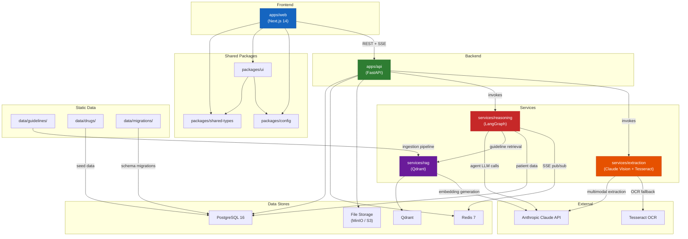

# Aether Clinician -- Project Structure

**Product:** Aether Clinician -- Clinician-Facing Diagnostic & Management Decision-Support System  
**Version:** 1.0  
**Last Updated:** 2026-06-27  
**Status:** Living document  
**Related docs:** [System Design](./system-design.md) | [Architecture Design](./architecture-design.md) | [API Design](./api-design.md) | [Database Schema](./database-schema.md)

---

## Table of Contents

1. [Monorepo Overview](#1-monorepo-overview)
2. [Complete Directory Layout](#2-complete-directory-layout)
3. [apps/web/ -- Next.js 14 Frontend](#3-appsweb----nextjs-14-frontend)
4. [apps/api/ -- FastAPI Backend](#4-appsapi----fastapi-backend)
5. [services/reasoning/ -- Multi-Agent Reasoning Engine](#5-servicesreasoning----multi-agent-reasoning-engine)
6. [services/extraction/ -- Document Processing Pipeline](#6-servicesextraction----document-processing-pipeline)
7. [services/rag/ -- Guideline RAG Service](#7-servicesrag----guideline-rag-service)
8. [packages/ -- Shared Libraries](#8-packages----shared-libraries)
9. [data/ -- Migrations, Seeds, and Corpora](#9-data----migrations-seeds-and-corpora)
10. [Configuration Management](#10-configuration-management)
11. [Module Dependency Diagram](#11-module-dependency-diagram)
12. [Adding New Features](#12-adding-new-features)
13. [Key Files Reference](#13-key-files-reference)

---

## 1. Monorepo Overview

Aether Clinician is organized as a **Turborepo monorepo** containing three languages (Python, TypeScript, Markdown/YAML) and five execution targets (Next.js frontend, FastAPI backend, LangGraph reasoning engine, extraction service, RAG service). The monorepo structure was chosen for the following reasons:

- **Atomic cross-cutting changes.** A single pull request can update a Pydantic model, the corresponding TypeScript type, the UI component that renders it, and the agent prompt that produces it. This matters because the system has tight coupling between API schemas, frontend types, and agent output formats.
- **Shared type safety.** The `packages/shared-types/` workspace acts as the canonical source of truth for data shapes. Python Pydantic models and TypeScript interfaces are kept in sync manually but colocated for easy cross-reference.
- **Build orchestration.** Turborepo manages parallel builds, test runs, and lint passes across Python and TypeScript workspaces. Build caching avoids redundant work when only one workspace changes.
- **Single Docker Compose.** Local development starts the entire stack (PostgreSQL, Redis, Qdrant, MinIO, API, web, services) from a single `docker compose up`.

### Workspace Taxonomy

| Workspace | Language | Runtime | Purpose |
|---|---|---|---|
| `apps/web` | TypeScript | Node.js / Next.js 14 | Clinician-facing UI |
| `apps/api` | Python | uvicorn / FastAPI | REST API + SSE gateway |
| `services/reasoning` | Python | LangGraph | 8-agent diagnostic reasoning engine |
| `services/extraction` | Python | standalone | Document processing (Claude vision + Tesseract) |
| `services/rag` | Python | standalone | Guideline corpus embedding + retrieval |
| `packages/shared-types` | TypeScript | compile-time only | Shared type definitions |
| `packages/ui` | TypeScript | React | Shared component library |
| `packages/config` | YAML/JSON | N/A | Shared lint/format/build configs |

---

## 2. Complete Directory Layout

```
aether-clinician/
│
├── apps/
│   ├── web/                              # Next.js 14 frontend
│   │   ├── public/
│   │   │   ├── icons/                    # PWA icons (192x192, 512x512)
│   │   │   ├── manifest.json             # PWA manifest
│   │   │   └── sw.js                     # Service worker entry (compiled)
│   │   ├── src/
│   │   │   ├── app/                      # Next.js App Router (see Section 3)
│   │   │   │   ├── (auth)/               # Auth route group (unauthenticated)
│   │   │   │   │   ├── login/
│   │   │   │   │   │   └── page.tsx
│   │   │   │   │   ├── signup/
│   │   │   │   │   │   └── page.tsx
│   │   │   │   │   └── layout.tsx
│   │   │   │   ├── (dashboard)/          # Main route group (authenticated)
│   │   │   │   │   ├── patients/
│   │   │   │   │   │   ├── page.tsx                        # Patient list
│   │   │   │   │   │   └── [id]/
│   │   │   │   │   │       ├── page.tsx                    # Patient record (longitudinal view)
│   │   │   │   │   │       ├── upload/
│   │   │   │   │   │       │   └── page.tsx                # Document upload
│   │   │   │   │   │       ├── consult/
│   │   │   │   │   │       │   └── page.tsx                # Reasoning theatre
│   │   │   │   │   │       ├── differential/
│   │   │   │   │   │       │   └── page.tsx                # Differential diagnosis view
│   │   │   │   │   │       ├── safety/
│   │   │   │   │   │       │   └── page.tsx                # Drug safety dashboard
│   │   │   │   │   │       └── export/
│   │   │   │   │   │           └── page.tsx                # Export/print view
│   │   │   │   │   └── layout.tsx
│   │   │   │   ├── layout.tsx            # Root layout (providers, fonts, global styles)
│   │   │   │   ├── page.tsx              # Landing / redirect to patients
│   │   │   │   ├── loading.tsx           # Global loading state
│   │   │   │   ├── error.tsx             # Global error boundary
│   │   │   │   ├── not-found.tsx         # 404 page
│   │   │   │   └── globals.css           # Tailwind base + custom properties
│   │   │   ├── components/               # React components (see Section 3.2)
│   │   │   │   ├── auth/
│   │   │   │   ├── patients/
│   │   │   │   ├── documents/
│   │   │   │   ├── reasoning/
│   │   │   │   ├── safety/
│   │   │   │   ├── intake/
│   │   │   │   ├── export/
│   │   │   │   ├── layout/
│   │   │   │   └── shared/
│   │   │   ├── hooks/                    # Custom React hooks (see Section 3.3)
│   │   │   │   ├── api/
│   │   │   │   ├── use-offline.ts
│   │   │   │   ├── use-sse.ts
│   │   │   │   └── use-auth.ts
│   │   │   ├── stores/                   # Zustand state stores (see Section 3.4)
│   │   │   │   ├── auth-store.ts
│   │   │   │   ├── patient-store.ts
│   │   │   │   ├── reasoning-store.ts
│   │   │   │   └── offline-store.ts
│   │   │   ├── lib/                      # Utilities and API client
│   │   │   │   ├── api/
│   │   │   │   │   ├── client.ts         # Axios/fetch wrapper with auth interceptors
│   │   │   │   │   ├── patients.ts       # Patient API functions
│   │   │   │   │   ├── documents.ts      # Document API functions
│   │   │   │   │   ├── reasoning.ts      # Reasoning API functions
│   │   │   │   │   ├── safety.ts         # Drug safety API functions
│   │   │   │   │   ├── auth.ts           # Auth API functions
│   │   │   │   │   └── types.ts          # Request/response type re-exports
│   │   │   │   ├── utils/
│   │   │   │   │   ├── format.ts         # Date, number, clinical formatting
│   │   │   │   │   ├── validation.ts     # Form validation schemas (Zod)
│   │   │   │   │   └── offline.ts        # IndexedDB helpers
│   │   │   │   └── constants.ts          # App-wide constants
│   │   │   ├── providers/                # React context providers
│   │   │   │   ├── query-provider.tsx    # TanStack Query provider
│   │   │   │   ├── auth-provider.tsx     # Auth context
│   │   │   │   └── offline-provider.tsx  # Offline state context
│   │   │   ├── styles/
│   │   │   │   └── tailwind.css          # Tailwind entry point
│   │   │   ├── types/                    # Frontend-only types (page props, etc.)
│   │   │   │   └── index.ts
│   │   │   └── workers/
│   │   │       └── service-worker.ts     # Service worker source (offline caching)
│   │   ├── .env.local                    # Frontend environment variables
│   │   ├── .env.example                  # Template for .env.local
│   │   ├── next.config.js                # Next.js configuration
│   │   ├── tailwind.config.ts            # Tailwind CSS configuration
│   │   ├── postcss.config.js             # PostCSS configuration
│   │   ├── tsconfig.json                 # TypeScript configuration
│   │   ├── package.json                  # Frontend dependencies
│   │   └── vitest.config.ts              # Test configuration
│   │
│   └── api/                              # FastAPI backend
│       ├── app/
│       │   ├── __init__.py
│       │   ├── main.py                   # FastAPI app factory, router registration, lifespan
│       │   ├── config.py                 # Settings class (Pydantic BaseSettings)
│       │   ├── dependencies.py           # FastAPI Depends: get_db, get_current_user, etc.
│       │   ├── exceptions.py             # Domain exceptions (PatientNotFoundError, etc.)
│       │   ├── routers/                  # API route handlers (see Section 4.1)
│       │   │   ├── __init__.py
│       │   │   ├── auth.py               # POST /auth/signup, /login, /refresh, /logout
│       │   │   ├── patients.py           # CRUD /patients
│       │   │   ├── documents.py          # POST /patients/{id}/documents (upload)
│       │   │   ├── records.py            # GET /patients/{id}/record (longitudinal view)
│       │   │   ├── encounters.py         # CRUD /patients/{id}/encounters
│       │   │   ├── intake.py             # POST /encounters/{id}/intake (Q&A flow)
│       │   │   ├── reasoning.py          # POST /encounters/{id}/reason, SSE stream
│       │   │   ├── safety.py             # GET /patients/{id}/safety-check
│       │   │   ├── management.py         # GET /encounters/{id}/management-options
│       │   │   ├── suggestions.py        # GET/POST /encounters/{id}/suggestions
│       │   │   ├── audit.py              # GET /audit/trail
│       │   │   └── export.py             # GET /patients/{id}/export (PDF/JSON)
│       │   ├── services/                 # Business logic layer (see Section 4.2)
│       │   │   ├── __init__.py
│       │   │   ├── auth_service.py       # JWT creation/validation, password hashing
│       │   │   ├── patient_service.py     # Patient CRUD, search, graph assembly
│       │   │   ├── document_service.py    # Upload handling, extraction dispatch
│       │   │   ├── record_service.py      # Longitudinal record assembly
│       │   │   ├── encounter_service.py   # Encounter lifecycle management
│       │   │   ├── intake_service.py      # Intake question flow orchestration
│       │   │   ├── reasoning_service.py   # LangGraph invocation, SSE streaming
│       │   │   ├── safety_service.py      # Deterministic drug safety checks
│       │   │   ├── management_service.py  # Management option assembly
│       │   │   ├── suggestion_service.py  # ClinicalSuggestion creation (append-only)
│       │   │   ├── audit_service.py       # Audit trail queries
│       │   │   └── export_service.py      # PDF/JSON export generation
│       │   ├── repositories/             # Database access layer (see Section 4.3)
│       │   │   ├── __init__.py
│       │   │   ├── base.py               # BaseRepository with common CRUD
│       │   │   ├── patient_repo.py
│       │   │   ├── document_repo.py
│       │   │   ├── encounter_repo.py
│       │   │   ├── medication_repo.py
│       │   │   ├── lab_result_repo.py
│       │   │   ├── condition_repo.py
│       │   │   ├── allergy_repo.py
│       │   │   ├── suggestion_repo.py    # Insert-only (no update/delete methods)
│       │   │   ├── drug_vocab_repo.py
│       │   │   └── audit_repo.py
│       │   ├── models/                   # SQLAlchemy ORM models (see Section 4.4)
│       │   │   ├── __init__.py
│       │   │   ├── base.py               # DeclarativeBase, common mixins
│       │   │   ├── user.py
│       │   │   ├── patient.py
│       │   │   ├── document.py
│       │   │   ├── encounter.py
│       │   │   ├── medication_event.py
│       │   │   ├── lab_result.py
│       │   │   ├── condition.py
│       │   │   ├── allergy.py
│       │   │   ├── derived_marker.py
│       │   │   ├── clinical_suggestion.py  # Immutable -- no update/delete methods
│       │   │   ├── clinician_decision.py
│       │   │   ├── drug_vocabulary.py
│       │   │   ├── intake_question.py
│       │   │   ├── intake_answer.py
│       │   │   └── audit_log.py
│       │   ├── schemas/                  # Pydantic request/response models (see Section 4.5)
│       │   │   ├── __init__.py
│       │   │   ├── auth.py               # LoginRequest, TokenResponse, etc.
│       │   │   ├── patient.py            # PatientCreate, PatientResponse, etc.
│       │   │   ├── document.py           # DocumentUpload, ExtractionResult, etc.
│       │   │   ├── record.py             # LongitudinalRecordResponse
│       │   │   ├── encounter.py
│       │   │   ├── intake.py             # IntakeQuestionResponse, IntakeAnswerRequest
│       │   │   ├── reasoning.py          # ReasoningRequest, ReasoningStreamEvent
│       │   │   ├── safety.py             # SafetyCheckResponse, HardBlockDetail
│       │   │   ├── management.py         # ManagementOptionResponse
│       │   │   ├── suggestion.py         # ClinicalSuggestionResponse
│       │   │   ├── audit.py              # AuditTrailResponse
│       │   │   ├── export.py             # ExportRequest, ExportResponse
│       │   │   └── common.py             # PaginatedResponse, ErrorResponse, enums
│       │   ├── middleware/               # FastAPI middleware (see Section 4.6)
│       │   │   ├── __init__.py
│       │   │   ├── auth.py               # JWT verification middleware
│       │   │   ├── cors.py               # CORS configuration
│       │   │   ├── rate_limit.py         # Redis-backed rate limiting
│       │   │   └── request_logging.py    # Structured request/response logging
│       │   └── db/                       # Database connection management
│       │       ├── __init__.py
│       │       ├── session.py            # AsyncSession factory, engine setup
│       │       └── init_db.py            # Database initialization, table creation
│       ├── tests/                        # Backend tests
│       │   ├── conftest.py               # Fixtures: test DB, client, auth headers
│       │   ├── test_auth.py
│       │   ├── test_patients.py
│       │   ├── test_documents.py
│       │   ├── test_reasoning.py
│       │   ├── test_safety.py
│       │   └── test_audit.py
│       ├── .env                          # Backend environment variables
│       ├── .env.example                  # Template
│       ├── pyproject.toml                # Python project config (deps, ruff, mypy)
│       ├── requirements.txt              # Pinned dependencies
│       └── Dockerfile                    # Backend container build
│
├── services/
│   ├── reasoning/                        # LangGraph agent orchestration
│   │   ├── reasoning/
│   │   │   ├── __init__.py
│   │   │   ├── graph.py                  # StateGraph definition, nodes, edges
│   │   │   ├── state.py                  # CaseState dataclass
│   │   │   ├── agents/                   # One file per agent (see Section 5.1)
│   │   │   │   ├── __init__.py
│   │   │   │   ├── triage_intake.py      # Agent 1: Triage/Intake
│   │   │   │   ├── hypothesis_panel.py   # Agent 2: Specialist panel (4 sub-agents)
│   │   │   │   ├── cant_miss_sentinel.py # Agent 3: Can't-Miss Sentinel
│   │   │   │   ├── devil_advocate.py     # Agent 4: Devil's-Advocate
│   │   │   │   ├── investigation.py      # Agent 5: Investigation Strategist
│   │   │   │   ├── guideline_rag.py      # Agent 6: Guideline-RAG
│   │   │   │   ├── verifier.py           # Agent 7: Verifier (gatekeeper)
│   │   │   │   └── orchestrator.py       # Agent 8: Synthesis/Orchestrator
│   │   │   ├── tools/                    # LangGraph tool definitions (see Section 5.2)
│   │   │   │   ├── __init__.py
│   │   │   │   ├── patient_graph.py      # query_patient_graph, get_lab_trend
│   │   │   │   ├── drug_safety.py        # check_drug_safety, check_interactions
│   │   │   │   ├── guideline_retrieval.py # retrieve_guidelines
│   │   │   │   ├── investigation.py      # compute_discriminating_test
│   │   │   │   └── cant_miss.py          # flag_cant_miss
│   │   │   ├── prompts/                  # System prompts per agent (see Section 5.3)
│   │   │   │   ├── triage_intake.md
│   │   │   │   ├── internal_medicine.md
│   │   │   │   ├── cardiology.md
│   │   │   │   ├── infectious_disease.md
│   │   │   │   ├── primary_care.md
│   │   │   │   ├── cant_miss_sentinel.md
│   │   │   │   ├── devil_advocate.md
│   │   │   │   ├── investigation.md
│   │   │   │   ├── guideline_rag.md
│   │   │   │   └── verifier.md
│   │   │   └── config.py                 # Agent configuration (thresholds, model params)
│   │   ├── tests/
│   │   │   ├── conftest.py
│   │   │   ├── test_graph.py             # Graph structure validation
│   │   │   ├── test_triage_intake.py
│   │   │   ├── test_hypothesis_panel.py
│   │   │   ├── test_verifier.py          # Must confirm all output routes through verifier
│   │   │   ├── test_devil_advocate.py
│   │   │   └── test_state.py             # CaseState serialization/deserialization
│   │   ├── pyproject.toml
│   │   └── Dockerfile
│   │
│   ├── extraction/                       # Document processing pipeline
│   │   ├── extraction/
│   │   │   ├── __init__.py
│   │   │   ├── pipeline.py               # Main extraction orchestrator
│   │   │   ├── clients/                  # External service clients (see Section 6.1)
│   │   │   │   ├── __init__.py
│   │   │   │   ├── claude_vision.py      # Anthropic Claude multimodal extraction
│   │   │   │   └── tesseract.py          # Tesseract OCR fallback
│   │   │   ├── normalizers/              # Data normalization (see Section 6.2)
│   │   │   │   ├── __init__.py
│   │   │   │   ├── medication.py         # Drug name normalization via DrugVocabulary
│   │   │   │   ├── lab_result.py         # Lab value + unit normalization
│   │   │   │   ├── date.py               # Date parsing (Indian formats: DD/MM/YYYY, etc.)
│   │   │   │   └── patient_info.py       # Demographic normalization
│   │   │   ├── validators/               # Extraction validation (see Section 6.3)
│   │   │   │   ├── __init__.py
│   │   │   │   ├── schema_validator.py   # Validate against expected extraction schema
│   │   │   │   ├── confidence.py         # Per-field confidence scoring
│   │   │   │   └── cross_reference.py    # Cross-ref against existing patient data
│   │   │   └── models.py                 # Extraction-specific Pydantic models
│   │   ├── tests/
│   │   │   ├── conftest.py
│   │   │   ├── test_pipeline.py
│   │   │   ├── test_claude_vision.py
│   │   │   ├── test_normalizers.py
│   │   │   └── fixtures/                 # Sample documents for testing
│   │   │       ├── prescription_scan.jpg
│   │   │       ├── lab_report.pdf
│   │   │       └── expected_outputs/
│   │   ├── pyproject.toml
│   │   └── Dockerfile
│   │
│   └── rag/                              # Guideline RAG service
│       ├── rag/
│       │   ├── __init__.py
│       │   ├── ingest.py                 # Guideline ingestion pipeline entry point
│       │   ├── client.py                 # Qdrant client wrapper
│       │   ├── embeddings.py             # Embedding generation (model + batching)
│       │   ├── chunker.py                # Document chunking with metadata preservation
│       │   ├── retriever.py              # Retrieval with reranking and score filtering
│       │   ├── reranker.py               # Cross-encoder reranking logic
│       │   └── models.py                 # GuidelineChunk, RetrievalResult models
│       ├── tests/
│       │   ├── conftest.py
│       │   ├── test_ingest.py
│       │   ├── test_retriever.py
│       │   └── test_chunker.py
│       ├── pyproject.toml
│       └── Dockerfile
│
├── packages/
│   ├── shared-types/                     # Shared type definitions
│   │   ├── src/
│   │   │   ├── index.ts                  # Barrel export
│   │   │   ├── patient.ts                # Patient, PatientSummary
│   │   │   ├── document.ts               # Document, ExtractionResult
│   │   │   ├── encounter.ts              # Encounter, EncounterStatus
│   │   │   ├── medication.ts             # MedicationEvent, DrugVocabularyEntry
│   │   │   ├── lab-result.ts             # LabResult, LabTrend
│   │   │   ├── condition.ts              # Condition, ConditionStatus
│   │   │   ├── allergy.ts                # Allergy, AllergyReaction
│   │   │   ├── reasoning.ts              # Hypothesis, CaseState (TS mirror), AgentMessage
│   │   │   ├── safety.ts                 # DrugSafetyResult, HardBlock, InteractionDetail
│   │   │   ├── suggestion.ts             # ClinicalSuggestion, ClinicianDecision
│   │   │   ├── intake.ts                 # IntakeQuestion, IntakeAnswer
│   │   │   ├── audit.ts                  # AuditEntry
│   │   │   └── enums.ts                  # AutonomyTier, SuggestionType, ProbabilityBand, etc.
│   │   ├── tsconfig.json
│   │   └── package.json
│   │
│   ├── ui/                               # Shared React component library
│   │   ├── src/
│   │   │   ├── index.ts                  # Barrel export
│   │   │   ├── components/
│   │   │   │   ├── Button.tsx
│   │   │   │   ├── Card.tsx
│   │   │   │   ├── Badge.tsx             # Includes AutonomyTierBadge variant
│   │   │   │   ├── Modal.tsx
│   │   │   │   ├── Toast.tsx
│   │   │   │   ├── DataTable.tsx
│   │   │   │   ├── FileUpload.tsx
│   │   │   │   ├── LoadingSpinner.tsx
│   │   │   │   ├── EmptyState.tsx
│   │   │   │   ├── OfflineBanner.tsx
│   │   │   │   ├── DemoBanner.tsx        # Persistent demo mode indicator
│   │   │   │   └── EvidencePanel.tsx      # Renders evidence-before-conclusion blocks
│   │   │   └── primitives/
│   │   │       ├── Input.tsx
│   │   │       ├── Select.tsx
│   │   │       ├── Textarea.tsx
│   │   │       ├── Checkbox.tsx
│   │   │       └── Label.tsx
│   │   ├── tsconfig.json
│   │   └── package.json
│   │
│   └── config/                           # Shared configurations
│       ├── eslint/
│       │   ├── base.js                   # Base ESLint rules
│       │   ├── next.js                   # Next.js-specific rules
│       │   └── react.js                  # React-specific rules
│       ├── typescript/
│       │   ├── base.json                 # Base tsconfig
│       │   ├── next.json                 # Next.js tsconfig extends base
│       │   └── library.json              # Library tsconfig (packages/ui, packages/shared-types)
│       ├── prettier/
│       │   └── index.js                  # Prettier configuration
│       ├── ruff/
│       │   └── ruff.toml                 # Shared Ruff config for all Python workspaces
│       └── package.json
│
├── data/
│   ├── guidelines/                       # Curated clinical guideline corpus
│   │   ├── icmr/                         # ICMR Standard Treatment Workflows
│   │   │   ├── manifest.yaml             # Index of all ICMR STW documents
│   │   │   └── *.pdf                     # Source PDFs
│   │   ├── who/                          # WHO guidelines
│   │   │   ├── manifest.yaml
│   │   │   └── *.pdf
│   │   ├── nice/                         # NICE guidelines
│   │   │   ├── manifest.yaml
│   │   │   └── *.pdf
│   │   └── README.md                     # Corpus versioning and ingestion instructions
│   │
│   ├── drugs/                            # DrugVocabulary seed data
│   │   ├── drug_vocabulary.json          # Brand -> generic -> reference ID mapping
│   │   ├── interactions.json             # Known drug-drug interactions
│   │   ├── contraindications.json        # Drug-condition contraindications
│   │   └── schema.json                   # JSON Schema for seed data validation
│   │
│   └── migrations/                       # Alembic database migrations
│       ├── alembic.ini                   # Alembic configuration
│       ├── env.py                        # Migration environment (async engine)
│       ├── script.py.mako                # Migration template
│       └── versions/                     # Migration scripts
│           ├── 001_initial_schema.py
│           ├── 002_audit_log.py
│           ├── 003_drug_vocabulary.py
│           └── ...
│
├── scripts/                              # Development and deployment scripts
│   ├── dev-setup.sh                      # First-time dev environment setup
│   ├── seed-db.sh                        # Seed database with drug vocabulary and test data
│   ├── ingest-guidelines.sh              # Run guideline ingestion pipeline
│   ├── generate-types.sh                 # Sync Python Pydantic -> TS types (manual step)
│   └── deploy.sh                         # Production deployment script
│
├── docs/                                 # Project documentation
│   ├── system-design.md                  # Tech stack, infrastructure, caching, error handling
│   ├── architecture-design.md            # Component architecture, agent specs, data flow
│   ├── api-design.md                     # REST API specification
│   ├── database-schema.md                # PostgreSQL schema, migration plan
│   └── project-structure.md              # This document
│
├── tests/                                # Integration and E2E tests
│   ├── integration/
│   │   ├── conftest.py                   # Shared fixtures (running API, seeded DB)
│   │   ├── test_document_to_record.py    # Upload -> extraction -> patient graph
│   │   ├── test_intake_to_reasoning.py   # Intake flow -> reasoning engine -> output
│   │   ├── test_safety_offline.py        # Drug safety checks without network
│   │   └── test_audit_immutability.py    # Verify ClinicalSuggestion append-only
│   ├── e2e/
│   │   ├── playwright.config.ts
│   │   ├── tests/
│   │   │   ├── auth.spec.ts
│   │   │   ├── patient-flow.spec.ts
│   │   │   ├── document-upload.spec.ts
│   │   │   ├── reasoning-theatre.spec.ts
│   │   │   └── offline-mode.spec.ts
│   │   └── fixtures/
│   │       └── test-documents/
│   └── load/
│       └── locustfile.py                 # Load testing for concurrent reasoning sessions
│
├── .env.example                          # Root environment variable template
├── .gitignore
├── docker-compose.yml                    # Full-stack local development
├── docker-compose.prod.yml               # Production override
├── turbo.json                            # Turborepo task orchestration
├── package.json                          # Root workspace definition
├── pnpm-workspace.yaml                   # pnpm workspace configuration
├── CLAUDE.md                             # Claude Code project context
└── nginx/
    ├── nginx.conf                        # Nginx configuration
    └── ssl/                              # TLS certificates (gitignored)
```

---

## 3. apps/web/ -- Next.js 14 Frontend

The frontend is a Next.js 14 application using the App Router, React 18, and TypeScript. It is designed as a Progressive Web App (PWA) with offline capabilities for core record access.

### 3.1 App Router Structure

The `src/app/` directory uses Next.js App Router conventions with **route groups** to separate authenticated and unauthenticated flows:

```
src/app/
├── (auth)/                   # Unauthenticated route group
│   ├── layout.tsx            # Minimal layout (no sidebar, no nav)
│   ├── login/page.tsx        # Email/password login; demo mode bypass
│   └── signup/page.tsx       # Clinician registration
│
├── (dashboard)/              # Authenticated route group
│   ├── layout.tsx            # Dashboard shell (sidebar, header, offline banner, demo banner)
│   └── patients/
│       ├── page.tsx          # Patient list: search, filter, create new
│       └── [id]/
│           ├── page.tsx      # Longitudinal patient record (timeline view)
│           ├── upload/       # Document upload with drag-and-drop, preview, extraction progress
│           ├── consult/      # Reasoning Theatre: intake Q&A, agent deliberation, streaming output
│           ├── differential/ # Differential diagnosis view with evidence-before-conclusion layout
│           ├── safety/       # Drug safety dashboard: interactions, contraindications, hard blocks
│           └── export/       # Export patient record as PDF or structured JSON
│
├── layout.tsx                # Root layout: HTML head, providers, fonts, global error boundary
├── page.tsx                  # Landing redirect (-> /patients if authenticated, -> /login if not)
├── loading.tsx               # Suspense fallback (global)
├── error.tsx                 # Root error boundary
├── not-found.tsx             # 404
└── globals.css               # Tailwind imports + CSS custom properties for clinical colors
```

**Route group rationale:** The `(auth)` group uses a minimal layout without the dashboard shell. The `(dashboard)` group applies the authenticated layout with sidebar, header, connectivity indicator, and the persistent demo banner (when `NEXT_PUBLIC_DEMO_MODE=true`). This separation means authentication checks live in the dashboard layout, not in every page.

### 3.2 Component Organization

Components are organized by **feature domain** with a `shared/` directory for cross-cutting components:

| Directory | Contents |
|---|---|
| `components/auth/` | `LoginForm`, `SignupForm`, `DemoModeNotice` |
| `components/patients/` | `PatientList`, `PatientCard`, `PatientCreateForm`, `PatientSearch`, `PatientTimeline` |
| `components/documents/` | `DocumentUploader`, `DocumentPreview`, `ExtractionProgress`, `ConfirmationCard` (for low-confidence fields) |
| `components/reasoning/` | `ReasoningTheatre`, `AgentPanel`, `HypothesisCard`, `EvidenceList`, `DevilAdvocateBlock` (cannot be collapsed), `CantMissAlert`, `InvestigationCard`, `AutonomyTierBadge` |
| `components/safety/` | `SafetyDashboard`, `InteractionMatrix`, `HardBlockAlert`, `AllergyConflictCard`, `MedicationReconciliation` |
| `components/intake/` | `IntakeFlow`, `QuestionCard`, `AnswerInput`, `ProgressIndicator` |
| `components/export/` | `ExportPreview`, `ExportOptions`, `PrintLayout` |
| `components/layout/` | `Sidebar`, `Header`, `ConnectivityIndicator`, `BreadcrumbNav` |
| `components/shared/` | `ConfidenceBadge`, `CitationLink`, `PatientIdentifier`, `ClinicalDisclaimer`, `EmptyTimeline` |

**Anti-automation-bias components:** The `ReasoningTheatre` component enforces evidence-before-conclusion rendering order. The `DevilAdvocateBlock` is structurally prevented from being collapsed or hidden -- it renders as a mandatory, visually distinct section within the reasoning output. These are architectural safety requirements, not UI preferences.

### 3.3 Hooks

| Hook | Location | Purpose |
|---|---|---|
| `hooks/api/use-patients.ts` | API hooks | TanStack Query hooks for patient CRUD (`usePatients`, `usePatient`, `useCreatePatient`) |
| `hooks/api/use-documents.ts` | API hooks | Document upload mutation, extraction polling |
| `hooks/api/use-reasoning.ts` | API hooks | Reasoning session initiation, SSE event parsing |
| `hooks/api/use-safety.ts` | API hooks | Drug safety check queries |
| `hooks/api/use-intake.ts` | API hooks | Intake question/answer flow |
| `hooks/use-sse.ts` | Shared | Generic SSE connection hook with reconnection and event typing |
| `hooks/use-offline.ts` | Shared | Online/offline state detection, IndexedDB sync status |
| `hooks/use-auth.ts` | Shared | JWT token management, refresh flow, logout |

**SSE hook:** The `use-sse.ts` hook manages the real-time connection to the reasoning engine's SSE stream (`/api/v1/encounters/{id}/reason/stream`). It handles reconnection with exponential backoff, parses typed `ReasoningStreamEvent` messages, and dispatches them to the `reasoning-store` Zustand store. The SSE pattern is used instead of WebSocket because the data flow is server-to-client only (the frontend does not send messages during reasoning).

### 3.4 State Management

Client state is managed with **Zustand** stores. Server state (API data) is managed by TanStack Query. The two do not overlap.

| Store | Purpose | Key State |
|---|---|---|
| `auth-store.ts` | Authentication | `user`, `accessToken`, `isAuthenticated`, `isDemoMode` |
| `patient-store.ts` | Active patient context | `selectedPatient`, `activeEncounter`, `patientGraph` |
| `reasoning-store.ts` | Reasoning session | `agentMessages`, `hypotheses`, `currentPhase`, `isStreaming`, `verifierVerdicts` |
| `offline-store.ts` | Offline state | `isOnline`, `pendingSyncCount`, `lastSyncAt`, `cachedPatientIds` |

### 3.5 Service Worker and Offline

The service worker (`workers/service-worker.ts`) provides:

- **Static asset caching:** All JS, CSS, and font assets are precached at install time.
- **API response caching:** Patient record GET responses are cached in IndexedDB for offline access.
- **Network-first with fallback:** API requests attempt network first; on failure, serve from cache with an offline indicator flag.
- **Background sync:** Document uploads queued offline are retried when connectivity returns.

The service worker is compiled to `public/sw.js` during the Next.js build. The `manifest.json` in `public/` defines the PWA metadata (name, icons, theme color, display mode).

### 3.6 Styling

- **Tailwind CSS** is the primary styling system, configured in `tailwind.config.ts`.
- Custom CSS properties in `globals.css` define the clinical color palette (severity tiers, confidence bands, autonomy tier colors).
- The Tailwind config extends the default theme with clinical-specific color scales and typography sizes optimized for data-dense displays.
- No CSS-in-JS libraries are used.

---

## 4. apps/api/ -- FastAPI Backend

The backend follows a **layered architecture**: routers (thin controllers) -> services (business logic) -> repositories (data access). All layers are async. FastAPI's dependency injection (`Depends`) wires everything together.

### 4.1 Routers

Routers are thin HTTP handlers. They validate input (via Pydantic schemas), call the service layer, and return responses. No business logic lives in routers.

| Router file | Prefix | Key endpoints |
|---|---|---|
| `auth.py` | `/auth` | `POST /signup`, `POST /login`, `POST /refresh`, `POST /logout` |
| `patients.py` | `/patients` | `GET /`, `POST /`, `GET /{id}`, `PATCH /{id}`, `DELETE /{id}` (soft) |
| `documents.py` | `/patients/{id}/documents` | `POST /` (multipart upload), `GET /{doc_id}`, `GET /{doc_id}/extraction` |
| `records.py` | `/patients/{id}/record` | `GET /` (assembled longitudinal view) |
| `encounters.py` | `/patients/{id}/encounters` | `POST /`, `GET /{enc_id}`, `PATCH /{enc_id}` |
| `intake.py` | `/encounters/{id}/intake` | `POST /start`, `POST /answer`, `GET /questions` |
| `reasoning.py` | `/encounters/{id}/reason` | `POST /` (start reasoning), `GET /stream` (SSE), `GET /result` |
| `safety.py` | `/patients/{id}/safety-check` | `GET /` (full safety report), `POST /check-medication` (single drug check) |
| `management.py` | `/encounters/{id}/management` | `GET /options` (guideline-cited management options) |
| `suggestions.py` | `/encounters/{id}/suggestions` | `GET /` (all suggestions), `POST /{id}/decision` (clinician accept/override) |
| `audit.py` | `/audit` | `GET /trail` (filtered audit log) |
| `export.py` | `/patients/{id}/export` | `GET /` (PDF/JSON export) |

All routers are registered in `main.py` under the `/api/v1` prefix. See the [API Design document](./api-design.md) for full endpoint specifications.

### 4.2 Service Layer

Services contain business logic and orchestrate calls to repositories, external services (reasoning engine, extraction pipeline), and the cache. Each service is a class injected via `Depends`.

Key patterns:

- **`reasoning_service.py`** manages the lifecycle of a reasoning session: validates patient data completeness, invokes the LangGraph engine via an async call, streams intermediate `AgentMessage` events via SSE, and writes the final `ClinicalSuggestion` records to the audit trail.
- **`safety_service.py`** performs deterministic drug-safety checks (allergy cross-referencing, contraindication detection, interaction screening) against the local DrugVocabulary. These checks are fully offline-capable and do not depend on LLM availability.
- **`suggestion_service.py`** enforces the append-only invariant on `ClinicalSuggestion` records. It only exposes `create` and `list` methods -- no update or delete.

### 4.3 Repository Layer

Repositories encapsulate all SQLAlchemy queries. Each repository inherits from `BaseRepository`, which provides common CRUD operations (`get_by_id`, `list_all`, `create`, `update`, `soft_delete`).

**Exception: `suggestion_repo.py`** deliberately omits `update` and `soft_delete` methods from its interface. This is the application-level enforcement of the ClinicalSuggestion immutability rule (complementing the PostgreSQL trigger-level enforcement defined in the [Database Schema document](./database-schema.md)).

All repositories accept an `AsyncSession` via dependency injection and use SQLAlchemy 2.0-style query syntax.

### 4.4 SQLAlchemy Models

Models map to PostgreSQL tables defined in the [Database Schema document](./database-schema.md). Key conventions:

- All models inherit from a `Base` class (SQLAlchemy `DeclarativeBase`) that includes `id` (UUID), `created_at`, and `updated_at` columns.
- Models with patient data include `is_deleted` and `deleted_at` columns (soft-delete mixin).
- The `ClinicalSuggestion` model deliberately omits any method that would produce an `UPDATE` or `DELETE` query.

### 4.5 Pydantic Schemas

Schemas define the API contract. They are separate from SQLAlchemy models to enforce the API boundary.

- **Request models:** Validate incoming data (`PatientCreate`, `IntakeAnswerRequest`, `ReasoningRequest`).
- **Response models:** Shape outgoing data (`PatientResponse`, `SafetyCheckResponse`, `ReasoningStreamEvent`).
- **Common schemas:** `PaginatedResponse[T]`, `ErrorResponse`, shared enums (`AutonomyTier`, `SuggestionType`, `ProbabilityBand`).

Enums in `schemas/common.py` must stay synchronized with `packages/shared-types/src/enums.ts`. The `scripts/generate-types.sh` script assists with this, but the sync is ultimately a manual review step.

### 4.6 Middleware

| Middleware | Purpose |
|---|---|
| `auth.py` | Extracts and validates JWT from `Authorization` header. Populates `request.state.user`. Skips for exempt routes (`/auth/signup`, `/auth/login`, `/auth/refresh`). |
| `cors.py` | Configures CORS with allowed origins from environment. Production restricts to the deployed frontend domain. |
| `rate_limit.py` | Redis-backed sliding-window rate limiting. Per-user for authenticated routes, per-IP for auth endpoints. Configurable limits per route group. |
| `request_logging.py` | Structured JSON logging of every request/response (method, path, status, latency, user_id). Excludes request/response bodies for privacy -- logs metadata only. |

### 4.7 Dependencies

`dependencies.py` defines the FastAPI `Depends` callables that wire the application together:

| Dependency | Provides |
|---|---|
| `get_db()` | `AsyncSession` from the session factory |
| `get_current_user()` | Authenticated `User` (or raises 401) |
| `get_current_user_optional()` | `User | None` (for endpoints that work in both auth and demo mode) |
| `get_patient_service()` | `PatientService` instance with injected repository |
| `get_reasoning_service()` | `ReasoningService` instance with injected LangGraph client |
| `get_redis()` | Redis connection from the pool |

---

## 5. services/reasoning/ -- Multi-Agent Reasoning Engine

This is the clinical core of the system. It implements the eight-agent diagnostic reasoning pipeline using LangGraph's `StateGraph`. For detailed agent specifications, see the [Architecture Design document](./architecture-design.md), Section 3.

### 5.1 Agent Files

Each agent is implemented in a single Python file under `reasoning/agents/`. Each file exports a function with the signature `async def run(state: CaseState) -> CaseState` that the LangGraph graph calls as a node.

| File | Agent | Notes |
|---|---|---|
| `triage_intake.py` | Triage/Intake | Loops until `info_gain_score < threshold` or question cap reached. Contains the question-generation prompt and info-gain scoring logic. |
| `hypothesis_panel.py` | Hypothesis Panel | Dispatches 4 specialist sub-agents (IM, cardiology, ID, primary care) in parallel via `asyncio.gather()`. Each sub-agent uses a distinct specialist system prompt. |
| `cant_miss_sentinel.py` | Can't-Miss Sentinel | Append-only output to `hypothesis_set`. Items with `cant_miss_flag=True` require clinician acknowledgment. |
| `devil_advocate.py` | Devil's-Advocate | Receives the leading hypotheses and produces counter-arguments. Output cannot be suppressed or hidden. |
| `investigation.py` | Investigation Strategist | Computes the most discriminating next test. Frames with cost and availability tier (PHC/CHC/District Hospital/Referral). |
| `guideline_rag.py` | Guideline-RAG | Calls the RAG service for retrieval. Synthesizes management options from retrieved chunks with inline citations. |
| `verifier.py` | Verifier (gatekeeper) | Independently re-checks all output. Assigns `AutonomyTier`. Disagreement with other agents triggers conservative resolution. **Cannot be bypassed.** |
| `orchestrator.py` | Synthesis/Orchestrator | Pure orchestration logic (not an LLM call). Reconciles outputs, preserves disagreement, writes final audit record. |

### 5.2 Graph Definition (`graph.py`)

The graph definition file creates the LangGraph `StateGraph` and wires agents as nodes with conditional edges:

```
START -> triage_intake -> (loop until intake_complete) -> hypothesis_panel
hypothesis_panel -> cant_miss_sentinel -> devil_advocate -> investigation
investigation -> guideline_rag -> verifier -> orchestrator -> END
```

The graph supports:
- **Conditional edges:** The triage/intake node loops back to itself until intake is complete.
- **Parallel dispatch:** The hypothesis panel internally parallelizes its 4 specialist sub-agents.
- **Checkpointing:** LangGraph checkpoints after each node for pause/resume capability.
- **SSE streaming:** The orchestrator emits `AgentMessage` events to a Redis pub/sub channel, which the API's SSE endpoint relays to the frontend.

A `--dry-run` mode validates graph structure (node connectivity, edge definitions, state schema) without making LLM calls: `python -m reasoning.graph --dry-run`.

### 5.3 Prompts

System prompts are stored as Markdown files in `prompts/`. Each agent's Python file loads its prompt at startup. Prompts are versioned alongside the code -- changes to prompts go through the same review process as code changes.

Prompt files encode:
- **Persona and role definition** (e.g., the devil's advocate persona for adversarial reasoning).
- **Output format specification** (structured output requirements for each agent).
- **Constraints** (e.g., verifier must use independent reasoning, cannot access other agents' chain-of-thought).
- **Clinical safety rules** (no certainty language, cite patient data for every evidence item).

### 5.4 Tools

LangGraph tool definitions in `tools/` expose structured functions that agents can call during reasoning:

| Tool | Used by | Function |
|---|---|---|
| `query_patient_graph(filter)` | Triage, Hypothesis Panel, Can't-Miss, Devil's Advocate, Verifier | Query the patient graph for specific clinical data |
| `get_lab_trend(marker)` | Hypothesis Panel, Devil's Advocate | Retrieve time-series lab values for trend analysis |
| `check_drug_safety(drug, patient_id)` | Verifier | Run deterministic drug safety check |
| `check_interactions(drugs)` | Verifier | Check drug-drug interactions for a medication set |
| `retrieve_guidelines(query, k)` | Guideline-RAG, Verifier | Semantic retrieval from the guideline corpus |
| `compute_discriminating_test(hypotheses)` | Investigation Strategist | Compute information gain for candidate investigations |
| `flag_cant_miss(symptoms, context)` | Triage, Can't-Miss Sentinel | Flag potential can't-miss diagnoses |

### 5.5 Configuration (`config.py`)

Agent configuration parameters that affect reasoning behavior:

| Parameter | Default | Purpose |
|---|---|---|
| `INFO_GAIN_THRESHOLD` | `0.15` | Intake loop termination threshold |
| `QUESTION_CAP` | `8` | Maximum intake questions per session |
| `RETRIEVAL_SIMILARITY_THRESHOLD` | `0.75` | Minimum similarity score for guideline retrieval |
| `HYPOTHESIS_PROBABILITY_BANDS` | 4 bands | HIGH / MODERATE / LOW / VERY_LOW thresholds |
| `ANTHROPIC_MODEL` | `claude-sonnet-4-20250514` | Default model for all agents |
| `ANTHROPIC_MAX_TOKENS` | `4096` | Default max tokens per agent call |
| `PARALLEL_SPECIALISTS` | `4` | Number of parallel specialist agents in hypothesis panel |

---

## 6. services/extraction/ -- Document Processing Pipeline

The extraction service processes uploaded medical documents (prescriptions, lab reports, discharge summaries) into structured patient graph data.

### 6.1 Pipeline Flow

```
Document Upload -> Claude Vision Extraction -> Confidence Check
    |                                              |
    |  (if confidence < threshold)                 v
    +-------> Tesseract OCR Fallback -----> Normalization Pipeline
                                                   |
                                                   v
                                           Validation Pipeline
                                                   |
                                                   v
                                           Patient Graph Insert
```

**`pipeline.py`** orchestrates this flow. It accepts a document (file bytes + metadata), runs Claude vision extraction, checks per-field confidence scores, falls back to Tesseract for low-confidence fields, normalizes the extracted data, validates against expected schemas, and returns structured `ExtractionResult` objects ready for patient graph insertion.

### 6.2 Clients

- **`claude_vision.py`:** Wraps the Anthropic client for multimodal document extraction. Sends document images to Claude with a structured extraction prompt specifying the expected output schema (medications, lab results, patient demographics). Returns per-field confidence scores.
- **`tesseract.py`:** Wraps the Tesseract OCR binary for fallback extraction. Handles image preprocessing (deskew, contrast enhancement) for low-quality scans. Supports Hindi + English language packs.

### 6.3 Normalizers

| Normalizer | Purpose |
|---|---|
| `medication.py` | Resolves Indian brand names to INN generics via DrugVocabulary. "Crocin" -> "Paracetamol" -> reference ID. |
| `lab_result.py` | Standardizes lab values (unit conversion, reference range tagging). Handles Indian lab report formats. |
| `date.py` | Parses Indian date formats (DD/MM/YYYY, DD-Mon-YY) and normalizes to ISO 8601. |
| `patient_info.py` | Standardizes demographic fields (name casing, age/DOB resolution, gender normalization). |

### 6.4 Validators

| Validator | Purpose |
|---|---|
| `schema_validator.py` | Validates extraction output against Pydantic schema. Ensures required fields are present and typed correctly. |
| `confidence.py` | Computes per-field confidence scores. Fields below the confirmation threshold are flagged for clinician review in the UI. |
| `cross_reference.py` | Cross-references extracted data against existing patient records to detect duplicates, contradictions, or updates to known data. |

---

## 7. services/rag/ -- Guideline RAG Service

The RAG service manages the clinical guideline corpus: ingestion, embedding, storage in Qdrant, and retrieval with reranking.

### 7.1 Ingestion Pipeline (`ingest.py`)

The ingestion pipeline processes source guideline documents into indexed, searchable chunks:

```
Source PDFs (data/guidelines/) -> Chunking -> Embedding -> Qdrant Upsert
```

Each chunk retains its **citation metadata**: guideline name, edition/version, section heading, page number, and a stable `section_id` for citation linking. This metadata is stored as a Qdrant payload alongside the vector.

### 7.2 Key Components

| Component | Purpose |
|---|---|
| `chunker.py` | Splits guideline documents into chunks with overlapping windows. Preserves section boundaries and heading hierarchy. Each chunk carries its citation metadata. |
| `embeddings.py` | Generates vector embeddings for chunks. Handles batching for large corpora. Embedding model is configurable. |
| `client.py` | Qdrant client wrapper. Manages collections, upserts, and metadata filtering. |
| `retriever.py` | Semantic retrieval with score filtering (minimum similarity threshold: 0.75). Returns `RetrievalResult` objects with chunks, scores, and citation metadata. |
| `reranker.py` | Cross-encoder reranking of initial retrieval results to improve precision. Takes top-k candidates from the retriever and reranks by relevance to the query. |

### 7.3 Corpus Structure

Guidelines are organized by source in `data/guidelines/`:

```
data/guidelines/
├── icmr/                # Primary guideline spine
│   ├── manifest.yaml    # Lists all documents with metadata (title, edition, date, specialty)
│   └── *.pdf
├── who/                 # Supplementary
│   ├── manifest.yaml
│   └── *.pdf
└── nice/                # Supplementary
    ├── manifest.yaml
    └── *.pdf
```

Each `manifest.yaml` provides:
- Document title, edition, publication date
- Specialty tags (for scoped retrieval)
- Corpus version identifier (for reproducibility)

The ingestion script (`scripts/ingest-guidelines.sh`) reads the manifests, runs the pipeline, and records the corpus version in Qdrant collection metadata.

---

## 8. packages/ -- Shared Libraries

### 8.1 shared-types/

TypeScript type definitions that mirror the Python Pydantic models used by the API. These are the canonical frontend types for API responses and domain objects.

Key files:

| File | Defines |
|---|---|
| `patient.ts` | `Patient`, `PatientSummary`, `PatientCreate` |
| `document.ts` | `Document`, `ExtractionResult`, `ExtractionField` |
| `encounter.ts` | `Encounter`, `EncounterStatus` |
| `medication.ts` | `MedicationEvent`, `DrugVocabularyEntry` |
| `lab-result.ts` | `LabResult`, `LabTrend`, `ReferenceRange` |
| `condition.ts` | `Condition`, `ConditionStatus` |
| `allergy.ts` | `Allergy`, `AllergyReaction`, `AllergySeverity` |
| `reasoning.ts` | `Hypothesis`, `AgentMessage`, `TraceEntry`, `VerifierVerdict`, `CaseStateSummary` |
| `safety.ts` | `DrugSafetyResult`, `HardBlock`, `InteractionDetail`, `ContraindicationDetail` |
| `suggestion.ts` | `ClinicalSuggestion`, `ClinicianDecision`, `DecisionType` |
| `intake.ts` | `IntakeQuestion`, `IntakeAnswer` |
| `audit.ts` | `AuditEntry` |
| `enums.ts` | `AutonomyTier`, `SuggestionType`, `ProbabilityBand`, `ExtractionConfidence`, `EncounterStatus` |

**Synchronization:** Types in this package must stay synchronized with the corresponding Pydantic models in `apps/api/app/schemas/`. The `scripts/generate-types.sh` script generates draft TypeScript types from the Pydantic models, but the output is reviewed and manually committed -- it is not an automatic code generation step.

### 8.2 ui/

A shared React component library providing design system primitives and clinical-specific components used across the web app. Components are built with Tailwind CSS and follow the project's clinical color palette.

Key component categories:

- **Primitives** (`primitives/`): `Input`, `Select`, `Textarea`, `Checkbox`, `Label` -- form elements with consistent styling and accessibility attributes.
- **Layout components**: `Button`, `Card`, `Modal`, `Toast`, `DataTable`, `LoadingSpinner`, `EmptyState`.
- **Clinical components**: `Badge` (with `AutonomyTierBadge` variant), `EvidencePanel` (enforces evidence-before-conclusion rendering), `DemoBanner` (persistent demo mode indicator), `OfflineBanner` (connectivity indicator).

### 8.3 config/

Shared lint, format, and build configurations consumed by all workspaces:

| Directory | Contents |
|---|---|
| `eslint/` | Base ESLint config (`base.js`), Next.js-specific rules (`next.js`), React-specific rules (`react.js`). All TypeScript workspaces extend from `base.js`. |
| `typescript/` | Base `tsconfig.json` with strict mode enabled. Extended by `next.json` (for `apps/web`) and `library.json` (for `packages/ui` and `packages/shared-types`). |
| `prettier/` | Shared Prettier config (single quotes, trailing commas, 100-char line width). |
| `ruff/` | Shared Ruff config (`ruff.toml`) for all Python workspaces. Combines linting and formatting. Enforces `isort`-compatible import sorting. |

---

## 9. data/ -- Migrations, Seeds, and Corpora

### 9.1 Alembic Migrations (`data/migrations/`)

Database migrations use Alembic with an async engine configuration. The migration environment (`env.py`) is configured for SQLAlchemy 2.0 + `asyncpg`.

```
data/migrations/
├── alembic.ini           # Alembic config (points to DATABASE_URL env var)
├── env.py                # Async migration runner
├── script.py.mako        # Template for new migration files
└── versions/
    ├── 001_initial_schema.py
    ├── 002_audit_log.py
    ├── 003_drug_vocabulary.py
    └── ...
```

Migration commands (run from `data/migrations/` or with `--config` pointing to `alembic.ini`):

```bash
alembic upgrade head                        # Apply all pending migrations
alembic downgrade -1                        # Rollback last migration
alembic revision --autogenerate -m "desc"   # Generate migration from model changes
alembic history                             # View migration history
```

**Constraints on `clinical_suggestions` table:** No migration may add `UPDATE` or `DELETE` grants on this table. The PostgreSQL trigger that rejects mutations is created in the `002_audit_log.py` migration.

### 9.2 Seed Data (`data/drugs/`)

Drug vocabulary and safety data are stored as JSON files with a validating JSON Schema:

| File | Contents |
|---|---|
| `drug_vocabulary.json` | Array of `{ brand_name, generic_name, inn, reference_id, formulations }` objects. Maps Indian brand names (Crocin, Dolo, Augmentin) to INN generics (Paracetamol, Ibuprofen, Amoxicillin/Clavulanate). |
| `interactions.json` | Known drug-drug interactions with severity levels and clinical descriptions. Used for offline deterministic interaction checking. |
| `contraindications.json` | Drug-condition contraindication mappings. Used for offline deterministic contraindication screening. |
| `schema.json` | JSON Schema that validates the structure of all seed data files. Used by `scripts/seed-db.sh` before loading. |

Seed data is loaded by `scripts/seed-db.sh`, which validates against `schema.json`, then upserts into the `drug_vocabulary`, `drug_interactions`, and `drug_contraindications` tables.

### 9.3 Guideline Corpus (`data/guidelines/`)

See [Section 7.3](#73-corpus-structure) for the corpus directory structure and manifest format.

---

## 10. Configuration Management

### 10.1 Environment Variables

Environment variables are managed via `.env` files at multiple levels:

| File | Scope | Contents |
|---|---|---|
| `.env.example` (root) | Template | All environment variables with placeholder values and documentation comments. Committed to git. |
| `apps/api/.env` | Backend | Database URL, Redis URL, Anthropic API key, Qdrant URL, S3 credentials, Tesseract path. Gitignored. |
| `apps/api/.env.example` | Template | Backend template. Committed. |
| `apps/web/.env.local` | Frontend | `NEXT_PUBLIC_API_URL`, `NEXT_PUBLIC_WS_URL`, `NEXT_PUBLIC_DEMO_MODE`. Gitignored. |
| `apps/web/.env.example` | Template | Frontend template. Committed. |

Environment-specific overrides follow the naming convention: `.env.development`, `.env.staging`, `.env.production`. Only `.env.example` and `.env.*.example` files are committed to version control.

See the [CLAUDE.md](../CLAUDE.md) "Environment Variables" section for the complete variable reference.

### 10.2 Docker Compose

Local development uses Docker Compose to start all infrastructure dependencies:

**`docker-compose.yml`** (development):

| Service | Image | Purpose | Port |
|---|---|---|---|
| `postgres` | `postgres:16-alpine` | Primary database | 5432 |
| `redis` | `redis:7-alpine` | Cache, sessions, SSE pub/sub | 6379 |
| `qdrant` | `qdrant/qdrant:v1.9.0` | Guideline vector store | 6333 |
| `minio` | `minio/minio` | S3-compatible file storage (dev) | 9000/9001 |

The application services (`api`, `web`, `reasoning`, `extraction`, `rag`) can run either inside Docker or locally for hot-reload development. A typical development workflow:

```bash
docker compose up -d                    # Start infrastructure
cd apps/api && uvicorn app.main:app --reload  # Start API with hot-reload
cd apps/web && npm run dev              # Start frontend with hot-reload
```

**`docker-compose.prod.yml`** extends the base file with production overrides: all services containerized, no MinIO (real S3-compatible storage), Nginx reverse proxy, volume mounts for persistent data.

### 10.3 Turborepo (`turbo.json`)

Turborepo orchestrates tasks across all workspaces. The `turbo.json` configuration defines the task dependency graph:

```json
{
  "pipeline": {
    "build": {
      "dependsOn": ["^build"],
      "outputs": [".next/**", "dist/**"]
    },
    "dev": {
      "cache": false,
      "persistent": true
    },
    "lint": {},
    "test": {
      "dependsOn": ["build"]
    },
    "typecheck": {
      "dependsOn": ["^build"]
    },
    "lint:python": {},
    "test:python": {},
    "typecheck:python": {}
  }
}
```

Key commands (run from the monorepo root):

| Command | Effect |
|---|---|
| `turbo dev` | Start all workspaces in dev mode (parallel, persistent) |
| `turbo build` | Build all workspaces (respects dependency graph, cached) |
| `turbo lint` | Lint all TypeScript workspaces (ESLint + Prettier) |
| `turbo lint:python` | Lint all Python workspaces (Ruff) |
| `turbo test` | Run all tests (TypeScript: Vitest, Python: pytest) |
| `turbo typecheck` | TypeScript type-checking across all TS workspaces |

### 10.4 pnpm Workspaces

The monorepo uses pnpm for JavaScript/TypeScript dependency management. `pnpm-workspace.yaml` defines the workspace roots:

```yaml
packages:
  - "apps/*"
  - "packages/*"
```

Python workspaces (`apps/api`, `services/*`) are managed independently via their own `pyproject.toml` and `requirements.txt` files. Turborepo invokes Python tasks via custom pipeline scripts.

---

## 11. Module Dependency Diagram



### Dependency Rules

1. **Frontend depends on shared packages and API only.** The frontend never imports from `services/` or accesses data stores directly.
2. **API is the gateway.** All external access to services, data stores, and the reasoning engine goes through the API layer.
3. **Services are invoked by API, not by each other** (with one exception: the reasoning engine calls the RAG service for guideline retrieval during agent execution).
4. **Shared packages have no upward dependencies.** `packages/shared-types`, `packages/ui`, and `packages/config` never import from `apps/` or `services/`.
5. **Data stores are accessed only by their owning service.** PostgreSQL is accessed by the API (via repositories). Qdrant is accessed by the RAG service. Redis is accessed by the API (middleware, caching) and reasoning engine (SSE pub/sub). File storage is accessed by the API (document upload/download).

---

## 12. Adding New Features

### 12.1 Adding a New API Endpoint

1. Create the router: `apps/api/app/routers/your_resource.py`
2. Define Pydantic schemas: `apps/api/app/schemas/your_resource.py`
3. Implement the service: `apps/api/app/services/your_service.py`
4. Add the repository (if new data): `apps/api/app/repositories/your_repo.py`
5. Register the router in `apps/api/app/main.py`
6. If the endpoint touches clinical data, ensure the audit log records the action
7. Add tests: `apps/api/tests/test_your_resource.py`
8. Update shared types: `packages/shared-types/src/your-resource.ts`

### 12.2 Adding a New UI Page

1. Create the page: `apps/web/src/app/(dashboard)/your-page/page.tsx`
2. Create feature components: `apps/web/src/components/your-feature/`
3. Add API hooks: `apps/web/src/hooks/api/use-your-feature.ts`
4. Add API client functions: `apps/web/src/lib/api/your-feature.ts`
5. Use shared types from `packages/shared-types/`
6. If the page displays clinical output, enforce:
   - Evidence before conclusions (anti-automation-bias)
   - Devil's-advocate dissent is visible and non-collapsible
   - Autonomy tier badges are displayed
   - No certainty language in microcopy

### 12.3 Adding a New Reasoning Agent

1. Create the agent: `services/reasoning/reasoning/agents/your_agent.py`
2. Write the system prompt: `services/reasoning/reasoning/prompts/your_agent.md`
3. Define any new tools: `services/reasoning/reasoning/tools/your_tool.py`
4. Register the agent as a node in `services/reasoning/reasoning/graph.py`
5. Wire edges to define execution order
6. Add the agent's output to the Verifier's checklist -- all clinical output must be verified
7. Update the Orchestrator to incorporate the agent's output
8. Write tests: `services/reasoning/tests/test_your_agent.py`
9. Include a test confirming output routes through the Verifier

### 12.4 Adding a New Document Type to Extraction

1. Define the extraction schema in `services/extraction/extraction/models.py`
2. Add the extraction prompt to the Claude vision client (`clients/claude_vision.py`)
3. Add normalizers for any new field types in `normalizers/`
4. Add schema validation in `validators/schema_validator.py`
5. Add test fixtures in `services/extraction/tests/fixtures/`

### 12.5 Adding New Guidelines to the RAG Corpus

1. Place source PDFs in `data/guidelines/{source}/`
2. Update the `manifest.yaml` with document metadata
3. Run the ingestion pipeline: `scripts/ingest-guidelines.sh`
4. Verify retrieval quality with test queries in `services/rag/tests/`

### 12.6 Adding a New Drug to the Vocabulary

1. Add entries to `data/drugs/drug_vocabulary.json`
2. Map: Indian brand name -> generic name (INN) -> reference ID
3. If the drug has known interactions, add entries to `data/drugs/interactions.json`
4. If the drug has known contraindications, add entries to `data/drugs/contraindications.json`
5. Validate against schema: `data/drugs/schema.json`
6. Run the seed script: `scripts/seed-db.sh`
7. Verify allergy and contraindication cross-references resolve correctly

---

## 13. Key Files Reference

| File | Purpose |
|---|---|
| `turbo.json` | Turborepo task pipeline configuration |
| `docker-compose.yml` | Local development infrastructure |
| `pnpm-workspace.yaml` | pnpm workspace root definitions |
| `CLAUDE.md` | Claude Code project context (safety rules, conventions, commands) |
| **Frontend** | |
| `apps/web/src/app/layout.tsx` | Root layout with providers, fonts, global styles |
| `apps/web/src/app/(dashboard)/layout.tsx` | Dashboard shell (sidebar, header, offline/demo banners) |
| `apps/web/src/app/(dashboard)/patients/[id]/consult/page.tsx` | Reasoning Theatre page |
| `apps/web/src/components/reasoning/ReasoningTheatre.tsx` | Core reasoning UI (evidence-before-conclusion) |
| `apps/web/src/components/reasoning/DevilAdvocateBlock.tsx` | Non-collapsible dissent display |
| `apps/web/src/hooks/use-sse.ts` | SSE connection for reasoning stream |
| `apps/web/src/stores/reasoning-store.ts` | Reasoning session client state |
| `apps/web/src/lib/api/client.ts` | API client with auth interceptors |
| `apps/web/src/workers/service-worker.ts` | Offline caching and background sync |
| `apps/web/next.config.js` | Next.js configuration |
| `apps/web/tailwind.config.ts` | Tailwind CSS theme (clinical color palette) |
| **Backend** | |
| `apps/api/app/main.py` | FastAPI app factory, router registration |
| `apps/api/app/config.py` | Settings (Pydantic BaseSettings) |
| `apps/api/app/dependencies.py` | Dependency injection wiring |
| `apps/api/app/routers/reasoning.py` | Reasoning API + SSE stream endpoint |
| `apps/api/app/services/reasoning_service.py` | LangGraph invocation and SSE streaming |
| `apps/api/app/services/safety_service.py` | Deterministic drug safety checks (offline-capable) |
| `apps/api/app/repositories/suggestion_repo.py` | Insert-only repository (ClinicalSuggestion immutability) |
| `apps/api/app/models/clinical_suggestion.py` | Immutable audit record model |
| `apps/api/app/db/session.py` | Async database session factory |
| **Reasoning Engine** | |
| `services/reasoning/reasoning/graph.py` | LangGraph StateGraph definition |
| `services/reasoning/reasoning/state.py` | CaseState dataclass |
| `services/reasoning/reasoning/agents/verifier.py` | Gatekeeper agent (cannot be bypassed) |
| `services/reasoning/reasoning/agents/hypothesis_panel.py` | Parallel specialist agents |
| `services/reasoning/reasoning/config.py` | Agent thresholds and model parameters |
| **Extraction** | |
| `services/extraction/extraction/pipeline.py` | Main extraction orchestrator |
| `services/extraction/extraction/clients/claude_vision.py` | Claude multimodal extraction client |
| `services/extraction/extraction/normalizers/medication.py` | Drug name resolution via DrugVocabulary |
| **RAG** | |
| `services/rag/rag/ingest.py` | Guideline ingestion pipeline |
| `services/rag/rag/retriever.py` | Semantic retrieval with reranking |
| **Data** | |
| `data/migrations/env.py` | Alembic async migration environment |
| `data/drugs/drug_vocabulary.json` | Indian brand-to-generic drug mappings |
| `data/drugs/interactions.json` | Drug-drug interaction database |
| `data/guidelines/icmr/manifest.yaml` | ICMR guideline corpus index |
| **Scripts** | |
| `scripts/dev-setup.sh` | First-time development environment setup |
| `scripts/seed-db.sh` | Database seeding (drugs, test data) |
| `scripts/ingest-guidelines.sh` | Guideline corpus ingestion |
| `scripts/generate-types.sh` | Pydantic-to-TypeScript type generation |
| **Config** | |
| `packages/config/ruff/ruff.toml` | Shared Python linter/formatter config |
| `packages/config/eslint/base.js` | Shared ESLint base rules |
| `packages/config/typescript/base.json` | Shared TypeScript strict config |
