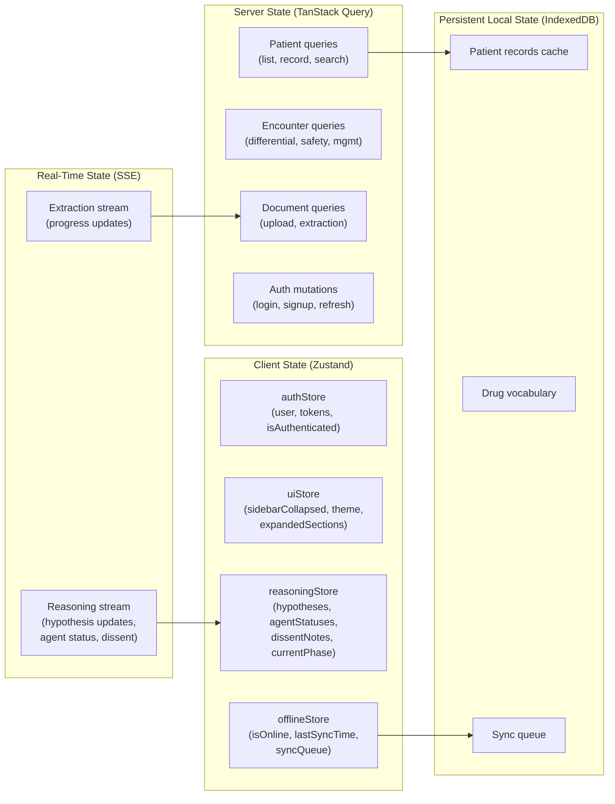
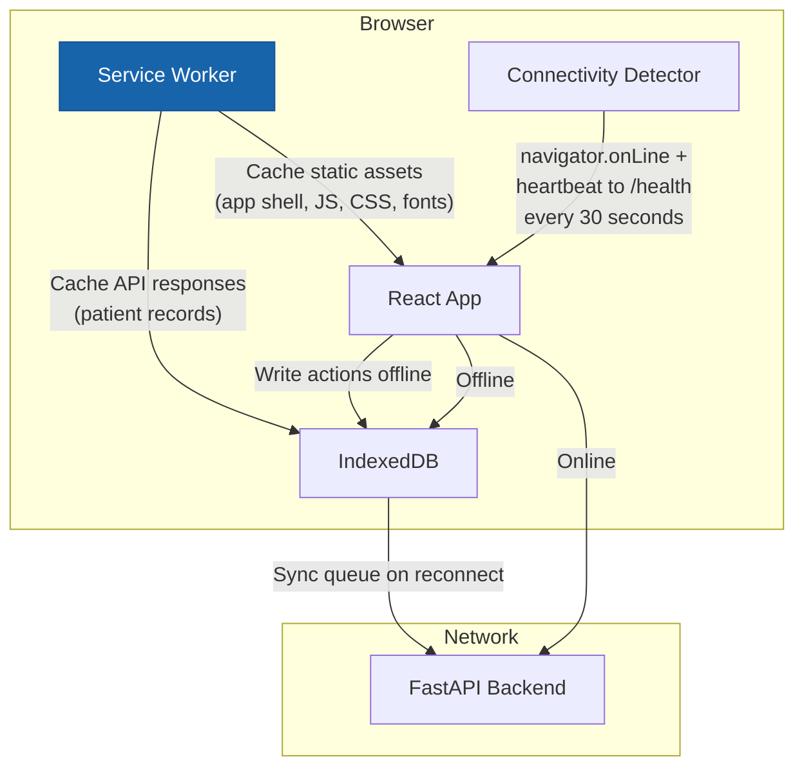
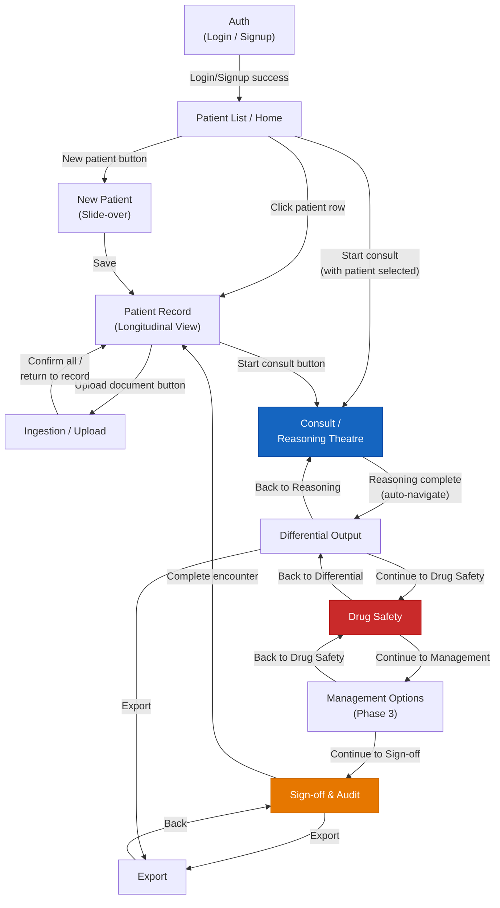

# Aether Clinician -- UI/UX Specification

**Product:** Aether Clinician -- Clinician-Facing Diagnostic & Management Decision-Support System
**Version:** 1.0
**Last Updated:** 2026-06-27
**Status:** Living document
**Audience:** Engineering (frontend), Design, Product, Clinical Safety
**Tech Stack:** Next.js 14 / React 18 / TypeScript, Zustand + TanStack Query, IndexedDB + Service Worker

---

## Table of Contents

1. [Design System](#1-design-system)
2. [Screen Specifications](#2-screen-specifications)
   - [2.1 Auth](#21-auth)
   - [2.2 Patient List / Home](#22-patient-list--home)
   - [2.3 Patient Record (Longitudinal View)](#23-patient-record-longitudinal-view)
   - [2.4 Ingestion / Upload](#24-ingestion--upload)
   - [2.5 Consult / Reasoning Theatre](#25-consult--reasoning-theatre)
   - [2.6 Differential Output](#26-differential-output)
   - [2.7 Drug Safety](#27-drug-safety)
   - [2.8 Management Options](#28-management-options-phase-3)
   - [2.9 Sign-off & Audit](#29-sign-off--audit)
   - [2.10 Export](#210-export)
3. [Component Hierarchy](#3-component-hierarchy)
4. [State Management Approach](#4-state-management-approach)
5. [Responsive Design](#5-responsive-design)
6. [Offline-First UI Patterns](#6-offline-first-ui-patterns)
7. [Anti-Bias UX Mechanisms](#7-anti-bias-ux-mechanisms)
8. [Accessibility](#8-accessibility)
9. [Keyboard Navigation Map](#9-keyboard-navigation-map)
10. [Loading, Error, and Empty States](#10-loading-error-and-empty-states)
11. [Microcopy Guidelines](#11-microcopy-guidelines)
12. [Screen Flow Diagram](#12-screen-flow-diagram)

---

## 1. Design System

### 1.1 Design Principles

| Principle | Rationale |
|---|---|
| **Clean, calm, clinical** | Clinicians work under stress. The UI must reduce cognitive load, not add to it. No decorative gradients, no animation for animation's sake. |
| **High contrast** | Target environments include clinics with mixed lighting -- fluorescent, natural, dim. WCAG AAA contrast ratios (7:1) for body text. |
| **Fast** | Cached record views must render in under 1 second. Every interaction must feel instantaneous or show a meaningful progress signal within 200ms. |
| **Keyboard-first** | Power users navigate faster with keyboard. Every action reachable without a mouse. |
| **Evidence before conclusion** | The most important design constraint: in every clinical output, the evidence is shown before the conclusion. This is an anti-automation-bias safety requirement. |
| **No gimmicks** | No skeleton loaders that mislead about content shape. No auto-playing animations. No tooltip carousels. Clinicians do not need to be entertained. |
| **Offline-aware** | The UI must clearly signal what works offline and what does not, never silently degrade. |

### 1.2 Typography

| Role | Font | Weight | Size | Line Height | Usage |
|---|---|---|---|---|---|
| **UI text** | Inter | 400 (regular), 500 (medium), 600 (semibold) | 14px base | 1.5 | Navigation, labels, buttons, form inputs, metadata |
| **Clinical text** | Source Serif 4 | 400 (regular), 600 (semibold) | 16px base | 1.6 | Patient names, diagnosis names, drug names, evidence narratives, clinical notes |
| **Monospace** | JetBrains Mono | 400 | 13px | 1.4 | Lab values, dosage strings, ICD codes, technical identifiers |
| **Headings (H1)** | Inter | 600 | 24px | 1.3 | Page titles |
| **Headings (H2)** | Inter | 600 | 20px | 1.3 | Section headings |
| **Headings (H3)** | Inter | 500 | 16px | 1.4 | Subsection headings, card titles |
| **Caption** | Inter | 400 | 12px | 1.4 | Timestamps, source annotations, secondary metadata |
| **Demo banner** | Inter | 600 | 13px | 1.0 | Persistent top banner |

**Rationale:** Inter is highly legible at small sizes and renders well on low-resolution displays (target: 1366x768). Source Serif 4 provides visual separation between UI chrome and clinical content, signaling to the clinician that serif text is patient data. The two fonts have compatible x-heights.

**Font loading:** Both fonts are self-hosted (no Google Fonts CDN dependency for offline capability). `font-display: swap` with system font fallbacks: `-apple-system, BlinkMacSystemFont, "Segoe UI", sans-serif` for UI text; `Georgia, "Times New Roman", serif` for clinical text.

### 1.3 Color Palette

#### Core Palette (Light Theme -- Default)

| Token | Hex | Usage |
|---|---|---|
| `--color-bg-primary` | `#FFFFFF` | Page background |
| `--color-bg-secondary` | `#F8F9FA` | Card backgrounds, table alternating rows |
| `--color-bg-tertiary` | `#F1F3F5` | Sidebar backgrounds, inactive tabs |
| `--color-surface` | `#FFFFFF` | Elevated cards, modals |
| `--color-border` | `#DEE2E6` | Borders, dividers |
| `--color-border-strong` | `#ADB5BD` | Emphasized borders |
| `--color-text-primary` | `#212529` | Body text, headings |
| `--color-text-secondary` | `#495057` | Secondary text, labels |
| `--color-text-tertiary` | `#868E96` | Captions, placeholders, timestamps |
| `--color-text-inverse` | `#FFFFFF` | Text on dark backgrounds |

#### Semantic Colors

| Token | Hex | Usage |
|---|---|---|
| `--color-accent` | `#1864AB` | Primary actions, links, focus rings |
| `--color-accent-hover` | `#1351A0` | Hover state for accent |
| `--color-accent-light` | `#D0EBFF` | Accent backgrounds (selected rows, active nav) |
| `--color-success` | `#2B8A3E` | Confirmed extractions, passed verification, healthy values |
| `--color-success-light` | `#D3F9D8` | Success backgrounds |
| `--color-warning` | `#E67700` | Low confidence fields, moderate interactions, amber flags |
| `--color-warning-light` | `#FFF3BF` | Warning backgrounds |
| `--color-danger` | `#C92A2A` | Hard blocks, allergy conflicts, critical abnormals |
| `--color-danger-light` | `#FFE3E3` | Danger backgrounds |
| `--color-info` | `#1864AB` | Informational badges, tooltips |
| `--color-info-light` | `#D0EBFF` | Informational backgrounds |

#### Clinical-Specific Colors

| Token | Hex | Usage |
|---|---|---|
| `--color-cant-miss` | `#E8590C` | Can't-miss sentinel badges and highlights |
| `--color-cant-miss-light` | `#FFF4E6` | Can't-miss background |
| `--color-dissent` | `#862E9C` | Devil's-advocate dissent panel |
| `--color-dissent-light` | `#F3D9FA` | Dissent panel background |
| `--color-confidence-high` | `#2B8A3E` | High confidence band fill |
| `--color-confidence-moderate` | `#1864AB` | Moderate confidence band fill |
| `--color-confidence-low` | `#E67700` | Low confidence band fill |
| `--color-confidence-very-low` | `#C92A2A` | Very low confidence band fill |
| `--color-lab-abnormal-high` | `#C92A2A` | Lab values above reference range |
| `--color-lab-abnormal-low` | `#E67700` | Lab values below reference range |
| `--color-lab-normal` | `#2B8A3E` | Lab values within reference range |
| `--color-reference-band` | `#E9ECEF` | Lab reference range background band |

#### Demo Banner

| Token | Hex | Usage |
|---|---|---|
| `--color-demo-bg` | `#FFF3BF` | Demo banner background |
| `--color-demo-text` | `#5C3D00` | Demo banner text |
| `--color-demo-border` | `#FFD43B` | Demo banner bottom border |

### 1.4 Spacing Scale

The spacing system uses a 4px base unit. All spacing values are multiples of 4px.

| Token | Value | Usage |
|---|---|---|
| `--space-1` | 4px | Inline spacing between icon and label, tight internal padding |
| `--space-2` | 8px | Internal padding (chips, badges), gap between related elements |
| `--space-3` | 12px | Form input padding, small card padding |
| `--space-4` | 16px | Standard card padding, gap between sections |
| `--space-5` | 20px | Medium spacing between components |
| `--space-6` | 24px | Section spacing within a page |
| `--space-8` | 32px | Major section spacing, page side margins |
| `--space-10` | 40px | Page top/bottom padding |
| `--space-12` | 48px | Large section separation |
| `--space-16` | 64px | Maximum spacing (e.g., between major page sections) |

### 1.5 Component Library

#### Buttons

| Variant | Appearance | Usage |
|---|---|---|
| **Primary** | `--color-accent` bg, white text, 8px 16px padding, 6px radius | Primary page actions: "Start consult", "Upload document", "Export" |
| **Secondary** | White bg, `--color-accent` text, 1px `--color-border` border | Secondary actions: "Cancel", "Back", filter toggles |
| **Danger** | `--color-danger` bg, white text | Destructive or blocking actions: "Override (with reason)" |
| **Ghost** | Transparent bg, `--color-text-secondary` text | Tertiary actions, inline actions within cards |
| **Icon** | 32x32px, transparent bg, `--color-text-secondary` icon | Toolbar actions, close buttons |

All buttons: `min-height: 36px`, `font-size: 14px`, `font-weight: 500`, visible focus ring (`2px solid --color-accent`, `2px offset`). Disabled state: `opacity: 0.5`, `cursor: not-allowed`.

#### Cards

| Variant | Usage |
|---|---|
| **Base card** | White bg, 1px `--color-border`, 8px radius, `--space-4` padding, subtle `box-shadow: 0 1px 3px rgba(0,0,0,0.08)` |
| **Diagnostic card** | Base card + left border accent (color varies by confidence band) + expandable evidence sections |
| **Safety card** | Base card + left border (red for hard-block, amber for warning, blue for info) |
| **Confirmation card** | Base card + amber left border + source snippet area + proposed value area |
| **Agent card** | Base card + agent-specific header color + activity indicator |

#### Badges and Chips

| Type | Appearance | Usage |
|---|---|---|
| **Autonomy tier badge** | Rounded pill, colored bg (blue/green/amber) | Informational / Suggestive / Flag-for-review labels |
| **Source chip** | Small rounded pill, `--color-bg-tertiary` bg, underline on hover | Links to source document with highlighted extraction region |
| **Citation chip** | Small rounded pill, `--color-info-light` bg | Inline guideline citations: "ICMR STW: Hypertension, section 3.2" |
| **Can't-miss badge** | `--color-cant-miss` bg, white text, bold | Marks can't-miss sentinel diagnoses |
| **Confidence band** | Horizontal bar with range shading | Shows probability range, not a single number |
| **Status chip** | Rounded pill, status-colored | Active / Resolved for conditions; Queued / Extracting / Confirmed for documents |

#### Form Inputs

| Element | Specification |
|---|---|
| **Text input** | 36px height, 12px horizontal padding, 1px `--color-border`, 6px radius, `--color-bg-primary` bg. Focus: `--color-accent` border, 2px ring. |
| **Textarea** | Same as text input, min-height 80px, resize vertical only. |
| **Select** | Same as text input, custom dropdown arrow. |
| **Checkbox** | 18x18px, 4px radius, `--color-accent` fill when checked. Custom checkmark icon. |
| **Radio** | 18x18px circle, `--color-accent` fill when selected. |
| **Search input** | Text input with left-aligned search icon (16px), right-aligned clear button when populated. |
| **File input** | Hidden native input; custom drag-drop zone or button trigger. |

#### Progress Indicators

| Type | Usage |
|---|---|
| **Determinate bar** | Document extraction progress. Thin (4px) horizontal bar, `--color-accent` fill, percentage label. |
| **Indeterminate bar** | Network requests. Thin (2px) bar at page top, animated left-to-right. |
| **Spinner** | Small (16px) inline operations. Circular, `--color-accent`. Never standalone -- always paired with text label. |
| **Stepped progress** | Reasoning pipeline phases. Horizontal stepper showing: Intake > Hypothesis > Safety > Verification > Output. |

#### Tooltips

| Type | Usage |
|---|---|
| **Informational** | Hover/focus-triggered. Max width 280px. Dark bg (`#212529`), white text, 12px font, 8px padding, 6px radius, 4px arrow. |
| **"Why I'm asking"** | Specific to intake questions. Same style as informational but with a `?` icon trigger. Explains the clinical reasoning behind the question. |

### 1.6 Iconography

Icons: Lucide icon set (open source, consistent, clean). 20px default size, 1.5px stroke width.

| Context | Icon | Notes |
|---|---|---|
| Navigation: Home | `Home` | |
| Navigation: Patients | `Users` | |
| Navigation: Upload | `Upload` | |
| Navigation: Settings | `Settings` | |
| Patient: New | `UserPlus` | |
| Document: Upload | `FileUp` | |
| Document: Camera | `Camera` | |
| Document: PDF | `FileText` | |
| Document: Image | `Image` | |
| Clinical: Medication | `Pill` | |
| Clinical: Lab | `FlaskConical` | |
| Clinical: Condition | `Stethoscope` | |
| Clinical: Allergy | `ShieldAlert` | |
| Safety: Hard block | `OctagonX` | Always red |
| Safety: Warning | `AlertTriangle` | Always amber |
| Safety: Info | `Info` | Always blue |
| Safety: Can't-miss | `Siren` | Always `--color-cant-miss` |
| Dissent: Devil's advocate | `Scale` | Always `--color-dissent` |
| Status: Online | `Wifi` | Green |
| Status: Offline | `WifiOff` | Red |
| Status: Syncing | `RefreshCw` | Animated rotation |
| Action: Expand | `ChevronDown` | |
| Action: Collapse | `ChevronUp` | |
| Action: Close | `X` | |
| Action: Search | `Search` | |
| Action: Export | `Download` | |
| Action: Edit | `Pencil` | |
| Action: Confirm | `Check` | |
| Action: Flag | `Flag` | |
| Reasoning: Agent active | `Loader2` | Animated rotation |
| Reasoning: Agent complete | `CheckCircle` | |
| Source: Link to document | `ExternalLink` | |

### 1.7 Elevation and Shadows

| Level | Shadow | Usage |
|---|---|---|
| **Level 0** | None | Flat surfaces, table rows |
| **Level 1** | `0 1px 3px rgba(0,0,0,0.08)` | Cards, raised panels |
| **Level 2** | `0 4px 12px rgba(0,0,0,0.12)` | Dropdowns, popovers |
| **Level 3** | `0 8px 24px rgba(0,0,0,0.16)` | Modals, dialogs |

### 1.8 Animation and Motion

Animations are minimal and purposeful. They exist only to communicate state changes, never for decoration.

| Animation | Duration | Easing | Usage |
|---|---|---|---|
| **Card entrance** | 150ms | `ease-out` | New diagnostic cards, confirmation cards appearing |
| **Expand/collapse** | 200ms | `ease-in-out` | Evidence sections, detail panels |
| **Confidence bar update** | 300ms | `ease-out` | Hypothesis confidence changing during reasoning |
| **Fade in** | 150ms | `ease-out` | Toast notifications, status changes |
| **Spinner rotation** | 1000ms | `linear`, infinite | Loading spinners |

All animations respect `prefers-reduced-motion: reduce`. When reduced motion is preferred, all animations are replaced with instant state changes (0ms duration).

### 1.9 Layout Grid

| Breakpoint | Min Width | Columns | Gutter | Margin |
|---|---|---|---|---|
| **Desktop** | 1366px | 12 | 24px | 32px |
| **Tablet** | 768px | 8 | 16px | 24px |
| **Mobile** | 360px | 4 | 16px | 16px |

Content max-width: 1440px, centered on larger screens.

---

## 2. Screen Specifications

### 2.1 Auth

**Purpose:** Account creation and login. Minimal friction entry point to the application. Persistent "Demo build" indicator.

**Route:** `/auth/login`, `/auth/signup`

#### Layout Description

Centered single-column layout. The page has three vertical sections:

1. **Demo banner** (pinned to viewport top): Full-width amber bar, 40px height, centered text: "Demo build -- decision-support only, not for real patient care."
2. **Auth card**: Centered vertically and horizontally. Max-width 400px, `--space-8` padding, Level 1 shadow. Contains:
   - Product wordmark (text-based, no logo image): "Aether Clinician" in Inter 600, 24px.
   - Subtitle: "Clinical Decision Support" in Inter 400, 14px, `--color-text-secondary`.
   - Tab toggle: "Log in" / "Sign up" (underline active indicator).
   - Form fields (login): Email, Password, "Log in" primary button.
   - Form fields (signup): Full name, Email, Password, "Create account" primary button.
   - Divider line with "or" text.
   - "Continue as demo user" ghost button (when `DEMO_MODE=true`).
3. **Footer text**: "This is a clinical decision-support tool. It does not replace clinical judgment." Caption-sized text, centered below the card.

#### Key Interactions

- Tab toggle between Login and Signup is instantaneous (no page reload, client-side state toggle).
- Form validation is inline: red border + error message below field on blur.
- Password field has a show/hide toggle (eye icon).
- On successful login/signup: redirect to Patient List (`/`).
- "Continue as demo user" creates a transient session with pre-seeded demo data.
- `Enter` key submits the active form.

#### Component Breakdown

```
AuthPage
  DemoBanner
  AuthCard
    ProductWordmark
    TabToggle (login | signup)
    LoginForm | SignupForm
      TextInput (email)
      PasswordInput (password)
      TextInput (name) -- signup only
      PrimaryButton (submit)
    Divider
    GhostButton (demo user) -- conditional on DEMO_MODE
  FooterDisclaimer
```

#### State Requirements

- `authForm`: `{ mode: 'login' | 'signup', email: string, password: string, name: string, errors: Record<string, string>, isSubmitting: boolean }`
- Server state: TanStack Query mutation for `POST /auth/login` and `POST /auth/signup`.
- On success: tokens stored in httpOnly cookies (handled by API response), user object stored in Zustand `authStore`.

#### Edge Cases

| Scenario | Behavior |
|---|---|
| Invalid credentials | Inline error: "Invalid email or password." No indication of which field is wrong (security). |
| Email already registered (signup) | Inline error: "An account with this email already exists." |
| Network offline at login | Error message: "Unable to reach the server. Check your connection and try again." |
| Password too short | Inline error below password field: "Password must be at least 8 characters." |
| Session expired, redirected to login | Subtle info bar above form: "Your session has expired. Please log in again." |

---

### 2.2 Patient List / Home

**Purpose:** Landing page after authentication. Searchable patient list with quick access to start a new consult. Shows recent activity.

**Route:** `/`

#### Layout Description

Full-width page with the persistent app shell:

**App Shell** (present on all authenticated pages):
- **Demo banner** (top, fixed): Full-width amber bar, same as auth page.
- **Header bar** (below demo banner, fixed): 56px height. Contains:
  - Left: Product wordmark (clickable, navigates to home).
  - Center: Global search input (search patients by name).
  - Right: Network status indicator (wifi icon, green/red) + User avatar/initials dropdown.
- **Sidebar** (left, fixed): 240px width on desktop. Navigation links: Home, Patients, Upload, Settings. Collapsible to 56px icon-only sidebar. Active link highlighted with `--color-accent-light` bg.

**Page content** (scrollable, right of sidebar):

1. **Page header row**: "Patients" heading (H1) + "New patient" primary button (right-aligned) + "Start a consult" primary button (prominent, larger than New patient).
2. **Search and filter bar**: Full-width search input with filter chips (All / Active / Recent). Patient count label: "142 patients".
3. **Patient list** (table layout on desktop, card layout on mobile):
   - Columns: Name (serif, 16px), Age/Sex, Last visit date, Active conditions (truncated chips), Status indicator, Actions (three-dot menu).
   - Rows are clickable -- navigates to Patient Record.
   - Sorted by last interaction date (most recent first) by default.
   - Alternating row background (`--color-bg-secondary`).
4. **Recent activity feed** (right column on desktop, below list on mobile): Compact list of recent actions -- "Extraction complete for [patient]", "Consult completed for [patient]", "Document uploaded for [patient]". Each item is timestamped and clickable.

#### Key Interactions

- **Search**: Debounced (300ms) search-as-you-type. Highlights matching text in results.
- **New patient button**: Opens a slide-over panel from the right with a minimal patient creation form (name, date of birth, sex). On save, navigates to the new patient's record.
- **Start a consult button**: If a patient is selected (row highlighted), navigates directly to `Consult / Reasoning Theatre` for that patient. If no patient is selected, opens a patient-picker modal.
- **Row click**: Navigates to Patient Record (`/patients/[id]/record`).
- **Three-dot menu**: Options: "View record", "Start consult", "Upload document".
- **Pagination**: Cursor-based, "Load more" button at bottom of list (not infinite scroll -- gives clinician control).
- **Keyboard**: `j`/`k` to move between rows, `Enter` to open selected row, `/` to focus search, `n` to open new patient panel.

#### Component Breakdown

```
PatientListPage
  AppShell
    DemoBanner
    HeaderBar
      ProductWordmark
      GlobalSearch
      NetworkStatusIndicator
      UserMenu
    Sidebar
      NavLink (Home)
      NavLink (Patients)
      NavLink (Upload)
      NavLink (Settings)
  PageHeader
    Heading ("Patients")
    ButtonGroup
      PrimaryButton ("New patient")
      PrimaryButton ("Start a consult") -- prominent variant
  SearchFilterBar
    SearchInput
    FilterChips (All | Active | Recent)
    PatientCount
  PatientTable
    PatientRow (repeated)
      PatientName
      PatientAge
      LastVisitDate
      ConditionChips
      StatusIndicator
      RowActionMenu
  LoadMoreButton
  RecentActivityFeed
    ActivityItem (repeated)
  NewPatientSlideOver (conditional)
    PatientForm
```

#### State Requirements

- **Server state** (TanStack Query):
  - `usePatients(search, filter, cursor)`: Paginated patient list. Stale time: 30s.
  - `useRecentActivity()`: Recent activity feed. Stale time: 60s.
  - `useCreatePatient()`: Mutation for new patient creation.
- **Client state** (Zustand):
  - `selectedPatientId`: Currently highlighted row.
  - `sidebarCollapsed`: Boolean.
- **Offline**: Patient list cached in IndexedDB. Stale cache indicator shown when offline: "Showing cached data from [timestamp]".

#### Edge Cases

| Scenario | Behavior |
|---|---|
| Empty state (no patients) | Centered illustration-free message: "No patients yet. Create your first patient to get started." + "New patient" button. |
| Search with no results | "No patients match '[query]'. Try a different search." |
| Offline | Patient list loads from IndexedDB cache. "New patient" works (queued for sync). "Start a consult" disabled with tooltip: "Consults require an internet connection for AI reasoning." |
| Slow network | Skeleton rows (plain gray blocks, not shaped to imply specific content structure) shown for up to 3 seconds. After 3s, timeout message. |

---

### 2.3 Patient Record (Longitudinal View)

**Purpose:** Display a patient's complete medical history assembled from all ingested documents. Three primary regions: medication timeline, lab trends, and conditions/allergies. Every datum links to its source document.

**Route:** `/patients/[id]/record`

#### Layout Description

Full-width page within the app shell. The page header contains:

- **Patient identity bar**: Patient name (serif, 20px), age, sex, patient ID. Right side: "Start consult" button, "Upload document" button.
- **Tab navigation**: Horizontal tabs -- "Timeline" (default), "Documents", "Encounters".

Below the tabs, three stacked regions (each is a collapsible section with a section heading):

##### Region A: Medication Timeline

A horizontal scrollable timeline. The x-axis is time (dates). Each medication is a horizontal bar:

- **Bar**: Colored track (`--color-accent`) from start date to end date (or "ongoing" arrow if no end date).
- **Label**: Drug name (generic, serif font) + dose + frequency, positioned above or to the left of the bar.
- **Markers on bar**: Small circles at dose-change events. Hover to see old dose and new dose.
- **Source chip**: Small `--color-bg-tertiary` pill at the start of each bar. Click to open the source document viewer with the extraction region highlighted.
- **Zoom controls**: Zoom in/out on the time axis. Pan left/right. Default view: last 12 months.
- **Active medications**: Bold track. Discontinued medications: dashed track, `--color-text-tertiary` label.

Layout: The timeline scrolls horizontally. Medications are stacked vertically, grouped by therapeutic class when there are more than 10. A minimap at the bottom shows the full timeline extent with the current viewport highlighted.

##### Region B: Lab Trends

Each lab marker gets a row. The row contains:

- **Marker name** (left, fixed): e.g., "HbA1c", "Creatinine", "Hemoglobin". Serif font, 14px.
- **Sparkline chart** (center): Small (120px x 40px) line chart showing all historical values. The reference range is shown as a green-tinted band behind the line. Points outside the reference range are colored: red above, amber below.
- **Latest value** (right, fixed): Current value in monospace font, colored by status (green/amber/red).
- **Expand control**: Chevron to expand into a full-width detailed chart (300px height) with:
  - Labeled axes (value on y, date on x).
  - Reference range bands with labels ("Normal: 4.0--6.0 %").
  - Individual data points (circles) -- hover for exact value, date, and source document link.
  - Trend line.

Layout: Rows are sorted by clinical relevance (abnormal values first), then alphabetically. A filter dropdown allows showing: All / Abnormal only / By category (hematology, metabolic, renal, hepatic, etc.).

##### Region C: Conditions & Allergies Rail

A vertical list divided into two sub-sections:

**Conditions:**
- Each condition: Name (serif, bold for active, regular for resolved) + status chip ("Active" green, "Resolved" gray) + onset date + source chip.
- Sorted: Active first, then resolved. Within each group, sorted by onset date (most recent first).

**Allergies:**
- Each allergy: Substance name (serif, bold) + reaction description + severity badge ("Severe" red, "Moderate" amber, "Mild" blue) + source chip.
- Allergies are always visible, never hidden behind a "Show more" toggle (safety requirement).

#### Source Linking

Every datum (medication entry, lab value, condition, allergy) has a **source chip** -- a small clickable pill labeled "Source" or showing the document type icon. Clicking the source chip opens a **document viewer modal**:

- Left panel: The original document (image or PDF rendered in-browser).
- The extraction region is highlighted with a translucent amber overlay and a bounding box.
- Right panel: The extracted data fields with the specific field that was clicked highlighted.

#### Key Interactions

- **Medication timeline panning**: Click and drag, or left/right arrow keys while timeline is focused.
- **Lab sparkline click**: Expands that row to full detail chart. Click again or `Escape` to collapse.
- **Source chip click**: Opens document viewer modal.
- **Section collapse**: Each region (Medications, Labs, Conditions/Allergies) can be collapsed via the section heading chevron. State is persisted per user.
- **Print/export**: A "Print view" button reformats the page for A4 printing (linearized layout, no interactive elements).

#### Component Breakdown

```
PatientRecordPage
  PatientIdentityBar
    PatientName
    PatientDemographics (age, sex)
    ButtonGroup
      PrimaryButton ("Start consult")
      SecondaryButton ("Upload document")
  TabNavigation (Timeline | Documents | Encounters)
  TimelineView
    MedicationTimeline
      TimelineAxis (date scale)
      MedicationTrack (repeated)
        DrugLabel (name, dose, frequency)
        TimelineBar (start, end, dose-change markers)
        SourceChip
      TimelineMinimap
      ZoomControls
    LabTrendsSection
      LabFilterDropdown
      LabRow (repeated)
        MarkerName
        Sparkline
        LatestValue
        ExpandButton
        DetailChart (conditional, expanded)
          ChartAxes
          ReferenceRangeBand
          DataPoints
          TrendLine
    ConditionsAllergiesRail
      ConditionsList
        ConditionItem (repeated)
          ConditionName
          StatusChip
          OnsetDate
          SourceChip
      AllergiesList
        AllergyItem (repeated)
          SubstanceName
          ReactionDescription
          SeverityBadge
          SourceChip
  DocumentViewerModal (conditional)
    DocumentPreview (image/PDF)
    ExtractionHighlight
    ExtractedDataPanel
```

#### State Requirements

- **Server state** (TanStack Query):
  - `usePatientRecord(patientId)`: Full longitudinal record. Stale time: 5 minutes. Cached in IndexedDB for offline access.
  - `useDocument(docId)`: Individual document for source viewer. Cached in IndexedDB.
- **Client state** (Zustand):
  - `expandedLabRows: Set<string>`: Which lab rows are in expanded detail view.
  - `timelineZoom: { start: Date, end: Date }`: Current timeline viewport.
  - `collapsedSections: Set<string>`: Which sections are collapsed.
  - `documentViewerState: { open: boolean, docId: string, highlightRegion: BoundingBox }`.
- **Offline**: Full patient record available from IndexedDB. All interactions work. Source documents viewable if previously cached.

#### Edge Cases

| Scenario | Behavior |
|---|---|
| No medications | Section shows: "No medications recorded. Upload a prescription to get started." |
| No lab results | Section shows: "No lab results recorded." |
| No conditions/allergies | Section shows: "No conditions or allergies recorded." |
| Conflicting medication entries | Both entries shown with amber highlight and a note: "Potential conflict -- verify with source documents." |
| Very long medication history (>50 entries) | Timeline groups by therapeutic class; individual entries visible on zoom. |
| Lab value with no reference range | Sparkline rendered without reference band. Value shown in neutral color. |
| Source document not cached (offline) | Source chip shows tooltip: "Source document unavailable offline." |

---

### 2.4 Ingestion / Upload

**Purpose:** Upload clinical documents (prescriptions, lab reports, discharge summaries) for extraction. Show live extraction progress. Present confirmation cards for low-confidence fields.

**Route:** `/patients/[id]/documents/upload`

#### Layout Description

Single-column layout within the app shell, max-width 800px, centered.

1. **Upload zone**: Large dashed-border area (200px height) centered on the page:
   - Drag-drop target: "Drop files here or click to browse" text + file icon. Accepts PDF, JPEG, PNG (up to 20MB per file).
   - Below the drop zone: Two buttons side by side -- "Browse files" (secondary button) + "Take photo" (secondary button with camera icon). The camera button triggers the device camera via `getUserMedia`.
   - **Batch upload support**: Multiple files can be dropped or selected. Each file appears as a queued item below.

2. **Upload queue** (below upload zone): Vertical list of upload items. Each item is a card:
   - **Queued state**: File name, file size, file type icon, "Remove" ghost button.
   - **Uploading state**: File name + determinate progress bar (percentage).
   - **Extracting state**: File name + stepped progress indicator showing extraction phases: "Analyzing document..." > "Extracting medications..." > "Extracting lab values..." > "Validating...". Progress updates via SSE from `GET /documents/{id}/extraction/stream`.
   - **Confirmation state**: Extraction complete. Card expands to show confirmation interface (see below).
   - **Confirmed state**: Green check, file name, "View in record" link.
   - **Failed state**: Red alert icon, file name, error message, "Retry" button.

3. **Confirmation cards** (within each upload item in confirmation state):
   Each low-confidence field (confidence < 0.85) gets its own confirmation card. The card has two columns:
   - **Left column (Source snippet)**: Cropped region of the original document showing the area from which the value was extracted. The relevant text/region is highlighted with an amber bounding box.
   - **Right column (Proposed value)**: The extracted value in an editable form field. Below the field: confidence indicator (horizontal bar, colored by confidence level) + the label "Confidence: [band]".
   - **Actions per field**: "Confirm" (check icon), "Edit" (the field is editable), "Not in document" (flag icon).
   - **High-confidence fields** (>= 0.85): Shown in a compact list above the low-confidence cards with green check marks. Expandable if the clinician wants to review.
   - **Bottom actions**: "Confirm all" button (only enabled when all fields are reviewed), "Reject & enter manually" ghost button.

#### Key Interactions

- **Drag and drop**: Visual feedback on drag-over (border turns `--color-accent`, background tints `--color-accent-light`).
- **Camera capture**: Opens camera viewfinder in a modal. Capture button takes photo. Photo added to upload queue.
- **Progress streaming**: Extraction progress updates arrive via SSE. The UI updates the progress indicator in real-time.
- **Source snippet hover**: Hovering over the source snippet zooms it to 150% for legibility.
- **Field editing**: Clicking an extracted value makes it editable inline. On blur or Enter, the edit is saved locally.
- **Confirm all**: Only enabled after every low-confidence field has been confirmed or edited. Triggers `POST /documents/{id}/approve`.
- **Batch workflow**: Multiple files process in parallel. Each file has independent progress and confirmation.

#### Component Breakdown

```
UploadPage
  PageHeader
    Heading ("Upload Documents")
    PatientName (context)
  UploadZone
    DragDropArea
    ButtonGroup
      SecondaryButton ("Browse files")
      SecondaryButton ("Take photo")
  UploadQueue
    UploadItem (repeated)
      QueuedState | UploadingState | ExtractingState | ConfirmationState | ConfirmedState | FailedState
      ConfirmationState:
        HighConfidenceFieldList
          FieldItem (compact, green check)
        LowConfidenceFieldList
          ConfirmationCard (repeated)
            SourceSnippet (cropped document region)
            ProposedValueField (editable input)
            ConfidenceBar
            FieldActions (Confirm | Edit | Not in document)
        BottomActions
          PrimaryButton ("Confirm all")
          GhostButton ("Reject & enter manually")
  CameraCaptureModal (conditional)
    CameraViewfinder
    CaptureButton
```

#### State Requirements

- **Server state** (TanStack Query):
  - `useUploadDocument()`: Mutation for `POST /documents/upload`.
  - `useExtractionStream(docId)`: SSE subscription for extraction progress.
  - `useApproveExtraction(docId)`: Mutation for `POST /documents/{id}/approve`.
- **Client state** (Zustand or local component state):
  - `uploadQueue: UploadItem[]`: List of files being uploaded/processed.
  - `fieldEdits: Record<string, Record<string, string>>`: Per-document, per-field edits.
  - `confirmedFields: Record<string, Set<string>>`: Per-document set of confirmed field names.

#### Edge Cases

| Scenario | Behavior |
|---|---|
| File too large (>20MB) | Rejected immediately with inline error: "File exceeds the 20 MB size limit." |
| Unsupported file type | Rejected immediately: "Unsupported file type. Upload PDF, JPEG, or PNG files." |
| Extraction fails (all attempts) | Card shows red state: "Could not extract data from this document. You can enter data manually or try uploading a clearer image." + "Enter manually" button + "Retry" button. |
| Very low confidence (<0.50) | Field shown with red confidence bar and label: "Low confidence -- manual review recommended." Field is pre-filled but highlighted more aggressively. |
| Duplicate document (same file hash) | Info banner: "This document was previously uploaded on [date]. Previous extraction results are shown." |
| Offline | Upload is queued locally. Banner: "You're offline. Documents will be uploaded and processed when you reconnect." Progress indicators show "Queued for upload". |
| Camera not available | Camera button disabled with tooltip: "Camera not available on this device." |

---

### 2.5 Consult / Reasoning Theatre

**Purpose:** THE SIGNATURE SCREEN. Conduct an adaptive intake conversation and watch the multi-agent reasoning engine work in real-time. Three-panel layout: intake on the left, live reasoning in the center, dissent on the right.

**Route:** `/patients/[id]/encounter/new`

#### Layout Description

Three-panel horizontal layout, full viewport height (minus header and demo banner). No scrollbar on the outer container -- each panel scrolls independently.

##### Left Panel: Intake (320px fixed width)

1. **Presenting complaint input** (top): Large textarea (120px height) with placeholder: "What is the patient presenting with today?" Submit via `Enter` (with Shift+Enter for newlines) or "Begin" primary button.
2. **Adaptive intake conversation** (below, scrollable): A conversation-style interface. Questions appear one at a time from the system, answers come from the clinician:
   - **System question**: Left-aligned card with `--color-bg-secondary` background. The question text is in serif font. Below the question text: a small "Why I'm asking" link that expands a tooltip explaining the clinical reasoning.
   - **Answer input**: Depending on question type:
     - Free-text: Text input + submit button.
     - Yes/No: Two buttons side by side.
     - Options: Radio button group or checkbox group.
     - Free-text with suggestions: Text input with autocomplete dropdown.
   - **Clinician answer**: Right-aligned card with `--color-accent-light` background, showing the submitted answer.
   - Questions arrive via SSE stream. New questions animate in from the bottom (150ms, `ease-out`).
3. **Intake progress**: Below the conversation, a subtle progress indicator showing information gain. Text: "Gathering information... [N] questions asked." When intake is complete: "Intake complete. Reasoning in progress."

##### Center Panel: Live Reasoning (flexible width, fills remaining space)

THE CORE OF THE REASONING THEATRE. This panel shows the agent team's evolving hypotheses in real-time.

1. **Phase stepper** (top, fixed within panel): Horizontal stepper showing current phase: "Intake" > "Hypothesis Generation" > "Safety Checks" > "Verification" > "Output". Active phase highlighted, completed phases have green checkmarks.
2. **Hypothesis list** (scrollable):
   - Each hypothesis is a card that appears and updates as specialist agents report in.
   - **Hypothesis card** contains:
     - Diagnosis name (serif, 16px, bold).
     - **Confidence band**: A horizontal range bar (not a percentage). The bar is colored by band (green for HIGH, blue for MODERATE, amber for LOW, red for VERY_LOW). The bar shows a range, not a single point.
     - **Source agent labels**: Small chips showing which specialist agents proposed this hypothesis (e.g., "Internal Medicine", "Cardiology").
     - The card layout prioritizes information density without clutter.
   - Cards are sorted by confidence band (HIGH first, then MODERATE, LOW, VERY_LOW). Within the same band, sorted by number of supporting agents.
   - **Live updates**: As new agent results arrive via SSE, hypothesis cards animate their confidence bars smoothly (300ms transition). New hypotheses fade in. Cards reorder with smooth animation.
   - **Can't-miss badge**: Hypotheses flagged by the Can't-Miss Sentinel have a prominent badge: `Siren` icon + "Can't miss" label in `--color-cant-miss`. These remain visible even if confidence is low.
3. **Agent activity indicators** (bottom of panel): A horizontal row of small agent status indicators. Each agent is a small card (icon + name + status). Statuses: "Waiting" (gray), "Active" (animated spinner + blue), "Complete" (green check), "Error" (red x). Shows which agents are currently processing.

##### Right Panel: Dissent Feed (280px fixed width)

**This panel is ALWAYS visible. It cannot be collapsed, hidden, or minimized. This is a non-negotiable anti-bias requirement.**

1. **Panel header**: "Counterpoints" heading with `Scale` icon in `--color-dissent`.
2. **Devil's-advocate notes** (scrollable): As the Devil's-Advocate Agent produces output, notes appear here as cards with `--color-dissent-light` background and a left border in `--color-dissent`:
   - Each note targets a specific hypothesis (named at the top of the note).
   - The note body explains the counter-evidence or alternative explanation in clinical language (serif font).
   - Notes are ordered by the hypothesis they target (top hypothesis first).
3. **Can't-miss sentinel notes**: Cards with `--color-cant-miss-light` background and `--color-cant-miss` left border:
   - Each note describes a dangerous condition to consider, even if not in the leading hypotheses.
   - `Siren` icon + "Can't-miss consideration" label.
4. If no dissent has been generated yet (agents still running): Placeholder text: "Counter-evidence will appear here as the reasoning team works."

#### Key Interactions

- **Presenting complaint submission**: Submitting the complaint initiates the reasoning session. An SSE connection is opened to `GET /encounters/{id}/reasoning/stream`.
- **Answering intake questions**: Each answer is sent via `POST /encounters/{id}/intake/answer`. The system responds with the next question (or marks intake as complete) via SSE.
- **Real-time hypothesis updates**: All updates arrive via SSE. The UI applies them to a local state reducer that maintains the current hypothesis list.
- **Clicking a hypothesis card**: Does NOT navigate away. Instead, highlights the card and shows a brief evidence summary below the card (inline expand). The full evidence is shown on the Differential Output screen.
- **Keyboard**: `Tab` cycles between the three panels. Within the intake panel, `Enter` submits an answer. `Escape` cancels an in-progress answer edit.

#### Component Breakdown

```
ConsultPage (three-panel layout)
  LeftPanel (320px)
    PresentingComplaintInput
      Textarea
      PrimaryButton ("Begin")
    IntakeConversation
      SystemQuestion (repeated)
        QuestionText
        WhyImAskingTooltip
      AnswerInput (varies by question type)
        FreeTextInput | YesNoButtons | OptionsGroup | AutocompleteInput
      ClinicianAnswer (repeated)
    IntakeProgressIndicator
  CenterPanel (flex)
    PhaseStepper
      PhaseStep (repeated: Intake, Hypothesis, Safety, Verification, Output)
    HypothesisList
      HypothesisCard (repeated)
        DiagnosisName
        ConfidenceBand (range bar)
        SourceAgentChips
        CantMissBadge (conditional)
        InlineEvidenceSummary (conditional, on click)
    AgentActivityRow
      AgentStatusIndicator (repeated, one per agent)
  RightPanel (280px, NON-COLLAPSIBLE)
    PanelHeader ("Counterpoints")
    DissentFeed
      DevilsAdvocateNote (repeated)
        TargetHypothesis
        CounterEvidenceText
      CantMissSentinelNote (repeated)
        ConditionName
        RationaleText
    PlaceholderText (conditional, when no dissent yet)
```

#### State Requirements

- **Server state** (TanStack Query):
  - `useCreateEncounter(patientId)`: Mutation to create encounter and get `encounterId`.
  - `useSubmitComplaint(encounterId)`: Mutation to submit presenting complaint.
  - `useSubmitAnswer(encounterId)`: Mutation to submit intake answer.
- **Client state** (Zustand -- `reasoningStore`):
  - `sseConnection: EventSource | null`: Active SSE connection.
  - `currentPhase: 'intake' | 'hypothesis' | 'safety' | 'verification' | 'output'`: Current pipeline phase.
  - `intakeQuestions: IntakeQuestion[]`: Accumulated intake questions.
  - `intakeAnswers: IntakeAnswer[]`: Accumulated intake answers.
  - `hypotheses: Hypothesis[]`: Current hypothesis list (updated by SSE).
  - `agentStatuses: Record<AgentName, AgentStatus>`: Status of each agent.
  - `dissentNotes: DissentNote[]`: Devil's-advocate and can't-miss notes.
  - `isIntakeComplete: boolean`.
  - `isReasoningComplete: boolean`.
- **SSE event types consumed**:
  - `intake_question`: New intake question.
  - `intake_complete`: Intake phase done.
  - `hypothesis_update`: Hypothesis added or confidence updated.
  - `agent_status`: Agent started/completed/errored.
  - `dissent_note`: New devil's-advocate or can't-miss note.
  - `phase_change`: Pipeline phase transition.
  - `reasoning_complete`: Full pipeline done, navigate to Differential Output.

#### Edge Cases

| Scenario | Behavior |
|---|---|
| SSE connection drops | Reconnect with exponential backoff (1s, 2s, 4s). During reconnection: amber banner at top of center panel: "Connection interrupted. Reconnecting..." On reconnect, request full state from `GET /encounters/{id}/reasoning/state`. |
| Agent fails mid-reasoning | Agent status indicator turns red. Note in center panel: "The [agent name] could not complete its analysis. Results may be incomplete." Reasoning continues with remaining agents. |
| Clinician submits empty complaint | Inline error: "Please describe the presenting complaint." |
| Very long reasoning (>2 min) | After 90 seconds, show subtle message: "The reasoning team is still working. Complex cases may take up to 2 minutes." |
| Offline when starting consult | "Start consult" button disabled. Tooltip: "Consults require an internet connection for AI reasoning." |
| Connection lost mid-consult | Reasoning pauses. Banner: "Connection lost. Reasoning will resume when you reconnect. Your intake answers have been saved." |
| No dissent generated | Right panel shows: "No counter-evidence was identified for the current hypotheses." (This is rare and itself noteworthy.) |

---

### 2.6 Differential Output

**Purpose:** Display the final ranked differential diagnosis. Each diagnosis card shows evidence for, evidence against (expanded by default -- evidence before conclusion), can't-miss badges, and agent-disagreement strips. Below: next-best-test recommendations.

**Route:** `/patients/[id]/encounter/[encounterId]/differential`

#### Layout Description

Single-column layout, max-width 900px, centered. The clinician arrives here after reasoning completes (auto-navigated from Reasoning Theatre).

1. **Page header**: "Differential Diagnosis" heading + autonomy tier badge (Informational / Suggestive / Flag-for-review) + encounter date.

2. **Diagnostic cards** (vertical stack): Each diagnosis is a card. Cards are ordered by confidence band (highest first). CRITICAL LAYOUT REQUIREMENT: Evidence sections are expanded by default and appear ABOVE the diagnosis conclusion.

   **Diagnostic card anatomy (top to bottom):**

   a. **Evidence For section** (expanded by default): `--color-success-light` background. Heading: "Evidence supporting this diagnosis" (serif, green text). Bulleted list of evidence items. Each item cites patient data with a source chip.

   b. **Evidence Against section** (expanded by default): `--color-danger-light` background. Heading: "Evidence against this diagnosis" (serif, red text). Bulleted list of counter-evidence items. Each item cites patient data with a source chip.

   c. **Diagnosis conclusion**: Diagnosis name (serif, 18px, bold) + confidence band (range bar, not a percentage) + ICD code (monospace, caption size).

   d. **Can't-miss badge** (conditional): If flagged by the Can't-Miss Sentinel, a prominent badge appears: `Siren` icon + "Can't-miss -- requires acknowledgment" in `--color-cant-miss`.

   e. **Agent-disagreement strip** (conditional): When specialist agents disagreed on this diagnosis, a horizontal strip shows each agent's position:
      - Agent name + their assessment (e.g., "Internal Medicine: HIGH", "Cardiology: LOW").
      - Visually distinct: `--color-bg-tertiary` background, dashed border, `--color-text-secondary` text.
      - Label: "The specialist panel was divided on this diagnosis."

   f. **Card footer**: Source agent chips + autonomy tier badge for this specific diagnosis.

3. **Next Best Test panel** (below all diagnostic cards): A distinct section with heading "Recommended Next Investigation":
   - **Test name** (serif, bold).
   - **Rationale** (one line): Why this test discriminates best between the top hypotheses.
   - **Cost framing**: Estimated cost range in INR.
   - **Local availability**: Badge -- "Available at PHC" (green), "Requires CHC" (amber), "Requires District Hospital" (red).
   - If multiple tests are recommended, they are ordered by discriminating power.

4. **Action bar** (bottom, sticky): "Continue to Drug Safety" primary button + "Back to Reasoning" ghost button + "Export" secondary button.

#### Key Interactions

- **Evidence sections are NOT collapsible by default.** The clinician sees all evidence before processing the conclusion. A small "Collapse" toggle is available per section but defaults to expanded. (This is the anti-automation-bias design.)
- **Source chip click**: Opens document viewer modal (same as Patient Record).
- **Can't-miss acknowledgment**: If a can't-miss diagnosis is present, the clinician cannot proceed to Drug Safety without clicking "I have reviewed this can't-miss consideration" checkbox on each can't-miss card.
- **Continue to Drug Safety**: Navigates to Drug Safety screen. Disabled if can't-miss acknowledgments are pending.

#### Component Breakdown

```
DifferentialOutputPage
  PageHeader
    Heading ("Differential Diagnosis")
    AutonomyTierBadge
    EncounterDate
  DiagnosticCardList
    DiagnosticCard (repeated, ordered by confidence)
      EvidenceForSection (expanded by default)
        EvidenceHeading
        EvidenceItem (repeated)
          EvidenceText
          SourceChip
      EvidenceAgainstSection (expanded by default)
        EvidenceHeading
        EvidenceItem (repeated)
          EvidenceText
          SourceChip
      DiagnosisConclusion
        DiagnosisName
        ConfidenceBand
        ICDCode
      CantMissBadge (conditional)
        AcknowledgeCheckbox
      AgentDisagreementStrip (conditional)
        AgentPosition (repeated)
      CardFooter
        SourceAgentChips
        AutonomyTierBadge
  NextBestTestPanel
    TestName
    Rationale
    CostEstimate
    AvailabilityBadge
  ActionBar (sticky bottom)
    PrimaryButton ("Continue to Drug Safety")
    GhostButton ("Back to Reasoning")
    SecondaryButton ("Export")
```

#### State Requirements

- **Server state** (TanStack Query):
  - `useEncounterDifferential(encounterId)`: Full differential diagnosis data. Includes hypotheses, evidence, agent disagreements, verifier verdicts, next-best-test recommendations.
- **Client state** (local):
  - `cantMissAcknowledged: Set<string>`: Set of can't-miss diagnosis IDs that have been acknowledged.
  - `collapsedEvidence: Record<string, { for: boolean, against: boolean }>`: Per-card evidence section collapse state (defaults to all expanded).

#### Edge Cases

| Scenario | Behavior |
|---|---|
| Single hypothesis (no differential) | Card shown alone with note: "Only one hypothesis met the confidence threshold. Consider whether additional data could reveal other possibilities." |
| All hypotheses low confidence | Amber banner at top: "All hypotheses have low confidence. Consider gathering additional clinical information." |
| No evidence against (for a hypothesis) | Section shows: "No specific counter-evidence identified. This does not confirm the diagnosis." |
| No next best test | Section shows: "No additional investigations are recommended at this time." |
| Agent disagreement on all hypotheses | Each card shows its disagreement strip. Top-level note: "The specialist panel had significant disagreement on this case. Review all perspectives carefully." |

---

### 2.7 Drug Safety

**Purpose:** Display automatic drug safety check results for medications being considered. Hard-blocked allergy/contraindication conflicts, drug interaction warnings, and dose concern flags.

**Route:** `/patients/[id]/encounter/[encounterId]/drug-safety`

#### Layout Description

Single-column layout, max-width 900px, centered. Three sections, ordered by severity.

1. **Hard blocks** (top, if any): Red-bordered section with `--color-danger-light` background.
   - Section heading: `OctagonX` icon + "Blocked -- Allergy or Contraindication Conflict" in red, bold.
   - Each hard block is a card with:
     - Drug name (serif, bold) + "BLOCKED" red badge.
     - **Conflict type**: "Known allergy", "Absolute contraindication", or "Major interaction".
     - **Explanation**: Plain-language description of the conflict (e.g., "Patient has a documented allergy to Penicillin. Amoxicillin is a penicillin-class antibiotic with high cross-reactivity risk.").
     - **Source**: Link to the allergy or condition record that triggered the block.
     - **NO dismiss or override button.** Hard blocks cannot be overridden. The card has no action buttons other than "View source." The text reads: "This medication cannot be recommended due to a documented safety conflict."

2. **Warnings** (middle, if any): Amber-bordered section with `--color-warning-light` background.
   - Section heading: `AlertTriangle` icon + "Warnings -- Review Required" in amber, bold.
   - Each warning is a card with:
     - Drug name (serif, bold) + severity badge ("Major" red, "Moderate" amber).
     - **Warning type**: "Drug-drug interaction" or "Relative contraindication".
     - **Mechanism**: Brief pharmacological explanation (e.g., "Concurrent use of Metformin and contrast dye may increase risk of lactic acidosis.").
     - **Interacting drug** (for interactions): Name + dose of the other drug.
     - **Relevant patient data**: Lab values or conditions that contribute to the concern (with source chips).
     - **Clinician action**: "Acknowledge" button. Must be clicked before proceeding. Clicking opens a brief note input: "Reason for proceeding despite warning" (required, min 10 characters).

3. **Dose concerns** (bottom, if any): Blue-bordered section with `--color-info-light` background.
   - Section heading: `Info` icon + "Dose Considerations" in blue.
   - Each concern is a card with:
     - Drug name (serif, bold).
     - **Concern**: e.g., "Patient's eGFR is 38 mL/min. Consider dose adjustment for renally-cleared medications."
     - **Relevant lab**: Lab name + value + reference range (with source chip).
     - **Suggested adjustment** (if available): "Consider reducing dose to [X] based on renal function."

4. **No issues found** (if all checks pass): Green-bordered section with `--color-success-light` background. `Check` icon + "No drug safety concerns identified for current medications."

5. **Action bar** (bottom, sticky): "Continue to Management Options" primary button (disabled if unacknowledged warnings exist) + "Back to Differential" ghost button.

#### Key Interactions

- **Hard blocks are immovable.** No dismiss, no override, no hidden workaround. This is a non-negotiable safety requirement.
- **Warnings require acknowledgment.** Each warning has an "Acknowledge" button. Clicking it opens a text input requiring the clinician to state their reasoning (minimum 10 characters). The acknowledgment is logged to the audit trail.
- **Dose concerns are informational.** No action required, but the clinician can click "Noted" to record that they reviewed the concern.
- **All actions are logged** to the immutable audit trail (`ClinicalSuggestion` + `ClinicianDecision` records).

#### Component Breakdown

```
DrugSafetyPage
  PageHeader
    Heading ("Drug Safety Review")
    EncounterDate
  HardBlockSection (conditional)
    SectionHeading (red)
    HardBlockCard (repeated)
      DrugName
      BlockedBadge
      ConflictType
      ExplanationText
      SourceLink
  WarningSection (conditional)
    SectionHeading (amber)
    WarningCard (repeated)
      DrugName
      SeverityBadge
      WarningType
      MechanismText
      InteractingDrug (conditional)
      RelevantPatientData
        LabValue + SourceChip
      AcknowledgeButton
      AcknowledgeReasonInput (conditional, on button click)
  DoseConcernSection (conditional)
    SectionHeading (blue)
    DoseConcernCard (repeated)
      DrugName
      ConcernText
      RelevantLab
      SuggestedAdjustment
      NotedButton
  NoIssuesSection (conditional)
    SuccessMessage
  ActionBar (sticky bottom)
    PrimaryButton ("Continue to Management Options")
    GhostButton ("Back to Differential")
```

#### State Requirements

- **Server state** (TanStack Query):
  - `useDrugSafetyResults(encounterId)`: Drug safety check results.
- **Client state**:
  - `acknowledgedWarnings: Record<string, { acknowledged: boolean, reason: string }>`: Per-warning acknowledgment state.
  - `notedConcerns: Set<string>`: Set of dose concern IDs that have been noted.

#### Edge Cases

| Scenario | Behavior |
|---|---|
| No medications to check | Page shows: "No medications are associated with this encounter. Drug safety checks will run automatically when medications are present." |
| Drug not in vocabulary | Amber note: "The drug '[name]' could not be resolved in the drug vocabulary. Safety checks are incomplete for this medication. Manual review is recommended." |
| Multiple hard blocks | All shown, each in its own card. The overall section is clearly marked as blocked. |
| Offline | Drug safety checks work offline (deterministic, local rules). Banner at top: "Running offline safety checks. Online checks may surface additional interactions." |
| Safety check still processing | Spinner + "Running safety checks..." Progress updates via SSE. |

---

### 2.8 Management Options (Phase 3)

**Purpose:** Display guideline-cited management options. Every option has an inline citation. If no guideline retrieval meets the confidence threshold, display a clear "insufficient support" state.

**Route:** `/patients/[id]/encounter/[encounterId]/management`

#### Layout Description

Single-column layout, max-width 900px, centered.

1. **Page header**: "Management Options" heading + "Phase 3" badge (indicating this feature's development phase) + autonomy tier badge.

2. **Management option cards** (vertical stack): Each option is a card:
   - **Option title** (serif, bold): e.g., "Initiate Metformin for glycemic control."
   - **Citation chip** (inline, immediately after title): `--color-info-light` pill showing guideline source: e.g., "ICMR STW: Type 2 Diabetes, section 4.1" or "WHO Essential Medicines List, 2023, p.12". Clicking the chip opens a panel showing the relevant guideline text excerpt.
   - **Rationale** (body text, serif): One to two sentences explaining why this option is supported by the cited guideline.
   - **Caveats** (if any): Amber-background section within the card listing relevant precautions from the guideline.
   - **Autonomy tier badge** for this specific option.

3. **Insufficient guideline support state** (when retrieval confidence < 0.75 for all options):
   - Large amber-bordered card: `AlertTriangle` icon + "Insufficient guideline support -- no recommendation."
   - Body text: "The system could not retrieve guideline evidence above the confidence threshold for management of this presentation. Clinical judgment should guide management decisions. Consider consulting a specialist."
   - This state REPLACES the management option cards (no cards are shown). The system never shows management options without citations.

4. **Action bar** (bottom, sticky): "Continue to Sign-off" primary button + "Back to Drug Safety" ghost button.

**CRITICAL CONSTRAINT:** Management options are NEVER shown without a citation. If there is no cited guideline, no management option is displayed. The "insufficient support" state is the explicit alternative. Empty states are never shown -- it is always one of: cited options OR the insufficient-support card.

#### Component Breakdown

```
ManagementOptionsPage
  PageHeader
    Heading ("Management Options")
    PhaseBadge ("Phase 3")
    AutonomyTierBadge
  ManagementCardList (conditional: shown when options exist)
    ManagementCard (repeated)
      OptionTitle
      CitationChip (clickable)
      RationaleText
      CaveatsSection (conditional)
      AutonomyTierBadge
  InsufficientSupportCard (conditional: shown when no options meet threshold)
    AlertIcon
    Heading
    ExplanationText
  GuidelineExcerptPanel (conditional: shown on citation chip click)
    GuidelineSource
    ExcerptText
    SectionReference
  ActionBar (sticky bottom)
    PrimaryButton ("Continue to Sign-off")
    GhostButton ("Back to Drug Safety")
```

#### State Requirements

- **Server state** (TanStack Query):
  - `useManagementOptions(encounterId)`: Management options with citations and retrieval confidence.
- **Client state**:
  - `selectedCitation: string | null`: Citation chip that has been clicked to show guideline excerpt.

#### Edge Cases

| Scenario | Behavior |
|---|---|
| Mixed confidence (some options above threshold, some below) | Only above-threshold options shown. Note at bottom: "Additional management options could not be supported by available guidelines." |
| Guideline corpus version mismatch | Note: "Guideline evidence is from corpus version [X], last updated [date]." |
| Offline | Management options unavailable (requires RAG). Banner: "Management options require an internet connection for guideline retrieval." + "Continue to Sign-off" button still available. |

---

### 2.9 Sign-off & Audit

**Purpose:** Final review step. For Flag-for-review items: active-engagement modal requiring counter-evidence review. For Informational/Suggestive: simpler accept/override flow. Everything is logged.

**Route:** `/patients/[id]/encounter/[encounterId]/signoff`

#### Layout Description

Single-column layout, max-width 900px, centered.

1. **Page header**: "Review & Sign-off" heading + encounter date + overall autonomy tier badge.

2. **Summary section**: Compact summary of the encounter:
   - Presenting complaint (one line).
   - Top 3 differential diagnoses (names + confidence bands).
   - Drug safety status (green "No issues" / red "[N] hard blocks" / amber "[N] warnings acknowledged").
   - Management options count (or "Insufficient guideline support").

3. **Decision items** (vertical stack): Each clinical suggestion (diagnosis, management option, drug safety note) that requires clinician sign-off is listed as a card. The card style varies by autonomy tier:

   **Informational items**: Simple card with:
   - Item description.
   - "Accept" primary button + "Override (with note)" secondary button.
   - Clicking "Accept" logs acceptance. Clicking "Override" opens a text input for the clinician's reasoning.

   **Suggestive items**: Card with evidence summary + conclusion:
   - Item description.
   - Brief evidence summary (collapsed, expandable).
   - "Accept" primary button + "Override (with note)" secondary button + "Edit" ghost button.
   - Same interaction as Informational but with evidence visible.

   **Flag-for-review items**: ACTIVE-ENGAGEMENT MODAL. These items cannot be accepted with a single click. The flow:

   a. The card shows the suggestion with an amber "Requires Review" badge.
   b. Clicking "Review" opens a modal with a GATED flow:
      - **Step 1**: The modal displays the top counter-evidence / devil's advocate note for this suggestion. The clinician MUST scroll to the bottom of the counter-evidence (scroll-gate) OR check a checkbox "I have read the counter-evidence above."
      - **Step 2**: After acknowledging counter-evidence, three buttons appear: "Accept" (primary) + "Override with reason" (danger button, opens required text input) + "Edit suggestion" (secondary, opens edit form).
      - **Step 3**: If the clinician overrides, they must provide a written reason (minimum 20 characters). The text input has a label: "Explain your clinical reasoning for overriding this recommendation."
   c. All interactions are logged immutably. The audit record captures: the original suggestion, the counter-evidence shown, the clinician's decision, and the timestamp.

4. **Final sign-off** (bottom): "Complete encounter" primary button. Disabled until all Flag-for-review items have been reviewed. Below the button: "All decisions are permanently recorded in the audit log."

#### Key Interactions

- **Scroll gate**: For Flag-for-review modals, the "I have reviewed" checkbox is only enabled after the clinician has scrolled to the bottom of the counter-evidence content OR after 10 seconds (whichever comes first). This prevents auto-clicking through safety gates.
- **Override reason validation**: Override reason must be at least 20 characters and must not be a repetitive string (basic entropy check to prevent "aaaaaaa...").
- **Keyboard**: `Tab` navigates between decision items. `Enter` triggers the primary action on the focused item. `Escape` closes the review modal.

#### Component Breakdown

```
SignOffPage
  PageHeader
    Heading ("Review & Sign-off")
    EncounterDate
    AutonomyTierBadge
  EncounterSummary
    PresentingComplaint
    TopDiagnoses
    DrugSafetyStatus
    ManagementStatus
  DecisionItemList
    InformationalItem (repeated)
      ItemDescription
      AcceptButton
      OverrideButton
    SuggestiveItem (repeated)
      ItemDescription
      EvidenceSummary (expandable)
      AcceptButton
      OverrideButton
      EditButton
    FlagForReviewItem (repeated)
      ItemDescription
      RequiresReviewBadge
      ReviewButton (opens modal)
  ActiveEngagementModal (conditional)
    CounterEvidenceDisplay
      CounterEvidenceText (scrollable)
      ScrollGateIndicator
    AcknowledgmentCheckbox
    DecisionButtons (enabled after acknowledgment)
      AcceptButton
      OverrideButton (opens reason input)
      EditButton
    OverrideReasonInput (conditional)
      Textarea (min 20 chars)
      SubmitButton
  FinalSignOff
    PrimaryButton ("Complete encounter")
    AuditDisclaimer
```

#### State Requirements

- **Server state** (TanStack Query):
  - `useEncounterSuggestions(encounterId)`: All clinical suggestions for this encounter with autonomy tiers.
  - `useSubmitDecision(suggestionId)`: Mutation for accepting/overriding a suggestion.
  - `useCompleteEncounter(encounterId)`: Mutation for final sign-off.
- **Client state**:
  - `reviewedItems: Set<string>`: Suggestions that have been reviewed.
  - `decisions: Record<string, { action: 'accept' | 'override' | 'edit', reason?: string }>`: Per-suggestion decisions.
  - `activeModal: string | null`: Which Flag-for-review modal is open.
  - `scrollGateReached: Record<string, boolean>`: Whether the clinician has scrolled to the bottom of each counter-evidence display.

#### Edge Cases

| Scenario | Behavior |
|---|---|
| All items are Informational | No modal gates. Simple accept/override flow for each. |
| Clinician tries to close Flag-for-review modal without deciding | Modal shows: "This item requires your review before the encounter can be completed." Modal cannot be dismissed without a decision (Accept/Override/Edit). |
| Override reason too short | Inline error: "Please provide a more detailed explanation (at least 20 characters)." |
| Network error during sign-off | Error toast: "Could not save your decision. Please try again." Decision is queued locally and retried. |
| Encounter already signed off | Page shows read-only view of all decisions with timestamps. No further actions possible. |

---

### 2.10 Export

**Purpose:** Generate and download a clinician summary document. Includes current medications, recent abnormal labs, key trends, working differential with clinician notes, and recommended next steps. Output as PDF + structured JSON.

**Route:** `/patients/[id]/encounter/[encounterId]/export`

#### Layout Description

Split layout: preview on the left, options on the right.

1. **Preview panel** (left, 60% width): A rendered preview of the export document. Styled to approximate the final PDF output. The preview is scrollable and shows:
   - **Document header**: "Clinical Summary -- [Patient Name]", date, clinician name, encounter ID.
   - **Section 1: Patient Demographics**: Name, age, sex, patient ID.
   - **Section 2: Current Medications**: Table of active medications with dose, frequency, start date.
   - **Section 3: Recent Abnormal Lab Values**: Table of abnormal labs from the last 6 months. Value + reference range + date. Abnormal values highlighted.
   - **Section 4: Key Trends**: Brief narrative of significant lab trends (e.g., "HbA1c has been declining from 9.2% (Jan 2026) to 7.8% (Jun 2026)").
   - **Section 5: Working Differential**: Ranked list of diagnoses with confidence bands and brief evidence summary.
   - **Section 6: Clinician Notes**: Free-text area where the clinician can add their own notes before export. Persisted in encounter record.
   - **Section 7: Recommended Next Steps**: Next-best-test recommendations + management options (if available) with citations.
   - **Footer**: "Generated by Aether Clinician (Demo Build). Decision-support only." + timestamp.

2. **Options panel** (right, 40% width):
   - **Format selection**: Checkbox group -- "PDF" (checked by default), "Structured JSON" (unchecked by default).
   - **Sections to include**: Checkbox list of all sections. All checked by default. Unchecking a section removes it from the preview in real-time.
   - **Clinician notes**: Textarea (this is the same as Section 6 in the preview -- editing here updates the preview live).
   - **Download button**: "Download" primary button. Downloads the selected formats.
   - **Print button**: "Print" secondary button. Opens browser print dialog with the preview content.

#### Key Interactions

- **Live preview**: Toggling section checkboxes updates the preview panel in real-time.
- **Clinician notes editing**: Typing in the notes textarea updates Section 6 in the preview immediately.
- **Download**: Generates PDF client-side (using a library like `@react-pdf/renderer` or via server-side rendering) and/or JSON. Browser download dialog opens.
- **Print**: `window.print()` with a print-specific stylesheet that hides the options panel.

#### Component Breakdown

```
ExportPage
  PageHeader
    Heading ("Export Clinical Summary")
    EncounterDate
  SplitLayout
    PreviewPanel (60%)
      ExportPreview
        DocumentHeader
        DemographicsSection
        MedicationsTable
        AbnormalLabsTable
        KeyTrendsNarrative
        DifferentialSummary
        ClinicianNotesSection
        NextStepsSection
        DocumentFooter
    OptionsPanel (40%)
      FormatSelection
        Checkbox ("PDF")
        Checkbox ("Structured JSON")
      SectionToggles
        Checkbox (per section)
      ClinicianNotesTextarea
      ButtonGroup
        PrimaryButton ("Download")
        SecondaryButton ("Print")
```

#### State Requirements

- **Server state** (TanStack Query):
  - `useEncounterExport(encounterId)`: Aggregated encounter data for export.
  - `useSaveClinicianNotes(encounterId)`: Mutation to persist clinician notes.
- **Client state**:
  - `selectedFormats: Set<'pdf' | 'json'>`: Selected export formats.
  - `includedSections: Set<string>`: Which sections to include.
  - `clinicianNotes: string`: Free-text clinician notes.

#### Edge Cases

| Scenario | Behavior |
|---|---|
| No abnormal labs | Section 3 shows: "No abnormal lab values in the last 6 months." |
| No management options (Phase 3 not available) | Section 7 shows only next-best-test recommendations. |
| PDF generation fails | Error toast: "PDF generation failed. Try again or use the Print option." |
| Very long patient record | Preview is paginated to approximate PDF page breaks. |
| Offline | Export works from cached data. Banner: "Exporting from cached data. Some recent changes may not be reflected." |

---

## 3. Component Hierarchy

```mermaid
graph TD
    APP["App (Root)"]
    APP --> PROVIDERS["Providers<br/>(Auth, Query, Offline, Theme)"]
    PROVIDERS --> DEMO["DemoBanner<br/>(persistent, all pages)"]
    PROVIDERS --> SHELL["AppShell<br/>(authenticated pages)"]
    PROVIDERS --> AUTH_PAGES["Auth Pages<br/>(unauthenticated)"]

    AUTH_PAGES --> LOGIN["LoginPage"]
    AUTH_PAGES --> SIGNUP["SignupPage"]

    SHELL --> HEADER["HeaderBar"]
    HEADER --> WORDMARK["ProductWordmark"]
    HEADER --> SEARCH["GlobalSearch"]
    HEADER --> NET_STATUS["NetworkStatusIndicator"]
    HEADER --> USER_MENU["UserMenu"]

    SHELL --> SIDEBAR["Sidebar"]
    SIDEBAR --> NAV["NavLink (x4)"]

    SHELL --> PAGES["Page Content"]

    PAGES --> HOME["PatientListPage"]
    HOME --> PAT_TABLE["PatientTable"]
    HOME --> ACTIVITY["RecentActivityFeed"]
    HOME --> NEW_PAT["NewPatientSlideOver"]

    PAGES --> RECORD["PatientRecordPage"]
    RECORD --> IDENTITY["PatientIdentityBar"]
    RECORD --> MED_TL["MedicationTimeline"]
    RECORD --> LAB_TR["LabTrendsSection"]
    RECORD --> COND_RAIL["ConditionsAllergiesRail"]
    RECORD --> DOC_VIEW["DocumentViewerModal"]

    PAGES --> UPLOAD["UploadPage"]
    UPLOAD --> DROP["UploadZone"]
    UPLOAD --> QUEUE["UploadQueue"]
    QUEUE --> CONFIRM["ConfirmationCard"]

    PAGES --> CONSULT["ConsultPage"]
    CONSULT --> INTAKE["IntakePanel"]
    INTAKE --> CONV["IntakeConversation"]
    CONSULT --> THEATRE["ReasoningTheatre"]
    THEATRE --> HYPO_LIST["HypothesisList"]
    THEATRE --> AGENT_ROW["AgentActivityRow"]
    CONSULT --> DISSENT["DissentFeed"]
    DISSENT --> DA_NOTE["DevilsAdvocateNote"]
    DISSENT --> CM_NOTE["CantMissSentinelNote"]

    PAGES --> DIFF["DifferentialOutputPage"]
    DIFF --> DIAG_CARD["DiagnosticCard"]
    DIAG_CARD --> EV_FOR["EvidenceForSection"]
    DIAG_CARD --> EV_AGAINST["EvidenceAgainstSection"]
    DIAG_CARD --> CONF_BAND["ConfidenceBand"]
    DIAG_CARD --> DISAGREE["AgentDisagreementStrip"]
    DIFF --> NEXT_TEST["NextBestTestPanel"]

    PAGES --> SAFETY["DrugSafetyPage"]
    SAFETY --> HARD_BLK["HardBlockCard"]
    SAFETY --> WARN_CARD["WarningCard"]
    SAFETY --> DOSE_CARD["DoseConcernCard"]

    PAGES --> MGMT["ManagementOptionsPage"]
    MGMT --> MGMT_CARD["ManagementCard"]
    MGMT --> INSUFF["InsufficientSupportCard"]

    PAGES --> SIGNOFF["SignOffPage"]
    SIGNOFF --> DECISION["DecisionItem"]
    SIGNOFF --> AE_MODAL["ActiveEngagementModal"]

    PAGES --> EXPORT["ExportPage"]
    EXPORT --> PREVIEW["ExportPreview"]
    EXPORT --> OPTIONS["OptionsPanel"]

    style THEATRE fill:#1565c0,stroke:#0d47a1,color:#fff
    style DISSENT fill:#862e9c,stroke:#7b2d8e,color:#fff
    style HARD_BLK fill:#c92a2a,stroke:#b71c1c,color:#fff
    style AE_MODAL fill:#e67700,stroke:#cc6a00,color:#fff
```



### Shared Component Tree

```
packages/ui/src/components/
  layout/
    DemoBanner
    AppShell
    HeaderBar
    Sidebar
    PageHeader
    SplitLayout
    ActionBar (sticky bottom)
  forms/
    TextInput
    PasswordInput
    Textarea
    SearchInput
    Select
    Checkbox
    RadioGroup
    AutocompleteInput
  buttons/
    PrimaryButton
    SecondaryButton
    DangerButton
    GhostButton
    IconButton
  feedback/
    ProgressBar (determinate)
    IndeterminateBar
    Spinner
    SteppedProgress
    Toast
  data-display/
    Badge
    Chip
    SourceChip
    CitationChip
    ConfidenceBand
    StatusIndicator
    Sparkline
  overlays/
    Modal
    SlideOver
    Tooltip
    Dropdown
  clinical/
    DiagnosticCard
    ConfirmationCard
    HardBlockCard
    WarningCard
    DoseConcernCard
    ManagementCard
    HypothesisCard
    EvidenceSection
    AgentStatusIndicator
    CantMissBadge
    AutonomyTierBadge
    AgentDisagreementStrip
    DevilsAdvocateNote
    CantMissSentinelNote
    MedicationTrack
    LabRow
    ConditionItem
    AllergyItem
    PatientRow
    DocumentViewerModal
    ActiveEngagementModal
```

---

## 4. State Management Approach

### Architecture



### Zustand Store Definitions

**`authStore`**: User authentication state.
```typescript
interface AuthStore {
  user: User | null;
  isAuthenticated: boolean;
  login: (credentials: LoginCredentials) => Promise<void>;
  signup: (data: SignupData) => Promise<void>;
  logout: () => void;
}
```

**`uiStore`**: UI preferences and ephemeral UI state.
```typescript
interface UIStore {
  sidebarCollapsed: boolean;
  toggleSidebar: () => void;
  expandedSections: Record<string, boolean>;
  toggleSection: (sectionId: string) => void;
}
```

**`reasoningStore`**: Live reasoning session state (populated by SSE events).
```typescript
interface ReasoningStore {
  encounterId: string | null;
  currentPhase: ReasoningPhase;
  intakeQuestions: IntakeQuestion[];
  intakeAnswers: IntakeAnswer[];
  isIntakeComplete: boolean;
  hypotheses: Hypothesis[];
  agentStatuses: Record<string, AgentStatus>;
  dissentNotes: DissentNote[];
  isReasoningComplete: boolean;
  // Actions
  handleSSEEvent: (event: ReasoningSSEEvent) => void;
  reset: () => void;
}
```

**`offlineStore`**: Network connectivity and offline sync state.
```typescript
interface OfflineStore {
  isOnline: boolean;
  lastSyncTime: Date | null;
  syncQueueSize: number;
  setOnline: (status: boolean) => void;
  addToSyncQueue: (action: SyncAction) => void;
  processSyncQueue: () => Promise<void>;
}
```

### TanStack Query Configuration

```typescript
const queryClient = new QueryClient({
  defaultOptions: {
    queries: {
      staleTime: 30_000,        // 30 seconds
      gcTime: 10 * 60_000,      // 10 minutes
      retry: 2,
      refetchOnWindowFocus: false,  // Avoid unnecessary refetches on slow connections
      networkMode: 'offlineFirst',  // Use cache first when offline
    },
    mutations: {
      retry: 1,
      networkMode: 'offlineFirst',
    },
  },
});
```

### SSE Consumption Pattern

SSE events are consumed by a custom React hook (`useReasoningStream`) that dispatches events to the Zustand `reasoningStore`:

```typescript
function useReasoningStream(encounterId: string) {
  const handleEvent = useReasoningStore(s => s.handleSSEEvent);

  useEffect(() => {
    const source = new EventSource(
      `${API_BASE}/encounters/${encounterId}/reasoning/stream`
    );

    source.addEventListener('hypothesis_update', (e) => {
      handleEvent({ type: 'hypothesis_update', data: JSON.parse(e.data) });
    });

    source.addEventListener('agent_status', (e) => {
      handleEvent({ type: 'agent_status', data: JSON.parse(e.data) });
    });

    source.addEventListener('dissent_note', (e) => {
      handleEvent({ type: 'dissent_note', data: JSON.parse(e.data) });
    });

    // ... other event types

    source.onerror = () => {
      // Reconnect with exponential backoff
    };

    return () => source.close();
  }, [encounterId, handleEvent]);
}
```

---

## 5. Responsive Design

### Breakpoint Strategy

| Breakpoint | Min Width | Target Device | Layout Adjustments |
|---|---|---|---|
| **Desktop** | 1366px | Laptops (primary target) | Full layout as specified in screen descriptions |
| **Small Desktop** | 1024px | Smaller laptops, large tablets | Sidebar collapses to icon-only by default. Three-panel consult layout: left panel narrows to 260px, right panel narrows to 240px. |
| **Tablet** | 768px | iPad, Android tablets | Sidebar becomes a hamburger menu. Consult layout becomes two-panel (intake + reasoning stacked, dissent below). Patient record regions stack vertically. |
| **Mobile** | 360px | Phones (secondary target) | Single-column layout. Full-screen modals. Bottom navigation bar replaces sidebar. Patient table becomes card list. |

### Desktop (1366px+) -- Primary Target

This is the primary design target. All screen specifications above describe the desktop layout. The minimum supported resolution is 1366x768, which is the most common laptop resolution in the target deployment environment.

- Sidebar: 240px fixed width.
- Content area: Remaining width (minimum 1126px on 1366px screen).
- Consult three-panel: 320px left + flexible center + 280px right.
- Patient record: All three regions visible simultaneously (stacked vertically).

### Tablet (768px -- 1023px)

- **Sidebar**: Hidden by default, accessible via hamburger menu icon in the header. Overlays content when opened.
- **Patient list**: Card layout replaces table layout. Each patient is a card with name, age, last visit, conditions stacked vertically.
- **Patient record**: Three regions stack vertically. Medication timeline becomes vertically oriented (medications as rows, time as horizontal within each row).
- **Consult (Reasoning Theatre)**: Two-panel layout:
  - Top panel: Intake conversation + live reasoning (tabbed view -- toggle between Intake and Reasoning within the same panel space).
  - Bottom panel: Dissent feed (always visible, takes 30% of viewport height). Non-collapsible requirement is maintained.
- **Modals**: Full-screen on tablet.

### Mobile (360px -- 767px)

- **Navigation**: Bottom tab bar (4 items: Home, Patients, Upload, Settings). Replaces sidebar entirely.
- **Patient list**: Single-column card list. Search bar is sticky at top.
- **Patient record**: Accordion sections. Only one region expanded at a time. Medication timeline becomes a simple chronological list.
- **Consult**: Single-panel view with bottom tab switcher (Intake | Reasoning | Counterpoints). The "Counterpoints" tab has a badge indicator when new dissent notes arrive. The requirement that dissent is never hidden is met by the persistent badge -- the tab is always accessible and visually indicated.
- **Diagnostic cards**: Full-width. Evidence sections remain expanded by default.
- **Upload**: Full-width drop zone. Camera button is full-width and prominent.
- **Export**: Preview is hidden on mobile. Options panel is full-width. "Preview" button opens the preview in a full-screen modal.

### Touch Targets

All interactive elements have a minimum touch target of 44x44 CSS pixels on tablet and mobile, per WCAG 2.5.5 (Enhanced).

---

## 6. Offline-First UI Patterns

### Architecture



### What Works Offline

| Feature | Offline Behavior |
|---|---|
| **Patient list** | Loads from IndexedDB cache. Shows "Last synced: [timestamp]" badge. |
| **Patient record** | Full record available from IndexedDB (if previously viewed). All sections interactive. |
| **Medication timeline** | Fully functional from cached data. |
| **Lab trends** | Fully functional from cached data. Sparklines and detail charts render from local data. |
| **Conditions/allergies** | Fully functional from cached data. |
| **Drug safety checks** | Fully functional. Deterministic checks run against local DrugVocabulary copy in IndexedDB. |
| **New patient creation** | Works. Patient saved to IndexedDB and sync queue. Synced when online. |
| **Document upload** | File stored locally. Queued for upload. Badge: "Queued for upload -- will process when online." |
| **Source document viewing** | Available if document was previously cached. Otherwise: "Source document unavailable offline." |

### What Requires Connectivity

| Feature | Offline Behavior |
|---|---|
| **Start a consult / AI reasoning** | Button disabled. Tooltip: "AI reasoning requires an internet connection." |
| **Document extraction** | Queued. Progress indicator: "Extraction will begin when you reconnect." |
| **Guideline search** | Unavailable. Message: "Guideline search requires internet connectivity." |
| **Management options** | Unavailable (requires RAG). Banner explains. |
| **Export (PDF generation)** | Works from cached data, but notes may be out of sync. Banner: "Exported from cached data." |

### Network Status Indicator

The header contains a persistent network status indicator:

- **Online**: `Wifi` icon, green, no label (clean, unobtrusive).
- **Offline**: `WifiOff` icon, red, + "Offline" label. The label is always visible when offline -- it is not just an icon.
- **Syncing**: `RefreshCw` icon, blue, animated rotation, + "Syncing..." label. Shown when the sync queue is being processed.
- **Degraded**: `Wifi` icon, amber, + "Slow connection" label. Shown when heartbeat latency exceeds 5 seconds.

### Offline Transition

When the app transitions from online to offline:

1. A toast notification appears: "You're offline. Patient records and drug safety checks are available. AI reasoning features are paused."
2. The network status indicator updates to red offline state.
3. All LLM-dependent features show their offline state (disabled buttons, explanation banners).
4. A small amber banner appears below the header on pages that have reduced functionality: "Some features are unavailable offline."

When the app transitions from offline to online:

1. A toast notification: "Back online. Syncing [N] pending actions..."
2. The sync queue processes in FIFO order.
3. TanStack Query refetches stale queries.
4. All features re-enable.

### IndexedDB Schema

```typescript
interface OfflineDB {
  patients: {
    key: string;        // patient_id
    value: PatientRecord;
    indexes: {
      byName: string;
      byLastVisit: Date;
    };
  };
  medications: {
    key: string;        // medication_event_id
    value: MedicationEvent;
    indexes: {
      byPatient: string;
    };
  };
  labResults: {
    key: string;        // lab_result_id
    value: LabResult;
    indexes: {
      byPatient: string;
      byTestName: string;
    };
  };
  conditions: {
    key: string;        // condition_id
    value: Condition;
    indexes: {
      byPatient: string;
    };
  };
  allergies: {
    key: string;        // allergy_id
    value: Allergy;
    indexes: {
      byPatient: string;
    };
  };
  drugVocabulary: {
    key: string;        // drug_vocabulary_id
    value: DrugVocabularyEntry;
    indexes: {
      byBrandName: string;
      byGenericName: string;
    };
  };
  syncQueue: {
    key: number;        // auto-incrementing
    value: SyncAction;
    indexes: {
      byTimestamp: Date;
    };
  };
  documents: {
    key: string;        // document_id
    value: {
      metadata: DocumentMetadata;
      blob?: Blob;      // Cached file content (optional, large)
    };
    indexes: {
      byPatient: string;
    };
  };
}
```

### Service Worker Strategy

The service worker uses a **Stale-While-Revalidate** strategy for API responses and a **Cache-First** strategy for static assets:

- **Static assets** (JS, CSS, fonts, icons): Cache-first. Served from cache immediately. Updated in background. New version activates on next page load.
- **Patient record API responses**: Stale-while-revalidate. Serve from cache, fetch fresh in background, update cache and IndexedDB. If fetch fails (offline), cached version is used with a staleness indicator.
- **Drug vocabulary API**: Cache-first with 24-hour expiry. The full vocabulary is small enough to cache entirely.
- **Other API responses**: Network-first with fallback to cache.

---

## 7. Anti-Bias UX Mechanisms

This section describes the UI patterns that mitigate automation bias -- the tendency for clinicians to uncritically accept AI recommendations. These are not optional design polish; they are safety requirements derived from the project's critical safety rules (see CLAUDE.md, rules 4-7).

### 7.1 Evidence Before Conclusion

**Rule:** In every screen that displays a clinical conclusion (diagnosis, management option), the supporting and counter-evidence is rendered ABOVE the conclusion in the DOM order and visual flow.

**Implementation:**

In `DiagnosticCard`, the rendering order is:
1. Evidence For section (expanded, `--color-success-light` bg)
2. Evidence Against section (expanded, `--color-danger-light` bg)
3. Diagnosis name + confidence band

The clinician reads the evidence before encountering the conclusion. This is the inverse of the natural "answer first, justify later" pattern and is intentional.

**Enforcement:** A lint rule or test should verify that `EvidenceForSection` and `EvidenceAgainstSection` components render before `DiagnosisConclusion` in the `DiagnosticCard` component tree.

### 7.2 Mandatory Counter-Evidence Display

**Rule:** The Devil's-Advocate Agent's output is ALWAYS visible. It cannot be hidden, collapsed by default, or deprioritized.

**Implementation:**
- In the Consult / Reasoning Theatre: The dissent feed occupies a dedicated right panel that is structurally non-collapsible. There is no collapse toggle, no "Show/Hide" button, no minimize control. The panel is a fixed part of the layout.
- In the Differential Output: The Evidence Against section on each diagnostic card is expanded by default. There is a collapse toggle, but it defaults to expanded. If the clinician collapses it, it re-expands if the card data changes.
- On mobile: The dissent is in a separate tab, but the tab has a persistent badge indicator when there is dissent content, and the tab title is "Counterpoints" (not a neutral name like "More").

**Enforcement:** The `DissentFeed` component must NOT accept a `collapsible` or `hidden` prop. The right panel in the three-panel layout must NOT have a resize handle that allows reducing it below its minimum width.

### 7.3 Agent Disagreement Display

**Rule:** When specialist agents disagreed on a hypothesis, the disagreement is shown explicitly.

**Implementation:**
- `AgentDisagreementStrip` component appears on diagnostic cards where `hypothesis.agent_disagreement === true`.
- The strip shows each specialist agent's name and their individual assessment (confidence band).
- The strip has a distinct visual treatment (dashed border, gray background) to draw attention.
- Label text: "The specialist panel was divided on this diagnosis."

### 7.4 Active-Engagement Gates

**Rule:** Flag-for-review outputs require the clinician to actively engage with counter-evidence before accepting.

**Implementation (Sign-off page):**
- Flag-for-review items open an `ActiveEngagementModal`.
- The modal presents counter-evidence in a scrollable area.
- The "I have reviewed the counter-evidence" checkbox is disabled until:
  - The clinician has scrolled to the bottom of the counter-evidence, OR
  - 10 seconds have elapsed (fallback for short content that does not require scrolling).
- Only after the checkbox is enabled and checked do the Accept/Override/Edit buttons appear.
- Override requires a written explanation (minimum 20 characters).

**Enforcement:** The `ActiveEngagementModal` must NOT accept props that bypass the scroll gate or the acknowledgment checkbox. The modal cannot be dismissed without a decision.

### 7.5 Confidence Bands, Not Percentages

**Rule:** Clinical confidence is shown as a qualitative band (HIGH / MODERATE / LOW / VERY_LOW), never as a single false-precise number.

**Implementation:**
- The `ConfidenceBand` component renders a horizontal bar with a shaded range.
- The range represents the uncertainty interval, not a point estimate.
- Colors: GREEN for HIGH, BLUE for MODERATE, AMBER for LOW, RED for VERY_LOW.
- The label shows the qualitative band name, not a percentage.
- The component does NOT accept a `showPercentage` prop. There is no way to display a percentage.

**Forbidden patterns:**
- "87% confident" -- NEVER
- "Confidence: 0.87" -- NEVER
- Any single-number representation of confidence -- NEVER

### 7.6 Prescriber-Framed Microcopy

**Rule:** All clinical microcopy is framed as information for the clinician's consideration, never as a directive.

**See Section 11 (Microcopy Guidelines) for the full microcopy standard.**

### 7.7 Uncertainty Language

**Rule:** Low-confidence outputs are rendered as uncertainty, never presented as fact.

**Implementation:**
- LOW confidence hypotheses: "This diagnosis has limited supporting evidence. Consider whether additional information could clarify the picture."
- VERY_LOW confidence hypotheses: "This is a provisional consideration with minimal evidence. It may warrant further investigation if other diagnoses are excluded."
- Insufficient guideline support: "The system could not find sufficient guideline evidence. Clinical judgment should guide management decisions."

---

## 8. Accessibility

### Standards

The application targets WCAG 2.1 Level AA compliance, with AAA compliance for text contrast.

### Color Contrast

| Element | Minimum Contrast Ratio | Standard |
|---|---|---|
| Body text on bg-primary | 12.6:1 (`#212529` on `#FFFFFF`) | AAA |
| Secondary text on bg-primary | 7.3:1 (`#495057` on `#FFFFFF`) | AAA |
| Caption text on bg-primary | 4.6:1 (`#868E96` on `#FFFFFF`) | AA |
| Button text on accent | 7.2:1 (`#FFFFFF` on `#1864AB`) | AAA |
| Danger text on danger-light | 5.8:1 (`#C92A2A` on `#FFE3E3`) | AA |
| Warning text on warning-light | 4.8:1 (`#E67700` on `#FFF3BF`) | AA |
| Dissent text on dissent-light | 6.1:1 (`#862E9C` on `#F3D9FA`) | AA |

### Focus Management

- Every interactive element has a visible focus indicator: `2px solid --color-accent`, `2px offset`. This is never suppressed.
- Focus is trapped within modals when open. `Escape` closes the modal and returns focus to the trigger element.
- When the Reasoning Theatre's center panel updates (new hypothesis, reorder), focus is NOT moved. The clinician's focus remains on their current element (typically the intake input).
- After a page navigation, focus is moved to the page's main heading (`<h1>`).

### Screen Reader Support

- All images have `alt` text. Document previews: `alt="Uploaded document: [filename]"`.
- Source snippets in confirmation cards: `alt="Cropped region of [filename] showing the extracted value"`.
- Confidence bands have `aria-label`: `aria-label="Confidence: [BAND_NAME] range"`.
- Agent status indicators: `aria-live="polite"` region for status updates.
- Hypothesis list in Reasoning Theatre: `aria-live="polite"` region for new hypotheses and reordering.
- Dissent feed: `aria-live="assertive"` for new can't-miss sentinel notes (these are safety-critical).
- Hard block cards: `role="alert"` with `aria-live="assertive"`.

### Semantic HTML

- Page structure uses `<main>`, `<nav>`, `<aside>`, `<header>`, `<footer>` landmarks.
- Patient record regions use `<section>` with `aria-labelledby` pointing to section headings.
- Diagnostic cards use `<article>`.
- Form inputs are associated with `<label>` elements via `htmlFor`.
- Tables use `<thead>`, `<tbody>`, `<th scope="col">`.
- Lists use `<ul>` / `<ol>` / `<li>`.

### Motion and Animation

- All animations respect `@media (prefers-reduced-motion: reduce)`. Reduced motion replaces all transitions with instant state changes.
- No auto-playing animations (except spinners for loading states, which are necessary functional indicators).
- Confidence bar transitions are not purely decorative -- they communicate state change -- but they are still disabled under reduced motion.

### Text Scaling

- The UI is usable at 200% browser zoom.
- Font sizes use `rem` units relative to a 16px root.
- No `max-height` on scrollable text areas that would clip content at large zoom levels.
- Layout reflows to single-column at extreme zoom levels.

---

## 9. Keyboard Navigation Map

### Global Shortcuts

| Shortcut | Action | Context |
|---|---|---|
| `/` | Focus global search | Any authenticated page |
| `g` then `h` | Navigate to Home/Patient List | Any authenticated page |
| `g` then `p` | Navigate to current patient record | Patient-context pages |
| `g` then `u` | Navigate to Upload | Patient-context pages |
| `Escape` | Close active modal/slide-over/dropdown | When modal is open |
| `?` | Show keyboard shortcuts help | Any page |
| `Ctrl+K` / `Cmd+K` | Open command palette (patient search) | Any authenticated page |

### Patient List Page

| Shortcut | Action |
|---|---|
| `j` | Move selection to next patient row |
| `k` | Move selection to previous patient row |
| `Enter` | Open selected patient's record |
| `n` | Open "New patient" slide-over |
| `c` | Start consult for selected patient |
| `Tab` | Move focus through interactive elements |

### Patient Record Page

| Shortcut | Action |
|---|---|
| `1` | Focus/scroll to Medication Timeline section |
| `2` | Focus/scroll to Lab Trends section |
| `3` | Focus/scroll to Conditions & Allergies section |
| `s` | Start consult for this patient |
| `u` | Upload document for this patient |
| `Left`/`Right` | Pan medication timeline (when focused) |
| `+`/`-` | Zoom medication timeline (when focused) |
| `Enter` | Expand/collapse focused lab row |

### Consult / Reasoning Theatre

| Shortcut | Action |
|---|---|
| `Tab` | Cycle focus between Left/Center/Right panels |
| `Enter` | Submit current intake answer |
| `Shift+Enter` | New line in free-text answer |
| `1`/`2`/`3` | Focus Left/Center/Right panel directly |

### Differential Output

| Shortcut | Action |
|---|---|
| `j` | Move focus to next diagnostic card |
| `k` | Move focus to previous diagnostic card |
| `e` | Expand/collapse evidence sections on focused card |
| `Enter` | On can't-miss card: toggle acknowledgment checkbox |

### Sign-off Page

| Shortcut | Action |
|---|---|
| `j` | Move focus to next decision item |
| `k` | Move focus to previous decision item |
| `a` | Accept focused item |
| `o` | Override focused item (opens reason input) |
| `r` | Review focused Flag-for-review item (opens modal) |
| `Enter` | Submit action in active modal |

### Upload Page

| Shortcut | Action |
|---|---|
| `u` | Trigger file picker dialog |
| `Enter` | Confirm all reviewed fields (when all fields are reviewed) |
| `Tab` | Navigate between confirmation card fields |

---

## 10. Loading, Error, and Empty States

### Auth Screen

| State | Behavior |
|---|---|
| **Loading** | Submit button shows inline spinner + "Logging in..." / "Creating account..." text. Button is disabled. |
| **Error** | Inline error message below the relevant field or below the form. Red text, `AlertTriangle` icon. |
| **Empty** | Default state -- form with empty fields and placeholder text. |

### Patient List / Home

| State | Behavior |
|---|---|
| **Loading (initial)** | Gray placeholder blocks (not skeleton loaders shaped like content) in the table area. Text: "Loading patients..." |
| **Loading (search)** | Spinner in the search input's right side. Table content dims slightly (`opacity: 0.7`). |
| **Error** | Red error card: "Could not load patients. [Error details]." + "Retry" button. |
| **Empty (no patients)** | Centered text: "No patients yet. Create your first patient to get started." + "New patient" button. No illustration. |
| **Empty (search no results)** | "No patients match '[query]'." |
| **Offline** | Loads from cache. Amber "Offline" badge next to the patient count. "Last synced: [timestamp]." |

### Patient Record

| State | Behavior |
|---|---|
| **Loading** | Each section shows its own loading state independently. Text: "Loading medications..." / "Loading lab results..." / "Loading conditions..." |
| **Error** | Per-section error card with retry button. Other sections continue to display. |
| **Empty (per section)** | Section-specific empty message (see Section 2.3 edge cases). |
| **Offline** | Full record from cache. Banner: "Viewing cached record from [timestamp]." Source chips for uncached documents show "Unavailable offline" tooltip. |

### Ingestion / Upload

| State | Behavior |
|---|---|
| **Loading (upload)** | Determinate progress bar on the upload card. |
| **Loading (extraction)** | Stepped progress indicator: "Analyzing..." > "Extracting..." > "Validating..." |
| **Error (upload)** | Red card: "Upload failed. [Error message]." + "Retry" button. |
| **Error (extraction)** | Red card: "Could not extract data. Upload a clearer image or enter data manually." + "Retry" + "Enter manually" buttons. |
| **Empty** | Default state -- drop zone visible. No items in the upload queue. |

### Consult / Reasoning Theatre

| State | Behavior |
|---|---|
| **Loading (starting reasoning)** | Phase stepper shows first phase active. Center panel: "Initializing reasoning team..." Agent activity row shows all agents as "Waiting." |
| **Loading (waiting for SSE)** | If SSE connection takes >3s: "Connecting to reasoning service..." |
| **Error (SSE connection lost)** | Amber banner in center panel: "Connection interrupted. Reconnecting..." Reconnect with exponential backoff. |
| **Error (agent failure)** | Agent status indicator turns red. Note in center panel explaining which agent failed. Reasoning continues. |
| **Empty (no hypotheses yet)** | Center panel: "The reasoning team is analyzing the case. Hypotheses will appear here." |
| **Empty (no dissent yet)** | Right panel: "Counter-evidence will appear here as the reasoning team works." |

### Differential Output

| State | Behavior |
|---|---|
| **Loading** | Stepped progress shows "Output" phase active. Cards render as placeholder blocks. |
| **Error** | Red error card: "Could not load differential diagnosis. [Error details]." + "Retry" button. |
| **Empty (no hypotheses)** | "The reasoning team could not generate hypotheses for this presentation. Consider providing additional clinical information." |

### Drug Safety

| State | Behavior |
|---|---|
| **Loading** | Spinner + "Running safety checks..." |
| **Error** | Red error card: "Drug safety check encountered an error. Manual review of drug interactions is recommended." |
| **Empty (no medications)** | "No medications to check for this encounter." |
| **All clear** | Green card: "No drug safety concerns identified." |

### Management Options

| State | Behavior |
|---|---|
| **Loading** | Spinner + "Retrieving guideline evidence..." |
| **Error** | Red error card: "Could not retrieve management options. [Error details]." |
| **Insufficient support** | Amber card: "Insufficient guideline support -- no recommendation." (This is an expected state, not an error.) |
| **Offline** | "Management options require an internet connection for guideline retrieval." |

### Sign-off & Audit

| State | Behavior |
|---|---|
| **Loading** | Spinner + "Loading encounter summary..." |
| **Error** | Red error card: "Could not load encounter details. [Error details]." + "Retry" button. |
| **Error (saving decision)** | Toast: "Could not save decision. Retrying..." Auto-retry with backoff. |
| **Completed** | Read-only view. All decision items show their recorded decision with timestamp. "This encounter has been completed." |

### Export

| State | Behavior |
|---|---|
| **Loading** | Preview shows placeholder blocks. "Assembling summary..." |
| **Error (PDF generation)** | Toast: "PDF generation failed. Try again or use Print." |
| **Empty (no data)** | Sections with no data show their empty-state messages within the preview. |

---

## 11. Microcopy Guidelines

### Core Principle

All user-facing text in Aether Clinician must be:
1. **Clear** -- No jargon that a primary-care clinician would not immediately understand.
2. **Non-directive** -- Never imperative in clinical context. Never "Give", "Administer", "Diagnose with".
3. **Uncertainty-aware** -- Low-confidence outputs use language that conveys uncertainty, not fact.
4. **Source-attributed** -- Clinical claims link to their evidence source.

### Forbidden Patterns

| Pattern | Why It Is Forbidden | Correct Alternative |
|---|---|---|
| "Give [drug] to the patient" | Imperative clinical language | "Guidelines support considering [drug]" |
| "The patient has [diagnosis]" | Presents AI output as diagnosis | "Evidence suggests [diagnosis] as a possibility" |
| "Administer [drug] [dose]" | Imperative, prescriptive | "Consider [drug] [dose] per [guideline citation]" |
| "Diagnose with [condition]" | System does not diagnose | "Findings are consistent with [condition]" |
| "87% likely" | False precision | "Moderate confidence" (with range bar) |
| "Confirmed: [diagnosis]" | System does not confirm diagnoses | "Working hypothesis: [diagnosis]" |
| "Required: [treatment]" | Imperative | "Guideline-supported option: [treatment]" |
| "You should" | Directive | "Consider" or "Review" |
| "Must prescribe" | Imperative | "Guidelines support" |
| "Safe to use" (about a drug) | Overly definitive | "No known contraindications identified" |

### Microcopy Examples by Screen

#### Auth
- Login button: "Log in" (not "Sign in" -- consistency)
- Signup button: "Create account"
- Demo button: "Continue as demo user"
- Error: "Invalid email or password." (not "Wrong password" -- security)
- Demo disclaimer: "Demo build -- decision-support only, not for real patient care."

#### Patient List
- Empty state: "No patients yet. Create your first patient to get started."
- Search no results: "No patients match '[query]'."
- Offline badge: "Showing cached data from [timestamp]."

#### Patient Record
- Section headers: "Medications", "Lab Results", "Conditions & Allergies" (simple, clinical)
- Empty sections: "No [medications/lab results/conditions] recorded."
- Source chip: "Source" (on hover: "View in original document")

#### Upload / Ingestion
- Drop zone: "Drop files here or click to browse"
- Confidence labels: "High confidence" / "Review recommended" / "Manual review needed" (not numerical)
- Confirmation prompt: "The system extracted the following. Please verify." (not "Confirm these results")
- Rejected extraction: "Could not extract data from this document. You can enter data manually or try uploading a clearer image."

#### Consult / Reasoning Theatre
- Presenting complaint placeholder: "What is the patient presenting with today?"
- Intake question prefix: (no prefix -- the question stands alone)
- "Why I'm asking" tooltip example: "This question helps distinguish between cardiac and musculoskeletal causes of chest pain."
- Intake complete: "Intake complete. The reasoning team is analyzing the case."
- Agent status: "[Agent name]: Working..." / "[Agent name]: Complete" / "[Agent name]: Could not complete"

#### Differential Output
- Evidence section headers: "Evidence supporting this diagnosis" / "Evidence against this diagnosis"
- Confidence band labels: "High", "Moderate", "Low", "Very low" (not numerical)
- Agent disagreement: "The specialist panel was divided on this diagnosis."
- Can't-miss: "This is a can't-miss consideration -- a dangerous condition that warrants exclusion even if probability appears low."
- Next best test rationale: "This test best distinguishes between [diagnosis A] and [diagnosis B]."

#### Drug Safety
- Hard block: "This medication cannot be recommended due to a documented safety conflict."
- Hard block (allergy): "Patient has a documented allergy to [substance]. [Drug] is contraindicated due to [mechanism]."
- Warning: "Concurrent use of [drug A] and [drug B] may [risk]. Consider [alternative or monitoring]."
- Dose concern: "Patient's [lab marker] is [value]. Consider [adjustment] for [drug] based on [renal/hepatic] function."
- No issues: "No drug safety concerns identified for current medications."
- Unresolved drug: "The drug '[name]' could not be resolved in the drug vocabulary. Safety checks are incomplete."

#### Management Options
- Option framing: "Guidelines support considering [option]." (not "Recommended: [option]")
- Citation: "[Guideline name]: [Section reference]"
- Insufficient support: "The system could not retrieve guideline evidence above the confidence threshold for management of this presentation. Clinical judgment should guide management decisions."

#### Sign-off
- Flag-for-review prompt: "This recommendation requires your review before the encounter can be completed."
- Acknowledgment checkbox: "I have reviewed the counter-evidence above."
- Override prompt: "Explain your clinical reasoning for overriding this recommendation."
- Audit note: "All decisions are permanently recorded in the audit log."

#### Export
- Footer disclaimer: "Generated by Aether Clinician (Demo Build). Decision-support only -- does not replace clinical judgment."
- Offline note: "Exported from cached data. Some recent changes may not be reflected."

### Tone

- **Professional, not formal.** Write as a knowledgeable colleague would speak -- clear, direct, respectful.
- **Concise.** Clinical environments are time-pressured. Every word must earn its place.
- **Honest about uncertainty.** When the system does not know, it says so plainly. "Insufficient evidence" is better than a guess.
- **Never alarming without reason.** Safety alerts (hard blocks, can't-miss) are urgent but factual. No exclamation marks, no ALL CAPS (except in badge labels like "BLOCKED" where it is a UI convention), no scare language.

---

## 12. Screen Flow Diagram



### Navigation Notes

- The primary flow through a consult is linear: Consult > Differential > Drug Safety > Management > Sign-off > Export.
- Back navigation is always available. The clinician can go back to any previous step without losing progress.
- The patient record is the "home base" for a patient. All patient-specific flows start from and return to the patient record.
- The consult flow auto-navigates forward (Reasoning Theatre to Differential) when reasoning completes. All other transitions are clinician-initiated.
- Direct URL access to any page is supported (deep linking). If the user navigates to a mid-flow page without the required prior state, they are redirected to the appropriate starting point.

---

*This is a living document. Update it as design decisions evolve and implementation reveals new requirements.*
